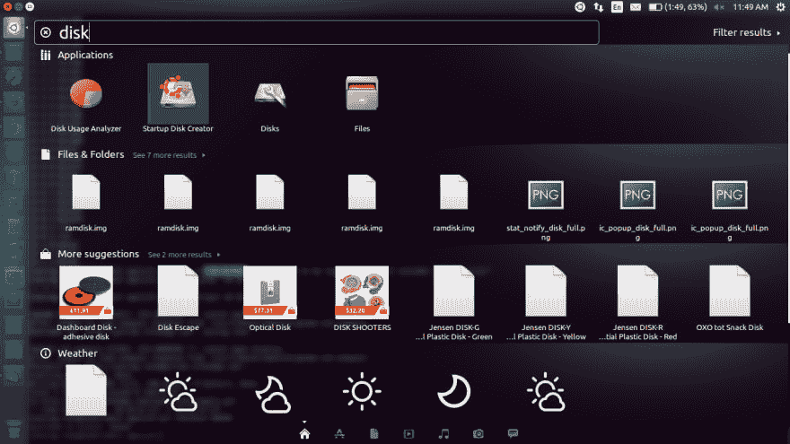
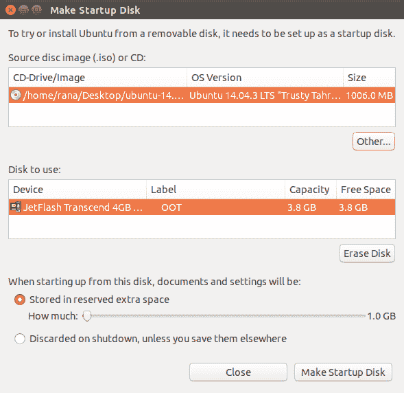

# 在 Ubuntu 中创建一个可引导的笔式驱动器

> 原文：<https://dev.to/anuragrana/create-a-bootable-pen-drive-in-ubuntu-p08>

Ubuntu 有一个默认程序来创建一个可引导的笔式驱动器。
按照以下步骤创建相同的。

1.  从他们的官方网站下载最新 Ubuntu 的 iso 镜像文件。
2.  现在将一个空的 USB 驱动器连接到系统。
3.  启动“启动盘创建器”程序。

1.  选择下载的 iso 映像文件作为源文件。

1.  选择 USB 设备作为“要使用的磁盘”。
2.  选择小于 1 GB 的保留磁盘空间。单击“制作启动盘”。

1.  文件将被复制到磁盘。一段时间后，当磁盘上的操作系统安装完成后，单击“退出”按钮。

1.  卸下 u 盘，在任何系统上安装 Ubuntu。

[如何开始 Python 编程——初学者指南](https://www.pythoncircle.com/post/671/how-to-start-with-python-programming-a-beginners-guide/)

[如何在 Pythonanywhere 上免费托管 Django 应用](https://www.pythoncircle.com/post/18/how-to-host-django-app-on-pythonanywhere-for-free/)