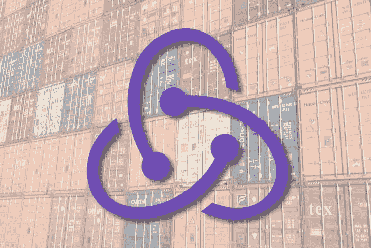

# 如何将现有的 Redux 容器转换成钩子

> 原文：<https://dev.to/bnevilleoneill/how-to-convert-your-existing-redux-containers-to-hooks-4j7o>

[](https://res.cloudinary.com/practicaldev/image/fetch/s--5EEnEJxm--/c_limit%2Cf_auto%2Cfl_progressive%2Cq_auto%2Cw_880/https://thepracticaldev.s3.amazonaws.com/i/i890w1seuoohftik9sf4.jpeg)

## 简介

随着 React 在前端工程领域加快步伐，出现了新的模式来帮助我们的应用程序更具可伸缩性和可维护性。随着像 Redux 和 MobX 这样的全局状态管理工具的引入，其中一些模式扩展了它们在整个行业中的影响。

人类的大脑有一种认知倾向，在给定的情况下保留有限数量的事物。这导致我们将程序分成更小的单元，这样我们就可以一次思考、编码、测试和修复一件事情，有时这被称为关注点分离。

## 改变 SOC 的模式

随着 Redux 的引入，容器和表示组件的模式在 2015 年夏天出现了，当时 [Dan Abramov](https://twitter.com/dan_abramov) 写了一篇关于它的[惊人帖子](https://medium.com/@dan_abramov/smart-and-dumb-components-7ca2f9a7c7d0)。

该模式的主要关注点是将您的业务或全局有状态逻辑从您的表示组件中分离出来。这使得开发人员更容易在任何给定的时间只关注相关的东西；一部分的变化不会对另一部分产生任何变化。

因此，编写或修复表示层的开发人员必须确保 a11y 标准和基于平台的优化能够提供更好的美观性，而编写业务逻辑的开发人员必须确保交付给表示层组件的数据是从给定的道具中正确导出的。

在 React 16.8 中引入钩子之后，事情发生了很大的变化，正如 Dan 在同一篇博客的更新中所描述的:

> 2019 年更新:我很久以前写了这篇文章，我的观点也随之发展。特别是，我不建议再这样拆分你的组件了。如果您发现这在您的代码库中很自然，这种模式会很方便。但我已经多次看到它在没有任何必要的情况下，以近乎教条的热情被强制执行。我发现它有用的主要原因是因为它让我将复杂的有状态逻辑与组件的其他方面分开。Hooks 让我做同样的事情，没有任意的划分。

但是将业务逻辑与表示组件分离的核心概念仍然可以使我们的许多复杂问题更容易解决。

[](https://logrocket.com/signup/)

## Redux Hooks:赶时髦

自从 Hooks 发布以来，React 社区很快就采用了它。同样，React Redux 也在他们现有的 API 中添加了钩子。有了更好的开发者体验和性能提升，这个 API 为更倾向于钩子的代码库带来了一些巨大的改进。基于钩子，你的组件现在没有连接钩子的麻烦。

在容器组件模式中，我们的容器是使用`connect()`方法连接到 Redux 存储的组件。这些容器获得全局状态的某个部分作为道具(可选地使用 [reselect](https://github.com/reduxjs/reselect) 从全局状态中获得一个相关的块)和一个调度方法来启动全局状态的改变。

connect API 的这些部分现在可以作为两个独立的挂钩使用。现在使用`useSelector`钩子来选择状态，而动作分派器现在可以通过`useDispatch`钩子来使用。

### 使用选择器()

这几乎是 connect 方法中`mapStateToProps`(第一个参数)的概念替换。[这个钩子](https://react-redux.js.org/api/hooks#useselector)需要两个函数作为参数:一个选择器函数和一个等式函数。

选择器将使用整个 Redux 存储状态作为其唯一的参数来调用，并且必须返回组件所使用的状态的相关部分。

每当选择器功能被执行时，相等功能将被提供当前和新的状态。如果它返回一个假值，组件将被强制重新渲染；否则，组件将不会重新呈现。默认情况下，相等函数是两个状态之间的浅层比较。

#### 新增功能选择器()

在许多应用程序中使用 Redux 的大量经验之后，考虑到基于 Hooks 的 API 的性质，Redux 团队对`useSelector`进行了一些明智的修改，与`mapStateToProps`的工作方式进行了比较。

*   选择器函数可以返回任何值，而不仅仅是对象
*   这个 API 中没有参数`ownProps`,因为 props 在函数组件中是可用的，并且可以通过闭包使用
*   等式函数可以修改:它可以是 Lodash 的`isEqual`或 Immutable 的匹配器

### 使用 Dispatch()

connect 方法的第二个参数是一个[函数，它为我们的组件提供了动作分派器](https://react-redux.js.org/api/hooks#usedispatch)。经过[深思熟虑的辩论](https://github.com/reduxjs/react-redux/issues/1252#issuecomment-488160930)和 Redux 的 Twitter 社区的大多数共识，Redux 采用了`useDispatch`而不是`useActions`。它将一个 action 对象作为参数，然后提供给我们的 reducer，以反映全局状态的变化。

## 容器和挂钩:平滑变换

这种转变通常会让开发人员对他们现有的代码库更加谨慎。但是由于所有这些新特性在性能和可伸缩性方面给了应用程序很大的提升，没有人想错过它们。

谈到向后兼容性，React 是最好的库之一。正如 React 团队所提到的，基于类的组件不会消失，在可预见的未来，即将发布的 React 版本将会支持它们。

但是如果你想利用 Hooks 给 React 生态系统带来的一些很酷的好处，那么这里有一个指南来启动你的转变。

让我们考虑一个获取并提供黑客新闻条目列表的容器的例子。我们将探索如何将我们的容器转换成钩子，并保持它们在我们现有的代码库中工作。

我们的基于类的容器带有用类实现的子属性，看起来可能是这样的:

```
/*
 *
 * HackerNews
 *
 */

import React from 'react';
import PropTypes from 'prop-types';
import { connect } from 'react-redux';
import { createStructuredSelector } from 'reselect';
import { compose } from 'redux';
import injectReducer from 'utils/injectReducer';
import injectSaga from 'utils/injectSaga';

import reducer from './reducer';
import saga from './sagas';

import makeSelectHackerNews from './selectors';
import { fetch } from './actions';

class HackerNews extends React.PureComponent {
  componentDidMount() {
    const { hackerNews } = this.props;
    if (!hackerNews.data.length && !hackerNews.fetching) {
      this.props.fetch({
        offset: 0,
        limit: 15,
      });
    }
  }

  render() {
    const { fetching, data, error } = this.props.hackerNews;
    return this.props.children.call(null, {
      fetching,
      data,
      error,
    });
  }
}

HackerNews.propTypes = {
  hackerNews: PropTypes.object.isRequired,
  children: PropTypes.func.isRequired,
  fetch: PropTypes.func.isRequired,
};

const mapStateToProps = createStructuredSelector({
  hackerNews: makeSelectHackerNews(),
});

function mapDispatchToProps(dispatch) {
  return {
    fetch: (data) => dispatch(fetch(data)),
  };
}
const withConnect = connect(
  mapStateToProps,
  mapDispatchToProps,
);
const withReducer = injectReducer({ key: 'hackerNews', reducer });
const withSaga = injectSaga({ key: 'hackerNews', saga });
export default compose(
  withReducer,
  withSaga,
  withConnect,
)(HackerNews); 
```

<svg width="20px" height="20px" viewBox="0 0 24 24" class="highlight-action crayons-icon highlight-action--fullscreen-on"><title>Enter fullscreen mode</title></svg> <svg width="20px" height="20px" viewBox="0 0 24 24" class="highlight-action crayons-icon highlight-action--fullscreen-off"><title>Exit fullscreen mode</title></svg>

改造后会是这个样子:

```
/*
 *
 * HackerNews
 *
 */

import React from 'react';
import PropTypes from 'prop-types';
import { useSelector, useDispatch, shallowEqual } from 'react-redux';
import { createStructuredSelector } from 'reselect';

import reducer from './reducer';
import saga from './sagas';

import makeSelectHackerNews from './selectors';
import { fetch } from './actions';

function useHackerNews(props) {
  const hackerNews = useSelector(makeSelectHackerNews, shallowEqual);
  const dispatch = useDispatch();

  useEffect(() => {
    if (!hackerNews.data.length && !hackerNews.fetching) {
      dispatch(fetch({
        offset: 0,
        limit: 15,
      }));
    }    
  }, [hackerNews]);

  return hackerNews;
}

export default function HackerNews({ children, ...props }) {
  const hackerNews = useHackerNews(props);
  return children(hackerNews);
};

HackerNews.propTypes = {
  children: PropTypes.func.isRequired,
}; 
```

<svg width="20px" height="20px" viewBox="0 0 24 24" class="highlight-action crayons-icon highlight-action--fullscreen-on"><title>Enter fullscreen mode</title></svg> <svg width="20px" height="20px" viewBox="0 0 24 24" class="highlight-action crayons-icon highlight-action--fullscreen-off"><title>Exit fullscreen mode</title></svg>

如您所见，以前放在组件类之外的代码现在是功能组件的一部分。我们已经将之前使用的相同的选择器方法移到了新的`useSelector`钩子上，现在通过`useDispatch`钩子可以使用相同的分派方法。

我们的新容器为我们提供了一个选项，将它用作新功能组件的定制挂钩，并保持基于 props 的子组件像以前一样平稳运行。

### 有哪些上升的方面？

与基于类的组件相比，功能组件的一个主要优点是代码行更少。与基于类的组件相比，这给了你稍微好一点的性能，并且它可以在大规模应用中产生显著的差异。

钩子还通过将连接的逻辑组合在一起使我们的组件更具可读性。在我们的容器中，我们不必向下滚动来理解`mapStateToProps`或`mapDispatchToProps`。除此之外，我们去掉了 connect HOCs，这将减少组件层次结构中的节点数量。

## Redux 会留在这里吗？

在 React 中发布了钩子和上下文之后，有很多关于我们是否还需要 Redux 的争论——它是不是已经过时了？

依我看，这个问题可以根据不同的用例有不同的答案。Redux 仍然服务于它的初衷，是大规模应用程序最可靠的状态管理库之一。

当我第一次用 React 开发时，它没有任何全局状态管理，只是对所有事情使用本地状态。随着我们的应用程序变得越来越大，我们意识到对全局状态的需求，从那时起，使用 Redux 是一种非常棒的体验。

我们在[躲猫猫大师](https://peekaboo.guru/karachi)的前端采用了这种容器表示模式，到目前为止我们没有任何遗憾；我们正在庆祝我们产品的三周年纪念日。

除此之外，React 有一条最吸引人的标语:“学一次，写遍天下。”随着脸书在 React Native 和其他 React 渲染器上投入的努力，现在不仅可以更容易地利用你的知识，还可以跨平台利用你的代码库。如果以真实的方式实现，这种模式允许您在不同平台的 React 应用程序之间共享大量代码。

* * *

## Plug: [LogRocket](https://logrocket.com/signup/) ，一款适用于网络应用的 DVR

[](https://logrocket.com/signup/)

[log rocket](https://logrocket.com/signup/)是一个前端日志工具，让你重放问题，就像它们发生在你自己的浏览器中一样。LogRocket 不需要猜测错误发生的原因，也不需要向用户询问截图和日志转储，而是让您重放会话以快速了解哪里出错了。它可以与任何应用程序完美配合，不管是什么框架，并且有插件可以记录来自 Redux、Vuex 和@ngrx/store 的额外上下文。

除了记录 Redux 动作和状态，LogRocket 还记录控制台日志、JavaScript 错误、stacktraces、带有头+体的网络请求/响应、浏览器元数据、自定义日志。它还使用 DOM 来记录页面上的 HTML 和 CSS，甚至为最复杂的单页面应用程序重新创建像素级完美视频。

[免费试用](https://logrocket.com/signup/)。

* * *

帖子[如何将你现有的 Redux 容器转换成钩子](https://blog.logrocket.com/how-to-convert-your-existing-redux-containers-to-hooks/)首先出现在[的 LogRocket 博客](https://blog.logrocket.com)上。