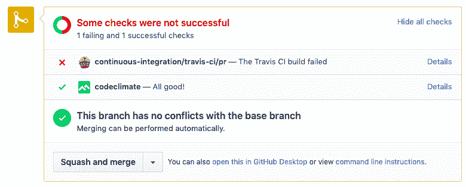
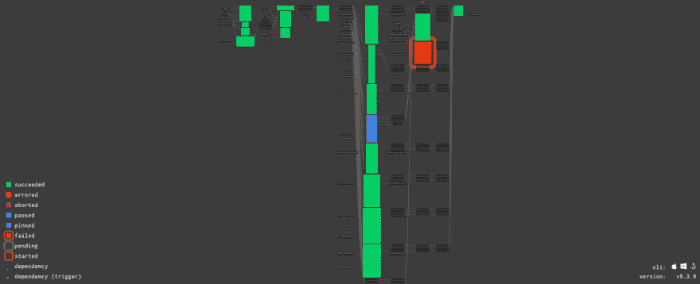

# 您决定如何以及何时更新应用程序的依赖项？

> 原文：<https://dev.to/downey/how-and-when-do-you-decide-to-update-your-app-s-dependencies-42m8>

*封面照片致谢:[弗朗西斯科·雅克耶](https://unsplash.com/@franjacquier)上[Unsplash](https://unsplash.com)T5】*

无论您有 Ruby gems、npm 包还是来自 Maven 仓库的 jar，除了最简单的项目之外，所有项目都有外部依赖。随着时间的推移，这些依赖关系会变得陈旧、过时，甚至不安全。

你以什么样的节奏更新项目的依赖关系？每月？周刊？仅在需要新功能或安全更新时使用？

你如何审查你的依赖升级以确保它们不会破坏东西或者它们不是恶意的？ *(参见最近的[强 _ 密码宝石劫持](https://withatwist.dev/strong-password-rubygem-hijacked.html)引以为戒)*

* * *

## 我的方法

在我花了大部分时间工作的 Ruby 项目、Cloud Foundry 的[云控制器](https://github.com/cloudfoundry/cloud_controller_ng)以及我的一些个人项目中，我做了以下工作。

### 依靠外部工具进行预警和 PRs

我发现，从安全角度来看，像 Snyk 和 T2 Github 自己的安全警报 T3 这样的服务对于保持 gems 的更新是非常有价值的。这些工具不断地监控最新的 CVE，并将它们与您的项目所依赖的依赖项版本进行交叉引用。当出现问题时，它们会提醒您，甚至可以提交自动拉取请求来消除依赖性。

除了安全警告，我还发现[依赖机器人](https://dependabot.com/#how-it-works)很有帮助。它通常会自动提交依赖项更新的拉请求，并尽力包含相关的 changelog 条目。

### 依靠不断的整合来捕捉回归

这些提交“拉”请求的服务的好处在于，您可以连接 CI 系统(例如 [Circle CI](https://circleci.com/) 或 [Travis CI](https://travis-ci.org/) )在所有 pr 上运行。您可以配置这些来运行您的测试套件，并给出一些关于更新影响的初始反馈。

有了足够复杂的自动化，比如我的团队的 Concourse CI 管道，您甚至可以做一些事情，比如自动添加某些依赖项(例如，我们[自动添加我们的 Golang 版本](https://github.com/cloudfoundry/capi-ci/blob/feda6e5a6e0324f32be8e35d212e93f38250e491/ci/update-packages/update_golang_package.sh)),并依赖持续的构建和部署到我们的集成环境中。

### 手动读取变更日志，浏览最近提交

当然，对于主要的版本问题(或次要的过去困扰我的依赖问题)，我喜欢手动通读项目的变更日志或浏览项目的新提交。这可能是乏味和耗时的，但它提醒我任何突破性的变化，并帮助我在升级时安心一些。

这是我(有点像以 Ruby 为中心的)依赖性管理方法的要点。你是做什么的？

我特别感兴趣的是更多地了解人们在其他语言生态系统中做什么，以及阅读你们的升级哲学！😊