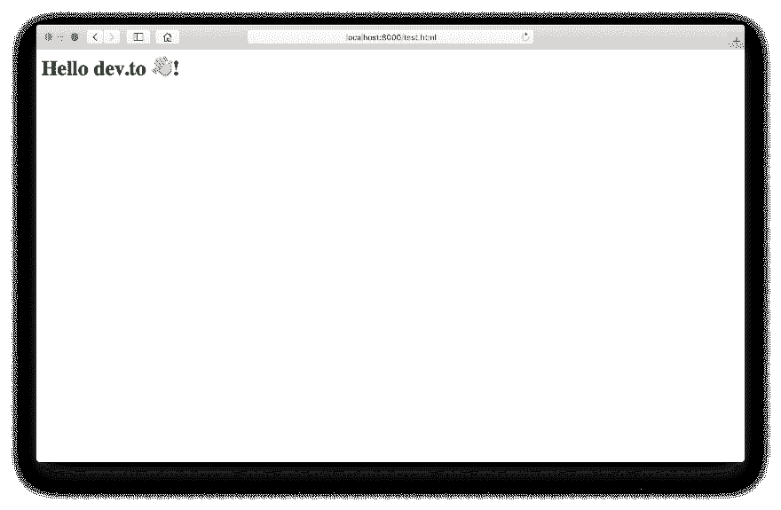
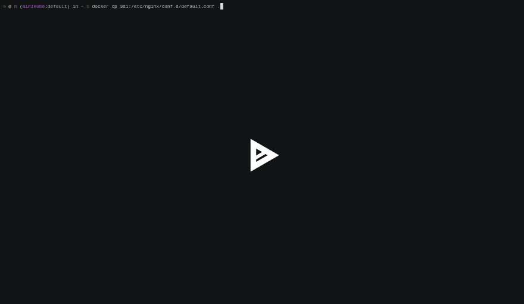

# 将文件复制到正在运行的 Docker 容器中

> 原文：<https://dev.to/matthias/copy-files-into-a-running-docker-container-4o6n>

[](https://asciinema.org/a/255327)

有时，您希望在运行的 docker 容器和本地文件系统之间复制文件。例如，如果您正在运行本地 web 服务器，并且想要更新 HTML 文件，这可能会很有帮助。

命令`docker cp`使您能够将文件从本地文件系统复制到正在运行的 Docker 容器中，反之亦然。

让我们假设您有一个正在运行的 NGINX 容器。如果没有，你可以用`docker run -d -p 8000:80 nginx`运行一个容器。

```
CONTAINER ID        IMAGE               COMMAND                  CREATED             STATUS              PORTS                  NAMES
3d1fb2f49f1a        nginx               "nginx -g 'daemon of…"   9 hours ago         Up 9 hours          0.0.0.0:8000->80/tcp   nifty_mirzakhani 
```

<svg width="20px" height="20px" viewBox="0 0 24 24" class="highlight-action crayons-icon highlight-action--fullscreen-on"><title>Enter fullscreen mode</title></svg> <svg width="20px" height="20px" viewBox="0 0 24 24" class="highlight-action crayons-icon highlight-action--fullscreen-off"><title>Exit fullscreen mode</title></svg>

现在你可以用`docker cp` :
将一个 HTML 文件复制到你的 NGINX 根文件夹(在这里是`/usr/share/nginx/html`)中

```
docker cp test.html 3d1fb2f49f1a:/usr/share/nginx/html
          ^         ^            ^
          |         |            |= destination path within the docker container
          |         |
          |         |= the id of the container in which you want to transfer the file
          |
          |= path to file you want to transfer 
```

<svg width="20px" height="20px" viewBox="0 0 24 24" class="highlight-action crayons-icon highlight-action--fullscreen-on"><title>Enter fullscreen mode</title></svg> <svg width="20px" height="20px" viewBox="0 0 24 24" class="highlight-action crayons-icon highlight-action--fullscreen-off"><title>Exit fullscreen mode</title></svg>

您现在可以在浏览器中访问您上传的文件([http://localhost:8000/test . html](http://localhost:8000/test.html))。

[](https://res.cloudinary.com/practicaldev/image/fetch/s--bE7wIX7o--/c_limit%2Cf_auto%2Cfl_progressive%2Cq_auto%2Cw_880/https://i.imgur.com/oPrTqIu.png%3F1)

## 下载文件

也可以将文件从容器复制到本地文件系统。

[](https://asciinema.org/a/255383)T3】

```
docker cp 3d1fb2f49f1a:/etc/nginx/conf.d/default.conf ~/
          ^            ^                              ^
          |            |                              |= destination path on your local machine
          |            |
          |            |= path to the file in your container
          |
          |= container id 
```

<svg width="20px" height="20px" viewBox="0 0 24 24" class="highlight-action crayons-icon highlight-action--fullscreen-on"><title>Enter fullscreen mode</title></svg> <svg width="20px" height="20px" viewBox="0 0 24 24" class="highlight-action crayons-icon highlight-action--fullscreen-off"><title>Exit fullscreen mode</title></svg>

## 路径信息

容器路径是相对于容器的根目录(`/`)的，因此可以省略前导斜杠。
两条路径都有效:`/etc/nginx/conf.d/default.conf`和`etc/nginx/conf.d/default.conf`。

对于本地机器路径，您可以使用绝对和相对值。

* * *

如果你喜欢我的内容，你可能想在 Twitter 上关注我？！ [@fullstack_to](https://twitter.com/fullstack_to)

封面图片由[弗兰克·麦肯纳](https://unsplash.com/@frankiefoto?utm_source=unsplash&utm_medium=referral&utm_content=creditCopyText)在 [Unsplash](https://unsplash.com/search/photos/containers?utm_source=unsplash&utm_medium=referral&utm_content=creditCopyText) 上拍摄