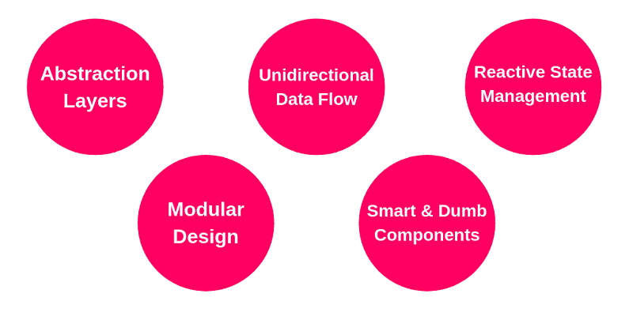
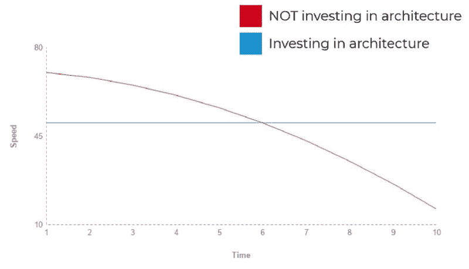
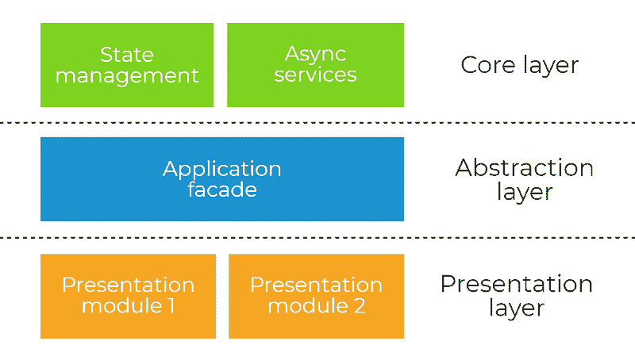
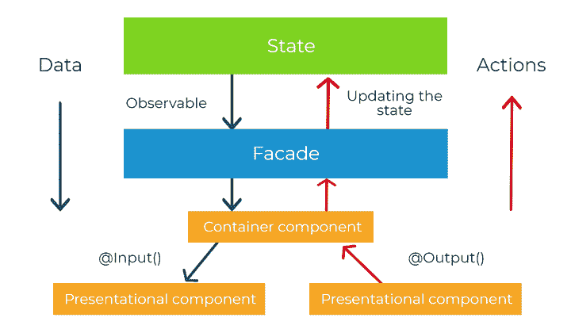
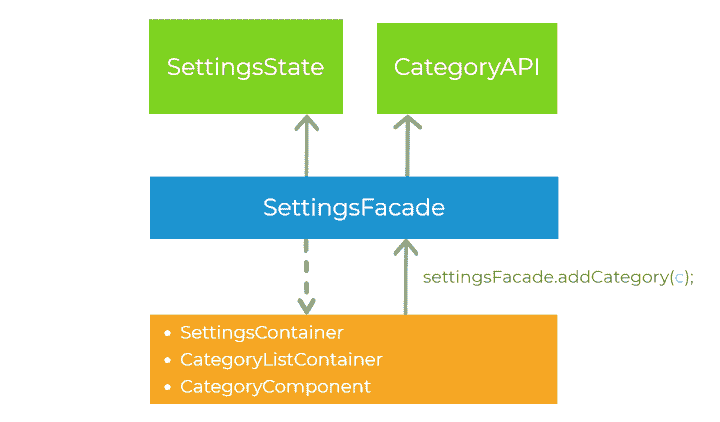
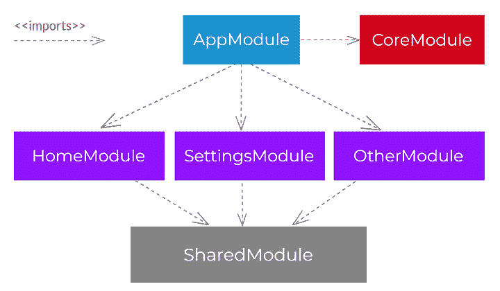
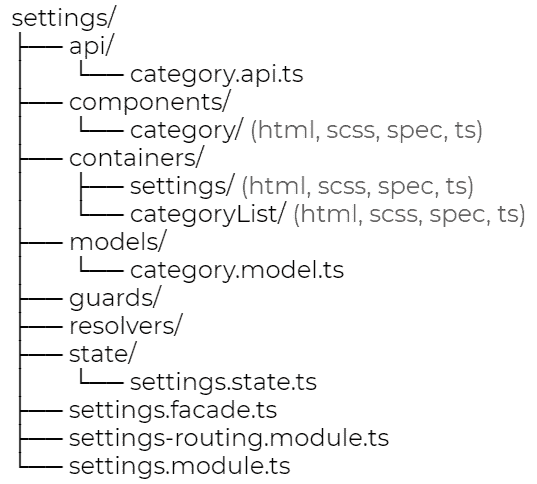

# 角度架构模式和最佳实践(有助于扩展)

> 原文：<https://dev.to/dev-academy/angular-architecture-patterns-and-best-practices-that-help-to-scale-507m>

===接收更多文章👉加入博客上的[简讯===](https://dev-academy.com)

构建可伸缩的软件是一项具有挑战性的任务。当我们考虑前端应用程序的可伸缩性时，我们可以想到不断增加的复杂性、越来越多的业务规则、加载到应用程序中的不断增长的数据量以及通常分布在世界各地的大型团队。为了处理提到的因素，以保持高质量的交付和防止技术债务，健壮和良好基础的架构是必要的。Angular 本身是一个非常固执己见的框架，迫使开发人员以正确的方式做事情，然而也有很多地方会出错。在本文中，我将基于最佳实践和久经考验的模式，给出设计良好的 Angular 应用程序架构的高级建议。我们在这篇文章中的最终目标是学习如何设计角度应用程序，以便从长远来看保持**可持续的开发速度**和**添加新特性的便利性**。为了实现这些目标，我们将采用:

*   应用层之间的适当抽象，
*   单向数据流，
*   反应式状态管理，
*   模块化设计，
*   智能和非智能组件模式。

[](https://res.cloudinary.com/practicaldev/image/fetch/s--zq1RQwyd--/c_limit%2Cf_auto%2Cfl_progressive%2Cq_auto%2Cw_880/https://thepracticaldev.s3.amazonaws.com/i/22xoxk89go5fgehxmyuq.png)

## 前端的可扩展性问题

让我们从现代前端应用程序开发中可能面临的可伸缩性方面来思考问题。今天，前端应用程序不只是“显示”数据和接受用户输入。单页应用程序(SPAs)为用户提供丰富的交互，并且主要使用后端作为数据持久层。这意味着，更多的责任已经转移到软件系统的前端部分。这导致前端逻辑越来越复杂，我们需要处理。不仅需求的数量随着时间的推移而增长，而且我们加载到应用程序中的数据量也在增加。最重要的是，我们需要保持应用程序的性能，这很容易受到损害。最后，我们的开发团队正在成长(或者至少是轮换——人们来了又走),对于新来的人来说，尽快跟上速度是很重要的。

[](https://res.cloudinary.com/practicaldev/image/fetch/s--Wmb917xb--/c_limit%2Cf_auto%2Cfl_progressive%2Cq_auto%2Cw_880/https://thepracticaldev.s3.amazonaws.com/i/kk3y7g0ckl5rwaswubdp.jpg)

上述问题的解决方案之一是可靠的系统架构。但是，这也带来了成本，即从第一天开始投资该体系结构的成本。对于我们开发人员来说，当系统还很小的时候，很快发布新的特性是很有诱惑力的。在这个阶段，一切都很容易理解，所以开发速度非常快。但是，除非我们关心架构，否则在一些开发人员轮换、复杂的特性、重构、几个新模块之后，开发速度会急剧下降。下图展示了在我的开发生涯中它通常的样子。这不是任何科学研究，这只是我的看法。

[](https://res.cloudinary.com/practicaldev/image/fetch/s--hi7zBcMa--/c_limit%2Cf_auto%2Cfl_progressive%2Cq_auto%2Cw_880/https://thepracticaldev.s3.amazonaws.com/i/zrcwih1v8yorgg0w8gz3.png)

## 软件架构

为了讨论架构最佳实践和模式，我们首先需要回答一个问题，什么是软件架构。Martin Fowler 将架构定义为“*将一个系统最高层次地分解成它的各个部分*”。除此之外，我认为软件架构描述了软件是如何由各个部分组成的，以及这些部分之间通信的*规则*和*约束*是什么。通常，我们在系统开发中做出的架构决策很难随着系统的发展而改变。这就是为什么从我们项目的一开始就关注这些决策是非常重要的，特别是如果我们构建的软件应该在生产中运行很多年。Robert C. Martin 曾经说过:软件的真正成本是它的维护。良好的架构有助于降低系统维护的成本。

> **软件架构**是软件组成部分的方式，以及这些部分之间通信的*规则*和*约束*

## 高层抽象层

第一种方式，我们将分解我们的系统，是通过抽象层。下图描述了这种分解的一般概念。这个想法是将**适当的职责**放入系统的**适当层**:**核心**，**抽象**或**表现**层。我们将独立查看每一层并分析其职责。系统的这种划分也规定了通信规则。例如，**表示层**只能通过**抽象层**与核心层**对话。稍后，我们将了解这种约束的好处。**

[](https://res.cloudinary.com/practicaldev/image/fetch/s--OrfF0gj7--/c_limit%2Cf_auto%2Cfl_progressive%2Cq_auto%2Cw_880/https://thepracticaldev.s3.amazonaws.com/i/9ckjhrqga7t1toso0m4i.png)

### 表示层

让我们从表示层开始分析我们的系统故障。这是我们所有有角度的组件生活的地方。这一层的唯一职责是**呈现**和**委托**。换句话说，它通过抽象层呈现 UI 并将用户的动作委托给核心层。它知道**显示什么**和**做什么**，但是它不知道**应该如何处理**用户的交互。

下面的代码片段包含使用来自抽象层的`SettingsFacade`实例的`CategoriesComponent`来委托用户的交互(通过`addCategory()`和`updateCategory()`)并在其模板中呈现一些状态(通过`isUpdating$`)。

```
@Component({
  selector: 'categories',
  templateUrl: './categories.component.html',
  styleUrls: ['./categories.component.scss']
})
export class CategoriesComponent implements OnInit {

  @Input() cashflowCategories$: CashflowCategory[];
  newCategory: CashflowCategory = new CashflowCategory();
  isUpdating$: Observable<boolean>;

  constructor(private settingsFacade: SettingsFacade) {
    this.isUpdating$ = settingsFacade.isUpdating$();
  }

  ngOnInit() {
    this.settingsFacade.loadCashflowCategories();
  }

  addCategory(category: CashflowCategory) {
    this.settingsFacade.addCashflowCategory(category);
  }

  updateCategory(category: CashflowCategory) {
    this.settingsFacade.updateCashflowCategory(category);
  }

} 
```

Enter fullscreen mode Exit fullscreen mode

### 抽象层

抽象层将表示层从核心层中分离出来，并且有自己明确的职责。该层为表示层中的组件公开了**状态流**和**接口**，扮演了**门面**的角色。这种门面*沙箱*什么组件能在系统里看到什么，做什么。我们可以通过简单地使用角度类提供者来实现外观。这里的类可以用 **Facade** 后缀来命名，例如`SettingsFacade`。下面，你可以找到这样一个门面的例子。

```
@Injectable()
export class SettingsFacade {

  constructor(private cashflowCategoryApi: CashflowCategoryApi, private settingsState: SettingsState) { }

  isUpdating$(): Observable<boolean> {
    return this.settingsState.isUpdating$();
  }

  getCashflowCategories$(): Observable<CashflowCategory[]> {
    // here we just pass the state without any projections
    // it may happen that it is necessary to combine two or more streams and expose to the components
    return this.settingsState.getCashflowCategories$();
  }

  loadCashflowCategories() {
    return this.cashflowCategoryApi.getCashflowCategories()
      .pipe(tap(categories => this.settingsState.setCashflowCategories(categories)));
  }

  // optimistic update
  // 1\. update UI state
  // 2\. call API
  addCashflowCategory(category: CashflowCategory) {
    this.settingsState.addCashflowCategory(category);
    this.cashflowCategoryApi.createCashflowCategory(category)
      .subscribe(
        (addedCategoryWithId: CashflowCategory) => {
          // success callback - we have id generated by the server, let's update the state
          this.settingsState.updateCashflowCategoryId(category, addedCategoryWithId)
        },
        (error: any) => {
          // error callback - we need to rollback the state change
          this.settingsState.removeCashflowCategory(category);
          console.log(error);
        }
      );
  }

  // pessimistic update
  // 1\. call API
  // 2\. update UI state
  updateCashflowCategory(category: CashflowCategory) {
    this.settingsState.setUpdating(true);
    this.cashflowCategoryApi.updateCashflowCategory(category)
      .subscribe(
        () => this.settingsState.updateCashflowCategory(category),
        (error) => console.log(error),
        () => this.settingsState.setUpdating(false)
      );
  }
} 
```

Enter fullscreen mode Exit fullscreen mode

#### 抽象接口

我们已经知道这一层的主要职责；为组件公开状态流和接口。先说界面。公共方法`loadCashflowCategories()`、`addCashflowCategory()`和`updateCashflowCategory()`从组件中抽象出状态管理和外部 API 调用的细节。我们没有在组件中直接使用 API 提供者(如`CashflowCategoryApi`)，因为它们位于核心层。此外，状态如何变化与组件无关。表示层不应该关心**事情是如何**完成的，组件应该**在必要的时候从抽象层调用**方法(委托)。查看抽象层中的公共方法，可以让我们快速了解系统这一部分的**高级用例**。

但是我们应该记住，抽象层不是实现业务逻辑的地方。在这里，我们只想将表示层与业务逻辑联系起来，抽象出与表示层联系的方式。

#### 状态

当谈到状态时，抽象层使我们的组件独立于状态管理解决方案。组件被赋予可观察的数据以显示在模板上(通常使用`async`管道),而不关心这些数据是如何以及从哪里来的。为了管理我们的状态，我们可以选择任何支持 RxJS 的状态管理库(比如 [NgRx](https://ngrx.io/) )或者简单地使用 BehaviorSubjects 来建模我们的状态。在上面的例子中，我们使用了内部使用 BehaviorSubjects 的状态对象(状态对象是我们核心层的一部分)。在 NgRx 的情况下，我们将为商店分派动作。

拥有这种抽象给了我们很大的灵活性，允许我们改变管理状态的方式，甚至不接触表示层。甚至有可能无缝迁移到 Firebase 这样的实时后端，使我们的应用程序**实时**。我个人喜欢从行为主体入手来管理国家。如果后来，在系统开发的某个时候，需要用到别的东西，有了这种架构，重构就非常容易了。

[](https://courses.dev-academy.com/p/web-security-fundamentals?utm_source=devto&utm_medium=banner&utm_campaign=angular_architecture_post)

#### 同步策略

现在，让我们仔细看看抽象层的另一个重要方面。不管我们选择哪种状态管理解决方案，我们都可以以乐观或悲观的方式实现 UI 更新。假设我们想在一些实体的集合中创建新的记录。这个集合从后端获取并显示在 DOM 中。在悲观的方法中，我们首先尝试在后端更新状态(例如使用 HTTP 请求)，如果成功，我们在前端应用程序中更新状态。另一方面，在乐观的方法中，我们以不同的顺序来做。首先，我们假设后端更新会成功，并立即更新前端状态。然后我们发送请求来更新服务器状态。如果成功，我们不需要做任何事情，但如果失败，我们需要回滚我们前端应用程序中的更改，并通知用户这种情况。

> **乐观更新**先改变 UI 状态，尝试更新后端状态。这为用户提供了更好的体验，因为他看不到由于网络延迟而导致的任何延迟。如果后端更新失败，则必须回滚 UI 更改。
> **悲观更新**首先改变后端状态，只有在成功的情况下才更新 UI 状态。通常，由于网络延迟，在后端请求执行期间，有必要显示某种微调器或加载栏。

#### 缓存

有时，我们可能会决定从后端获取的数据不会成为应用程序状态的一部分。这对于我们根本不想操作的只读数据来说可能是有用的，我们只是通过抽象层传递给组件。在这种情况下，我们可以在外观中应用数据缓存。最简单的方法是使用`shareReplay()` RxJS 操作符，该操作符将*为每个新订户重放*流中的最后一个值。看看下面的代码片段，其中`RecordsFacade`使用`RecordsApi`来获取、缓存和过滤组件的数据。

```
@Injectable()
export class RecordsFacade {

  private records$: Observable<Record[]>;

  constructor(private recordApi: RecordApi) {
    this.records$ = this.recordApi
        .getRecords()
        .pipe(shareReplay(1)); // cache the data
  }

  getRecords() {
    return this.records$;
  }

  // project the cached data for the component
  getRecordsFromPeriod(period?: Period): Observable<Record[]> {
    return this.records$
      .pipe(map(records => records.filter(record => record.inPeriod(period))));
  }

  searchRecords(search: string): Observable<Record[]> {
    return this.recordApi.searchRecords(search);
  }
} 
```

Enter fullscreen mode Exit fullscreen mode

总而言之，我们在抽象层可以做的是:

*   公开组件的方法，其中我们:
    *   将逻辑执行委托给核心层，
    *   决定数据同步策略(乐观还是悲观)，
*   公开组件的状态流:
    *   挑选一个或多个 UI 状态流(并在必要时组合它们)，
    *   从外部 API 缓存数据。

正如我们所看到的，抽象层在我们的分层架构中扮演着重要的角色。它明确定义了有助于更好地理解和推理系统的职责。根据您的具体情况，您可以为每个角度模块或每个实体创建一个立面。例如，`SettingsModule`可能只有一个`SettingsFacade`，如果它不是太臃肿的话。但是有时为每个实体单独创建更细粒度的抽象外观可能更好，比如为`User`实体创建`UserFacade`。

### 核心层

最后一层是核心层。这里是实现核心应用程序逻辑的地方。所有的**数据操纵**和**外界通讯**都在这里发生。如果对于状态管理，我们使用 NgRx 这样的解决方案，这里是放置状态定义、动作和减少器的地方。因为在我们的例子中我们是用 BehaviorSubjects 建模状态，所以我们可以把它封装在一个方便的 state 类中。下面，你可以从核心层找到`SettingsState`的例子。

```
@Injectable()
export class SettingsState {

  private updating$ = new BehaviorSubject<boolean>(false);
  private cashflowCategories$ = new BehaviorSubject<CashflowCategory[]>(null);

  isUpdating$() {
    return this.updating$.asObservable();
  }

  setUpdating(isUpdating: boolean) {
    this.updating$.next(isUpdating);
  }

  getCashflowCategories$() {
    return this.cashflowCategories$.asObservable();
  }

  setCashflowCategories(categories: CashflowCategory[]) {
    this.cashflowCategories$.next(categories);
  }

  addCashflowCategory(category: CashflowCategory) {
    const currentValue = this.cashflowCategories$.getValue();
    this.cashflowCategories$.next([...currentValue, category]);
  }

  updateCashflowCategory(updatedCategory: CashflowCategory) {
    const categories = this.cashflowCategories$.getValue();
    const indexOfUpdated = categories.findIndex(category => category.id === updatedCategory.id);
    categories[indexOfUpdated] = updatedCategory;
    this.cashflowCategories$.next([...categories]);
  }

  updateCashflowCategoryId(categoryToReplace: CashflowCategory, addedCategoryWithId: CashflowCategory) {
    const categories = this.cashflowCategories$.getValue();
    const updatedCategoryIndex = categories.findIndex(category => category === categoryToReplace);
    categories[updatedCategoryIndex] = addedCategoryWithId;
    this.cashflowCategories$.next([...categories]);
  }

  removeCashflowCategory(categoryRemove: CashflowCategory) {
    const currentValue = this.cashflowCategories$.getValue();
    this.cashflowCategories$.next(currentValue.filter(category => category !== categoryRemove));
  }
} 
```

Enter fullscreen mode Exit fullscreen mode

在核心层，我们也以类提供者的形式实现 HTTP 查询。这种类可能有`Api`或`Service`名称后缀。API 服务只有一个职责——它只是与 API 端点进行通信，没有别的。我们应该避免任何缓存、逻辑或数据操作。下面是 API 服务的一个简单示例。

```
@Injectable()
export class CashflowCategoryApi {

  readonly API = '/api/cashflowCategories';

  constructor(private http: HttpClient) {}

  getCashflowCategories(): Observable<CashflowCategory[]> {
    return this.http.get<CashflowCategory[]>(this.API);
  }

  createCashflowCategory(category: CashflowCategory): Observable<any> {
    return this.http.post(this.API, category);
  }

  updateCashflowCategory(category: CashflowCategory): Observable<any> {
    return this.http.put(`${this.API}/${category.id}`, category);
  }

} 
```

Enter fullscreen mode Exit fullscreen mode

在这一层，我们还可以放置任何验证器、映射器或更高级的用例，这些用例需要操作我们 UI 状态的许多部分。

我们已经讨论了前端应用程序中抽象层的主题。每一层都有明确的界限和责任。我们还定义了各层之间通信的严格规则。随着时间的推移，随着系统变得越来越复杂，这些都有助于更好地理解和推理系统。

* * *

🚀接收更多的文章👉加入博客上的[简讯🚀](https://angular-academy.com/blog)

* * *

## 单向数据流和反应状态管理

我们要在系统中引入的下一个原则是关于数据流和变化的传播。Angular 本身在表示层(通过输入绑定)使用[单向数据流，但是我们将在应用程序层施加类似的限制。与反应式状态管理(基于流)一起，它将赋予我们系统非常重要的属性- **数据一致性**。下图展示了单向数据流的一般概念。](https://blog.angularindepth.com/do-you-really-know-what-unidirectional-data-flow-means-in-angular-a6f55cefdc63)

[](https://res.cloudinary.com/practicaldev/image/fetch/s--t9qJBmAm--/c_limit%2Cf_auto%2Cfl_progressive%2Cq_66%2Cw_880/https://thepracticaldev.s3.amazonaws.com/i/sg4ysrba4tw7lf6u48ft.gif)

在我们的应用中，无论何时任何模型值发生变化，角度[变化检测系统](https://vsavkin.com/two-phases-of-angular-2-applications-fda2517604be)都会处理该变化的传播。它通过从**到整个组件树的顶部到底部**的输入属性绑定来实现。这意味着子组件只能依赖于它的父组件，反之亦然。这就是为什么我们称之为单向数据流。这允许 Angular 仅遍历组件树**一次**(因为树结构中没有循环)以达到稳定状态，这意味着绑定中的每个值都被传播。

从前面的章节中我们知道，表示层之上是核心层，我们的应用程序逻辑就是在这里实现的。有服务和提供商在操作我们的数据。如果我们在那个层次上应用同样的数据操作原理会怎么样呢？我们可以将应用程序数据(状态)放在组件“之上”的一个地方，并通过可观察的流将值向下传播到组件(Redux 和 NgRx 将这个地方称为存储)。状态可以传播到多个组件并显示在多个位置，但不能在本地修改。这种改变可能只来自“上面”,而下面的组件只“反映”系统的当前状态。这给了我们之前提到的重要的系统属性- **数据一致性** -并且状态对象变成了**真理的单一来源**。实际上，我们可以*在多个地方显示*相同的数据，而不用担心值会不同。

我们的状态对象公开了核心层中的服务操作状态的方法。每当需要改变状态时，只能通过调用状态对象上的方法来实现(或者在使用 NgRx 的情况下调度一个动作)。然后，更改通过流“向下”传播到表示层(或任何其他服务)。这样我们的状态管理就是*反应式*。此外，由于操作和共享应用程序状态的严格规则，使用这种方法，我们还提高了系统的可预测性。下面你可以找到一个代码片段，用 BehaviorSubjects 来模拟状态。

```
@Injectable()
export class SettingsState {

  private updating$ = new BehaviorSubject<boolean>(false);
  private cashflowCategories$ = new BehaviorSubject<CashflowCategory[]>(null);

  isUpdating$() {
    return this.updating$.asObservable();
  }

  setUpdating(isUpdating: boolean) {
    this.updating$.next(isUpdating);
  }

  getCashflowCategories$() {
    return this.cashflowCategories$.asObservable();
  }

  setCashflowCategories(categories: CashflowCategory[]) {
    this.cashflowCategories$.next(categories);
  }

  addCashflowCategory(category: CashflowCategory) {
    const currentValue = this.cashflowCategories$.getValue();
    this.cashflowCategories$.next([...currentValue, category]);
  }

  updateCashflowCategory(updatedCategory: CashflowCategory) {
    const categories = this.cashflowCategories$.getValue();
    const indexOfUpdated = categories.findIndex(category => category.id === updatedCategory.id);
    categories[indexOfUpdated] = updatedCategory;
    this.cashflowCategories$.next([...categories]);
  }

  updateCashflowCategoryId(categoryToReplace: CashflowCategory, addedCategoryWithId: CashflowCategory) {
    const categories = this.cashflowCategories$.getValue();
    const updatedCategoryIndex = categories.findIndex(category => category === categoryToReplace);
    categories[updatedCategoryIndex] = addedCategoryWithId;
    this.cashflowCategories$.next([...categories]);
  }

  removeCashflowCategory(categoryRemove: CashflowCategory) {
    const currentValue = this.cashflowCategories$.getValue();
    this.cashflowCategories$.next(currentValue.filter(category => category !== categoryRemove));
  }
} 
```

Enter fullscreen mode Exit fullscreen mode

让我们回顾一下处理用户交互的步骤，记住我们已经介绍过的所有原则。首先，让我们想象在表示层有一些事件(例如按钮点击)。组件将执行委托给抽象层，调用 facade 上的方法`settingsFacade.addCategory()`。然后，facade 调用核心层服务上的方法- `categoryApi.create()`和`settingsState.addCategory()`。这两种方法的调用顺序取决于我们选择的同步策略(悲观或乐观)。最后，应用程序状态通过可观察的流向下传播到表示层。这个过程就是**定义明确的**。

[](https://res.cloudinary.com/practicaldev/image/fetch/s--ht5cojmW--/c_limit%2Cf_auto%2Cfl_progressive%2Cq_66%2Cw_880/https://thepracticaldev.s3.amazonaws.com/i/orewq45xsee5chs1mxog.gif)

## 模块化设计

我们已经讨论了我们系统中的水平划分以及跨越它的通信模式。现在，我们将在功能模块中引入垂直分隔。这个想法是将应用程序分割成代表不同业务功能的**功能模块**。这是为了更好的可维护性而将系统分解成更小部分的又一步骤。每个特性模块共享核心、抽象和表示层的相同的水平分离。值得注意的是，这些模块可能会被延迟加载(和预加载)到浏览器中，从而增加应用程序的初始加载时间。下面你可以找到一个说明特征模块分离的图表。

[](https://res.cloudinary.com/practicaldev/image/fetch/s--Bm_CZ5eQ--/c_limit%2Cf_auto%2Cfl_progressive%2Cq_auto%2Cw_880/https://thepracticaldev.s3.amazonaws.com/i/z4q9wnajtdflevydwm57.png)

出于更多的技术原因，我们的应用程序还有两个额外的模块。我们有一个`CoreModule`，它定义了我们的单体服务、单实例组件、配置，并导出`AppModule`中需要的任何第三方模块。该模块在`AppModule`只导入**一次**。第二个模块是`SharedModule`，包含通用组件/管道/指令，也导出常用的角度模块(如`CommonModule`)。`SharedModule`可以由任何功能模块导入。下图显示了导入结构。

[](https://res.cloudinary.com/practicaldev/image/fetch/s--xO0Jxv_r--/c_limit%2Cf_auto%2Cfl_progressive%2Cq_auto%2Cw_880/https://thepracticaldev.s3.amazonaws.com/i/3rw1gke7euzwm9yv2d4b.png)

### 模块目录结构

下图展示了我们如何在目录中放置所有的`SettingsModule`片段。我们可以把文件放在文件夹里，用一个代表它们功能的名字。

[](https://res.cloudinary.com/practicaldev/image/fetch/s--Se6tRKAF--/c_limit%2Cf_auto%2Cfl_progressive%2Cq_auto%2Cw_880/https://thepracticaldev.s3.amazonaws.com/i/j5h09donuq91iw5q0sti.png)

## 智能和非智能组件

我们在本文中介绍的最后一种架构模式是关于组件本身的。我们希望根据组件的职责将组件分为两类。首先是**智能组件**(又名容器)。这些组件通常:

*   注入外观和其他服务，
*   与核心层通信，
*   将数据传递给哑组件，
*   对来自哑组件的事件做出反应，
*   是顶级可路由组件(但不总是这样！).

之前呈现的`CategoriesComponent`是**智能**。它注入了`SettingsFacade`,并使用它与我们应用程序的核心层进行通信。

在第二类中，有**哑组件**(又名表象)。他们唯一的职责是呈现 UI 元素，并通过事件将用户交互“向上”委托给智能组件。想象一个类似于`<button>Click me</button>`的原生 HTML 元素。该元素没有实现任何特定的逻辑。我们可以将文本“Click me”视为该组件的输入。它也有一些可以订阅的事件，比如点击事件。下面你可以找到一个简单的**表示性**组件的代码片段，它有一个输入事件，没有输出事件。

```
@Component({
  selector: 'budget-progress',
  templateUrl: './budget-progress.component.html',
  styleUrls: ['./budget-progress.component.scss'],
  changeDetection: ChangeDetectionStrategy.OnPush
})
export class BudgetProgressComponent {

  @Input()
  budget: Budget;
  today: string;

} 
```

Enter fullscreen mode Exit fullscreen mode

## 总结

我们已经介绍了一些关于如何设计 Angular 应用程序架构的想法。如果应用得当，这些原则有助于随着时间的推移保持可持续的开发速度，并允许新特性轻松交付。请不要将它们视为严格的规则，而是当它们有意义时可以采用的建议。

我们已经仔细研究了抽象层、单向数据流、反应式状态管理、模块化设计和智能/非智能组件模式。我希望这些概念会对你的项目有所帮助，并且，一如既往，如果你有任何问题，我非常乐意与你聊天。

在这一点上，我想给 [Brecht Billiet](https://twitter.com/@brechtbilliet) 一个巨大的*荣誉，他写了这篇[博文](https://blog.strongbrew.io/A-scalable-angular2-architecture/)，向我介绍了抽象层和外观的概念。谢谢布莱希特。非常感谢 Tomek sukowski 回顾了我对分层架构的看法。*