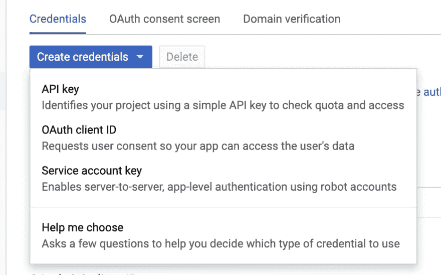

# 使用 Google Auth 的社交登录

> 原文：<https://dev.to/ogwurujohnson/social-logins-with-google-auth-4e15>

> 声明:我建议你耐心等待，因为我将向你展示如何轻松地将 Google Auth 无缝集成到 react 应用程序中。

随着统一认证系统的出现，如脸书、谷歌、Github 登录，人们倾向于使用这些方法在任何具有这种认证服务的平台上获得授权。

在这篇文章中，我们将讨论如何建立一个；react 应用程序中的 Google 社交登录。

给定一个 React 登录组件，代码如下:

```
 import React, {Component} from 'react'

      export default class Login extends Component {
          render(){
             return(
                 <div>
                    <input type="text" placeholder="username"/>
                    <input type="text" placeholder="username"/> 
                    <button>Login</button>
                 </div>
             )
          }
      } 
```

<svg width="20px" height="20px" viewBox="0 0 24 24" class="highlight-action crayons-icon highlight-action--fullscreen-on"><title>Enter fullscreen mode</title></svg> <svg width="20px" height="20px" viewBox="0 0 24 24" class="highlight-action crayons-icon highlight-action--fullscreen-off"><title>Exit fullscreen mode</title></svg>

我们需要安装一个软件包来帮助我们在应用程序上设置 Google 登录功能。为此，我们需要安装`react-google-login`包。

```
 yarn add react-google-login || or you can use || npm i react-google-login 
```

<svg width="20px" height="20px" viewBox="0 0 24 24" class="highlight-action crayons-icon highlight-action--fullscreen-on"><title>Enter fullscreen mode</title></svg> <svg width="20px" height="20px" viewBox="0 0 24 24" class="highlight-action crayons-icon highlight-action--fullscreen-off"><title>Exit fullscreen mode</title></svg>

成功安装软件包后，我们必须将它导入到我们的项目中。我们的项目应该是这样的:

```
 import React, {Component} from 'react'
     import GoogleLogin from 'react-google-login'

      export default class Login extends Component {
          render(){
             return(
                 <div>
                    <input type="text" placeholder="username"/>
                    <input type="text" placeholder="username"/> 
                    <button>Login</button>
                 </div>
             )
          }
      } 
```

<svg width="20px" height="20px" viewBox="0 0 24 24" class="highlight-action crayons-icon highlight-action--fullscreen-on"><title>Enter fullscreen mode</title></svg> <svg width="20px" height="20px" viewBox="0 0 24 24" class="highlight-action crayons-icon highlight-action--fullscreen-off"><title>Exit fullscreen mode</title></svg>

所以要使用这个包，我们所要做的就是通过在`<button>Login</button>`下面添加这个`<GoogleLogin />`来在我们的组件中呈现它。

呈现的 GoogleLogin 组件需要一些属性作为道具传递给函数，这些属性包括:`clientId`、`buttonText`、`onSuccess`、`onFailure`。我将讨论它们中的每一个，从最容易设置到最难设置。

**buttonText** :这只是将出现在按钮上的文本。我们可以简单地通过给 buttonText 分配一个文本来完成这些，如下:`buttonText = 'Log in With Google';`

**onSuccess 和 onFailure** :这些实际上是方法，当请求向 Google 认证时，它们充当回调函数，因此在这些方法中，您可以指定当 Google 返回响应时会发生什么。对于我们的例子，一个`onSuccess`方法可能如下所示:

```
 responseGoogle = async (response) => {
    const userObject = {
      username: response.w3.ofa,
      password: 'test'
    }
    if(response.w3.ofa) {
      await localStorage.setItem("user", JSON.stringify(userObject));
      await window.location.reload();
    } else {

    }
    console.log(response);
  } 
```

<svg width="20px" height="20px" viewBox="0 0 24 24" class="highlight-action crayons-icon highlight-action--fullscreen-on"><title>Enter fullscreen mode</title></svg> <svg width="20px" height="20px" viewBox="0 0 24 24" class="highlight-action crayons-icon highlight-action--fullscreen-off"><title>Exit fullscreen mode</title></svg>

Google 发送的响应有一个名为`w3`的对象，其中包含属性`w3`和用户电子邮件的另一个属性。这可能对你有所不同，所以请在回复时记录你的回复，以挑选你需要的细节。

因为 Google 不会返回用户密码，所以我通常会给他们分配一个默认密码，并将这个密码存储在数据库中。还有一次，如果用户试图登录，我所要做的就是将一个包含他的用户名和默认密码的对象发送回服务器，在我们的例子中是`test`。在我们的例子中，我们将把`userObject`存储在`local storage`中，但是如果你在数据库中持久化你的数据，你将不得不把这个对象发送给在服务器上处理用户认证的方法。为了完成这个过程，我们现在将创建的方法分配给`onSuccess`属性，如下所示；`onSuccess = responseGoogle;`。对于 onFailure 属性，我们可以在一个输出错误消息的方法中有一个警告或日志，我们可以像对`onSuccess`一样将这个方法分配给`onFailure`属性。

**clientId** :
要获得这些信息，你需要访问谷歌 API 控制台[这里](https://console.developers.google.com)

*   点击凭证部分，并点击创建凭证按钮
*   选择 Oauth 选项
*   请注意，如果您在此之前没有创建项目，它会提示您按照说明创建项目，然后再次尝试生成凭证。这一次，按照提示，直到您看到您的`clientId`的部分，复制 clientId 并分配我们自己的`clientId`给它。最终，我们的`Login`组件看起来是这样的:

    从' react'
    导入 React，{Component}从' react-google-login '导入 GoogleLogin

    ```
     export default class Login extends Component {

          responseGoogle = async (response) => {
             const userObject = {
                username: response.w3.ofa,
                password: 'test'
             }
             if(response.w3.ofa) {
                await localStorage.setItem("user", JSON.stringify(userObject));
                await window.location.reload();
             } else {

          }
          console.log(response);
          }
          render(){
             return(
                 <div>
                    <input type="text" placeholder="username"/>
                    <input type="text" placeholder="username"/> 
                    <button>Login</button>
                    <GoogleLogin
                      clientId="##########" //id gotten from Google
                      buttonText="Log in with Google"
                      onSuccess={this.props.responseGoogle}
                      onFailure={this.props.responseGoogleError}
                    />
                 </div>
             )
          }
      } 
    ```

    这样，我们的 React 应用程序通过了 Google 0auth 的认证。这很简单，如果需要进一步澄清，请随时联系我，这里或通过谷歌邮件😂