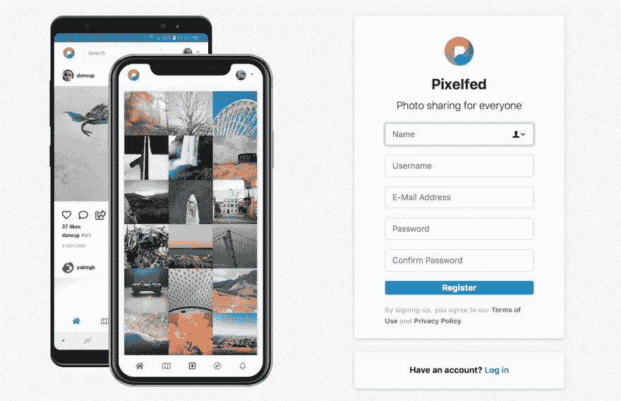

# 带有 Docker 和 Traefik 的 Pixelfed(测试版)

> 原文：<https://dev.to/joenas/pixelfed-beta-with-docker-and-traefik-35hm>

[](https://res.cloudinary.com/practicaldev/image/fetch/s--2OMYH_fs--/c_limit%2Cf_auto%2Cfl_progressive%2Cq_auto%2Cw_880/https://jonnev.se/conteimg/2019/07/pixelfed-2.png)

你厌倦了数据挖掘和广告吗？想要以类似 Instagram 的方式与朋友分享照片并保持对数据的控制吗？pixel feed 是一个开源的替代品，很容易托管。

本指南将向您展示一种在 Traefik 和 Docker 的帮助下快速启动实例的简单方法。如果您已经有一个运行 Traefik 的服务器，那么继续。否则，我推荐你阅读我在[之前的帖子](https://dev.to/joenas/traefik-with-docker-and-lets-encrypt-35if)，你很快就会回到这里。

也可以跳过使用 Traefik，把自己的*反向代理* (f.e nginx)放在 Pixelfed 前面。今天使用 https 是必须的。

请记住，当前的[发布](https://github.com/pixelfed/pixelfed/releases/tag/v0.9.4)是`v0.9.4`，所以事情仍然是一个*在进行中*。也就是说，它对我和我的朋友们来说都很好。

## 先决条件

本指南假定您对 Linux 有一定的了解，并且您有一台安装了这些服务的服务器:

*   [码头工人](https://docs.docker.com/engine/installation/linux/docker-ce/ubuntu/)
*   [坞站-复合](https://docs.docker.com/compose/install/)
*   用于托管您的应用程序的**域**

对于价廉物美的服务器，请查看数字海洋或 T2 的网站。另外，当我建立一个新的 VPS 时，我总是推荐[这个指南](https://plusbryan.com/my-first-5-minutes-on-a-server-or-essential-security-for-linux-servers)。

*如果你想使用数字海洋，请随意使用我的[推荐链接](https://m.do.co/c/37d221e6802a)为你的服务器获得 10 美元*😊

## 设置

我们首先将存储库克隆到它自己的目录中，并从那里构建 docker 映像。也有预建的，像[这个](https://hub.docker.com/r/tedomum/pixelfed)，但是在这种情况下我推荐自己建。

让我们为你的数据建立一个目录，如果需要的话。

```
sudo mkdir -p /opt/pixelfed_source
sudo chown $USER:$USER /opt/pixelfed_source 
```

获取 repo，检查发布的提交，然后构建映像(用最新版本替换标签中的`v0.9.4`,以便于回滚)并等待...

```
git clone git@github.com:pixelfed/pixelfed.git /opt/pixelfed_source
# OR 
git clone https://github.com/pixelfed/pixelfed.git /opt/pixelfed_source
cd /opt/pixelfed_source
git checkout v0.9.4
docker build -t pixelfed:v0.9.4 . 
```

现在我们可以为服务创建一个目录。

```
sudo mkdir -p /opt/pixelfed
sudo chown $USER:$USER /opt/pixelfed
cd /opt/pixelfed 
```

### 配置

接下来，让我们编辑配置。

```
cp ../pixelfed_source/.env.example .env
nano .env 
```

将所有的`*_DOMAIN`替换为您的主机名，将`APP_URL=http://localhost`替换为您的完整主机名，包括协议。

我们稍后会让 Pixelfed 为我们生成一个`APP_KEY`，所以不要碰那个。

我使用 Postgres，主要是因为 MySQL 抛出了奇怪的错误，但也因为这是我通常使用的，所以这些需要改变。

```
DB_CONNECTION=pgsql
DB_HOST=db
DB_PORT=5432
DB_DATABASE=pixelfed
DB_USERNAME=pixelfed
DB_PASSWORD=USE_A_PROPER_PASSWORD 
```

因为我们对数据库和 Redis 使用 docker 和一个内部网络，所以也修改这个:`REDIS_HOST=redis`

如果您**不想要**联盟，请更改以下内容。

```
ACTIVITY_PUB=false
REMOTE_FOLLOW=false 
```

您也可以编辑这些:

```
# For a personal server, I don't really feel this is necessary
ENFORCE_EMAIL_VERIFICATION=false
# I had trouble running Horizon (background jobs) embedded in Docker
HORIZON_EMBED=false 
```

### 码头工人

接下来，我们需要 docker 的内部网络。

```
docker network create pixelfed 
```

现在我们可以添加一个`docker-compose`文件。

```
touch docker-compose.yml
nano docker-compose.yml 
```

复制并粘贴这个。

```
version: '3'
services:

  app:
    image: pixelfed:v0.9.4
    restart: unless-stopped
    # This is for Traefik
    labels:
       - traefik.enable=true
       - traefik.frontend.rule=Host:pixelfed.example.com
       - traefik.port=80
       - traefik.docker.network=web
    env_file:
      - ./.env
    volumes:
      - "app-storage:/var/www/storage"
      - "app-bootstrap:/var/www/bootstrap"
      # We can remove this after generating APP_KEY
      - ./.env:/var/www/.env
    networks:
      - web
      - pixelfed

  db:
    image: postgres:9.6.4
    restart: unless-stopped
    networks:
      - pixelfed
    volumes:
     - db-data:/var/lib/postgresql/data
    environment:
     - POSTGRES_PASSWORD=${DB_PASSWORD}
     - POSTGRES_USER=${DB_USERNAME}

  worker:
    image: pixelfed:v0.9.4
    restart: unless-stopped
    env_file:
      - ./.env
    volumes:
      - "app-storage:/var/www/storage"
      - "app-bootstrap:/var/www/bootstrap"
    networks:
      - web # Required for ActivityPub
      - pixelfed
    command: gosu www-data php artisan horizon

  redis:
    image: redis:5-alpine
    restart: unless-stopped
    volumes:
      - "redis-data:/data"
    networks:
      - pixelfed

# Adjust your volume data in order to store data where you wish
volumes:
  redis-data:
  db-data:
  app-storage:
  app-bootstrap:

networks:
  pixelfed:
    internal: true
  web:
    external: true 
```

☝️ **记得用你的主机名替换`traefik.frontend.rule`中的** `pixelfed.example.com`。还要确保在`networks`中添加/替换你的 **Traefik 网络**(在我的例子中是`web`)。

如果你**没有**使用 Traefik，用这个替换`app`的`labels`部分以便能够反向代理。

```
 ports:
    - "127.0.0.1:8080:80" 
```

现在我们应该能够启动服务并生成一个`APP_KEY`。

```
docker-compose up -d
docker-compose exec app php artisan key:generate
# Make sure there's a value
cat .env | grep APP_KEY 
```

现在，我们可以重启、清空缓存并在数据库上运行迁移。

```
docker-compose restart app
docker-compose exec app php artisan config:cache
docker-compose exec app php artisan migrate
# Answer yes 
```

好了👏您的 Pixelfed 实例应该已经启动并正在运行。现在去注册一个用户吧！你可以在网上或者通过你的终端来做。

```
docker-compose exec app php artisan user:create 
```

[](https://res.cloudinary.com/practicaldev/image/fetch/s--gToz9zEG--/c_limit%2Cf_auto%2Cfl_progressive%2Cq_auto%2Cw_880/https://jonnev.se/conteimg/2019/07/pixelfed-1.png)

### 站点管理员

那么你可能想让自己成为网站的管理员...

```
docker-compose exec app php artisan user:admin [username] 
```

## 结束

我希望你喜欢你的社交照片分享，不要犹豫给我打电话寻求帮助(有了这个指南，关于像素问题，查看他们的[帮助中心](https://pixelfed.social/site/help))。