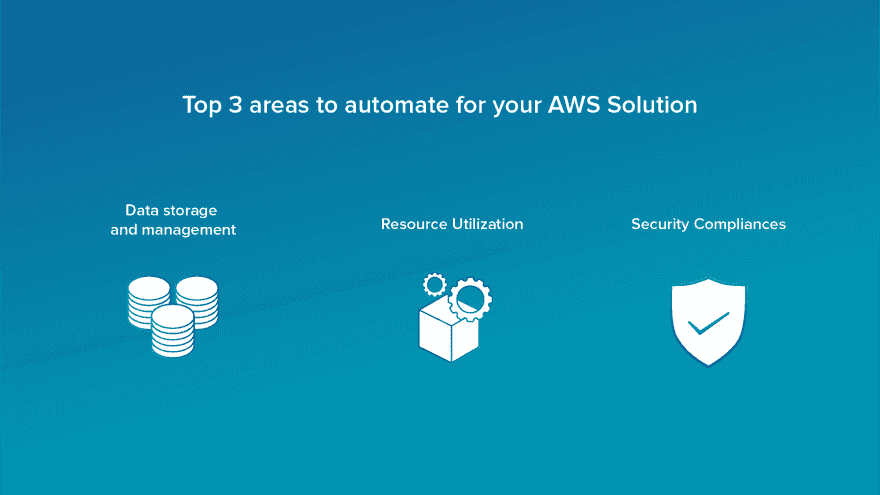

# AWS 中需要自动化的三大领域，以避免支付过多的云费用

> 原文：<https://dev.to/totalcloudio/top-3-areas-to-automate-in-aws-to-avoid-overpaying-cloud-bills-588m>

AWS 是全球使用最多的云服务之一。 [Gartner 魔力象限将 AWS 列为最大的 IaaS 提供商](https://www.zdnet.com/article/top-cloud-providers-2019-aws-microsoft-azure-google-cloud-ibm-makes-hybrid-move-salesforce-dominates-saas/)。AWS 服务被各个领域的企业所使用。大约[全球有 100 万家公司](https://www.contino.io/insights/whos-using-aws)正在使用 AWS 作为他们的 IaaS 提供商。

从网飞到联合利华到 Met Office，每个人都在 AWS 上迁移到云基础架构。既然你正在读这篇博客，那么你很可能也在使用 AWS，而且支付过高！！

一份报告显示，全球企业为 AWS 云服务支付了 64 亿美元的高价。这个数字将使**至少有 6 家初创公司成为独角兽。**

***为 AWS 解决方案多支付的金额= 64 亿美元***

# 企业在部署 AWS 服务时会犯什么错误？

让您的组织迁移到云基础架构非常容易，而且更容易出错，从而在 AWS 部署上多花了数百美元。以下是一些建议:

## **闲置和未使用的资源**

有些资源仅在个案基础上需要。然而，企业最终还是要为此付出代价。可以找到此类资源的领域包括开发、测试、QA、试运行等。同样，也有不再需要的资源。但是，他们继续跑。需要说明的一些例子如下:

1.  在很少使用的环境或区域中，未利用或未充分利用的 EC2 实例会被忽视数月。结果:你的企业最终为它们买单。
2.  长期未使用的 RDS 实例，尤其是在非生产环境中。结果:你的企业最终支付了整个持续时间。
3.  保留时间超过所需时间的过时快照。结果:您的企业最终为存储买单。
4.  即使实例被永久删除，未连接的 EBS 卷也会持续存在。结果:你的企业最终为它们买单。

## **AWS 内低效的数据管理、数据归档和数据检索**

鉴于企业所需的数据量，无论是哪个行业/垂直行业，您都必须谨慎地存储和管理数据。不这样做可能会导致您的企业计算成本飙升。您需要高效管理数据的一些地方包括 S3 使用、数据归档、数据缓存等。

## **安全性和合规性**

在采用云的早期，企业不愿意迁移到云的一个主要原因是安全问题。即使在今天，企业面临的主要挑战之一是确保全天候安全的 AWS 基础架构。

尽管采取了各种措施，企业仍然是安全漏洞的受害者。例如，2017 年，埃森哲意外地将他们的四个 AWS S3 桶配置为可供公众使用。这意味着任何能够访问并找出桶的 URL 的人都能够下载桶的内容。同年，[黑客获得了优步 GitHub 的数据](https://www.bloomberg.com/news/articles/2017-11-21/uber-concealed-cyberattack-that-exposed-57-million-people-s-data)，并能够提取该公司的 AWS 凭证。

# 自动化是高效部署和使用 AWS 的关键

随着 AWS 在企业设置中的增加，一些因素，如实例选项、管理、选择和部署正确的解决方案变得越来越复杂。

***尽管有这些限制，企业仍可在 AWS 上扩展，而无需支付过高费用！怎么会？使用自动化！*T3】**

## **数据存储管理自动化**

有效利用 S3、适当的数据检索、归档和信息缓存方法可以帮助企业节省数百美元。因此，自动执行以下操作:

*   在一段时间后，计划删除存储在 S3 上的旧备份数据
*   通过快照和 ami 在 S3 上管理 RDS、EC2 和 Redshift 资源的备份和保留。
*   将数据从 S3 移动到 S3 RRS(减少冗余存储)，数据保存在单个区域，但在多个 az 进行备份。
*   跨区域复制将 S3 数据复制或备份到其他区域。这种自动化有助于将源存储桶中上传的数据复制到不同区域的目标存储桶中。
*   通过 Amazon Elasticache 等服务进行缓存，简化了云中分布式内存缓存环境的设置、管理和扩展。

## **资源利用的自动化**

在企业设置中，管理数百个 AWS EC2 实例是一个巨大的挑战。优化它们的使用和避免成本浪费至关重要。自动扩展无疑有助于最佳利用 EC2s，但是，还有其他一些领域可以实现自动化，以避免超额支付，例如:

*   关闭未使用的实例
*   根据工作负载调整 EC2 实例
*   将工作负载转移到最匹配的 EC2 实例类型
*   关闭不使用的 EC2 实例的相关组件，如孤立快照、EBS 卷等。
*   释放非运行实例的弹性 IP

## **安全性和合规性自动化**

虽然 AWS 安全解决方案强调安全协议，但组织在确保强大的安全基础设施的同时仍然面临挑战，有时还会面临本文前面提到的安全漏洞。安全问题可能通过两种方式出现——低效的用户管理和未经授权的访问。

在这种情况下，自动化会有所帮助。方法如下:

*   使用像 AWS CloudTrail 这样的解决方案可以帮助跟踪 API 使用情况，这有助于审计和维护合规性控制。但是，当您需要管理大量的法规遵从性时，很难手动遵守所有这些法规。自动化会有所帮助。
*   像 Amazon GuardDuty 这样的工具可以帮助企业监控你的 AWS 账户和工作负载。它还使用智能威胁检测来确定恶意活动，并可以自动应对它们。

# **总之:**

AWS 有利于企业将其基础设施扩展为安全的平台。但是，不优化使用会导致您的企业浪费宝贵的资金。自动化关键要素可以帮助企业实现这一目标。这就是像 TotalCloud 这样的云管理自动化平台可以帮助您充分利用您的 AWS 部署并帮助您避免支付过多的 AWS 账单的地方。[了解更多...](https://totalcloud.io/)