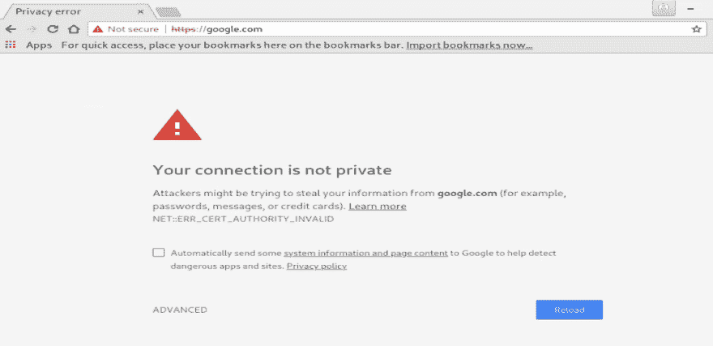
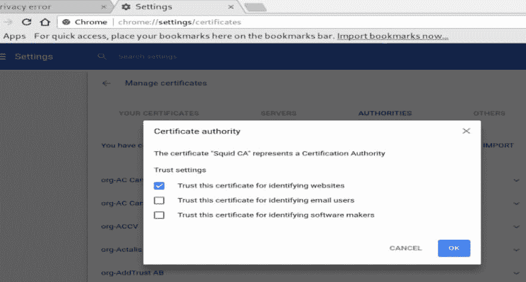
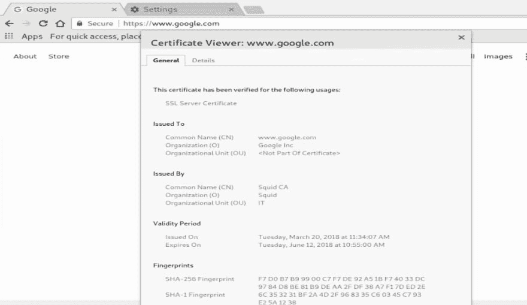
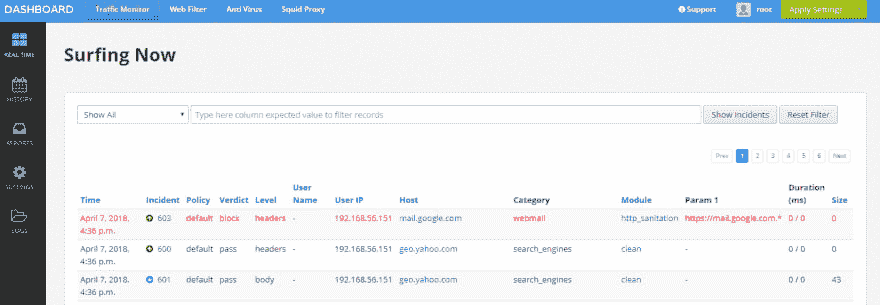

# 使用 Squid 代理 SSL 站点

> 原文：<https://dev.to/suntong/using-squid-to-proxy-ssl-sites-nj3>

*转自[使用 Squid 代理 SSL 站点](https://elatov.github.io/2019/01/using-squid-to-proxy-ssl-sites/#import-certificate-ca-into-the-browser-for-squid)(Karim elat ov 于 2019 年 1 月 5 日发布)，略有编辑*。

### 鱿鱼

Squid 非常灵活，允许许多不同的代理方法。从 3.5 版本开始，对 [SSL 碰撞](https://wiki.squid-cache.org/Features/SslBump)有了更好的支持，现在被称为 [Peek 和 Slice](https://wiki.squid-cache.org/Features/SslPeekAndSplice) 。这允许 Squid 查看 TLS 握手并动态生成动态证书，因此浏览器不会抛出任何警告(只要浏览器信任 CA 证书)。

### 生成一个由 Squid 使用的 CA 证书

在[动态 SSL 证书生成](https://wiki.squid-cache.org/Features/DynamicSslCert)中详细描述了该过程，在 [SSL-Bump 中有一个使用中间 CA](https://wiki.squid-cache.org/ConfigExamples/Intercept/SslBumpWithIntermediateCA) 的很好的配置示例。因此，首先让我们生成证书文件:

```
<> openssl req -new -newkey rsa:2048 -sha256 -days 365 -nodes -x509 -extensions v3_ca -keyout squid-ca-key.pem -out squid-ca-cert.pem 
```

<svg width="20px" height="20px" viewBox="0 0 24 24" class="highlight-action crayons-icon highlight-action--fullscreen-on"><title>Enter fullscreen mode</title></svg> <svg width="20px" height="20px" viewBox="0 0 24 24" class="highlight-action crayons-icon highlight-action--fullscreen-off"><title>Exit fullscreen mode</title></svg>

然后合并文件:

```
<> cat squid-ca-cert.pem squid-ca-key.pem >> squid-ca-cert-key.pem 
```

<svg width="20px" height="20px" viewBox="0 0 24 24" class="highlight-action crayons-icon highlight-action--fullscreen-on"><title>Enter fullscreen mode</title></svg> <svg width="20px" height="20px" viewBox="0 0 24 24" class="highlight-action crayons-icon highlight-action--fullscreen-off"><title>Exit fullscreen mode</title></svg>

然后将文件移动到一个位置 **squid** 可以读取:

```
<> sudo mkdir /etc/squid/certs
<> sudo mv squid-ca-cert-key.pem /etc/squid/certs/.
<> sudo chown squid:squid -R /etc/squid/certs 
```

<svg width="20px" height="20px" viewBox="0 0 24 24" class="highlight-action crayons-icon highlight-action--fullscreen-on"><title>Enter fullscreen mode</title></svg> <svg width="20px" height="20px" viewBox="0 0 24 24" class="highlight-action crayons-icon highlight-action--fullscreen-off"><title>Exit fullscreen mode</title></svg>

您应该可以开始安装了。

#### 配置 Squid 到 Peek-N-Slice SSL 连接

*。。。细节省略。如果你愿意的话，可以检查一下原件。。。*

要确认配置正常:

```
<> sudo squid -k parse 
```

<svg width="20px" height="20px" viewBox="0 0 24 24" class="highlight-action crayons-icon highlight-action--fullscreen-on"><title>Enter fullscreen mode</title></svg> <svg width="20px" height="20px" viewBox="0 0 24 24" class="highlight-action crayons-icon highlight-action--fullscreen-off"><title>Exit fullscreen mode</title></svg>

现在让我们创建 SSL 数据库，并确保 **squid** 用户可以访问它:

```
<> sudo /usr/lib64/squid/ssl_crtd -c -s /var/lib/ssl_db
<> sudo chown squid:squid -R /var/lib/ssl_db 
```

<svg width="20px" height="20px" viewBox="0 0 24 24" class="highlight-action crayons-icon highlight-action--fullscreen-on"><title>Enter fullscreen mode</title></svg> <svg width="20px" height="20px" viewBox="0 0 24 24" class="highlight-action crayons-icon highlight-action--fullscreen-off"><title>Exit fullscreen mode</title></svg>

然后启用服务，启动它，并确认它正在运行:

```
<> sudo systemctl enable squid
<> sudo systemctl start squid
<> sudo systemctl status squid.service 
```

<svg width="20px" height="20px" viewBox="0 0 24 24" class="highlight-action crayons-icon highlight-action--fullscreen-on"><title>Enter fullscreen mode</title></svg> <svg width="20px" height="20px" viewBox="0 0 24 24" class="highlight-action crayons-icon highlight-action--fullscreen-off"><title>Exit fullscreen mode</title></svg>

### 为 Squid 将证书 CA 导入浏览器

现在，作为一个快速测试，我们可以使用`curl`来确认它的工作。如果没有 CA，您将看到以下警告:

```
<> curl --proxy http://192.168.1.100:3128 https://google.com
curl: (60) SSL certificate problem: self signed certificate in certificate chain
More details here: https://curl.haxx.se/docs/sslcerts.html

curl performs SSL certificate verification by default, using a "bundle"
 of Certificate Authority (CA) public keys (CA certs). If the default
 bundle file isn't adequate, you can specify an alternate file
 using the --cacert option.
If this HTTPS server uses a certificate signed by a CA represented in
 the bundle, the certificate verification probably failed due to a
 problem with the certificate (it might be expired, or the name might
 not match the domain name in the URL).
If you'd like to turn off curl's verification of the certificate, use
 the -k (or --insecure) option.
HTTPS-proxy has similar options --proxy-cacert and --proxy-insecure. 
```

<svg width="20px" height="20px" viewBox="0 0 24 24" class="highlight-action crayons-icon highlight-action--fullscreen-on"><title>Enter fullscreen mode</title></svg> <svg width="20px" height="20px" viewBox="0 0 24 24" class="highlight-action crayons-icon highlight-action--fullscreen-off"><title>Exit fullscreen mode</title></svg>

因此，我将 CA 复制到客户机上，然后再次尝试:

```
<> curl --proxy http://192.168.1.100:3128 --cacert squid-ca-cert.pem  https://google.com
<HTML><HEAD><meta http-equiv="content-type" content="text/html;charset=utf-8">
<TITLE>301 Moved</TITLE></HEAD><BODY>
<H1>301 Moved</H1>
The document has moved
<A HREF="https://www.google.com/">here</A>.
</BODY></HTML> 
```

<svg width="20px" height="20px" viewBox="0 0 24 24" class="highlight-action crayons-icon highlight-action--fullscreen-on"><title>Enter fullscreen mode</title></svg> <svg width="20px" height="20px" viewBox="0 0 24 24" class="highlight-action crayons-icon highlight-action--fullscreen-off"><title>Exit fullscreen mode</title></svg>

现在，如果我们尝试使用浏览器，首先指定代理服务器，在 Linux 中，我们可以使用以下参数启动`chrome`:

```
<> google-chrome-stable --proxy-server=192.168.1.100:3128 
```

<svg width="20px" height="20px" viewBox="0 0 24 24" class="highlight-action crayons-icon highlight-action--fullscreen-on"><title>Enter fullscreen mode</title></svg> <svg width="20px" height="20px" viewBox="0 0 24 24" class="highlight-action crayons-icon highlight-action--fullscreen-off"><title>Exit fullscreen mode</title></svg>

默认情况下，您会看到一个 SSL 警告:

[](https://res.cloudinary.com/practicaldev/image/fetch/s--Wv5o79gX--/c_limit%2Cf_auto%2Cfl_progressive%2Cq_auto%2Cw_880/https://seacloud.cc/d/480b5e8fcd/files/%3Fp%3D/squid-ssl-proxy/chrome-ssl-warning.png%26raw%3D1)

所以在地址栏输入`chrome://settings/certificates`，然后导入**权限**部分下的 CA 证书，并确保选择该证书来验证*网站*:

[](https://res.cloudinary.com/practicaldev/image/fetch/s--zb2ZzNsh--/c_limit%2Cf_auto%2Cfl_progressive%2Cq_auto%2Cw_880/https://seacloud.cc/d/480b5e8fcd/files/%3Fp%3D/squid-ssl-proxy/chrome-trust-ca.png%26raw%3D1)

最后，确认证书已导入:

[](https://res.cloudinary.com/practicaldev/image/fetch/s--XxucbJAv--/c_limit%2Cf_auto%2Cfl_progressive%2Cq_auto%2Cw_880/https://seacloud.cc/d/480b5e8fcd/files/%3Fp%3D/squid-ssl-proxy/chrome-squid-cert-imported.png%26raw%3D1)

现在，如果您访问任何网站，您的浏览器都会信任 Squid CA，因为 Squid 会为该主机名生成一个动态证书:

[](https://res.cloudinary.com/practicaldev/image/fetch/s--8sbEASDC--/c_limit%2Cf_auto%2Cfl_progressive%2Cq_auto%2Cw_880/https://seacloud.cc/d/480b5e8fcd/files/%3Fp%3D/squid-ssl-proxy/chrome-trusts-squid-ca.png%26raw%3D1)

#### 查看鱿鱼日志

在您的浏览器配置为使用 Squid 作为它的代理后，您可以检查访问日志以确认它正在代理连接:

```
<> tail -f /var/log/squid/access.log
1523141358.587     51 192.168.1.107 TAG_NONE/200 0 CONNECT clientservices.googleapis.com:443 - HIER_DIRECT/172.217.11.227 -
1523141358.587     47 192.168.1.107 TAG_NONE/200 0 CONNECT translate.googleapis.com:443 - HIER_DIRECT/172.217.11.234 -
1523141358.631     15 192.168.1.107 TCP_MISS/200 1563 GET https://translate.googleapis.com/translate_a/l? - HIER_DIRECT/172.217.11.234 application/json 
```

<svg width="20px" height="20px" viewBox="0 0 24 24" class="highlight-action crayons-icon highlight-action--fullscreen-on"><title>Enter fullscreen mode</title></svg> <svg width="20px" height="20px" viewBox="0 0 24 24" class="highlight-action crayons-icon highlight-action--fullscreen-off"><title>Exit fullscreen mode</title></svg>

### 使用代理自动配置(PAC)文件来指定代理设置

大多数浏览器支持为一个 **pac** 文件指定一个 URL。PAC 文件是一个奇特的 java 脚本文件，它允许您对何时使用代理进行额外的选择。例如，您可以检查客户端的 IP，以及客户端要访问的 URL，然后通过代理或者将客户端直接转发到目的地 URL。有很多好的例子:

*   [代理自动配置文件](https://www.cisco.com/c/en/us/td/docs/security/web_security/connector/connector2972/PACAP.html)
*   [设置自动代理配置(PAC)文件](https://tektab.com/2012/09/26/setting-up-automatic-proxy-configuration-pac-file/)
*   [PAC 文件最佳实践](https://www.websense.com/content/support/library/web/v76/pac_file_best_practices/PAC_best_pract.aspx)

借用上述网站的大部分内容，以下是我最后的结论:

*。。。细节省略。如果你愿意的话，可以检查一下原件。。。*

现在你只需要在网络服务器上保存该文件，当启动 chrome 浏览器时，你只需传递文件的位置，这里有一个例子:

```
<> google-chrome-stable --proxy-pac-url=http://10.0.0.2/proxy.pac 
```

<svg width="20px" height="20px" viewBox="0 0 24 24" class="highlight-action crayons-icon highlight-action--fullscreen-on"><title>Enter fullscreen mode</title></svg> <svg width="20px" height="20px" viewBox="0 0 24 24" class="highlight-action crayons-icon highlight-action--fullscreen-off"><title>Exit fullscreen mode</title></svg>

或者在 chrome 设置部分手动输入。

#### 安全代理连接

(*这一节讲的是*)大多数浏览器都不支持到代理服务器的 HTTPS 连接，所以使用 chrome 你实际上需要用一个 **pac** 文件指定它或者使用一个 **socks** 代理。从[加密的浏览器-Squid 连接](https://wiki.squid-cache.org/Features/HTTPS#Encrypted_browser-Squid_connection):

> 虽然 HTTPS 的设计致力于端到端通信，但如果能够加密浏览器到代理的连接(而不创建阻止 Squid 访问和缓存内容的连接隧道)也不错。例如，这将允许安全使用位于可能有敌意的网络上的远程代理。
> 
> Squid 可以使用 https_port 接受常规代理流量，就像 Squid 使用 http_port 指令一样。不幸的是，流行的现代浏览器不允许配置 TLS/SSL 加密的代理连接。现在大多数浏览器都有公开的错误报告，等待支持出现。如果您有任何兴趣，请协助浏览器团队实现这一目标。
> 
> 同时，在浏览器到代理的连接离开客户机之前，需要使用 stunnel 或 SSH 隧道来加密它。这些对网络来说有些沉重，因此会很慢。
> 
> 如果配置为在 PAC 文件或命令行开关中使用代理，Chrome 浏览器能够通过 SSL 连接连接到代理。GUI 配置似乎是不可能的(还不可能)。
> 
> 如果配置为在 PAC 文件中使用代理，Firefox 33.0 浏览器能够通过 TLS 连接连接到代理。GUI 配置似乎还不可能

从[安全 Web 代理](https://www.chromium.org/developers/design-documents/secure-web-proxy)，这里有一个简单的 **pac** 文件，它指定了一个安全代理服务器:

```
function FindProxyForURL(url, host) { return "HTTPS secure-proxy.example.com:443"; } 
```

<svg width="20px" height="20px" viewBox="0 0 24 24" class="highlight-action crayons-icon highlight-action--fullscreen-on"><title>Enter fullscreen mode</title></svg> <svg width="20px" height="20px" viewBox="0 0 24 24" class="highlight-action crayons-icon highlight-action--fullscreen-off"><title>Exit fullscreen mode</title></svg>

很高兴知道这是可能的。

### 试用网络安全

有一个非常酷的产品叫做 [WebSafety](https://www.diladele.com/) 。它与 Squid 集成得非常好，提供了高级的网页过滤选项和一个很好的 UI 来配置大多数的 **squid** 设置。

有一个 ***社区版*** 但是不支持网页过滤。你可以在[社区版](https://docs.diladele.com/administrator_guide_6_1/community.html)查看不同之处。它可以显示您当前的流量，如果它阻止了什么(如果您配置它这样做):

[](https://res.cloudinary.com/practicaldev/image/fetch/s--RZz1dIql--/c_limit%2Cf_auto%2Cfl_progressive%2Cq_auto%2Cw_880/https://seacloud.cc/d/480b5e8fcd/files/%3Fp%3D/squid-ssl-proxy/websafety-web-traffic.png%26raw%3D1)