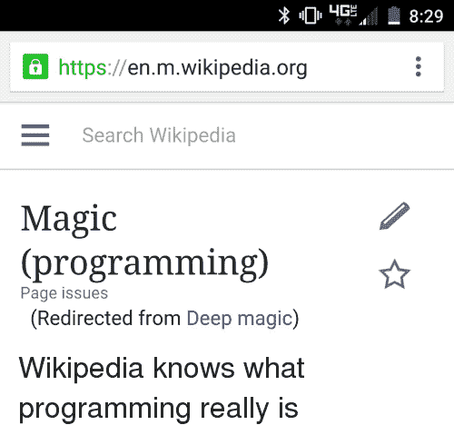

# CSS 战#8 -疯狂分叉

> 原文：<https://dev.to/pheeria/css-battle-8-forking-crazy-2i8n>

你猜怎么着标题说明了一切。*分叉*疯狂！
这是迄今为止最具挑战性的作品。尽管还有一个我还没解决。
问题是，如果你对尺寸没有任何概念，就很难匹配最小的细节。你会在下面看到一些神奇的数字，它们不知从哪里冒出来，经过几个小时(或者几分钟，公平地说)的微调，不知何故设法解决了。我会试着解释我对这个问题的唯一解决方案。顺便说一下，这是迄今为止最长的一个字符，总共有 1454 个字符！如果你关心分数，并且只有当你的内容少于 350 个字符时才有意义(否则你会得到 600 分)，你应该去使用[战斗技巧](https://cssbattle.dev/tips/)。公平地说，只有当你完全意识到你做了什么和你要做什么的时候，你才应该使用它们，因为这些主要是对错误的利用，浏览器会原谅你，比如省略结束标签。

## 解

让我们从设计`body`标签开始。很明显，我们先给它一个`background`的颜色，然后再给它一个`padding`，来框定我们的工作空间。因此，我们限制我们的数字是`50px`远离顶部和`130px`远离两侧。请记住，写入的数字包括标准的浏览器边距`8px`。当然，您可以使用 margins 定义相对于整个窗口的所有元素，从而减少字符数，但是我选择不这样做，因为这已经足够复杂了。
整个图形将由五部分组成:

### 1。上部

这是我们定义朝上的[齿](https://en.wikipedia.org/wiki/Tine_(structural))的部分。它带有`bg`的名字，背景的简称，因为它的背景与`body`的背景相同。我们将它的大小限制为`140 x 20`，并给它一个`font-size: 0`，以使我们的`inline-block`div 更具可读性，而不是将它们像沙丁鱼一样装在一个破碎的铁盒里。
公平地说，我们内部有四个半圆，它们朝向顶部。每个都有`20px`的尺寸，背景颜色更深。除了第一个还有`margin-left: 20px`。现在我们再来看看这个解决方案，我认为 flexbox 可能会更好地解决这个问题。为此，你需要给出一个父类`display: flex`和`justify-content: space-between`，以避免难看的左边距。嗯，也许我会比我计划的写更多的解决方案。

### 2。条纹

在最开始，我认真考虑过让每一个条纹都成为自己的`div`。但是后来，一个[重复线性梯度](https://developer.mozilla.org/en-US/docs/Web/CSS/repeating-linear-gradient)出现了，我明白这是胡说八道。不是分别用较暗和较亮的蓝色设计两个重复的 div，这是最糟糕的，或者只设计一个较暗的 div 并使用边距重复它，这比前面的提议好，我们把它提高了一个级别。我们用从左到右的渐变创建了`140 x 70`的`striped` id。请注意，为了避免渐变效果并使其看起来像一条均匀着色的线，颜色在每个停止点的开始和结束都是重复的。

### 3。尖齿末端

这部分和上部分很像。它有两个半圆，背景是浅蓝色，中间有空白。整行的`background`为`darker`。

### 4。底部

底部的尺寸为`140 x 90`并且具有`90px`的圆角。底部没有什么特别的。

### 5。棍子

也许你不应该问我这最后一块。

[](https://res.cloudinary.com/practicaldev/image/fetch/s---cgxHxmm--/c_limit%2Cf_auto%2Cfl_progressive%2Cq_auto%2Cw_880/https://pics.me.me/lige-https-en-m-wikipedia-org-e-search-wikipedia-magic-programming-page-issues-2571475.png)

我们相对地放置一根棍子，这样如果我们静态地放置棍子，我们可以把它举到底部上方，以避免在连接处出现奇怪的间隙。它有`20 x 60`和`margin-left: 60px`的大小。然后我们给它一个负值，把它提升 10 个像素。

```
<div class="bg">
    <div class="upward-circle"></div>
    <div class="upward-circle left-margin"></div>
    <div class="upward-circle left-margin"></div>
    <div class="upward-circle left-margin"></div>
</div>
<div id="striped"></div>
<div class="bg darker">
    <div class="downward-circle left-margin"></div>
    <div class="downward-circle left-margin"></div>
    <div class="downward-circle left-margin"></div>
</div>
<div id="bottom"></div>
<div id="stick"></div>

<style>
  body {
    padding: 42px 122px 0;
    background: #6592CF;
  }
  .bg {
    font-size: 0;
    width: 140px;
    height: 20px;
  }
  .darker {
    background: #060F55;
  }
  .left-margin {
    margin-left: 20px;
  }
  #striped {
    width: 140px;
    height: 70px;
    background: repeating-linear-gradient(
      to right,
      #060F55 0px,
      #060F55 20px,
      #6592CF 20px,
      #6592CF 40px);
  }
  #bottom {
    width: 140px;
    height: 90px;
    background: #060F55;
    border-radius: 0 0 100px 100px;
  }
  .upward-circle {
    width: 20px;
    height: 20px;
    background: #060F55;
    border-radius: 20px 20px 0 0;
    display: inline-block;
  }
  .downward-circle {
    width: 20px;
    height: 20px;
    background: #6592CF;
    border-radius: 0 0 20px 20px;
    display: inline-block;
  }
  #stick {
    width: 20px;
    height: 60px;
    z-index: 1;
    position: relative;
    top: -10px;
    background: #060F55;
    margin-left: 60px;
  }
</style> 
```

<svg width="20px" height="20px" viewBox="0 0 24 24" class="highlight-action crayons-icon highlight-action--fullscreen-on"><title>Enter fullscreen mode</title></svg> <svg width="20px" height="20px" viewBox="0 0 24 24" class="highlight-action crayons-icon highlight-action--fullscreen-off"><title>Exit fullscreen mode</title></svg>

[](https://res.cloudinary.com/practicaldev/image/fetch/s--Z_KgCnBI--/c_limit%2Cf_auto%2Cfl_progressive%2Cq_auto%2Cw_880/https://pics.me.me/its-over-its-finally-over-26367283.png)

让我们试着优化它！我们从一个闪亮的柔性盒开始。顺便说一下，如果你申请的是前端职位，请确保你知道 flexbox 和 grid 是如何工作的。

我们的`bg`类现在是一个 flexbox，它会均匀地分布它的内容，在它们之间创建一个适当的空间。

```
.bg {
  width: 140px;
  height: 20px;
  display: flex;
  justify-content: space-between;
} 
```

<svg width="20px" height="20px" viewBox="0 0 24 24" class="highlight-action crayons-icon highlight-action--fullscreen-on"><title>Enter fullscreen mode</title></svg> <svg width="20px" height="20px" viewBox="0 0 24 24" class="highlight-action crayons-icon highlight-action--fullscreen-off"><title>Exit fullscreen mode</title></svg>

您可以安全地删除`upward-circle`旁边的`left-margin`类，并在我们的图的那个部分看到完全相同的结果。突然，齿体结合现在看起来被打破了。让我们解决这个问题。我们将宽度减少到两边的`100px`和`20px`填充，以重现之前的轮廓。

```
.darker {
  width: 100px;
  padding: 0 20px;
  background: #060f55;
} 
```

<svg width="20px" height="20px" viewBox="0 0 24 24" class="highlight-action crayons-icon highlight-action--fullscreen-on"><title>Enter fullscreen mode</title></svg> <svg width="20px" height="20px" viewBox="0 0 24 24" class="highlight-action crayons-icon highlight-action--fullscreen-off"><title>Exit fullscreen mode</title></svg>

现在我们可以从`HTML`和`CSS`中完全移除`left-margin`类。还有`font-size: 0`也是。 **1409 个字符**还有计数。你感觉到生命中无法承受之轻了吗？这并不完全是减少包大小的方法(通过[移除左填充](https://www.davidhaney.io/npm-left-pad-have-we-forgotten-how-to-program/)来实现)，但这是需要记住的事情。

不过，我们还是可以减肥。或者更准确地说，宽度。因为我们从四周用填充包围了我们的图形，所以让我们删除所有的`width: 140px`。这些元素会占据所有可用的空间。 **1355 个字符。**

整个任务中使用了两种颜色——浅蓝色和深蓝色。我们每个人都必须至少申报一次，但当你审视目前的状况时，肯定有改进的余地。为了给我们想要的背景，浅蓝色必须用于`body`。如果我们每隔一个元素用深蓝色作为默认背景会怎么样？

```
* * {
  background: #060f55;
} 
```

<svg width="20px" height="20px" viewBox="0 0 24 24" class="highlight-action crayons-icon highlight-action--fullscreen-on"><title>Enter fullscreen mode</title></svg> <svg width="20px" height="20px" viewBox="0 0 24 24" class="highlight-action crayons-icon highlight-action--fullscreen-off"><title>Exit fullscreen mode</title></svg>

`* *`意味着在`body`元素中的所有东西都是深蓝色的。`bg`被破坏了，但是让我们把`background: #060F55`从其他元素中移除。那就是`.darker`、`#bottom`、`.upward-circle`和`#stick`。现在我们可以通过指定更浅的蓝色`background: #6592CF`来修复`bg`。这将打破面向下的半圆，因此我们为`darker`类设置`background: #6592CF`。 **1343 个字符。**

`upward-circle`和`downward-circle`读起来像很多字符，尤其是如果你多次重复使用它们。让我们提取公共逻辑并重命名这些类。我们知道，这是主要的形状:

```
.circle {
  width: 20px;
  height: 20px;
  display: inline-block;
} 
```

<svg width="20px" height="20px" viewBox="0 0 24 24" class="highlight-action crayons-icon highlight-action--fullscreen-on"><title>Enter fullscreen mode</title></svg> <svg width="20px" height="20px" viewBox="0 0 24 24" class="highlight-action crayons-icon highlight-action--fullscreen-off"><title>Exit fullscreen mode</title></svg>

这些东西给出了方向和颜色:

```
.up {
  border-radius: 20px 20px 0 0;
}
.down {
  background: #6592cf;
  border-radius: 0 0 20px 20px;
} 
```

<svg width="20px" height="20px" viewBox="0 0 24 24" class="highlight-action crayons-icon highlight-action--fullscreen-on"><title>Enter fullscreen mode</title></svg> <svg width="20px" height="20px" viewBox="0 0 24 24" class="highlight-action crayons-icon highlight-action--fullscreen-off"><title>Exit fullscreen mode</title></svg>

为了进一步简化，我们可以将`up`类的`border-radius`定义在`circle`中，这样就不需要将`up`作为一个单独的类。`down`仍将保持不变。如果您删除标记中 4 个使用的`up`类，您将只剩下 **1223 个字符**。

因为我们确切地知道我们有多少空间，有一个固定的*像素的*宽度和`400 x 300`像素的高度，我们可以重新措辞我们的棍子。我们固定位置并设置`top`和`left`值。 **1200 个字符**。

```
#stick {
  width: 20px;
  height: 60px;
  position: fixed;
  top: 240px;
  left: 190px;
} 
```

<svg width="20px" height="20px" viewBox="0 0 24 24" class="highlight-action crayons-icon highlight-action--fullscreen-on"><title>Enter fullscreen mode</title></svg> <svg width="20px" height="20px" viewBox="0 0 24 24" class="highlight-action crayons-icon highlight-action--fullscreen-off"><title>Exit fullscreen mode</title></svg>

我希望你和我一样喜欢这次旅行。尽管这个挑战基本上是用一个解决方案解决的，但我相信这次是更深层次的思想分享。我们将我们的解决方案减少了 254 个字符，其中一些疯狂的 CSS 黑客可以适合第一个挑战的 4 个解决方案，并且它仍然是语义正确的，可读的和可维护的。除非你告诉我有另一个更好的解决方案，否则我们可以为自己感到骄傲。