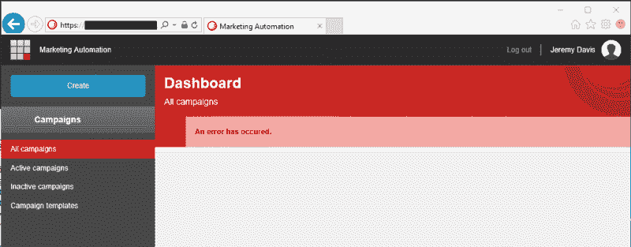

# 营销自动化搬起石头砸自己的脚

> 原文：<https://dev.to/jermdavis/shooting-myself-in-the-foot-with-marketing-automation-4oae>

最近，我和 Sitecore Support 进行了另一次有趣的聊天，是关于一个问题，当我在 Google 上查看时，似乎没有得到任何有用的结果。所以，以我的方式，我今天填补了搜索引擎的空白。这被证明完全是我的错——但这似乎是其他人也可能遇到的那种错误……因此，如果你已经部署了 Sitecore 的分布式实例，并发现营销自动化行为异常，请继续阅读……

## 这个问题

我一直在使用 XP1 SIF 脚本进行 Sitecore v9.1 Update 1 的大型部署。大多数情况下，这是非常无痛的。我能够编辑各种 json 文件，以填充我的部署所需的特定配置，然后在正确的位置运行正确的脚本，使其全部工作。

但是在初始部署之后，我注意到网站的一个方面不能正常工作。当您尝试浏览营销自动化 UI 时，您会得到一个暂停，然后是一个神秘的错误:

[](https://jermdavis.files.wordpress.com/2019/06/marketingautomationerror.png)

在深入研究我的 CM 服务器上的 Sitecore 日志时，我发现了这个错误，它位于一个很长的堆栈跟踪的顶部。我已经剪掉了结尾，因为它只是长时间重复同样的事情，但有趣的是:

```
13976 14:53:30 ERROR [Sitecore Services]: HTTP GET
URL https://author.redacted.com/sitecore/api/ma/plans/?cultureName=en-GB&sc_site=shell

Exception System.InvalidOperationException: Get plan statistics did not complete successfully. StatusCode: 404, ReasonPhrase: 'Not Found', Version: 1.1, Content: System.Net.Http.StreamContent, Headers:
{
  Connection: close
  Date: Mon, 03 Jun 2019 12:53:30 GMT
  Server: Microsoft-HTTPAPI/2.0
  Content-Length: 315
  Content-Type: text/html; charset=us-ascii
}
   at Sitecore.Xdb.Common.Web.Synchronous.SynchronousExtensions.SuspendContextLock[TResult](Func`1 taskFactory)
   at Sitecore.Marketing.Automation.Data.AutomationPlanRepository.<GetAll>d__9.MoveNext()
--- End of stack trace from previous location where exception was thrown ---
   at System.Runtime.ExceptionServices.ExceptionDispatchInfo.Throw()
   at System.Runtime.CompilerServices.TaskAwaiter.HandleNonSuccessAndDebuggerNotification(Task task)
   at Sitecore.Marketing.Automation.Client.Controllers.AutomationPlansController.<GetAll>d__8.MoveNext() 
```

<svg width="20px" height="20px" viewBox="0 0 24 24" class="highlight-action crayons-icon highlight-action--fullscreen-on"><title>Enter fullscreen mode</title></svg> <svg width="20px" height="20px" viewBox="0 0 24 24" class="highlight-action crayons-icon highlight-action--fullscreen-off"><title>Exit fullscreen mode</title></svg>

在营销自动化服务的日志中没有任何内容表明在它们的末端有一个错误，并且 IIS 日志在 CM 服务器上有这个请求，但是有一个 500 状态代码，而不是上面暗示的 404。

谷歌没有帮助我，所以经过一番挠头之后，我筹集了一张支持票。

## 解

在更详细地查看了我的 CM 和营销自动化实例的所有配置后，支持人员指出了一个明显的问题:我的 CM 服务器上的连接字符串文件将营销自动化的 URL 作为 HTTP 端点:

```
<?xml version="1.0" encoding="utf-8"?>
<connectionStrings>
  <!-- 
    Sitecore connection strings.
    All database connections for Sitecore are configured here.
  -->

  <add name="xdb.marketingautomation.operations.client" connectionString="http://xma.redacted.com" />
  <add name="xdb.marketingautomation.reporting.client" connectionString="http://xmareporting.redacted.com" />

</connectionStrings> 
```

<svg width="20px" height="20px" viewBox="0 0 24 24" class="highlight-action crayons-icon highlight-action--fullscreen-on"><title>Enter fullscreen mode</title></svg> <svg width="20px" height="20px" viewBox="0 0 24 24" class="highlight-action crayons-icon highlight-action--fullscreen-off"><title>Exit fullscreen mode</title></svg>

但是在这些端点后面设置服务的脚本只给了它们 HTTPS 绑定，因为 xConnect 服务在默认情况下是安全的。因此，当 CM 实例试图与营销自动化服务对话，却没有得到远程服务器的响应时，这显然会导致失败，因为它没有 HTTP 绑定。

进一步的挖掘[导致了令人尴尬的发现](https://media.giphy.com/media/XsUtdIeJ0MWMo/giphy.mp4),我在 CM 服务器 SIF json 文件中输入了营销自动化 URL。不知何故，我设法使用“http”而不是“https ”,因此 CM 服务器被设置为使用错误的 URL。

所以不要成为我。在部署之前，请仔细校对您的 SIF 脚本…