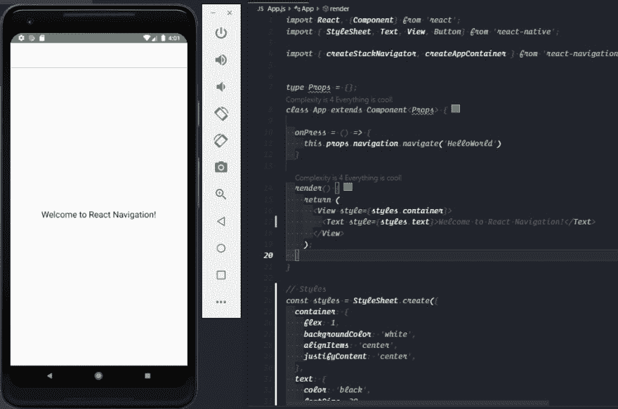
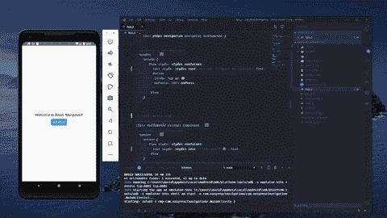

# React 导航-入门！

> 原文：<https://dev.to/davidlecodes/react-navigation-getting-started-3jlh>

**在这篇文章**中，我们将了解这个流行库的**基本概念**，以及如何让你的 React 原生应用在导航方面更具**可扩展性。**

> 本教程的资源可以在我的 [GitHub](https://github.com/D4v1d98Ru1z/started-react-navigation) 资源库中找到。随便叉，自己试试。🚀

### 索引

*   什么是 React 导航？
*   带 React 导航的 Hello World
*   何去何从

# 什么是 React 导航？

React Navigation 是一个库，它诞生于在 React 本地应用中创建导航的需求。正如我们所知，在移动环境中，有很多方法可以导航到不同的视图，我们可以选择我们需要什么样的导航或动画。**如原生平台所做。**

这个**基于 JavaScript 的**导航库**使用本地驱动**进行流畅转换。此外，React Navigation 采用了这种方法，避免了 Objective C、Swift、Java、Kotlin 中的任何必需知识，使您可以更专注于应用程序体验。

# Hello World 带 React 导航

在本节中，我们将在 React Native 上创建一个非常简单的 Hello World 应用程序，目的是学习如何以更简单的方式使用 React 导航。

在开始之前，让我们使用 React Native CLI 初始化一个 React Native 项目。

```
react-native init easyReactNavigation 
```

<svg width="20px" height="20px" viewBox="0 0 24 24" class="highlight-action crayons-icon highlight-action--fullscreen-on"><title>Enter fullscreen mode</title></svg> <svg width="20px" height="20px" viewBox="0 0 24 24" class="highlight-action crayons-icon highlight-action--fullscreen-off"><title>Exit fullscreen mode</title></svg>

在创建的项目内部，是时候将 React 导航安装到我们的`package.json`文件中了。

```
npm install -S react-navigation

# Then install the gesture handler.
npm install -S react-native-gesture-handler

# Link the native dependencies.
react-native link react-native-gesture-handler 
```

<svg width="20px" height="20px" viewBox="0 0 24 24" class="highlight-action crayons-icon highlight-action--fullscreen-on"><title>Enter fullscreen mode</title></svg> <svg width="20px" height="20px" viewBox="0 0 24 24" class="highlight-action crayons-icon highlight-action--fullscreen-off"><title>Exit fullscreen mode</title></svg>

接下来，使用 React 导航配置一个基本的根组件。为了实现它，您需要导入`createStackNavigator`，这是一个返回 React 组件的函数，在本例中是类`App`，它是从`App.js`直接导出的。

```
import { createStackNavigator, createAppContainer } from 'react-navigation'

class App extends React.Component {
  render() {
    return (
      <View style={styles.container}>
        <Text style={styles.welcome}>Welcome to React Navigation!</Text>
      </View>
    )
  }
}
// Create Stack Navigator gets two props createStackNavigator(routes, config)
const AppNavigator = createStackNavigator({
  Home: App
})
// Container of the app
const AppContainer = createAppContainer(AppNavigator)
export default AppContainer 
```

<svg width="20px" height="20px" viewBox="0 0 24 24" class="highlight-action crayons-icon highlight-action--fullscreen-on"><title>Enter fullscreen mode</title></svg> <svg width="20px" height="20px" viewBox="0 0 24 24" class="highlight-action crayons-icon highlight-action--fullscreen-off"><title>Exit fullscreen mode</title></svg>

运行这段代码，您将会看到一个非常漂亮的视图，在屏幕中间有一个问候文本。但是，有一点不同，你可以看到有一个标题。默认情况下，该标题由堆栈导航器提供。

[](https://res.cloudinary.com/practicaldev/image/fetch/s--exdKizcO--/c_limit%2Cf_auto%2Cfl_progressive%2Cq_auto%2Cw_880/https://thepracticaldev.s3.amazonaws.com/i/w0n23z6kxio7pahqyxjz.png)

### 浏览视图

在 React 导航中创建一个新视图就像用内容创建一个新的 React 组件一样简单。在本练习中，我们创建了一个类组件，在屏幕中间只有一个简单的平面文本。

```
class HelloWorld extends React.Component {
  render() {
    return (
      <View style={styles.container}>
        <Text style={styles.text}>Hello World!🤓</Text>
      </View>
    )
  }
} 
```

<svg width="20px" height="20px" viewBox="0 0 24 24" class="highlight-action crayons-icon highlight-action--fullscreen-on"><title>Enter fullscreen mode</title></svg> <svg width="20px" height="20px" viewBox="0 0 24 24" class="highlight-action crayons-icon highlight-action--fullscreen-off"><title>Exit fullscreen mode</title></svg>

在主视图中，让我们做一个按钮，它有一个将重定向到新视图的事件。为此，让我们为 onPress 事件创建一个方法，它负责使用导航属性转到新视图。

```
class App extends React.Component {
  // On Press event 
  onPress = () => {
    // Navigate to the HelloWorld view
    this.props.navigation.navigate('HelloWorld')
  }
  render() {
    return (
      <View style={styles.container}>
        <Text style={styles.text}>Welcome to React Navigation!</Text>
        <Button 
          title="Tap me 😄"
          onPress={this.onPress}
        />
      </View>
    )
  }
} 
```

<svg width="20px" height="20px" viewBox="0 0 24 24" class="highlight-action crayons-icon highlight-action--fullscreen-on"><title>Enter fullscreen mode</title></svg> <svg width="20px" height="20px" viewBox="0 0 24 24" class="highlight-action crayons-icon highlight-action--fullscreen-off"><title>Exit fullscreen mode</title></svg>

不要忘记将新视图导入堆栈导航器。

```
const AppNavigator = createStackNavigator({
  Home: App,
  HelloWorld
}) 
```

<svg width="20px" height="20px" viewBox="0 0 24 24" class="highlight-action crayons-icon highlight-action--fullscreen-on"><title>Enter fullscreen mode</title></svg> <svg width="20px" height="20px" viewBox="0 0 24 24" class="highlight-action crayons-icon highlight-action--fullscreen-off"><title>Exit fullscreen mode</title></svg>

> **堆栈导航器**提供了屏幕之间的转换，每个新屏幕都放在堆栈的顶部，其工作方式与调用堆栈完全一样。

最后，这里是最终结果！🎉

[](https://i.giphy.com/media/fV8KNoIllOgikN62G1/giphy.gif)

# 何去何从

本文只是 React Navigation 这个庞大库的一个简单开端。你可以去看看官方文档。另外，你可以在 dev.to 以及 [Instagram](https://www.instagram.com/davidlecodes/) 和 [Twitter](https://twitter.com/davidlecodes) 上关注我！