# 使用 Angular 和其他免费工具创建渐进式 Web 应用程序！

> 原文：<https://dev.to/paco_ita/create-progressive-web-apps-with-angular-workbox-pwa-builder-step-4-27d>

谁说创建 PWAs 很难？

在本次会议中，我们将发现一些实用的解决方案，以轻松构建我们的下一个渐进式 Web 应用程序。

开始之前，先快速回顾一下我们目前所学的内容:

*   [简介](https://dev.to/paco_ita/a-gentle-introduction-to-progressive-web-apps-step-1-24da):向我们介绍了背景知识，并概述了渐进式网络应用的优势。

*   [安装 PWA](https://dev.to/paco_ita/install-a-pwa-on-the-user-s-device-step-2-27pa) :描述了什么是`web app manifest`以及我们如何配置它。

*   [缓存策略](https://dev.to/paco_ita/service-workers-and-caching-strategies-explained-step-3-m4f) : faced `service workers` (SW)以及我们如何配置缓存策略以充分发挥其潜力。

本文由三个部分组成，如果您愿意，可以随意跳到特定的部分或继续阅读:

*   [PWA 生成器](#builder)
*   [工具箱](#wbox)
*   [角度 PWA 演示](#angular)

# PWA 构建器

[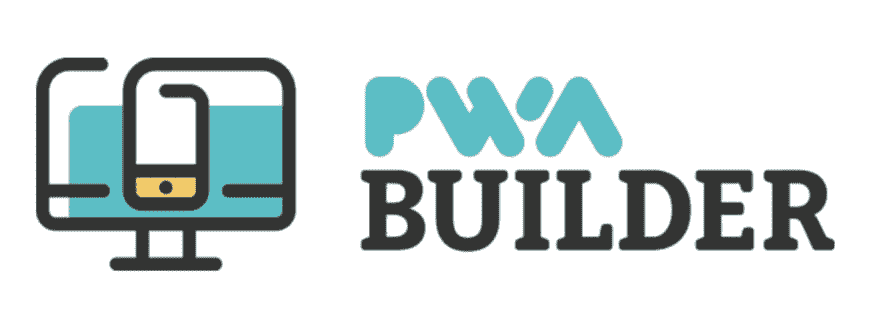](https://res.cloudinary.com/practicaldev/image/fetch/s--QAOiAihs--/c_limit%2Cf_auto%2Cfl_progressive%2Cq_auto%2Cw_880/https://thepracticaldev.s3.amazonaws.com/i/mgdi9lgup0sf0m7j93v3.png)

[PWA Builder](https://www.pwabuilder.com/) 是微软的一个开源项目( [repo](https://github.com/pwa-builder/PWABuilder-CLI) )。当前版本(2.0)带来了全新的布局和更多的功能，以更好地帮助开发人员。

访问网页时，我们在标题中有两个菜单项:

*   我的中心(默认打开)

*   特色商店

### 我的枢纽页面

本节的目标是分析一个给定的网站，并提供提示，使其完全 PWA 准备就绪。

[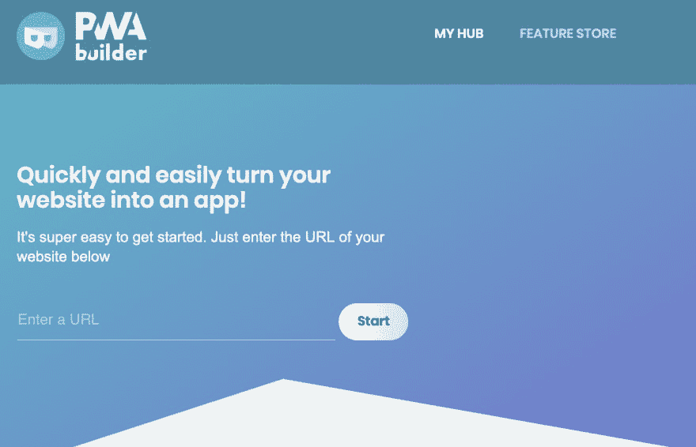](https://res.cloudinary.com/practicaldev/image/fetch/s--kE-Ff_2X--/c_limit%2Cf_auto%2Cfl_progressive%2Cq_auto%2Cw_880/https://thepracticaldev.s3.amazonaws.com/i/ycl3hi4o50g2ges0dgzo.png)

通过输入我们的 web 应用程序的 url 地址，PWA Builder 开始搜索是否存在 web 应用程序清单、已安装的服务工作器和安全连接，以及其他几个参数。

下面我用`https://angular.io`网站展示了一个目标已经是 PWA 的例子:

[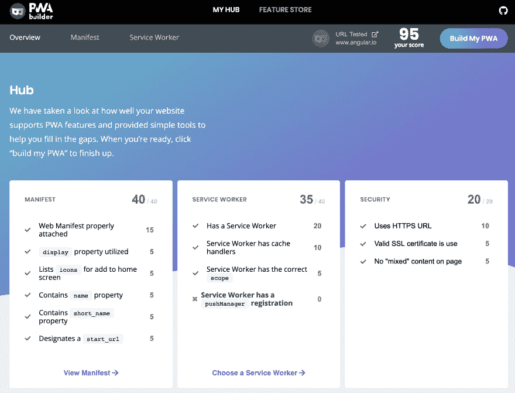](https://res.cloudinary.com/practicaldev/image/fetch/s--QKjorCij--/c_limit%2Cf_auto%2Cfl_progressive%2Cq_auto%2Cw_880/https://thepracticaldev.s3.amazonaws.com/i/5avjk3qvepro5i59o9ck.png)

三个“报告卡”分别显示 web 清单、服务人员和安全性的分析结果。每个盒子都有一个分数(总分 100)。这旨在帮助识别缺失的 PWA 设置，并遵循最佳实践。

让我们看看另一个网站:`www.repubblica.it`。
这里没有安装服务人员，因此得分仅为 60 分。如果我们还没有实现任何软件，这个案例可能反映了我们网站的现状。

[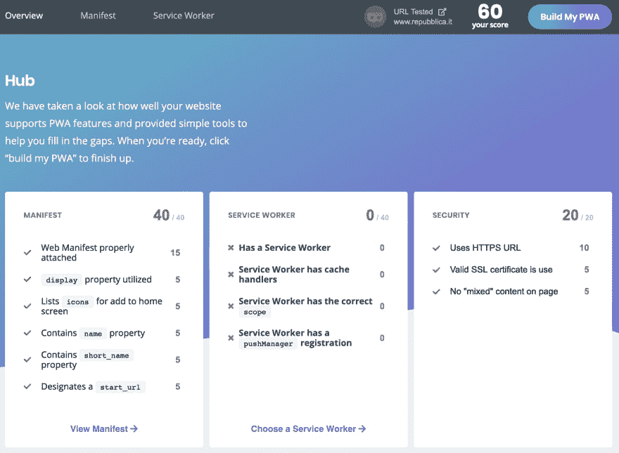](https://res.cloudinary.com/practicaldev/image/fetch/s--Jg1pUeI7--/c_limit%2Cf_auto%2Cfl_progressive%2Cq_auto%2Cw_880/https://thepracticaldev.s3.amazonaws.com/i/qvbbizwmw1mn422xj41v.png)

现在让我们详细描述一下清单和服务人员部分。

### 网页清单部分

**清单页面**允许深入查看 web 清单的详细信息:

[](https://res.cloudinary.com/practicaldev/image/fetch/s--E_WICv0Q--/c_limit%2Cf_auto%2Cfl_progressive%2Cq_auto%2Cw_880/https://thepracticaldev.s3.amazonaws.com/i/369qwdkw24mb0qedpmwk.png)

如果文件中存在任何错误，它将显示在显示最终 web 清单的右面板的右下角。

如果目标网站没有任何清单文件，应用程序会尝试从页面中猜测一些值，比如应用程序名称的标题或页面内容中的图片。这些值将在表单中提出，表单的字段与 web 清单属性一致。
我们可以手动编辑这些字段或上传新图像，PWA Builder 将直接更新最终的 json 文件。

“设置”选项卡允许定义更多属性。在下拉菜单的帮助下，我们不需要记住所有可能的值，这使我们可以轻松地调整 web 清单:

[](https://res.cloudinary.com/practicaldev/image/fetch/s--sdWZ0XGq--/c_limit%2Cf_auto%2Cfl_progressive%2Cq_auto%2Cw_880/https://thepracticaldev.s3.amazonaws.com/i/ywvv3gyzyb3y8cfoxj5d.png)

### 服务人员

这一部分可能更有趣，因为它允许在一组最常见的软件场景中进行选择，比如显示一个简单的离线页面或实现`stale while revalidate`缓存策略(如果你想了解更多细节，这已经在[以前的文章](https://dev.to/paco_ita/service-workers-and-caching-strategies-explained-step-3-m4f#stale-strategy)中讨论过了)。

当我们选择提供的选项之一时，右侧的代码片段会相应地更新。此时我们要做的就是下载文件并上传到我们的 web 应用程序中。

[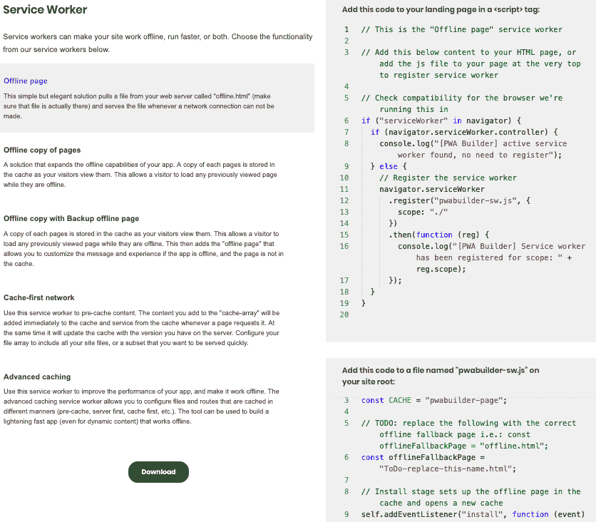](https://res.cloudinary.com/practicaldev/image/fetch/s--rOwQJO6S--/c_limit%2Cf_auto%2Cfl_progressive%2Cq_auto%2Cw_880/https://thepracticaldev.s3.amazonaws.com/i/o2zpsec316qvbbug78ms.png)T3】

### 功能商店页面

此页面收集了预配置的代码片段，允许进一步增强我们的 PWA。我们只需要选择一个特性并将代码导入到我们的项目中。完成了，耶！！😀

[](https://res.cloudinary.com/practicaldev/image/fetch/s--2TA9oEST--/c_limit%2Cf_auto%2Cfl_progressive%2Cq_auto%2Cw_880/https://thepracticaldev.s3.amazonaws.com/i/1lvbqdecrnc7owed24jq.png)

微软团队正在努力在未来的版本中添加更多的代码片段。

### 建立我的 PWA

除了单独处理单个文件之外，PWA Builder 还提供了针对不同平台生成完整的基本应用程序的可能性。

[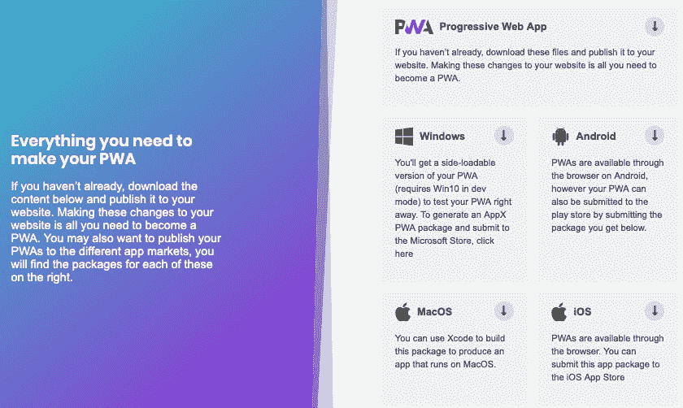](https://res.cloudinary.com/practicaldev/image/fetch/s--alkg5qj8--/c_limit%2Cf_auto%2Cfl_progressive%2Cq_auto%2Cw_880/https://thepracticaldev.s3.amazonaws.com/i/eyr1i8efkwm0bo40nsnz.png)

你可以在这里找到工具文档[📔](https://docs.pwabuilder.com/) 

# 工具箱

[](https://res.cloudinary.com/practicaldev/image/fetch/s--EbQlhkQq--/c_limit%2Cf_auto%2Cfl_progressive%2Cq_auto%2Cw_880/https://thepracticaldev.s3.amazonaws.com/i/9nl0mq5vb4xrwflaizfp.png)

Workbox 是 Google 的一个开源项目(这里是 [repo](https://github.com/GoogleChrome/workbox) )。

它包含一组抽象服务工作者复杂性的库和节点模块。这允许关注应用程序业务逻辑，而不必关心底层的 PWA 细节。

### 设置

与 PWA Builder 相比，Workbox 为开发人员提供了更强大和更精细的控制，但另一方面，它也需要最少的 Javascript 和服务人员知道如何操作。

为了开始，我们首先需要创建一个服务工作者，在这里我们导入工作箱文件`workbox-sw.js` :

```
importScripts('https://storage.googleapis.com/workbox-cdn/releases/4.3.1/workbox-sw.js');

if (workbox) {
  console.log(`Workbox is loaded!!`);
} else {
  console.log(`Workbox failed to load`);
} 
```

Enter fullscreen mode Exit fullscreen mode

`importScripts()`方法属于 [WorkerGlobalScope](https://developer.mozilla.org/en-US/docs/Web/API/WorkerGlobalScope#Methods) 接口，并同步导入一个或多个脚本，用逗号分隔，到 worker 的作用域中。

在 Workbox 中，根据我们的需求，`routes`用于确定哪些请求必须匹配。
为此，我们可以采用不同的方法:

*   **琴弦**

```
workbox.routing.registerRoute(
  // Matches a Request for the myTargetFile.js file
  '/myTargetFile.js',
  handlerFn
); 
```

Enter fullscreen mode Exit fullscreen mode

*   **正则表达式**

```
workbox.routing.registerRoute(
// Matches image files
  /\.(?:png|gif|jpg|jpeg|svg)$/,
  handlerFn
); 
```

Enter fullscreen mode Exit fullscreen mode

*   **回调**

```
const myCallBackFn = ({url, event}) => {
  // Here we can implement our custom matching criteria

  // If we want the route to match: return true
  return true;
};

const handlerFn = async ({url, event, params}) => { 
  return new Response(
   // Do something ...
  );
};

workbox.routing.registerRoute(
  myCallBackFn,
  handlerFn
); 
```

Enter fullscreen mode Exit fullscreen mode

一旦定义的路由与请求匹配，我们就可以通过`caching strategy modules`或`custom callbacks`指示 Workbox 做什么(就像上面的第三个例子)。

**缓存策略模块**让我们用一行代码实现一个缓存策略:

```
workbox.routing.registerRoute(
  /\.css$/,
  new workbox.strategies.StaleWhileRevalidate({

    // We can provide a custom name for the cache
    cacheName: 'css-cache',
  })
); 
```

Enter fullscreen mode Exit fullscreen mode

上面的代码缓存了`.css`文件并实现了`StaleWhileRevalidate`策略。与我们在[之前的帖子](https://dev.to/paco_ita/service-workers-and-caching-strategies-explained-step-3-m4f#caching-strategy)中看到的代码相比，我们不得不承认它要简洁得多！！

支持的策略有:

*   网络优先
*   先缓存
*   重新验证时过时
*   仅网络
*   仅缓存

定制回调适用于我们需要丰富响应或开发一些预定义缓存策略没有提供的其他特定动作的场景。

路径和缓存模块是 Workbox 的基础，但该工具提供了更多。例如，我们可以使用`pre-cache`文件使 web 应用程序即使在离线时也能响应，或者我们可以使用`plugins`来管理后台同步队列，以防一个网络请求失败。

下面的代码显示了如何定义缓存多少条目以及保留多长时间:

```
workbox.routing.registerRoute(
  /\.(?:png|jpg|jpeg|svg)$/,
  new workbox.strategies.CacheFirst({
    cacheName: 'img-assets',
    plugins: [
      new workbox.expiration.Plugin({
        maxEntries: 50,
        maxAgeSeconds: 7 * 24 * 60 * 60,  // 7 days
      }),
    ],
  }),
); 
```

Enter fullscreen mode Exit fullscreen mode

### 调试信息

在开发我们的应用程序时，调试和查看在 Workbox 下发生了什么是很有用的。

Workbox 的调试版本提供了许多细节，有助于理解是否有任何东西没有按预期工作。

我们需要启用 Workbox 来使用调试版本:

```
workbox.setConfig({  debug:  true  }) 
```

Enter fullscreen mode Exit fullscreen mode

debug 为 JavaScript 控制台构建具有特定日志级别的日志消息。如果您没有看到一些日志，请检查浏览器控制台中的日志级别设置。将其设置为*详细*级别将显示最详细的消息。

这些功能只是工具箱潜力的一小部分。如果你想了解更多，看看关于当前可用的所有模块的[文档](https://developers.google.com/web/tools/workbox/modules/)。【T2

# 棱角分明

[](https://res.cloudinary.com/practicaldev/image/fetch/s--C0svzccH--/c_limit%2Cf_auto%2Cfl_progressive%2Cq_auto%2Cw_880/https://thepracticaldev.s3.amazonaws.com/i/4wi96mbg4sq7yemmsdh0.png)

虽然以前的工具是框架不可知的，但我们也可以用 Angular 实现渐进式 web 应用程序，我们会看到它是多么容易！

### 设置

如果您已经熟悉 angular 并安装了 CLI，您可以直接进入下一节

对于演示，我将使用[视觉代码](https://code.visualstudio.com/)，但是你可以使用任何你喜欢的编辑器。
我们还需要`@angular/cli`。如果你还没有安装它，你可以执行下面的命令:

```
// using npm 
npm install -g @angular/cli@latest 
```

Enter fullscreen mode Exit fullscreen mode

要验证一切正常，在控制台中按`ng help`，您应该会看到所有可用的命令:

[](https://res.cloudinary.com/practicaldev/image/fetch/s--sRDM0Fla--/c_limit%2Cf_auto%2Cfl_progressive%2Cq_auto%2Cw_880/https://thepracticaldev.s3.amazonaws.com/i/wfksxm64v4xtjyxqijv4.png)

让我们创建一个新项目:

```
ng new angular-pwa 
```

Enter fullscreen mode Exit fullscreen mode

安装完所有 node_modules 后，使用`serve`命令构建并运行应用程序:

```
ng serve 
```

Enter fullscreen mode Exit fullscreen mode

在`http://localhost:4200/`打开浏览器，您应该会看到默认的角度页面:

[](https://res.cloudinary.com/practicaldev/image/fetch/s---LYuJKf4--/c_limit%2Cf_auto%2Cfl_progressive%2Cq_auto%2Cw_880/https://dev-to-uploads.s3.amazonaws.com/i/g53tp9k1n5ztrt6kpd39.png)

很好！现在我们已经准备好开始了。

[](https://i.giphy.com/media/Lm63QU87HvgVEuTV63/giphy.gif)

### 添加 PWA 功能

[添加原理图](https://angular.io/guide/schematics#add-schematics)允许为角度应用提供 PWA 功能。在控制台中执行以下命令:

```
ng add @angular/pwa 
```

Enter fullscreen mode Exit fullscreen mode

我们可以注意到在我们的项目中不同的东西已经被更新

[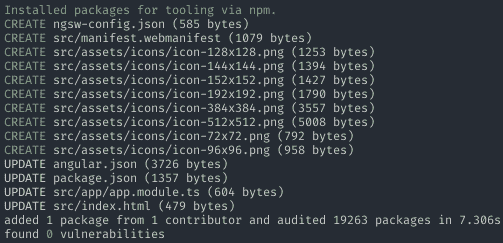](https://res.cloudinary.com/practicaldev/image/fetch/s--2tPKkoqN--/c_limit%2Cf_auto%2Cfl_progressive%2Cq_auto%2Cw_880/https://thepracticaldev.s3.amazonaws.com/i/9ewbipy96svyeuo5dwf6.png)

让我们首先开始分析更新的文件。

*angular.json*

```
 "build":  {  ...  "configurations":  {  "production":  {  ...  "serviceWorker":  true,  "ngswConfigPath":  "ngsw-config.json"  }  }  } 
```

Enter fullscreen mode Exit fullscreen mode

我们有两个新属性:`serviceworker: true`和`"ngswConfigPath": "ngsw-config.json"`。第一个属性将指示生产构建在分发文件夹中包括服务工作器文件(ngsw-worker.js 和 ngsw.json ),而后者指定服务工作器配置文件的路径。

*index.html*T2】

```
 <link rel="manifest" href="manifest.webmanifest">
  <meta name="theme-color" content="#1976d2"> 
```

Enter fullscreen mode Exit fullscreen mode

该命令注册了 web 清单，并为我们的 PWA 添加了一个默认的`theme color`。

*应用模块 ts*

下载`ServiceWorkerModule`并注册服务工人文件(ngsw-worker.js)。

```
@NgModule({
  declarations: [
    AppComponent
  ],
  imports: [
    BrowserModule,
    HttpClientModule,
    ServiceWorkerModule.register('ngsw-worker.js', { enabled: environment.production })
  ],
  bootstrap: [AppComponent]
}) 
```

Enter fullscreen mode Exit fullscreen mode

然而，如果我们搜索`ngsw-worker.js`文件，我们无法在我们的项目中找到它。原因是该文件直接取自 node_modules 文件夹，并在生产构建后放在分发文件夹中(默认为`/dist`，但可以在 angular.json 文件中配置)。

> ⚠️ **注意！**我们不应手动编辑服务人员文件，因为这将在每次生产构建时被覆盖，删除我们已经添加的任何更改。
> 
> `{ enabled: environment.production }`是允许 ServiceWorkerModule 注册服务工作者档案的标志条件。它使用 environment.production 变量仅在生产构建之后启用注册:`ng build --prod`。

在新生成的文件中，有一组大小不同的图像(角形标志)
放在`assets/icons`文件夹中。这些将用于主屏幕图标(一旦安装了 PWA)和闪屏(如果浏览器支持的话)。

**manifest.webmanifest.json**
使用默认值创建 web-manifest 文件(manifest . web manifest . JSON)。

```
{  "name":  "my-pwa",  "short_name":  "my-pwa",  "theme_color":  "#1976d2",  "background_color":  "#fafafa",  "display":  "standalone",  "scope":  "./",  "start_url":  "./",  "icons":  [  {  "src":  "assets/icons/icon-72x72.png",  "sizes":  "72x72",  "type":  "image/png",  "purpose":  "maskable any"  },  {  "src":  "assets/icons/icon-96x96.png",  "sizes":  "96x96",  "type":  "image/png",  "purpose":  "maskable any"  },  {  "src":  "assets/icons/icon-128x128.png",  "sizes":  "128x128",  "type":  "image/png",  "purpose":  "maskable any"  },  {  "src":  "assets/icons/icon-144x144.png",  "sizes":  "144x144",  "type":  "image/png",  "purpose":  "maskable any"  },  {  "src":  "assets/icons/icon-152x152.png",  "sizes":  "152x152",  "type":  "image/png",  "purpose":  "maskable any"  },  {  "src":  "assets/icons/icon-192x192.png",  "sizes":  "192x192",  "type":  "image/png",  "purpose":  "maskable any"  },  {  "src":  "assets/icons/icon-384x384.png",  "sizes":  "384x384",  "type":  "image/png",  "purpose":  "maskable any"  },  {  "src":  "assets/icons/icon-512x512.png",  "sizes":  "512x512",  "type":  "image/png",  "purpose":  "maskable any"  }  ]  } 
```

Enter fullscreen mode Exit fullscreen mode

现在让我们分析一下软件配置文件，因为有趣的事情就发生在这里！

*ngsw-config.json*

```
{  "$schema":  "./node_modules/@angular/service-worker/config/schema.json",  "index":  "/index.html",  "assetGroups":  [  {  "name":  "app",  "installMode":  "prefetch",  "resources":  {  "files":  [  "/favicon.ico",  "/index.html",  "/*.css",  "/*.js"  ]  }  },  {  "name":  "assets",  "installMode":  "lazy",  "updateMode":  "prefetch",  "resources":  {  "files":  [  "/assets/**",  "/*.(eot|svg|cur|jpg|png|webp|gif|otf|ttf|woff|woff2|ani)"  ]  }  }  ]  } 
```

Enter fullscreen mode Exit fullscreen mode

属性寻址 node_module 文件夹中的配置模式。它通过在编辑文件时提供验证和提示来帮助开发人员。如果尝试添加无效属性，IDE 将显示一条警告:

[](https://res.cloudinary.com/practicaldev/image/fetch/s--pxKHZu5G--/c_limit%2Cf_auto%2Cfl_progressive%2Cq_auto%2Cw_880/https://dev-to-uploads.s3.amazonaws.com/i/3noi1qlcagg31pewfq56.png)

`index`属性保存了索引页的路径，通常是 index.html。

`assetGroups`数组有两个缓存配置对象:

*   **app** :这个组的目标是构成我们应用程序核心的所有静态文件(“app shell”)，因此我们希望主动获取它们。属性`"installMode": "prefetch"`指定在服务人员安装时检索它们，并使它们在缓存中已经可用。如果软件无法收集文件，安装步骤将会中断。在页面重新加载时，再次触发新的尝试。

如果我们想包含外部资源，例如 web 字体，我们可以添加一个新的属性`url`，接受一个带有 glob 格式的资源路径的字符串数组。

```
 "resources":  {  "files":  [  "/favicon.ico",  "/index.html",  "/manifest.webmanifest",  "/*.css",  "/*.js"  ],  "urls":  [  "https://fonts.googleapis.com/**"  ]  } 
```

Enter fullscreen mode Exit fullscreen mode

*   **资产**:针对非即时需要的资源(如图像、字体文件)。`"installMode": "lazy"`告诉服务人员仅在第一次请求时收集请求的数据，而不是在此之前。`prefetch`和`lazy`是 installMode 属性的两个可能值，描述了我们有多渴望获得底层资源。`"updateMode": "prefetch"`指定如果检测到新版本的资源，软件必须如何操作。值为“prefetch”时，它会立即获取新版本，而“lazy”会让软件仅在再次请求时获取新版本。

> ⚠️ **注意！** `"updateMode": "lazy"`仅在 installMode 的值为“懒惰”时有效。

提取的文件存储在 [`Cache Storage`](https://developer.mozilla.org/en-US/docs/Web/API/CacheStorage) 中，这是服务人员可访问的所有缓存的接口。

`assetGroups`是为资产资源保留的，由`ng add @angular/add`命令自动创建。不过，我们可以添加另一个名为`dataGroups`的数组来缓存数据请求。
让我们在 ngsw-config.json 文件中添加以下代码(就在 assetGroups 之后):

```
 "dataGroups":  [{  "name":  "jokes-cache",  "urls":  [  "https://icanhazdadjoke.com/"],  "cacheConfig":  {  "strategy":  "performance",  "maxSize":  5,  "maxAge":  "15m"  }  },  {  "name":  "stocks-cache",  "urls":  [  "https://api.thecatapi.com/img/search"],  "cacheConfig":  {  "strategy":  "freshness",  "maxSize":  10,  "maxAge":  "1d",  "timeout":  "5s"  }  }] 
```

Enter fullscreen mode Exit fullscreen mode

在为每个缓存定义一个名称之后，我们通过`urls`属性设置我们感兴趣的 API 端点进行缓存。
`cacheConfig`部分定义了应用于匹配请求的策略:

*   **maxSize** :缓存响应的最大次数。

*   **maxAge** :设置缓存条目的寿命。在这段时间之后，缓存的项目将被删除。
    接受后缀:
    d:天
    h:小时
    m:分钟
    s:秒
    u:毫秒

*   **超时**:使用`freshness`策略，它指的是网络超时持续时间，在此之后，服务工作者将尝试从缓存中检索数据。

如 Angular 文档中所述，只有这两种缓存策略可用:

> 默认的**性能**，优化响应，尽可能快。如果资源存在于缓存中，则使用缓存的版本，并且不发出网络请求。根据 maxAge，这允许一些陈旧性，以换取更好的性能。这适用于不经常变化的资源；例如，用户头像图像。
> 
> **新鲜度**优化数据流通，优先从网络获取请求的数据。根据超时，只有当网络超时时，请求才会退回到缓存中。这对于经常变化的资源很有用；例如，帐户余额。

在我们的示例中，我们将`performance`策略用于 [`icanhazdadjoke.com`](https://icanhazdadjoke.com/api) 端点。这个 API 在每次访问时都会返回随机的笑话。因为我们希望每 15 分钟只发送一个新笑话，所以我们可以从缓存中提供数据，并相应地设置生存期。

在另一边，我们对 [`api.thecatapi.com`](https://api.thecatapi.com/img/search) 端点采用`freshness`策略，返回一只猫的随机图像。我们可以使用 API 来提供股票市场的详细信息，但我认为一些猫的照片会更可爱。因为我们真的喜欢猫，我们决定为新鲜度策略，因为我们想要有最新的最新细节。

服务工作者将在任何时候调用 API 时访问网络，并且只有在超时 5 秒的情况下，如在中断或没有连接的情况下，它才会从缓存中传递所请求的数据。

> ⚠️ **注意！**为了改善用户体验，特别是如果请求的数据新鲜度非常重要，我们应该通知用户所提供的信息来自缓存，并且不是最新的。

对于这个演示，我为 HTTP 调用创建了一个简单的服务，并更改了默认的`app-component`模板来显示 API 调用结果。
你可以从 [Github 库](https://github.com/pacoita/angular-pwa-boilerplate)获得完整的代码，但是这部分我就不在这里赘述了。PWA 演示也在[在线](https://pacoita.github.io/angular-pwa-boilerplate/)提供。

### 使签子造

现在是时候使用下面的命令进行生产构建了:

```
ng build --prod 
```

Enter fullscreen mode Exit fullscreen mode

将创建一个`dist`文件夹(如果您保留默认设置)。因为我们不能使用`ng serve`命令在本地测试服务人员，所以我们需要使用 web 服务器。我选择了 Chrome 扩展“web 服务器”:

[](https://res.cloudinary.com/practicaldev/image/fetch/s--saLcygyR--/c_limit%2Cf_auto%2Cfl_progressive%2Cq_auto%2Cw_880/https://thepracticaldev.s3.amazonaws.com/i/enzpljc6zq3yivgf90pz.png)

通过 web 服务器访问建议的 URL，您应该能够看到我们的 Angular 项目，布局如下:

[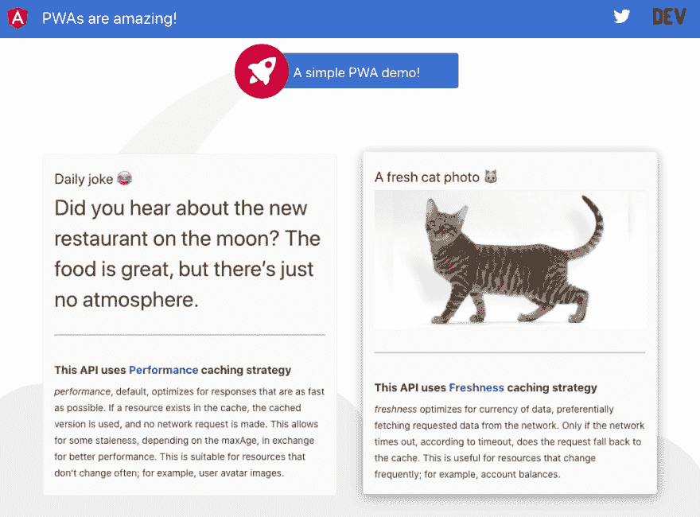](https://res.cloudinary.com/practicaldev/image/fetch/s--sIX4Jr5s--/c_limit%2Cf_auto%2Cfl_progressive%2Cq_auto%2Cw_880/https://dev-to-uploads.s3.amazonaws.com/i/s7j46pkqimw6iip7gwzt.png)

打开 dev tools(Chrome 中的 F12 ),在应用程序选项卡中，我们安装了我们的服务人员:

[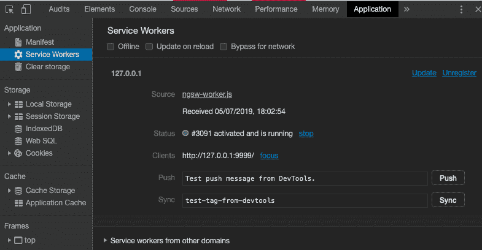](https://res.cloudinary.com/practicaldev/image/fetch/s--xGbBFqka--/c_limit%2Cf_auto%2Cfl_progressive%2Cq_auto%2Cw_880/https://thepracticaldev.s3.amazonaws.com/i/gn0g0xsxc5kitvoxmanv.png)

DevTools 的 network 选项卡向我们展示了正在使用的缓存策略:

[](https://res.cloudinary.com/practicaldev/image/fetch/s---O7kFdp3--/c_limit%2Cf_auto%2Cfl_progressive%2Cq_auto%2Cw_880/https://dev-to-uploads.s3.amazonaws.com/i/ekd71cy2oeyocfg9l8ak.png)

从缓存中提供`icanhazdadjoke.com`(除非它过期)，而从网络中获取 cats API。一切按计划进行！

如果我们将连接切换到飞行模式(在移动设备上),或者单击 DevTools 中的 *offline* 复选框来模拟无网络连接并刷新页面，我们可以看到我们的页面仍然被渲染，没有显示默认的离线页面。

我们创造了一个有棱角的 PWA，简单吧？

[](https://i.giphy.com/media/l46C52IJdRfvCGyVW/giphy.gif)T3】

# 分析我们的 PWA

我们如何确保新创建的 PWA 一切正常？幸运的是，我们有不同的准则和工具来验证我们的 PWA。

### PWA 检查表

谷歌工程师发布了一份清单，上面有很多要遵循的要点，以确保我们的 PWA 遵循最佳实践，并将完美地工作。该列表分为几个部分。对于它们中的每一个，都提供了一些操作来测试和修复特定的主题(Lighthouse 工具用于运行一些建议的测试):

[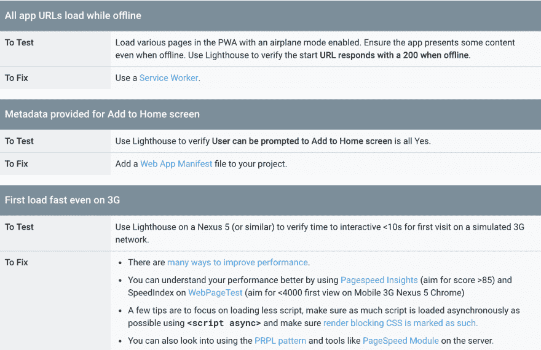](https://res.cloudinary.com/practicaldev/image/fetch/s--Sdl-Qjse--/c_limit%2Cf_auto%2Cfl_progressive%2Cq_auto%2Cw_880/https://thepracticaldev.s3.amazonaws.com/i/v59w5rx8momate5enipc.png)

你可以在这里
找到完整的名单

### 灯塔

Google 的 Lighthouse 是一款开源的网页审计工具。
网站的目标可以是性能、可访问性、渐进式网络应用和其他方面。

如果任何审计失败，将在其特定部分中报告。最高 100 分表示我们的网站有多好:

[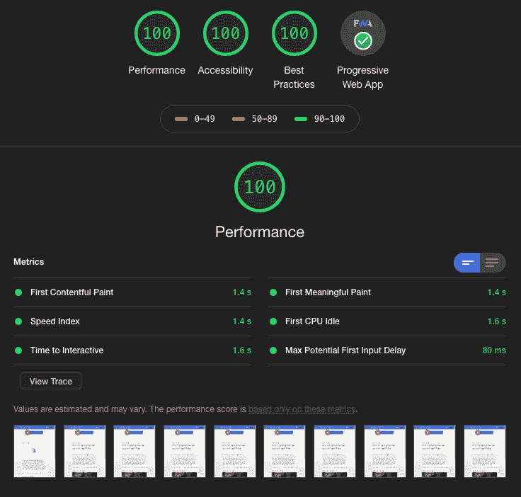](https://res.cloudinary.com/practicaldev/image/fetch/s--gcA51wVk--/c_limit%2Cf_auto%2Cfl_progressive%2Cq_auto%2Cw_880/https://dev-to-uploads.s3.amazonaws.com/i/eo412teci1m2568hyzzn.png)

关注 PWA 审核，如果我们展示了“PWA 徽章”,这意味着没有失败点。在这种情况下，我们做得很好，应该得到一杯好咖啡，☕！！

[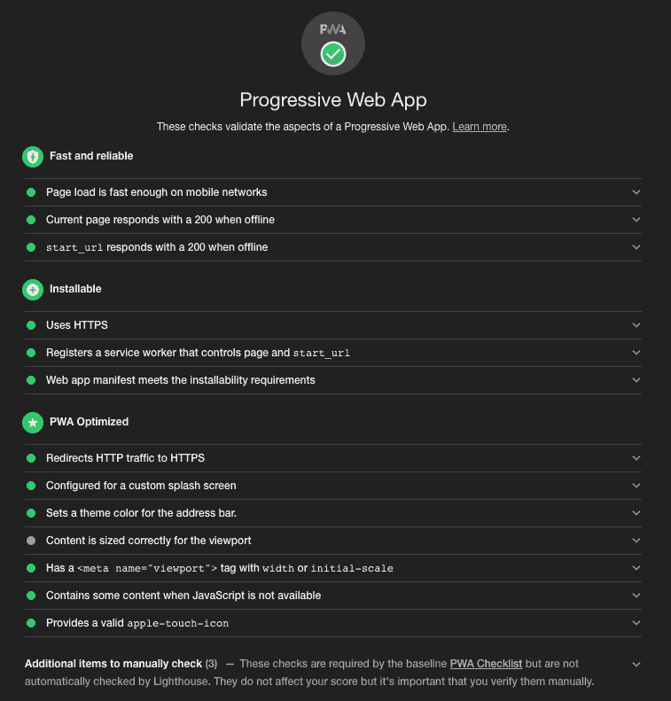](https://res.cloudinary.com/practicaldev/image/fetch/s--7uzhUaVO--/c_limit%2Cf_auto%2Cfl_progressive%2Cq_auto%2Cw_880/https://dev-to-uploads.s3.amazonaws.com/i/8c2vdqcporj0mtpy8zkn.png)

灯塔 PWA 审计遵循我们上面提到的`PWA Check List`。

## 奖励链接

最后的小礼物🎁因为已经到了文章的结尾！🎉

看看 [pwa.rocks](https://pwa.rocks/) 网站，在那里你可以找到一系列 pwa 的例子。其中一些可能会启发你💡！

下篇见！！

你可以关注我:

[](https://twitter.com/paco_ita)