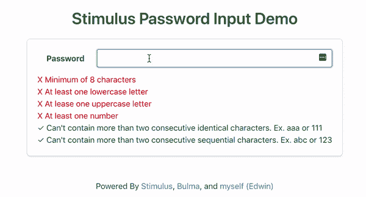

# 洒兴奋剂 JS -没有重选择的轻 JS。

> 原文：<https://dev.to/edwinthinks/sprinkling-stimulusjs-light-js-without-heavy-choices-1nmm>

# 简介

在当今的 web 应用程序状态下，很难选择合适的工具来为您的 web 页面注入一些交互性。有大量的选项可供选择，但不幸的是，其中许多都要求您致力于一个全面的 javascript 框架。我认为不应该轻易做出承诺的决定，尤其是当你为你的团队/公司/业务做出这个选择的时候。

我通常处理这些决定的方式是完全不回避做出这些决定。决策疲劳及其带来的压力是真实的。

本着回避风险的态度，我发现 [StimulusJS](https://stimulusjs.org) 是一个可能的选项，适合一些用例。在这篇文章中，我分享了我用它创建交互式密码输入表单的经验，在用户输入时显示需求是否得到满足，以及我对它的想法。

# 洒刺激

正如作者提到的，刺激的目标是用 JS 点缀页面，让它们闪闪发光。如果您主要拥有服务器端呈现的 HTML 页面，并且希望在这些页面上注入一些交互性，那么它可能非常适合您的项目。否则，您可能需要另找一个工具。

[核心概念](https://stimulusjs.org/handbook/origin#the-three-core-concepts-in-stimulus)特别提到它主要是绑定到现有的 HTML 并操纵它们。它不像 [React](https://reactjs.org/) 那样关心创建 HTML 来呈现。

例如:

```
// In Stimulus
<div data-controller="clipboard">
  PIN: <input data-target="clipboard.source" type="text" value="1234" readonly>
  <button data-action="clipboard#copy">Copy to Clipboard</button>
</div> 
```

Enter fullscreen mode Exit fullscreen mode

```
// In React
<pin-input></pin-input> 
```

Enter fullscreen mode Exit fullscreen mode

在刺激方法中，您可以预先看到所有的 HTML，并且可以避免挖掘另一个文件来查看 HTML 是什么。然而，这可能意味着您的 HTML 文件可能会变得更大，并面临难以管理的风险。

# StimulusJS 很容易学

作为一个大部分时间都在后端工作的人，我发现文档很清晰，很容易理解。我能够得到它的主要前提和足够的信息来相当快地使用它。我花了大约一个小时(或者更久)处理文档，并且能够很有效率地使用它。

# 根据需求构建交互式密码输入域

在我追求学习的过程中，我创建了一个基本的密码输入字段，以交互的方式显示其下的要求。下面的要求根据用户输入切换为满足或不满足。你可以在这里看到源代码[，在这里](https://github.com/edwinthinks/stimulus-password-requirements)现场测试[。](https://stimulus-password-requirements.netlify.com/)

一张它的 demo gif-
[](https://res.cloudinary.com/practicaldev/image/fetch/s--xjPOGzdf--/c_limit%2Cf_auto%2Cfl_progressive%2Cq_66%2Cw_880/https://thepracticaldev.s3.amazonaws.com/i/y7fvk5dfm8htjvb3sfaq.gif)

下面是代码片段，展示了它的协同工作(为了简洁，去掉了一些代码):

```
import { Controller } from "stimulus";

class PasswordInputController extends Controller {
  static targets = [
    "lowercaseLetter"
    // Removed other targets for brevity.
  ]

  connect() {
    this.validatePassword();
  }

  onInput(event) {
    this.password = event.target.value;
  }

  set password(value) {
    this.data.set("password", value);
    this.validatePassword();
  }

  get password() {
    if (!this.data.has("password")) {
      this.password = "";
    }

    return this.data.get("password")
  }

  validatePassword() {

    // Validate lowercase letters
    let lowerCaseLetters = /[a-z]/g;
    if (this.password.match(lowerCaseLetters)) {
      this.lowercaseLetterTarget.classList.toggle('invalid', false);
    } else {
      this.lowercaseLetterTarget.classList.toggle('invalid', true);
    }

    // Removed code on other validations of brevity
  }

}

export { PasswordInputController } 
```

Enter fullscreen mode Exit fullscreen mode

```
<div data-controller="password-input">
  <input class="input" type="password" data-action="input->password-input#onInput"></input>

  <li data-target="password-input.lowercaseLetter" class="password-requirements__requirement">
    At least one lowercase letter
  </li>
  <!-- Remove Code For Brevity -->
</div> 
```

Enter fullscreen mode Exit fullscreen mode

`PasswordInputController`定义了与它将要绑定的 HTML 相关的运行逻辑。Stimulus 提供的`Controller`类使我们能够通过`connect()`绑定逻辑部分，并在输入元素的`onInput()`和`data-action="input->password-input#onInput"`属性定义的用户输入上运行。定义了一个`validatePassword()`函数，通过`data-target`属性添加/移除相应`li`元素的`invalid` CSS 类。该函数最初由`connect()`调用，也在`password`的设置器中调用。

通过这样做，我能够生成一个功能性的密码输入字段。

# 检测？

我发现测试通过刺激制造的控制器并不像我希望的那么简单。

由于缺少`MutationObserver`，我最初在尝试让刺激控制器运行时遇到了一些问题。赫尔沃耶·希姆基的一篇[帖子弥补了这一点。](https://shime.sh/testing-stimulus)

不幸的是，关于如何测试的资源并不多。然而，一个[问题](https://github.com/stimulusjs/stimulus/issues/260)最近已经开放，要求在官方网页上添加文档。

不可否认，我在设置测试时的挣扎可能是因为我缺乏经验。

# 结论

Stimulus 是一个很好的工具，它可以让你的 HTML 页面在交互性上“闪闪发光”,而不必局限于一个框架。学习如何利用刺激是相当容易和容易的。

如果您发现自己需要在主要由服务器端 HTML 呈现的应用程序中添加一点交互性，那么您可能会发现选择使用 Stimulus 是一种拯救。