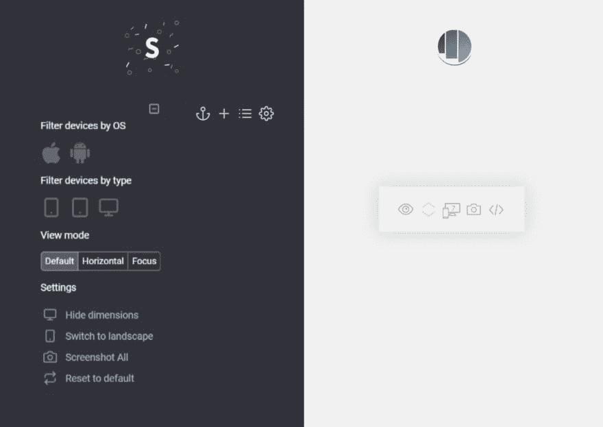
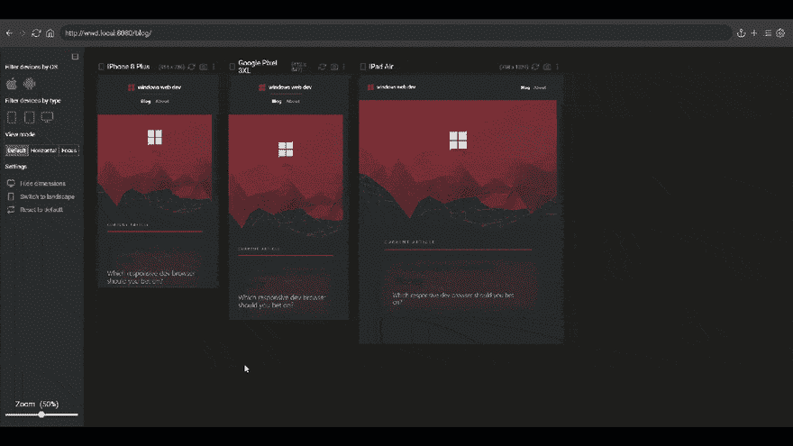
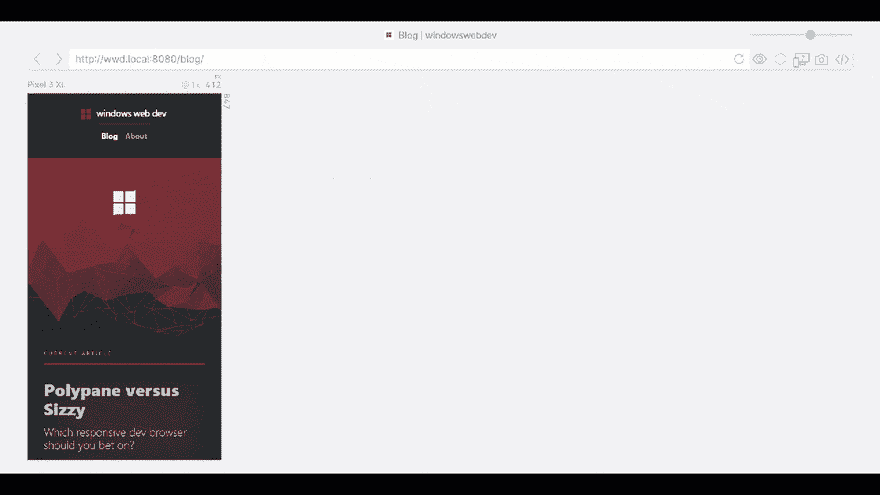
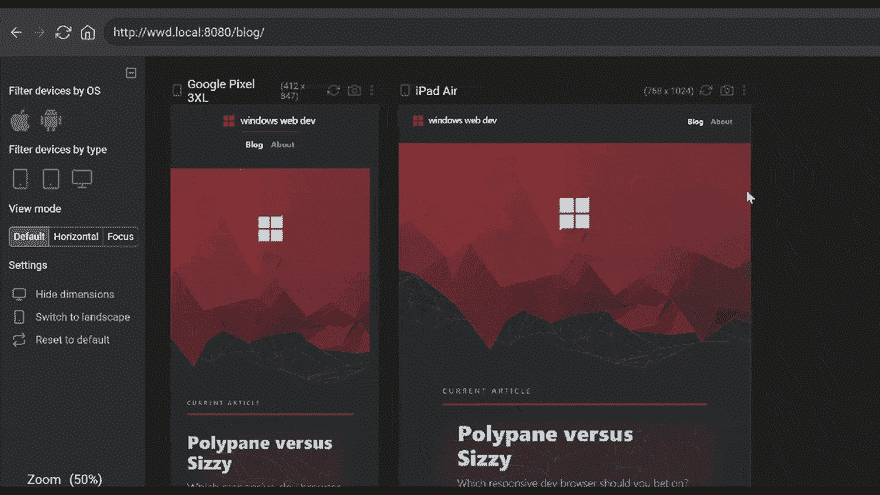
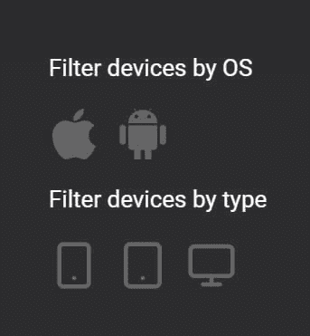

# 聚烷对希兹

> 原文：<https://dev.to/windowswebdev/polypane-versus-sizzy-432l>

<small>**注**:未提供审查版本。我购买了两个应用程序的许可证。这篇综述写于 2019 年年中，涉及 Sizzy 0.1.2 和聚烷 1(铬 73)。我预计这两款应用的功能集将随着时间的推移而增长。我会根据需要更新。“但是为什么没有 Blisk？”你可能会问。好问题。在某些方面，整体叶盘是一个比 Polypane 或 Sizzy 更强大的解决方案，值得自己的专门审查。在这里感觉有点不合适，因为它不允许同时显示多个视窗窗格，在我看来，这是这里审查的应用程序的主要特点。</small>

## 引擎盖下

### 聚烷

[Polypane](https://polypane.rocks) 是一款内置 Chromium 浏览器的电子应用。对，没错:*电子。*我意识到这伴随着一些包袱，对你来说可能是一个交易破坏者，但对我不是。Electron 为 Windows(和 Linux！)用户。我们可能永远不会看到的应用程序(因为设计/开发社区严重偏向 Mac OS)也正在为 Windows 发布。我不禁认为这是一件好事，尽管我总是更喜欢本机实现(如果可用的话)。以 Chromium 为基础，您将拥有 Chrome 的开发工具来满足检查和调试需求。使用专用工具栏按钮或使用熟悉的`Ctrl/Cmd+Shift+I`键盘快捷键调用开发工具窗口。因为它用 Blink 呈现你的页面，你将只能在一个类似 Chrome 的浏览器中浏览你的网页。这可能很好地满足了您的需求，但它确实排除了 Polypane 真正用于跨浏览器调试的可能性。你仍然需要启动 Firefox、Safari、*(颤栗)* IE 等。针对各种浏览器测试您的代码。这很好。跨浏览器测试并不是 Polypane(或 Sizzy)的目的。

### 希兹

Sizzy 也是基于 Electron(带有 React)构建的，并内置了 Chrome 开发工具，因此在这方面它与 Polypane 不相上下。像 Polypane 一样，Sizzy 独家使用 Chromium 的 Blink 渲染引擎。根据该应用的产品网站:“Sizzy 无法模拟不同的浏览器渲染引擎，所以在真实设备上测试时，可能会有一些微小的差异。”关于跨浏览器测试的警告在这里同样适用。

公平的警告:玩开发工具的时候正好是 Sizzy 对我没有反应的时候(我不得不关闭并重新打开这个应用)，但是我不知道是否有任何相关的关联。这似乎是一个孤立的事件。

## 用户界面

### 聚烷

Polypane 给人的印象是一个基于 chrome 的浏览器，去掉了大部分的 chrome。裸露的骨骼。它完成了任务，但没有它的竞争对手那么气派。没有菜单和设置/首选项可以调整。只有工具栏按钮和特定于窗格的控件。您需要探索这个接口，以掌握它的可用功能。毫无疑问，一些读者想要一个黑暗模式，但是 Polypane 还没有提供。我的大多数应用程序都是浅色主题，Polypane 的配色方案也很适合我。只是一些需要注意的事情。

### 希兹

Sizzy 有更好的用户界面。它看起来…很好...更像是一个专用的开发*应用*，而不是一个改装的开发浏览器。界面感觉非常直观，没有摩擦。一个专用的工具面板提供了对设备过滤器(按操作系统或按类型)、视图模式(默认、水平和聚焦)和一些基本“设置”的访问(包括一次截屏所有窗格的能力——如果不是如此错误，这是一个很好的功能，但本质上肯定不是一个“设置”)。

<figure>

<figcaption>In-app tools</figcaption>

</figure>

我对 Sizzy 的 Windows 实现的唯一问题(除了它看起来不像一个原生的 Windows 10 应用程序这一明显事实之外)是我最近遇到的另一个电子应用程序 Twizzy 的相同问题。电子工具包是灵活和健壮的，但是 Windows 上的 Sizzy 带有普通的白色标题栏、菜单栏和菜单。尽管事实上 Sizzy 只提供黑暗主题。这些非常明亮的 UI 组件会让人分心，而且突出来就像一个疼痛的拇指。(公平地说，Mac 版本似乎也有一个默认的 Mac-OS 专用标题栏，但它在那里看起来并不格格不入。)与 Eagle 或 Github Desktop 等电子应用程序相比，这两个应用程序都能正确处理这部分 UI。我希望开发人员在未来的版本中解决这个令人困扰的问题。

赢家:对我来说可能很辣，但不会很辣(你的口味可能会有所不同)

## 工作区管理

通过工作区管理，我指的是像重新排列和切换可见窗格的视图模式以及定制应用程序的主窗口这样的任务。至少对我来说，正如你将在下面读到的，Sizzy 的一个显著缺点是它相对繁琐的工作空间管理。

### 重新排列窗格/视口

#### 聚烷

Polypane 中的一个简单任务。每个视口上方都有专用按钮，用于在默认视图中左右移动视口。如下所述，在 Sizzy 中同样的任务需要更多的工作。

<figure>

<figcaption>Polypane's dedicated viewport "shufflers"</figcaption>

</figure>

#### 希兹

是的，你可以根据自己的喜好重新排列窗格，但是你必须进入`Organize Devices`模态对话框，手动重新排列设备列表顺序，然后保存你的更改。这听起来很乏味。也许你会让你的设备按照你想要的方式组织起来，而不需要经常访问这个对话框。但我倾向于在任何给定的时间重新排列窗格以匹配我的特定焦点——或者，至少我会这样做，如果 Sizzy 让这样做更容易的话。

### 查看模式

#### 聚烷

Polypane 只有两种模式:默认(`pane`模式)水平布局视口和`focus`模式(在`toggle mode`按钮后面)显示单个视口。让我先从第二种模式开始。我不觉得它特别有用，主要是因为它没有映射到默认视图中可见的任何现存视口。这完全是它自己的事。您需要随时根据需要手动调整这个单视图窗格的大小。我觉得不值得为我的工作流费心，但我也没有发现我需要用 Polypane。

至于默认？对我来说，它比 Sizzy 的类似观点(即`horizontal`)更有效，原因我将在下面讨论。

#### 希兹

Sizzy 提供了三种视图模式(我称之为“子模式”):`default`(根据需要垂直堆叠视口窗格)；`horizontal`(显然，在一行中水平显示它们)；`focus`模式(切换单个视口的视图)，以及刚刚在 0.2.1 更新中发布的一个新的子模式:`zen`，它隐藏了应用程序 chrome，以提供更整洁的体验。

堆叠视图对我来说感觉不自然，我无法习惯。在网页中垂直滚动是很自然的，但我不喜欢垂直滚动带来额外的离散视窗。感觉失去了比较视觉语境。我更喜欢查看并排放置的窗格— `horizontal`模式。不幸的是，*在`horizontal`模式下水平滚动可见窗格的唯一*方式是使用 Shift+鼠标滚轮。我意识到这就是你在一个比视窗更宽的页面上水平滚动的方式，但是同样，在这里感觉很麻烦。没有水平滚动条。Polypane 在这方面有更好的解决方案(如上所述)。

模式是 Sizzy 的工作空间管理真正闪光的地方。一旦你打开它，你就可以用箭头键或者使用界面顶部的标签在可见的窗格间导航。Sizzy 的`focus`模式实现远比 Polypane 中的类似特性更加精细。

<figure>

<figcaption>Sizzy focus tab toggles</figcaption>

</figure>

按下`z`键，可从任何其他模式进入`zen`子模式。

### 缩放工作区进行高级比较

#### 聚烷

没错。用聚烷很容易做到。对于我的工作流来说，这是一个突出的特性(Sizzy 共享的一个特性)。我经常发现自己需要(或者至少想要)在高层次上看到所有视口内容如何相互比较。Scrubby zoom 前来救援。

<figcaption>
Polypane 的磨砂画布缩放
</figcaption>

我也注意到聚烷的一个看似有用的特征。用空格键+左键点击画布/工作空间的空白区域，你可以水平拖动画布——左右。对我来说，这比 Sizzy 的`Shift+Mousewheel`水平滚动画布要直观得多。

#### 希兹

是，在`default`(即堆叠)视图模式下，但在`horizontal`中不是。

顺便说一句，当你调整应用程序窗口大小时，工作区中的视窗窗格会缩小以适应可用空间，至少在`horizontal`视图模式下是这样。这在我看来是违反直觉的。我希望无论我是否调整总体应用程序窗口的大小，视窗窗格都保持其固有尺寸。

 

<figure>

<figcaption>
希兹的磨砂画布缩放
</figcaption>

</figure>

**赢家:**除非你非常需要`focus`模式，在这种模式下，Sizzy 会发光，而 Polypane 不会，否则 Polypane 在这方面有优势

## 个体视口管理

### 向工作区添加视口

#### 聚烷

使用 Polypane 将烘焙视口添加到您的工作空间再简单不过了。您只需双击主工作区的空白区域，就会出现一个包含所有可用设备配置文件的覆盖列表。我无法告诉你我有多喜欢这种方法，相比之下，我更喜欢用 Sizzy 的隐藏菜单来完成同样的事情。(在那里，您需要访问一个工具栏菜单来显示一个模式覆盖，以打开和关闭视口轮廓，然后保存您的更改。)当我使用 Polypane 的时候，我使用这个功能一个 *lot* 。它又快又无摩擦。从用户体验的角度来看，它在这方面比 Sizzy 更好。

<figure>

<figcaption>Adding a viewport to Polypane {.figcaption .mb-8}

<figcaption></figcaption>

</figcaption>

</figure>

#### 希兹

使用 Sizzy，你必须访问一个专用的(有点不方便的)菜单来添加一个固定的设备配置文件。并且它总是将新的设备视口添加到右边的*。如上所述，如果您想将其移动到前一个视口的左侧，您必须再次访问同一个菜单。*

 * 

<figure>

<figcaption>
给 Sizzy
</figcaption>

</figure>

添加视口

### 重新配置现有的视口

#### 聚烷

要将一个视窗换成另一个视窗，只需点击视窗上方的设备类型标签，就会出现与上述相同的覆盖列表。选择不同的轮廓会将当前视口重新配置为新尺寸。很简单。而且很快。

#### 希兹

同样的任务在 Sizzy 中没有这么快和容易。你需要激活面板上方的溢出菜单，选择`edit`弹出一个模态对话框，手动输入你的调整，并保存你的更改。

 

<figure>

<figcaption>
在 Sizzy
</figcaption>

</figure>

中重新配置视口

但是，等等！还有呢！你不仅仅是调整了那里的视窗。您实际上还编辑了*内置的*设备配置文件，并且它将保持这种方式(直到您手动撤销您的编辑或清除应用程序缓存)。你可能*不想*那样做。当我第一次看到这个功能时，我知道我肯定不知道。如果你真的想走这条路，你会想先`clone`视口，然后进行修改。但是这里的要点是，Sizzy 没有提供一种简单的方法来快速重新配置给定的窗格。这是一种要么全有要么全无的事情——如果你改变它，你就几乎永久地改变了底层设备的定义。

### 从工作区中删除一个现有的视口

#### 聚烷

每个视窗上方都有一个“x”。点击它，窗格就会消失。真的就这么简单。将它带回来就像双击工作区的空白区域一样简单。

#### 希兹

有了希兹，事情就多了一点...复杂。是的，您可以通过访问溢出菜单并选择`delete`来删除视窗。会弹出一个对话框，询问你是否确定要这样做。我第一次遇到这种情况时，我想，“来吧。赌注没有 T2 那么高。你为什么让我再次点击？”事实上，赌注*是*那么高。您不仅仅是从工作区中删除视口。你也从应用程序中完全移除了设备描述文件。如果你想恢复它，你需要手动重新创建它(或者只是重置应用缓存——我发现自己经常这样做)。Sizzy 使得完全删除一个设备比仅仅隐藏它更容易。感觉倒退了。

从工作区隐藏视窗的正确方法是访问`Organize Devices`菜单，点击不需要的设备旁边的眼球图标，保存您的更改。繁琐。

**赢家:** Polypane，至少对我的工作流程来说，这是一个*巨大的*胜利

## 刷新时滚动到锚点

### 聚烷

没有。

### 希兹

是的。这是一个有趣的特性。Chromium 很好地保留了你的垂直滚动位置，所以我没有发现自己用得太多。但是它就在那里，您可能会找到一个合适的用例，使它成为您工作流的一个突出特性。

**获胜者:**希兹

## 内置设备配置文件

### 聚烷

与 Sizzy 相比，Polypane 附带了更多的内置设备配置文件(21 对 13)。

 <small>iPhone Xr/Xs max | Phone Xs | iPhone 7/8 | iPhone 7/8 Plus | iPhone SE | Galaxy S8 | Galaxy S7 | Pixel 3 XL | Pixel 3 | Pixel 2 XL |小安卓|平板人像| iPad | iPad Pro | Galaxy Note |
桌面|桌面宽|桌面高清| 720 p | 1080 p | Apple TV | Apple Watch</small> 

### 希兹

没有太多股票配置文件可供选择(13)——所有苹果和安卓设备，除了两个通用的笔记本电脑配置文件。

<small>iPhone 8 | iPhone 8 Plus | iPhone XR | iPhone XS | iPhone XS Max |谷歌 Pixel 3 |谷歌 Pixel 3XL | iPad Air | Galaxy S9 | Galaxy S9+| Nexus 7 |笔记本|笔记本电脑</small>

**赢家**:从数字上看，Polypane 赢了这一轮，但鉴于这两个应用在这方面都是可扩展的(见下一节)，很难将 Polypane 的较高计数视为一个强大的卖点

## 自定义设备配置文件

### 聚烷

你能给 Polypane 添加自定义设备配置文件吗？是的，但是你必须为此付出比希兹更大的努力。通过 UI，您*可以*通过特定于窗格的控件定制工作区中任何现有视窗的尺寸。但是你不能保存你的调整供以后使用。当然，它们在整个会话期间都是可用的。但是定制的设备尺寸不是永久的一次性的——我强调，是在 UI *本身中。*但是，您可以修改[这个](https://polypane.rocks/pane-sizes.json)配置文件，并将其保存到您设备的适当操作系统特定位置。这些更改将传播到内置设备列表中以供将来使用。这里是保存修改文件的位置。

*   视窗:`%APPDATA%/Polypane/`
*   苹果电脑:`~/Library/Application Support/Polypane/`
*   Linux: `~/.config/Polypane/`

就我个人而言，我宁愿定制 Polypane 的配置文件，而不是通过 Sizzy 的 UI 手动创建定制的设备配置文件(我觉得这很麻烦)，但你的里程数可能会因你的偏好/约束而异。

### 希兹

虽然 Sizzy 提供的内置设备配置文件较少，但你可以添加自己的*配置文件，这远远抵消了这一点。*我不知道自定义设备配置文件的上限是多少，但我没有找到。要在 Sizzy 中添加新的自定义视窗，您需要单击右上角工具栏中的加号按钮，并完成设备配置文件表单。您可以指定设备名称、用户代理字符串和设备的尺寸。一旦您创建了自定设备描述文件，它就会显示在您的可用设备列表中(并且会一直显示在那里，直到您清除应用程序缓存)。你随时都可以回去。

**赢家:**对我来说感觉像是平局，尽管如果你特别反对定制一个配置文件(你可能不反对)，Sizzy 可能对你有优势

## 按设备类型/操作系统过滤

### 聚烷

没有。

### 希兹

是的。我可以看到这对于那些同时面向 Android 和 iOS，但又想一次专注于其中一种设备的开发者来说非常有用。当然，你也可以过滤掉移动设备，只看大屏幕。这个功能实现得很好，运行得也很好。

 

<figure>

<figcaption>
希兹的滤镜控件
</figcaption>

</figure>

**获胜者:**希兹

## 从你的 CSS 中导出视口

### 聚烷

想要通过你自己的*断点自动查看你的站点，而不是从一个固定的设备配置文件列表中查看吗？Polypane 绝对让你做到这一点。只需点击工具栏中的`Create panes`按钮，工作区就会将您所有的媒体查询作为窗格加载到工作区中。这是一个突出的特点。如果你觉得这是你需要的...良好的...Polypane 是现在镇上唯一的游戏。*

### 希兹

没有。至少不是自动的。您需要逐个手动创建它们，然后逐个打开它们的可见性。

**获胜者:**聚烷

## 截图

### 聚烷

Polypane 目前只允许你截屏所有可见的窗格。没有截屏单个视口的选项。尽管如此，截屏一直如预期的那样工作。我注意到 Polypane 并没有隐藏视窗界面(设备类型，像素尺寸，等等)。)，所以它们会出现在你生成的截图里。我不能决定这是不是一件好事。

### 希兹

有了 Sizzy，你可以截图单个窗格以及完整的一套。然而，对完整的视口集进行截屏目前还是一项试验性的功能。然而，通过画布上的视口 UI 截屏各个窗格工作起来非常有魅力。此外，Sizzy 能够对视窗或整个滚动页面进行截屏——这也是一个实验性的功能，尽管谢天谢地，它看起来像预期的那样工作。这是一个很好的，周到的触摸。

我发现用 Sizzy 截屏所有的窗格非常容易出错。我明白为什么它现在处于实验阶段。在我的测试中，当我处于默认视图模式和水平视图模式时，我看到屏幕不正确地拼接成一个图像。

感觉我个人会更多地使用 Polypane 提供的并排截图，而不是 Sizzy 的单独截图。根据您的使用情况，您的里程可能会有所不同。

获胜者:看起来有点像一条领带，但不知何故属于不同的类别🤷

## 键盘快捷键

如果你是一个所谓的超级用户——如果你使用一个新应用的第一件事就是学习键盘快捷键 Polypane 和 Sizzy 都可以满足你。

### 聚烷

点击查看可用键盘快捷键列表[。](https://polypane.rocks/docs/list-of-shortcuts)

### 希兹

你可以在`Settings > Shortcuts`标签下找到 Sizzy 的快捷方式。在这个标签的顶部有一个提示，承诺快捷方式将很快被定制！

**获胜者:**首先允许用户配置快捷键的那个！

## 内置微软设备配置文件

Mac 用户:现在可以随意翻白眼，跳到下一部分。

### 聚烷

没有。看不到地面设备。(但如果你愿意，至少可以将它们添加到窗格配置中)

### 希兹

见上文。但是，同样，您可以添加自己的个人资料。

关于这一点，可以说的就这么多了。👎

**获胜者:**都不是

## 买之前先试试？

### 聚烷

是的。(七天试用期。)

### 希兹

不。但是联系开发商。他可能会给你一个准试用期，在此期间你可以得到全额退款。即使没有，支付 7 美元一个月的订阅费也不会造成太大的财务负担。至少你会知道这个工具是否足够吸引你去承诺每年的套餐。

**获胜者:**聚烷

## 文档

### 聚烷

是:[这里](https://polypane.rocks/docs/)

### 希兹

似乎不是这样。但是有一个 [changelog](https://headwayapp.co/sizzy-release-notes) 。

**获胜者:**聚烷

## 更新步调

现在说还为时过早。我要说的是，在我写这篇评论的时候，Sizzy 从 0.0.21 更新到了 0.1.2，Polypane 1.1 计划明天发布。

**获胜者:**还没有足够的比较信息

## 零零碎碎

### 切换设备方位

在 Sizzy 中，要将窗格的方向从纵向更改为横向，您可以单击相关的设备图标(在窗格的左上角)；在 Polypane 中，点击右上角的一个像素尺寸读数。乍看之下，两者都不是特别容易发现。然而，Sizzy 确实为设备图标提供了悬停效果，这无疑有助于发现。单击图标不仅会将窗格切换到横向或纵向方向，还会将设备图标本身旋转到适当的方向。这是一个很好的小技巧，代表了 Sizzy 更加完美的用户界面。

### 希兹的幽灵卷轴

有时候，当我使用 Sizzy 并打开另一个 Chromium 浏览器时，我正在浏览的网页会在两个浏览器中慢慢向上滚动，没有办法阻止它，除非关闭其中一个。

### Polypane 的滚动同步问题

如果您的开发环境使用了 Browsersync(尤其是它的滚动同步功能)，请注意这与 Polypane 不兼容。你需要(a)将 Browsersync 配置为*而不是*同步跨设备滚动，或者(b)关闭 Polypane 的内置滚动同步(通过 Polypane 工具栏中的`enable/disable scroll sync`开关)并让 Browsersync 做它自己的事情(这是我的偏好)。你需要做其中之一。否则，事情*会*变得怪异。

## 成本

好吧。这就把我们带到了倒数第二个问题。这些工具要花你多少钱？

### 聚烷

Polypane 每月运行 **$12** (每年收费$144)，或者你可以每月支付$15 订阅。我最初认为这似乎有点昂贵，因为 Polypane 的功能集通常与 Sizzy 的功能集相当(表面成本不到一半)。但是 Polypane 的许可证允许你在三个*独立的*设备上安装应用程序。为了比较价格，这一点非常值得注意。是的，表面上看成本更高，但是每次安装的成本只有 4 美元/台(如果您像我一样需要多个设备席位)。

### 希兹

Sizzy 只会让你每月花费 **$5** (每年 60 美元)。它也有每月 7 美元的选择。每月不到一半的费用，非常相似的功能集，在性价比方面，Sizzy 是赢家——也就是说，如果你只需要一个座位。注意:Sizzy 的许可证允许你在一个*单个*设备上安装应用程序。要添加额外的设备，您需要购买额外的许可证(每个座位 5 美元)。如果成本对你来说是一个决定因素，而你*不*需要多个座位，你可能会想要 Sizzy(也就是说，*除非*，对于*你的*工作流程，Polypane 明显更好的工具管理 UX 证明其更高的成本是合理的。如上所述，Polylpane 提供免费试用来帮助您做出决定)。

**赢家:**严格按照*单人*牌照的号码，希兹赢了(但如果你需要/想要多个座位，情况就不同了)

## 你真的需要这些工具吗？

最后，也是最重要的问题——在整个回顾过程中，这个问题可能一直萦绕在你的脑海中:你真的*需要*这些工具之一吗？

我在这里实话实说。如果你的预算目前很紧(就像我在生活中的不同时期一样)，简短的回答是:不，不太紧。这些是很好的工具。好工具。方便的工具。有用的工具。我因为不同的原因喜欢他们两个。我希望他们能一起创造一个体现两者最佳的婴儿，名字叫“多聚体”，并向全世界公布。我会立刻订阅的。

它们加快了你的工作流程吗？很有可能，但不是指数级的。它们确实减少了开发实时响应网站的摩擦，在各种设备上看起来都很棒。

但是他们现在对我来说都是奢侈品。非常好，值得投资，但还不是必不可少的。也就是说，如果成本对你的预算来说是可行的，我强烈建议试一试他们中的一个或两个。

**赢家**:你！✊

## 汇总对比

|  | 聚烷 | 希兹 |
| --- | --- | --- |
| **引擎盖下** | 电子(含铬) | 电子(含铬) |
| **Linux 支持** | -好的 | -好的 |
| **重新排列视口** | 快速简单 | 相对繁琐 |
| **动态重新配置视口** | 快速简单 | ✕:不尽然 |
| **移除视口** | 快速简单 | 相对繁琐 |
| **可缩放工作空间** | -好的 | -好的 |
| **刷新时滚动到锚点** | ✕ | -好的 |
| **老化设备** | Twenty-one | Thirteen |
| **自定义设备配置文件** | 通过修改的配置 | ✕ |
| **按设备类型过滤** | ✕ | ✕ |
| **按设备操作系统过滤** | ✕ | ✕ |
| **截图单个视口** | ✕ | -好的 |
| **截图所有视口** | -好的 | ✕仍然是实验性的 |
| **从 CSS 中导出断点** | -好的 | ✕ |
| **微软设备配置文件** | ✕ | ✕ |
| **免费试用** | -好的 | ✕ |
| **文档** | -好的 | ✕ |
| **每个许可证的席位/设备** | three | one |
| **成本** | **$ 12**/月(最多 3 台设备) | **$ 5**/月(在单个设备上) |

## 总结

我喜欢这两个应用程序，尽管原因不同。Polypane 有更好的工具管理；Sizzy 有一个更加完美的用户界面和一些独特的功能(例如，通过设备/操作系统过滤)。这个领域仍在发展中(我想是由 Blisk 开创的——在另一篇评论中会有更多相关内容),我期待 Polypane 和 Sizzy(以及其他人)都有出色的表现。)以后。愿他们的部落壮大。

本文原载于 [windowswebdev](https://www.windowswebdev.io/blog/polypane-vs-sizzy/) 。*