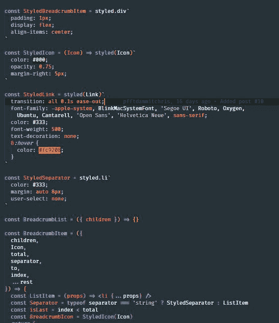

# 2019 年 JavaScript 开发者 26 款神奇 VS 代码工具

> 原文：<https://dev.to/jsmanifest/26-miraculous-vs-code-tools-for-javascript-developers-in-2019-50gg>

在[媒体](https://medium.com/@jsmanifest)上找到我

[Visual Studio Code](https://code.visualstudio.com/) (更通俗地称为 *VS code* )是一个轻量级但功能强大的跨平台源代码编辑器，运行在你的桌面上。由于内置了对 TypeScript 和 Chrome 调试器等开发工具的支持，我很快就爱上了这个编辑器，因为我越来越多地使用它来构建我的项目。

谁不喜欢 bajillion 开源扩展供公众使用和贡献呢？

如果您正在寻找更多的工具添加到您的开发工具包中，我希望这篇文章能帮助您找到一个可以采用的新工具！

*并不是所有的*工具都是专门针对 JavaScript 语言的*，而是针对像你我一样有着共同兴趣的 *JavaScript 开发者*的工具。*作为一名 JavaScript 开发人员*，我将围绕人类的五种感官[中的五种](https://www.livescience.com/60752-human-senses.html)中的三种来分享在几个方面增强我的开发流程的东西。*

以下是 2019 年 JavaScript 开发者的 26 个奇迹般的 VS 代码工具

## 1。项目片段

首先是我一直以来最喜欢的[项目片段](https://marketplace.visualstudio.com/items?itemName=rebornix.project-snippets)——源自 VS 代码中内置的原始 [*用户片段*](https://code.visualstudio.com/docs/editor/userdefinedsnippets) 。

如果您不熟悉用户代码片段，基本上这个特性允许您创建自己的代码片段，以便在整个项目中重用。

但是“重用”它们到底意味着什么呢？

好吧，如果你经常发现自己在编写任何类型的样板文件，比如下面的:

```
import { useReducer } from 'react'

const initialState = {
  //
}

const reducer = (state, action) => {
  switch (action.type) {
    default:
      return state
  }
}

const useSomeHook = () => {
  const [state, dispatch] = useReducer(reducer, initialState)

  return {
    ...state,
  }
}

export default useSomeHook 
```

Enter fullscreen mode Exit fullscreen mode

实际上，您可以直接将它添加到您的用户代码片段中，这样您就不必写出(或复制并粘贴)整个内容，而只需要键入自定义的*前缀*来生成您配置的代码片段。如果你进入*文件>首选项>用户片段*，你可以通过点击*新建全局片段文件*来创建一个新的全局片段。

例如，要为 TypeScript React 项目创建您自己的 snippets 文件，您可以单击*新的全局 Snippets 文件*，键入 *typescriptreact.json* ，它将引导您到一个新创建的`.json`文件，您可以将该文件用于使用 TypeScript 构建的 React 应用程序。

例如，要从上面的代码示例中创建一个用户代码片段，您应该这样做:

```
{  "const initialState = {}; const reducer = (state, action)":  {  "prefix":  "rsr",  "body":  [  "const initialState = {",  "  //$1",  "}",  "",  "const reducer = (state, action) => {",  "  switch (action.type) {",  "    default:",  "      return state",  "  }",  "}"  ]  }  } 
```

Enter fullscreen mode Exit fullscreen mode

准备好之后，您可以创建一个新的以`.tsx`结尾的 typescript 文件，键入前缀`rsr`，将会出现一个生成代码片段的建议。在弹出窗口中按下*标签*将会生成这个片段:

```
const initialState = {
  //
}

const reducer = (state, action) => {
  switch (action.type) {
    default:
      return state
  }
} 
```

Enter fullscreen mode Exit fullscreen mode

但是这样做的问题是，这将在你的所有项目中持续*(在某些情况下，这对于一般的片段来说可能是强大的)。有些项目的配置会稍有不同，当您需要区分特定的用例时，配置代码片段的全局文件开始成为一个问题。例如，一个用例是当每个项目的项目结构不同时:* 

```
{  "import Link from components/common/Link":  {  "prefix":  "gcl",  "body":  "import Link from 'components/common/Link'"  },  "border test":  {  "prefix":  "b1",  "body":  "border: '1px solid red',"  },  "border test2":  {  "prefix":  "b2",  "body":  "border: '1px solid green',"  },  "border test3":  {  "prefix":  "b3",  "body":  "border: '1px solid magenta',"  }  } 
```

Enter fullscreen mode Exit fullscreen mode

对于具有特定文件/文件夹结构的项目来说，这可能已经足够了，但是如果您正在处理另一个项目，其中的`Link`组件具有类似于`components/Link`的路径呢？

注意三个*边界测试*如何用单引号将它们的值括起来:`border: '1px solid red'`。这在 JavaScript 中完全有效，但是如果您使用[样式化组件](https://www.styled-components.com/docs)作为项目的样式化解决方案会怎么样呢？该语法不再适用于该工作区，因为样式化组件使用普通的 CSS 语法！

这就是[项目片段](https://marketplace.visualstudio.com/items?itemName=rebornix.project-snippets)开始发光的地方！

Project Snippets 使您能够声明项目/工作区级别的代码片段，这样您的代码片段就不会与其他项目冲突或污染其他项目。非常有用！

## 2。更好的评论

如果你喜欢在代码之间写注释，那么你有时可能会发现搜索你过去写的某些注释的位置有点令人沮丧，因为代码有时会变得有点拥挤。

使用[更好的注释](https://marketplace.visualstudio.com/items?itemName=aaron-bond.better-comments)，您可以通过引入彩色注释使您的注释更加明显:

[](https://res.cloudinary.com/practicaldev/image/fetch/s--gwM_aWUS--/c_limit%2Cf_auto%2Cfl_progressive%2Cq_auto%2Cw_880/https://jsmanifest.s3-us-west-1.amazonaws.com/posts/26-miraculous-vscode-tools-for-javascript-developers-in-2019/better-comments.jpg)

现在，您可以用`!`或`?`更好地提醒您的团队成员注意一些事情:)

## 3。括号对着色机

当我第一次看到这个扩展的截图时，我就知道我必须采用它并将它引入我的开发工具包中。编码是我的激情，激情应该是有趣的。因此，有了这种心态，这无疑帮助我更加享受我喜欢做的事情。

一个有趣的小事实是，有时多一点颜色有助于加速发育过程，因为它可以影响血液流动和唤醒。换句话说——你不仅仅是*在娱乐，你也在通过给你的工作流程增添色彩来改善你的健康！*

[](https://res.cloudinary.com/practicaldev/image/fetch/s--_Yd8MwJ4--/c_limit%2Cf_auto%2Cfl_progressive%2Cq_auto%2Cw_880/https://jsmanifest.s3-us-west-1.amazonaws.com/posts/26-miraculous-vscode-tools-for-javascript-developers-in-2019/bracketpaircolorizer.jpg)

## 4。材料主题

[素材主题](https://marketplace.visualstudio.com/items?itemName=Equinusocio.vsc-material-theme)是一个史诗主题，你可以直接安装到 VS 代码中，让你的代码看起来像这样:

[](https://res.cloudinary.com/practicaldev/image/fetch/s--bfn_QR_F--/c_limit%2Cf_auto%2Cfl_progressive%2Cq_auto%2Cw_880/https://jsmanifest.s3-us-west-1.amazonaws.com/posts/26-miraculous-vscode-tools-for-javascript-developers-in-2019/material-theme.JPG)

这是有史以来创造的最好的主题之一。我不知道如何详细描述一个主题有多棒，但这就是棒极了。现在就安装它，加入我的探索，把这个世界变成一个物质主义者的世界！(或者不要加入我只用主题。那也很酷)

## 5。@typescript-eslint/parser

如果你是一个 TypeScript 用户:随着 TSLint 背后的[支持者宣布计划在今年的某个时候弃用 TSLint](https://github.com/typescript-eslint/typescript-eslint#what-about-tslint) ，你可能应该开始考虑将你的 TSLint 配置转移到使用 ESLint + TypeScript 配置方法。

项目已经逐渐转向采用@typescript-eslint/parser 和相关的包来为他们的项目提供一个面向未来的设置。使用新的设置，你仍然可以利用 ESLint 的大部分规则和与 prettier 的兼容性。

## 6\. Stylelint

对我来说， [stylelint](https://marketplace.visualstudio.com/items?itemName=shinnn.stylelint) 是我所有项目中必不可少的，原因有很多:

1.  它有助于避免错误。
2.  它强制 css 中的样式约定。
3.  它与*更漂亮的*支持携手共进。
4.  它支持 css/scss/sass/less。
5.  它支持社区编写的插件。

## 7。Markdownlint + Docsify

现在我不知道你或其他开发人员在为他们的项目进行头脑风暴时喜欢如何做笔记，但我喜欢以 [markdown](https://daringfireball.net/projects/markdown/) 格式写下笔记。

首先，这对我来说很容易理解。还有大量的工具可以帮助简化编写 markdown 文本的过程，包括 [markdownlint](https://github.com/DavidAnson/vscode-markdownlint) 。Markdownlint 是一个 vs 代码扩展 linter，它帮助你在`.md`文件中进行样式检查。更酷的是它支持*更漂亮的格式*！

此外，我个人喜欢在我的所有项目上安装 [Docsify](https://docsify.js.org/#/) ，因为它支持每个项目的 markdown 和其他增强功能。

## 8。待办事项突出显示

我习惯在应用程序代码中编写 TODO，所以像 [TODO Highlight](https://marketplace.visualstudio.com/items?itemName=wayou.vscode-todo-highlight) 这样的扩展对于突出显示我在整个项目中设置的 TODO 非常有用。

## 9。进口成本

[导入成本](https://marketplace.visualstudio.com/items?itemName=wix.vscode-import-cost)是那些第一次尝试就变得非常有用的工具之一。但是过了一段时间，你开始意识到你真的不再需要这个工具了，因为它会告诉你你已经知道的东西。尽管如此，尝试一下这个工具，因为你可能会发现它很有用。

## 10。突出显示匹配的标签

有时，试图匹配标签的另一端会令人沮丧。这就是[高亮匹配标签](https://marketplace.visualstudio.com/items?itemName=vincaslt.highlight-matching-tag)带走你的挫败感的地方:

[](https://res.cloudinary.com/practicaldev/image/fetch/s--Bg_uDm3p--/c_limit%2Cf_auto%2Cfl_progressive%2Cq_auto%2Cw_880/https://jsmanifest.s3-us-west-1.amazonaws.com/posts/26-miraculous-vscode-tools-for-javascript-developers-in-2019/highlightmatchingtag.jpg)

## 11。vscode-spotify

说到挫折，有时不得不回到你的音乐播放器来切换音乐，然后不得不回到 vs 代码来继续做你正在做的事情，这是令人沮丧的。这就是 vscode-spotify 的用武之地，因为它允许你在 vscode 中使用 spotify！

有了这个扩展，你可以在状态栏中看到当前正在播放的歌曲，通过按热键在歌曲之间切换，点击按钮来控制 spotify，等等！

## 11。VSCode 的 GraphQL

GraphQL 一直在不断发展，我们开始在 JavaScript 社区的每个角落都能看到它的身影。也就是说，如果你还没有在 vs 代码中安装 [GraphQL for VSCode](https://marketplace.visualstudio.com/items?itemName=kumar-harsh.graphql-for-vscode) 可能是个好主意，这样你就可以在处理 GraphQL 语法时受益于语法高亮、林挺和自动完成功能。

我个人经常使用 [GatsbyJS](https://www.gatsbyjs.org) ，所以我的日常编码生活在一定程度上涉及到阅读 GraphQL 语法。

## 12。缩进彩虹

类似于上面的*高亮匹配标签*的原因。如果你在寻找通过凹痕的方法上有困难，那么[凹痕彩虹](https://marketplace.visualstudio.com/items?itemName=oderwat.indent-rainbow)可以帮助使那些凹痕更容易阅读。

这里有一个例子:

[](https://res.cloudinary.com/practicaldev/image/fetch/s--PpMYHt3C--/c_limit%2Cf_auto%2Cfl_progressive%2Cq_auto%2Cw_880/https://jsmanifest.s3-us-west-1.amazonaws.com/posts/26-miraculous-vscode-tools-for-javascript-developers-in-2019/indent-rainbow.JPG)

## 13。彩色高光

这是其中一个扩展，每个人都问我“你从哪里得到的？”如果他们还没有遇到这个扩展。基本上[颜色高亮](https://marketplace.visualstudio.com/items?itemName=naumovs.color-highlight)有助于高亮代码中的颜色，如下所示:

[](https://res.cloudinary.com/practicaldev/image/fetch/s--HdWpemOt--/c_limit%2Cf_auto%2Cfl_progressive%2Cq_auto%2Cw_880/https://jsmanifest.s3-us-west-1.amazonaws.com/posts/26-miraculous-vscode-tools-for-javascript-developers-in-2019/color-highlight.jpg)

## 14。颜色选择器

颜色选择器是一个 vscode 扩展，它提供了一个图形用户界面来帮助你选择和生成颜色代码，比如 CSS 颜色符号。

## 15。REST 客户端

我第一次读到 [REST 客户端](https://marketplace.visualstudio.com/items?itemName=humao.rest-client)并亲自试用时，它看起来并不像是一个比像[邮差](https://www.getpostman.com/)这样的成熟软件有用的工具。

但是我玩 REST 客户端扩展越多，我就越意识到它对我的开发工具的影响有多大，尤其是在测试 API 的时候。

你可以创建一个新文件，有这样一行:

```
https://google.com 
```

Enter fullscreen mode Exit fullscreen mode

要创建一个 HTTP GET 请求，您只需突出显示这一行，转到命令面板(CTRL + SHIFT + P)，单击 *Rest Client: Send Request* ，它将继续运行，并在一秒钟内弹出一个包含请求响应详细信息的新选项卡。

非常有用:

[](https://res.cloudinary.com/practicaldev/image/fetch/s--dZ3jd3KS--/c_limit%2Cf_auto%2Cfl_progressive%2Cq_auto%2Cw_880/https://jsmanifest.s3-us-west-1.amazonaws.com/posts/26-miraculous-vscode-tools-for-javascript-developers-in-2019/restclient1.jpg)

您甚至可以向 POST 请求传递参数或请求体数据，下面只需几行代码:

```
POST https://test.someapi.com/v1/account/user/login/
Content-Type: application/json

{ "email": "someemail@gmail.com", "password": 1 } 
```

Enter fullscreen mode Exit fullscreen mode

这将发出一个带有主体参数的 POST 请求`{ "email": "someemail@gmail.com", "password": 1 }`

但这只是扩展可能性的皮毛。[阅读](https://marketplace.visualstudio.com/items?itemName=humao.rest-client)了解更多信息。

## 16。设置同步

我讨厌手动写下我在开发工具中使用的扩展笔记的清单，并保存在 Evernote 这样的笔记服务中，直到[设置同步](https://marketplace.visualstudio.com/items?itemName=Shan.code-settings-sync)来拯救我。

基本上，你只需要一个 gist/github 帐户，每次你想保存你的设置(包括按键绑定、代码片段、扩展等)时，你只需要按下 *SHIFT + ALT + U* 将*私人*设置上传到你的 gist 帐户，这样下次你登录或重新格式化到另一台计算机时，你就可以通过按下 *SHIFT + ALT + D* 立即下载你的设置。

## 17。待办事项树

[待办事项树](https://marketplace.visualstudio.com/items?itemName=Gruntfuggly.todo-tree)将帮助您找到您在整个应用程序代码中创建的所有待办事项，放在一个单独的树中，您可以在面板的左侧一次查看所有待办事项:

[](https://res.cloudinary.com/practicaldev/image/fetch/s--qWevGYWS--/c_limit%2Cf_auto%2Cfl_progressive%2Cq_auto%2Cw_880/https://jsmanifest.s3-us-west-1.amazonaws.com/posts/26-miraculous-vscode-tools-for-javascript-developers-in-2019/todotree1.jpg)

## 18。切换报价

切换引号是一个有趣的工具扩展，可以让你在引号之间切换。当你要使用字符串插值时，尤其是当 prettier 习惯于将字符串修饰成单引号时，当你需要切换到反斜线时，这就很方便了。

[](https://res.cloudinary.com/practicaldev/image/fetch/s--1vh08SnC--/c_limit%2Cf_auto%2Cfl_progressive%2Cq_66%2Cw_880/https://jsmanifest.s3-us-west-1.amazonaws.com/posts/26-miraculous-vscode-tools-for-javascript-developers-in-2019/togglequotes1.gif)

## 19。更好地对齐

你可以在没有选择代码的情况下用[更好地对齐](https://marketplace.visualstudio.com/items?itemName=wwm.better-align)来对齐代码。

使用方法:将光标放在您想要对齐的代码上，然后用 *CTRL + SHIFT + P* 弹出打开您的命令面板(或者您自定义的打开命令面板的快捷方式)并调用 *Align* 命令。

## 20。自动关闭标签

[自动关闭标签](https://marketplace.visualstudio.com/items?itemName=formulahendry.auto-close-tag)从我第一次开始 VS 代码的那天起就对我很有用。它允许你在斜线`/`后输入类似`<div`的内容，它将为你完成最后一个箭头。这是默认情况下不在 vs 代码中的东西，对我非常有用:)

## 21。排序行

当我的数组没有按字母顺序排列时，我有一个令人沮丧的习惯。幸运的是，像 [Sort Lines](https://marketplace.visualstudio.com/items?itemName=Tyriar.sort-lines) 这样的工具让我的生活变得更加轻松。如果你以类似的方式感到沮丧，你会发现这对你很有帮助。

## 22。VScode 谷歌翻译

我可能是唯一一个发现这很有用的人，但是 [VScode Google Translate](https://marketplace.visualstudio.com/items?itemName=funkyremi.vscode-google-translate) 帮助了我的项目，因为我参与了一个多语言项目。如果你不想离开你的编辑器，这很有用。

## 23。较美丽

漂亮的是 vs 代码的一个扩展，可以自动格式化你的 JavaScript/TypeScript/等等。代码使用更漂亮。

## 24。材料图标主题

比起其他图标主题，我更喜欢[材质图标主题](https://marketplace.visualstudio.com/items?itemName=PKief.material-icon-theme),因为对于眼睛来说，哪种文件类型是哪种文件类型更明显，尤其是在深色主题下工作时。

## 25。HTML 中 CSS 类名的智能感知

[HTML 中 CSS 类名的智能感知](https://marketplace.visualstudio.com/items?itemName=Zignd.html-css-class-completion)是基于 HTML `class`属性的 CSS 类名补全，该属性基于您的工作区中找到的定义。

## 26。路径智能感知

[Path Intellisense](https://marketplace.visualstudio.com/items?itemName=christian-kohler.path-intellisense) 是一个 vs 代码扩展，可以自动完成文件名。

## 结论

本帖到此结束！我希望这能帮助您找到新的东西添加到您的开发工具包中！期待我以后的更多帖子！

在[媒体](https://medium.com/@jsmanifest)上找到我*