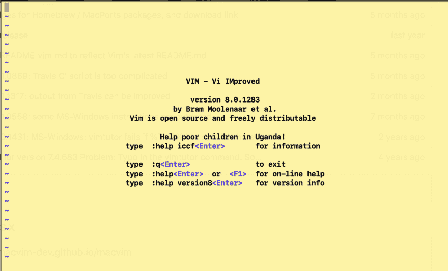
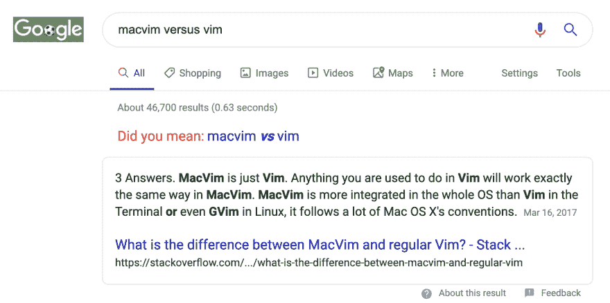

# 更新 Vim (MacOS)

> 原文：<https://dev.to/trisha114/updating-vim-macos-797>

## Vim 是什么？

这是一个强大的开源文本编辑器，允许你在命令行编辑你的文本文件。从技术上讲，您不需要离开终端去编码。

## 设置

当我第一次听说 Vim 的时候，我花了 30 分钟试图弄清楚如何安装它，所以我帮你省了这个力气:Vim 是预装在 MacOS 中的。如果您的当前版本是最新的稳定版本，则无需安装。撰写本文时的最新版本是 Vim **8.1** 。在 vim.org/download.php 的[查看最新稳定的 Vim 版本。](https://www.vim.org/download.php)

[](https://res.cloudinary.com/practicaldev/image/fetch/s--a6Q1ApiN--/c_limit%2Cf_auto%2Cfl_progressive%2Cq_auto%2Cw_880/https://drive.google.com/uc%3Fexport%3Dview%26id%3D1VBHhfqg-ipk-k_GwYuFrzbv0dF7QRDO3)

## 更新 Vim

我目前的 Vim 版本是 8.0.1283 。可悲的是，这不是最新的稳定版本，所以我要更新到 **^ 8.1.x** 。仅供参考:我的笔记本电脑是 MacOS Mojave 10.14.4。如果你不是 Mac 用户，点击[这里](https://www.vim.org/download.php)获得设备特定的指令(Unix 或 MS-Windows)。

**获取本地 Vim 的当前版本**
要弄清楚您的本地 Vim 版本，请输入命令`vim -v`。

它应该返回如下所示的内容:

[](https://res.cloudinary.com/practicaldev/image/fetch/s--hJFPNorb--/c_limit%2Cf_auto%2Cfl_progressive%2Cq_auto%2Cw_880/https://drive.google.com/uc%3Fexport%3Dview%26id%3D1AU8WreMRGQR_HrNxBCYkGWSNAVYevR6W)

### MacVim for OS

我决定用 [MacVim](https://github.com/macvim-dev) 更新。不过还有其他的[选项](https://www.vim.org/download.php)！如果你和我一样，你会想 MacVim 和 Vim 有什么区别。谷歌说没有区别😁

[](https://res.cloudinary.com/practicaldev/image/fetch/s--axn_mWxr--/c_limit%2Cf_auto%2Cfl_progressive%2Cq_auto%2Cw_880/https://drive.google.com/uc%3Fexport%3Dview%26id%3D1fALK6gy5FeI7sR2t04kls_WMwm2wYFgD)

[关于 MacVim 的更多信息请见常见问题解答](https://github.com/macvim-dev/macvim/wiki/FAQ)。

### 安装 MacVim

*   前往[https://github.com/macvim-dev/macvim/releases/latest](https://github.com/macvim-dev/macvim/releases/latest)获取最新版本的 MacVim 并下载 **MacVim.dmg**
*   打开**。dmg** 文件，并将 MacVim.app 复制到**/应用**

[](https://res.cloudinary.com/practicaldev/image/fetch/s--D-xTUmid--/c_limit%2Cf_auto%2Cfl_progressive%2Cq_auto%2Cw_880/https://drive.google.com/uc%3Fexport%3Dview%26id%3D1e55IYBZ65kp29xyYUflKVZ3vb4qUM6MB)

*   此时，您可以通过双击图标来运行 MacVim GUI。
*   双击图标后，您将进入 **vim 命令模式**。
*   要退出 vim 命令模式，输入`:q`并按回车键。

### 以下是常见的 Vim 命令列表:

```
- type `:q<ENTER>` to **EXIT** out of MacVim mode
- type `:help mvim` for help
- type `:wq<ENTER>` to save and exit
- type `:q!` to exit without saving changes
- type `i` to enter insert mode
- press **ESC** to exit insert mode 
```

Enter fullscreen mode Exit fullscreen mode

Vim 有两种模式**插入模式**和**命令模式**。如需初始列表，请访问 [coderwall - basic vim 命令](https://coderwall.com/p/adv71w/basic-vim-commands-for-getting-started)。

### 添加 mvim 作为终端命令

您并不真的希望每次使用 MacVim 时都要双击 GUI。因此，下一步是将 **mvim** *脚本添加到您的路径中。这样，无论您何时运行命令`mvim`，您的机器都将知道在哪里可以找到 MacVim 可执行文件。

最简单的方法是运行命令:

```
sudo ln -s /Applications/MacVim.app/Contents/bin/mvim /usr/local/bin/mvim 
```

Enter fullscreen mode Exit fullscreen mode

上面的命令会将 mvim 脚本链接到 **/usr/local/bin/mvim** 。

[](https://res.cloudinary.com/practicaldev/image/fetch/s--wmaQfixO--/c_limit%2Cf_auto%2Cfl_progressive%2Cq_auto%2Cw_880/https://drive.google.com/uc%3Fexport%3Dview%26id%3D1-kD3Fpl-OsYgrwPpwuT4RrJVXMblRgsc)

*   一旦这样做了，您就可以使用`mvim`来运行 MacVim shell。

*   要检查所有的链接是否正确，请在命令行上输入`/usr/local/bin/mvim`。它应该能打开麦克维。

*   要检查您的版本是否正确，请运行:`mvim -v`。你应该会看到你刚刚下载的最新版本(旧 8.0.x = >新 8.1.x)。

[](https://res.cloudinary.com/practicaldev/image/fetch/s--xDI5-ZEH--/c_limit%2Cf_auto%2Cfl_progressive%2Cq_auto%2Cw_880/https://drive.google.com/uc%3Fexport%3Dview%26id%3D1aOzwZS5EqB_cTFl10oL4_QCpE3Zdm66o)

### 可选-将 mvim 设为您的默认 vim

想在命令行使用 MacVim 而不是 Vim 的老版本？请遵循以下步骤:

*   如果你已经有了一个**。bash_profile** 使用命令`<bash_profile_path>; open .bash_profile;`打开它。
*   比如我的**。bash_profile** 位于我的 **Users/** 目录中，所以我运行命令`cd Users/<user_name>; open .bash_profile;`。
*   这将打开。bash_profile 文本文件。在下面添加别名:

```
# ----------------------
# MacVim alias
# ----------------------
# use mvim as a default text editor, assuming you already have mvim installed
alias vim="mvim -v" 
```

Enter fullscreen mode Exit fullscreen mode

**注意:**如果你不知道你的 **`<user_name>`** ，在命令行运行`whoami`。

*   维奥拉。你都准备好了。检查`vim -v`并查看 Vim 的更新版本。
*   **注意:**您需要打开一个新的终端外壳或重启您的终端来查看您对外壳所做的任何更改。

## 故障排除

有困难吗？谷歌一下！StackOverflow 会给你一个如何调试的线索。或者你可以使用下面的一些资源。

*   [Vim 主页](https://www.vim.org)
*   [MacVim 常见问题解答](https://github.com/macvim-dev/macvim/wiki/FAQ)

希望这能帮助到某个人！这是“使用 Vim 构建 Docker 项目”系列的第一部分。敬请关注更多内容！