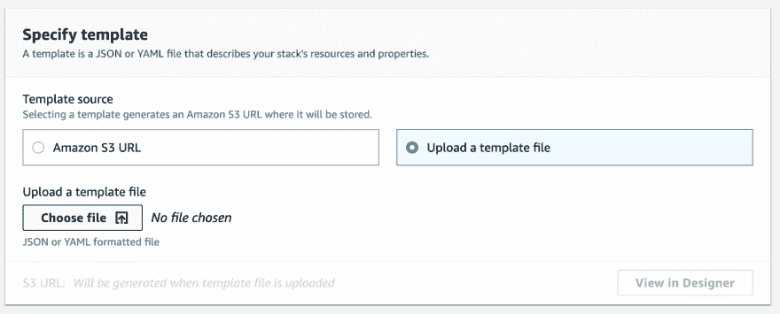

# 为 SFTP 创建一个带有 AWS 传输的 SFTP 服务器

> 原文：<https://dev.to/danimal141/create-sftp-server-with-aws-transfer-for-sftp-1a7l>

这篇文章描述了如何在 AWS 上创建一个 SFTP 服务器(SFTP 的 AWS 转移)。
关于 SFTP AWS 转移概述，请参见[此处](https://aws.amazon.com/sftp/?nc1=h_ls)。

## 决定 SFTP 的配置

AWS SFTP 可以配置:

*   DNS 配置
    *   “无”或“Amazon Route53 DNS 别名”
*   身份提供者
    *   “服务管理”或“定制”
*   日志记录角色
*   标签

在这篇文章中，我决定这样配置:

*   DNS 配置
    *   “无”(使用 AWS 直接创建的端点名称)
*   身份提供者
    *   “服务管理”(使用 AWS SFTP 功能)

日志角色和标签在这篇文章中没有使用。

## 为 SFTP 服务器准备 S3 桶

AWS SFTP 需要一个 S3 铲斗，所以让我们先准备好您的铲斗。

在这个帖子里，我准备了一个名为`danimal141-sftp-test`的桶，里面有一个名为`test`的文件夹作为例子。

## 创建云生成模板

要创建 SFTP 服务器，我们应该:

*   创建 IAM 策略
*   创建 IAM 角色
*   创建 SFTP 服务器
*   创建 SFTP 用户
    *   它具有上述 IAM 角色

有很多依赖关系，所以让我们使用 AWS CloudFormation 来简化这个过程。
模板变成这样:

```
AWSTemplateFormatVersion: '2010-09-09'

Resources:
  SftpAccessPolicy:
    Type: AWS::IAM::ManagedPolicy
    Properties:
      ManagedPolicyName: SftpAccessPolicy
      Description: Sftp access policy
      PolicyDocument:
        Version: '2012-10-17'
        Statement:
          - Effect: Allow
            Action:
              - 's3:PutObject'
              - 's3:GetObject'
              - 's3:DeleteObject'
              - 's3:GetObjectVersion'
              - 's3:DeleteObjectVersion'
            Resource: 'arn:aws:s3:::danimal141-sftp-test/test/*'
          - Effect: Allow
            Action:
              - 's3:ListBucket'
              - 's3:GetBucketLocation'
            Resource: 'arn:aws:s3:::danimal141-sftp-test'
            Condition:
              StringLike:
                's3:prefix': 'test/*'

  SftpAccessRole:
    Type: AWS::IAM::Role
    Properties:
      AssumeRolePolicyDocument:
        Version: '2012-10-17'
        Statement:
          - Effect: 'Allow'
            Principal:
              Service:
                - 'transfer.amazonaws.com'
            Action:
              - 'sts:AssumeRole'
      ManagedPolicyArns:
        - !Ref SftpAccessPolicy

  SftpServer:
    Type: AWS::Transfer::Server
    Properties:
      EndpointType: PUBLIC

  SftpUser:
    Type: AWS::Transfer::User
    Properties:
      UserName: testuser
      HomeDirectory: '/danimal141-sftp-test/test'
      Role: !GetAtt SftpAccessRole.Arn
      ServerId: !GetAtt SftpServer.ServerId
      SshPublicKeys:
        - YOUR PUBLIC KEY 
```

<svg width="20px" height="20px" viewBox="0 0 24 24" class="highlight-action crayons-icon highlight-action--fullscreen-on"><title>Enter fullscreen mode</title></svg> <svg width="20px" height="20px" viewBox="0 0 24 24" class="highlight-action crayons-icon highlight-action--fullscreen-off"><title>Exit fullscreen mode</title></svg>

关于 IAM 对 SFTP 的政策和作用，你可以参考这里的。

## 创建云状堆栈

让我们在 AWS 控制台或`aws cloudformation`命令上使用上述模板创建一个 CloudFormation 堆栈。

[](https://res.cloudinary.com/practicaldev/image/fetch/s--ZBSMOCpy--/c_limit%2Cf_auto%2Cfl_progressive%2Cq_auto%2Cw_880/https://thepracticaldev.s3.amazonaws.com/i/d112my2qhjgzc0a862qw.png)

重点是流程需要能力:`[AWS::IAM::ManagedPolicy, AWS::IAM::Role]`。
我们应该承认 CloudFormation 可能会创建带有自定义名称的 IAM 资源。

[](https://res.cloudinary.com/practicaldev/image/fetch/s--5I6PkfHM--/c_limit%2Cf_auto%2Cfl_progressive%2Cq_auto%2Cw_880/https://thepracticaldev.s3.amazonaws.com/i/zfs3162997lcc5lh20jl.png)

成功创建堆栈后，您将能够在 AWS 控制台上看到 SFTP 服务器！
然后，你可以用`sftp`命令检查服务器，比如:

```
sftp -i your_ssh_key your_user_name@server_endpoint

sftp> pwd Remote working directory: /danimal141-sftp/test

sftp> put index.html
Uploading index.html to /danimal141-sftp-test/test/index.html

sftp> rm index.html
Removing /danimal141-sftp-test/test/index.html

sftp> exit 
```

<svg width="20px" height="20px" viewBox="0 0 24 24" class="highlight-action crayons-icon highlight-action--fullscreen-on"><title>Enter fullscreen mode</title></svg> <svg width="20px" height="20px" viewBox="0 0 24 24" class="highlight-action crayons-icon highlight-action--fullscreen-off"><title>Exit fullscreen mode</title></svg>

当然，你也可以使用 Cyberduck 之类的应用程序。

## 清理依赖关系

请注意不要忘记移除 SFTP 服务器，因为从您创建和配置专用的 SFTP 服务器开始，直到您删除该服务器，您将按小时计费(参考:[此处为](https://aws.amazon.com/jp/sftp/pricing/))。

如果你像上面的例子一样使用 CloudFormation，那么清除所有的依赖关系是非常容易的。你所要做的就是删除 CloudFormation 堆栈！

## 总结

*   我们可以轻松地为 SFTP 创建一个 SFTP 服务器。
*   我们可以使用 AWS CloudFormation 轻松创建和删除与 SFTP 服务器相关的内容。

## 参考文献

*   [https://aws.amazon.com/sftp/?nc1=h_ls](https://aws.amazon.com/sftp/?nc1=h_ls)
*   [https://docs . AWS . Amazon . com/transfer/latest/user guide/requirements-roles . html](https://docs.aws.amazon.com/transfer/latest/userguide/requirements-roles.html)
*   [https://aws.amazon.com/jp/sftp/pricing](https://aws.amazon.com/jp/sftp/pricing)