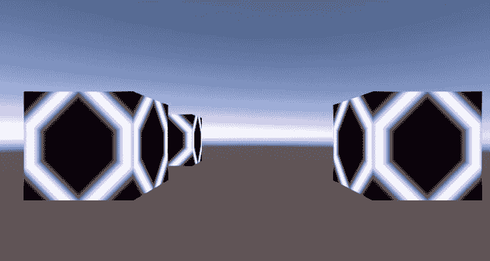

# 将碎片阴影导入 Unity

> 原文：<https://dev.to/0xkoji/import-fragmentshader-to-unity-24g3>

## 片段着色器

```
#ifdef GL_ES
precision mediump float;
#endif

uniform float u_time;
uniform vec2 u_resolution;

float HexDist(vec2 p) {
    p = abs(p);
    float c=dot(p, normalize(vec2(1.,1.73)));
    c=max(c, p.x);
    return c;
}

#define sat(x)clamp(x,0.,1.)

void main(){
    vec2 uv=(gl_FragCoord.xy - .5 / u_resolution.xy)/ u_resolution.y;
    uv -= .5;
    vec3 col=vec3(0.);
    col += sin( HexDist(uv) * 10\. + u_time);
    col.r += abs(cos(u_time));
    col.g *= sat(col.g);

    col.b *= mix(col.b, col.g, length(uv));

    gl_FragColor=vec4(col, 1.);
} 
```

<svg width="20px" height="20px" viewBox="0 0 24 24" class="highlight-action crayons-icon highlight-action--fullscreen-on"><title>Enter fullscreen mode</title></svg> <svg width="20px" height="20px" viewBox="0 0 24 24" class="highlight-action crayons-icon highlight-action--fullscreen-off"><title>Exit fullscreen mode</title></svg>

这个片段着色器创建如下动画。
[T3】](https://res.cloudinary.com/practicaldev/image/fetch/s--3KwVoXCv--/c_limit%2Cf_auto%2Cfl_progressive%2Cq_auto%2Cw_880/https://thepracticaldev.s3.amazonaws.com/i/el0ee7u66ogx4yathfws.png)

片段着色器是`GLSL`，但是`Unity`使用了`HLSL`，所以不能直接使用代码。转换需要一些修改。

### 如何转换

```
vec<n>  --> float<n>
vec2 --> float2
vec3 --> float3

texture --> tex2D

u_time --> _Time.y

atan(x,y) --> atan2(y,x)

fract --> frac

mix --> lerp

mod --> need to write a function col *= 1.5 --> col = mul(1.5, col)

gl_FragColor --> return 
```

<svg width="20px" height="20px" viewBox="0 0 24 24" class="highlight-action crayons-icon highlight-action--fullscreen-on"><title>Enter fullscreen mode</title></svg> <svg width="20px" height="20px" viewBox="0 0 24 24" class="highlight-action crayons-icon highlight-action--fullscreen-off"><title>Exit fullscreen mode</title></svg>

## 单位代码

```
Shader "Unlit/fragment"
{
    Properties
    {
        _MainTex ("Texture", 2D) = "white" {}
    }
    SubShader
    {
        Tags { "RenderType"="Opaque" }
        LOD 100

        Pass
        {
            CGPROGRAM
            #pragma vertex vert
            #pragma fragment frag
            // make fog work
            #pragma multi_compile_fog 
            #include "UnityCG.cginc"  
            struct appdata
            {
                float4 vertex : POSITION;
                float2 uv : TEXCOORD0;
            };

            struct v2f
            {
                float2 uv : TEXCOORD0;
                UNITY_FOG_COORDS(1)
                float4 vertex : SV_POSITION;
            };

            sampler2D _MainTex;
            float4 _MainTex_ST;

            v2f vert (appdata v)
            {
                v2f o;
                o.vertex = UnityObjectToClipPos(v.vertex);
                o.uv = TRANSFORM_TEX(v.uv, _MainTex);
                UNITY_TRANSFER_FOG(o,o.vertex);
                return o;
            }

            #define mod(x,y) (x-y*floor(x/y))
            #define sat(x)clamp(x, 0.0, 1.0) 
            static const float PI = 3.14159265359;
            static const float HALF_PI = 1.57079632675;
            static const float TWO_PI = 6.283185307;
            static const float3 A = (0.5, 0.5, 0.5);
            static const float3 B = (0.5, 0.5, 0.5);
            static const float3 C = (0.0, 0.1, 0.2);
            static const float2 s = (1.0, 1.73);

            float3 palette(float t, float3 a, float3 b, float3 c, float3 d)
            {
                return A + B * cos(TWO_PI * ( C * t + d));
            }

            float3 colorize(float d, float t)
            {
                return palette(d + t, 0.5,
                float3(0.5, 0.5, 0.5),
                float3(0.5, 0.5, 0.5),
                float3(0.0, 0.1, 0.2));
            }

            float HexDist(float2 p){
                p = abs(p);
                float c = dot(p, normalize(s) );
                c = max(c, p.x);

                return c;
            }

            float4 HexCoord(float2 uv) {
                float2 r = s;
                float2 h= r * .5;
                float2 a = mod(uv, r) - h;
                float2 b = mod(uv-h,r) - h;

                float2 gv = 0.0;
                if(length(a) < length(b)){
                    gv=a;
                }else{
                    gv=b;
                }

                float x = atan2(gv.y, gv.x);
                float y = float2(0.5, 0.5) - HexDist(gv);

                float2 id = uv - gv;
                return float4(x, y, id.x ,id.y );
            }

            fixed4 frag (v2f i) : SV_Target {
                float2 uv = i.uv;
                uv -= .5;
                float3 col=0;
                col += sin( HexDist(uv) * 10. + _Time.y);
                col.g = mul(sat(col.g), col.g);

                return float4(col, 1.);

            }
            ENDCG
        }
    }
} 
```

<svg width="20px" height="20px" viewBox="0 0 24 24" class="highlight-action crayons-icon highlight-action--fullscreen-on"><title>Enter fullscreen mode</title></svg> <svg width="20px" height="20px" viewBox="0 0 24 24" class="highlight-action crayons-icon highlight-action--fullscreen-off"><title>Exit fullscreen mode</title></svg>

那么结果就像下面这样。在这种情况下，我放了 3 个盒子，并对它们应用着色器。
[T3】](https://res.cloudinary.com/practicaldev/image/fetch/s--9Jwvin33--/c_limit%2Cf_auto%2Cfl_progressive%2Cq_auto%2Cw_880/https://thepracticaldev.s3.amazonaws.com/i/802r2dg37gekbsqer6c4.png)