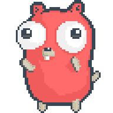

# 用(微小的)GO 和 WebAssembly 创建 Dev 的离线页面🦄💡✨

> 原文：<https://dev.to/sendilkumarn/create-dev-s-offline-page-with-tiny-go-and-webassembly-9n6>

Dev 的[离线页面](https://dev.to/offline)很有趣，我们[用 Rust 和 WebAssembly](https://dev.to/sendilkumarn/create-dev-s-offline-page-with-rust-and-webassembly-21gn) 实现了它。

围棋很简单。我们能在 Go 和 WebAssembly 中实现吗？答案是肯定的...

[](https://res.cloudinary.com/practicaldev/image/fetch/s--_i4QVzEO--/c_limit%2Cf_auto%2Cfl_progressive%2Cq_66%2Cw_880/https://thepracticaldev.s3.amazonaws.com/i/1eaxlpr98hv1bedjgyhg.gif)

我这里有一个示例应用程序。如果你想从头开始写，可以查看[这篇教程](https://dev.to/sendilkumarn/tiny-go-to-webassembly-5168)。

如果你只是想看源代码，[看看这个分支](https://github.com/sendilkumarn/go-wasm/tree/dev-board)。

# 代码代码代码

我们将首先在`go/main.go`中导入“syscall/js”和“fmt”。

> 当使用 js/WASM 架构时,“syscall/js”包提供了对 WebAssembly 主机环境的访问。它的 API 基于 JavaScript 语义。这个包是实验性的。🦄 🦄

```
package main 

import( 
    "fmt"
    "syscall/js"
) 
```

<svg width="20px" height="20px" viewBox="0 0 24 24" class="highlight-action crayons-icon highlight-action--fullscreen-on"><title>Enter fullscreen mode</title></svg> <svg width="20px" height="20px" viewBox="0 0 24 24" class="highlight-action crayons-icon highlight-action--fullscreen-off"><title>Exit fullscreen mode</title></svg>

添加一些全局可用的变量，这些变量是我们从 JavaScript 或浏览器调用函数时可能需要用到的。

```
var (
    isPainting bool
    x          float64
    y          float64
    ctx        js.Value
    color      string
) 
```

<svg width="20px" height="20px" viewBox="0 0 24 24" class="highlight-action crayons-icon highlight-action--fullscreen-on"><title>Enter fullscreen mode</title></svg> <svg width="20px" height="20px" viewBox="0 0 24 24" class="highlight-action crayons-icon highlight-action--fullscreen-off"><title>Exit fullscreen mode</title></svg>

我们将在`out/index.html`中手动添加画布元素。

```
<canvas id="canvas"> </canvas> 
```

<svg width="20px" height="20px" viewBox="0 0 24 24" class="highlight-action crayons-icon highlight-action--fullscreen-on"><title>Enter fullscreen mode</title></svg> <svg width="20px" height="20px" viewBox="0 0 24 24" class="highlight-action crayons-icon highlight-action--fullscreen-off"><title>Exit fullscreen mode</title></svg>

移除`main`功能内的`Hello World`行，并替换为以下内容。

从浏览器中获取`document`对象。使用`document`得到我们刚刚添加的`canvas`元素。

我们可以通过使用`syscall/js` API 来做到这一点。

```
func main() {

    doc := js.Global().Get("document")
    canvasEl := doc.Call("getElementById", "canvas")
} 
```

<svg width="20px" height="20px" viewBox="0 0 24 24" class="highlight-action crayons-icon highlight-action--fullscreen-on"><title>Enter fullscreen mode</title></svg> <svg width="20px" height="20px" viewBox="0 0 24 24" class="highlight-action crayons-icon highlight-action--fullscreen-off"><title>Exit fullscreen mode</title></svg>

API 很简单。从 JavaScript 的全局名称空间获取文档。

在文档内部，通过 Id 调用 canvas 元素。

我们将设置`canvasEl`的一些属性，比如宽度、高度。我们还会得到画布'`context`。

```
bodyW := doc.Get("body").Get("clientWidth").Float()
bodyH := doc.Get("body").Get("clientHeight").Float()
canvasEl.Set("width", bodyW)
canvasEl.Set("height", bodyH)
ctx = canvasEl.Call("getContext", "2d") 
```

<svg width="20px" height="20px" viewBox="0 0 24 24" class="highlight-action crayons-icon highlight-action--fullscreen-on"><title>Enter fullscreen mode</title></svg> <svg width="20px" height="20px" viewBox="0 0 24 24" class="highlight-action crayons-icon highlight-action--fullscreen-off"><title>Exit fullscreen mode</title></svg>

然后我们将定义三个事件监听器`mousedown` | `mousemove` | `mouseup`到`canvasElement`。

### 鼠标放下

当我们点击鼠标时，我们将开始绘画。

```
startPaint := js.FuncOf(func(this js.Value, args []js.Value) interface{} {
    e := args[0]
    isPainting = true

    x = e.Get("pageX").Float() - canvasEl.Get("offsetLeft").Float()
    y = e.Get("pageY").Float() - canvasEl.Get("offsetTop").Float()
    return nil
})

canvasEl.Call("addEventListener", "mousedown", startPaint) 
```

<svg width="20px" height="20px" viewBox="0 0 24 24" class="highlight-action crayons-icon highlight-action--fullscreen-on"><title>Enter fullscreen mode</title></svg> <svg width="20px" height="20px" viewBox="0 0 24 24" class="highlight-action crayons-icon highlight-action--fullscreen-off"><title>Exit fullscreen mode</title></svg>

> 请注意，返回 nil 是很重要的，否则程序将无法编译。

整个 API 基于[反射 API](https://developer.mozilla.org/en-US/docs/Web/JavaScript/Reference/Global_Objects/Reflect) 。

### 鼠标移动

我们将定义绘画功能。

```
 paint := js.FuncOf(func(this js.Value, args []js.Value) interface{} {
    if isPainting {
        e := args[0]
        nx := e.Get("pageX").Float() - canvasEl.Get("offsetLeft").Float()
        ny := e.Get("pageY").Float() - canvasEl.Get("offsetTop").Float()

        ctx.Set("strokeStyle", color)
        ctx.Set("lineJoin", "round")
        ctx.Set("lineWidth", 5)

        ctx.Call("beginPath")
        ctx.Call("moveTo", nx, ny)
        ctx.Call("lineTo", x, y)
        ctx.Call("closePath")

        // actually draw the path*
        ctx.Call("stroke")

        // Set x and y to our new coordinates*
        x = nx
        y = ny
    }
    return nil
})
canvasEl.Call("addEventListener", "mousemove", paint) 
```

<svg width="20px" height="20px" viewBox="0 0 24 24" class="highlight-action crayons-icon highlight-action--fullscreen-on"><title>Enter fullscreen mode</title></svg> <svg width="20px" height="20px" viewBox="0 0 24 24" class="highlight-action crayons-icon highlight-action--fullscreen-off"><title>Exit fullscreen mode</title></svg>

### 鼠标抬起

最后，我们将定义当鼠标抬起事件被触发时调用的退出方法。

```
 exit := js.FuncOf(func(this js.Value, args []js.Value) interface{} {
        isPainting = false
        return nil
    })

    canvasEl.Call("addEventListener", "mouseup", exit) 
```

<svg width="20px" height="20px" viewBox="0 0 24 24" class="highlight-action crayons-icon highlight-action--fullscreen-on"><title>Enter fullscreen mode</title></svg> <svg width="20px" height="20px" viewBox="0 0 24 24" class="highlight-action crayons-icon highlight-action--fullscreen-off"><title>Exit fullscreen mode</title></svg>

最后，我们将定义颜色选择器。在`out/index.html`中添加一个颜色 div 和必要的 CSS。

```
<style>
     .color {
            display: inline-block;
            width: 50px;
            height: 50px;
            border-radius: 50%;
            cursor: pointer;
            margin: 10px;
       }
</style>

<div id="colors></div> 
```

<svg width="20px" height="20px" viewBox="0 0 24 24" class="highlight-action crayons-icon highlight-action--fullscreen-on"><title>Enter fullscreen mode</title></svg> <svg width="20px" height="20px" viewBox="0 0 24 24" class="highlight-action crayons-icon highlight-action--fullscreen-off"><title>Exit fullscreen mode</title></svg>

我们将颜色定义为一个数组。然后遍历颜色并创建色样节点。向色样添加一个单击事件侦听器。

```
 divEl := doc.Call("getElementById", "colors")

    colors := [6]string {"#F4908E", "#F2F097", "#88B0DC", "#F7B5D1", "#53C4AF", "#FDE38C"}

    for _, c := range colors {  
        node := doc.Call("createElement", "div")
        node.Call("setAttribute","class", "color")
        node.Call("setAttribute", "id", c)
        node.Call("setAttribute","style", fmt.Sprintf("background-color: %s", c))

        setColor := js.FuncOf(func(this js.Value, args []js.Value) interface{} {
                e := args[0]
                color = e.Get("target").Get("id").String()
                return nil;
        })

        node.Call("addEventListener", "click", setColor)

        divEl.Call("appendChild", node)

    } 
```

<svg width="20px" height="20px" viewBox="0 0 24 24" class="highlight-action crayons-icon highlight-action--fullscreen-on"><title>Enter fullscreen mode</title></svg> <svg width="20px" height="20px" viewBox="0 0 24 24" class="highlight-action crayons-icon highlight-action--fullscreen-off"><title>Exit fullscreen mode</title></svg>

就是这样。

现在通过运行`go run webServer.go`启动 web 服务器。

使用
编译进入 WebAssembly 模块

```
tinygo build -o ./out/main.wasm -target wasm -no-debug ./go/main.go 
```

<svg width="20px" height="20px" viewBox="0 0 24 24" class="highlight-action crayons-icon highlight-action--fullscreen-on"><title>Enter fullscreen mode</title></svg> <svg width="20px" height="20px" viewBox="0 0 24 24" class="highlight-action crayons-icon highlight-action--fullscreen-off"><title>Exit fullscreen mode</title></svg>

访问 [localhost:8080](https://dev.tolocalhost:8080) 查看为您的创意准备的令人敬畏的画布板🦄。

💡生成的`WebAssembly`模块正好是 **52KB** 。TinyGo 非常棒，可以创建小得惊人的 WebAssembly 二进制文件。它是如何创造的？请继续关注本系列的下一篇文章。💡

> 注意:每晚使用 Firefox / Firefox。Chrome 有时会崩溃。

### 更优化❤️

> 移除`fmt`导入并用普通的字符串连接替换`fmt.Sprintf`，这将去掉另一个 **26KB** 。检查提交[这里](https://github.com/sendilkumarn/go-wasm/commit/f5837b0cee52f7598cff0da0a4f94770a29cb279)。

*感谢 Justin Clift 分享这个技巧:)*

你❤️生锈了吗？点击查看如何使用 Rust 进行 web 组装。

我希望这能给你一个动力，开始你的 WebAssembly 之旅。如果您有任何问题/建议/觉得我错过了什么，请随时添加评论。

你可以在推特上关注我。

如果你喜欢这篇文章，请留下赞或评论。❤️

谢谢

[](/aspittel)

## [阿里·斯皮特](/aspittel)

[Passionate about education, Python, JavaScript, and code art.](/aspittel)

对于[篇](https://dev.to/aspittel/how-to-create-the-drawing-interaction-on-dev-s-offline-page-1mbe)。