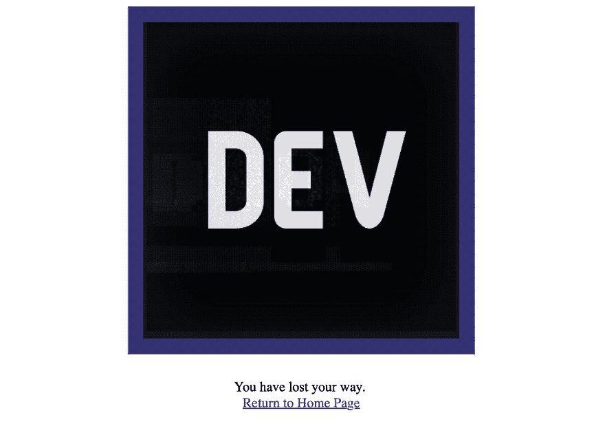
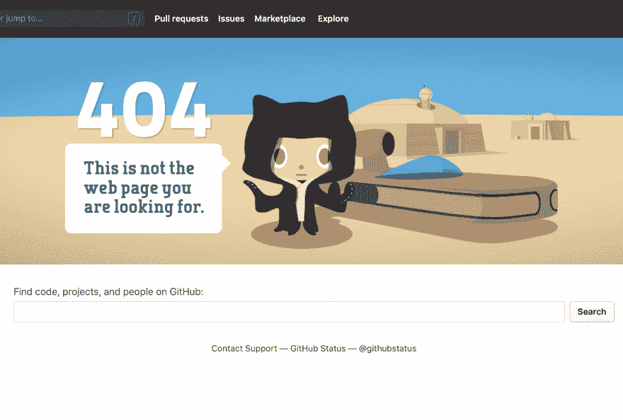
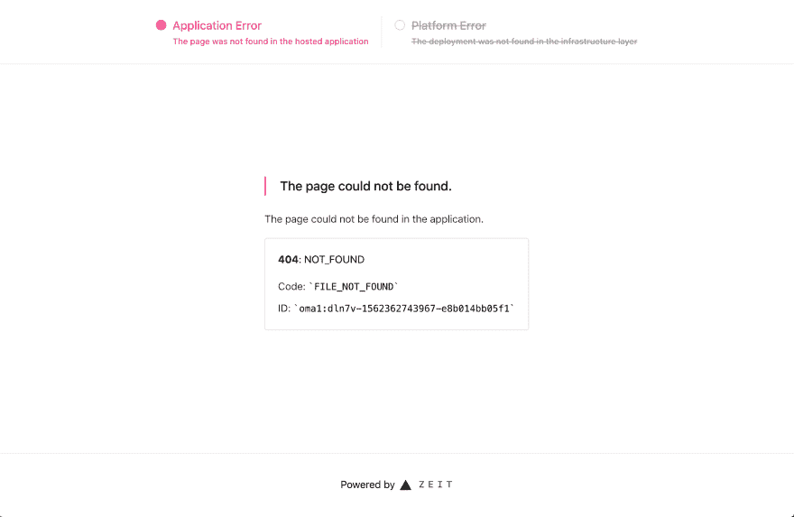

# 在 Zeit Now v2 平台上定制 404 页

> 原文：<https://dev.to/khrome83/custom-404-pages-on-zeit-now-v2-platform-4h2o>

定制的 404 页面已经成为精心打造的网站的标志。它允许表达网站的创意品牌。有时它会展示一个巧妙的把戏和复活节彩蛋。

## 404 页基础知识

以 [dev.to](https://dev.to/404) 404 页面为例。这是一个非常简单的页面，显示了 dev.to 品牌的 gif 标志。它不提供任何额外的东西，除了一个回家的链接。

[](https://res.cloudinary.com/practicaldev/image/fetch/s--BraOvoul--/c_limit%2Cf_auto%2Cfl_progressive%2Cq_66%2Cw_880/https://thepracticaldev.s3.amazonaws.com/i/je4wl8m2fjnby161ql40.gif)

GitHub 用他们的 404 页把事情向前推进了一步。他们用《星球大战》作为流行文化的参照物来联系我内心的怪胎。GitHub 比大多数网站更进一步，通过跟踪用户的鼠标移动来创造视差效果。我记得当我找到这一页时，这给我带来了片刻的喜悦。

[](https://res.cloudinary.com/practicaldev/image/fetch/s--vQJ-egJo--/c_limit%2Cf_auto%2Cfl_progressive%2Cq_66%2Cw_880/https://thepracticaldev.s3.amazonaws.com/i/1ezcflm2iq8vt6j9379i.gif)

### 建议有用 404 页

关于什么是有用的 404 页面有很多争论。Dev.to 没有提供很多恢复的方法，而 GitHub by contract 显示了网站的完整页眉页脚和第二个搜索栏。

总的来说，给登陆 404 页面的用户提供帮助，让他们能够恢复，这很难说有什么不好。糟糕的 404 页面会导致用户完全离开网站。一个有用的 404 页面向用户传达你关心帮助他们找到相关信息。这也可能意味着挽救一个客户或创造一个新的转换。

1.  显示一致的导航，以便用户可以自我恢复。
2.  提供二次搜索，鼓励用户找到他们想要的内容。
3.  根据用户的搜索历史、当前的热门内容或你想展示的内容提出建议。
4.  提供任何监控或状态页面的链接，以防显示的 404 页面出现其他错误。
5.  展示你的品牌和信息。喜悦。

## 现在默认 404 页的状态

Zeit 推出了 Now 平台的第二个版本(现在是 v2)，没有自定义 404 页面。这迫使客户使用内置的默认 404 页面。虽然这个设计很犀利，非常适合 Zeit 品牌，但它对用户没有任何帮助。也很有主见，站出来反对大部分品牌。简而言之，你应该换掉它。

[](https://res.cloudinary.com/practicaldev/image/fetch/s--Iu7KA4_n--/c_limit%2Cf_auto%2Cfl_progressive%2Cq_auto%2Cw_880/https://thepracticaldev.s3.amazonaws.com/i/2zhap1qbv653berropu8.png)

### 替换默认的 404 页面

我们首先需要的是一个新的 404 页面。我使用了 [Gridsome](https://gridsome.org/docs/pages/#add-a-404-page) ，它让我在`src/pages`文件夹中创建一个`404.vue`。现在，当我构建项目时，会在`/dist`文件夹中创建一个`404.html`文件。

Zeit 使用一个`now.json`文件来定制构建过程。大多数用户需要此文件，以便他们可以指定如何构建站点，并自定义路由体验。

部署在上的典型静态站点看起来像这样-

```
{  "version":  2,  "builds":  [{  "src":  "package.json",  "use":  "@now/static-build"  }]  } 
```

现在使用这个 JSON 文件基于您的`package.json`文件中`npm run build`的输出创建一个静态构建。如果只使用这种配置进行部署，您将获得默认的 Now v2 404 页面。

要设置自定义 404 页面，我们必须添加路线。

#### 添加路线

```
{  "version":  2,  "builds":  [{  "src":  "package.json",  "use":  "@now/static-build"  }],  "routes":  [  {  "src":  "/(.*)",  "dest":  "/$1"  },  {  "handle":  "filesystem"  },  {  "src":  "/.*",  "status":  404,  "dest":  "/404"  }  ]  } 
```

routes 数组中的第一行表示任何进入的流量都应该在目标目录中查找内容。在 Now v2 中，路由可能有点混乱。默认情况下，用大多数静态站点生成器运行`npm run build`后创建的`/dist`文件夹被视为输出的根。

`{"handle": "filesystem"}`行告诉现在将文件系统公开为可用的路由。如果在你的`/dist`文件夹中有三个 HTML 文件- `A.html`、`B.html`和`C.html`，它们中的每一个都将被自动映射并可用。

在这一点上，去你的网站上的`/404`会显示自定义的 404 页面，但是去`/not-a-real-page`不会。我们已经映射了文件系统以使其可用，但是我们没有告诉我们的路由来捕获任何失败的东西。所以用户不会在需要的时候看到显示 404 的页面。

最后一行捕获文件系统没有找到的任何内容，并将请求正确发送到`404.html`页面。它还向用户的浏览器发送`404`的正确状态。

### 最终结果

我决定为我的网站的发布留下干净和简约的东西。我把页眉和页脚留在了页面上。然后我用一幅来自 [unDraw.io](https://undraw.co) 的精彩插图来修饰它

[](https://res.cloudinary.com/practicaldev/image/fetch/s--LhqBMCjk--/c_limit%2Cf_auto%2Cfl_progressive%2Cq_auto%2Cw_880/https://thepracticaldev.s3.amazonaws.com/i/s54med88bamlj2bevq4r.png)

请在评论中告诉我你的想法。

*最初发布于[KH Rome . dev](https://khrome.dev/custom-404-pages-on-zeit-now-v2-platform)T3】*