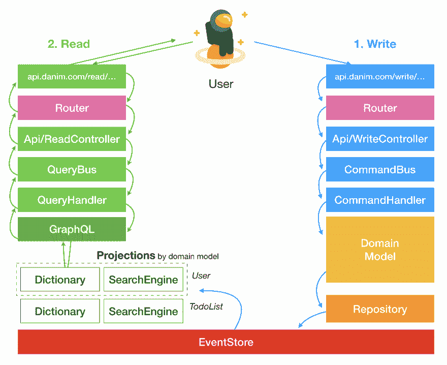

# 🐘EventSourcing 对记忆有好处！

> 原文：<https://dev.to/keywinf/eventsourcing-cqrs-for-a-colourful-code-2ap6>

以前我只是在 **ORMs** 上浪费了太多时间，以后我会尽量避免。

作为一个真正的后端选择，我想到的第一件事是用**事件**来思考。毕竟，如果对人类来说是这样，为什么对计算机来说不是这样。

当我看到我的妹妹时，我有关于她的记忆，所以我用 A 的观点来看。有一天，我可能会有关于她的记忆 M+∏M，因此观点 B。**记忆不会剧烈变化**(m≃m+∏m)。**观点有时会**(一！= B)。

那是为正常健全的人准备的:他们记录事件，没有任何即时处理:
a)客观地看发生了什么。
b)把它登记在你的大脑里。
c)事后从中得出你的结论。
d)改变你的结论。T4……改变你的结论没有限制。

独裁者会做一件更愚蠢的事情:a)用一种符合你已有结论的方式去观察那里正在发生的事情。
b)把它登记在你的大脑里。
c)喜欢你的结论，因为你的记忆与你的想法神奇地接近！不要改变这个精彩的结论。

ORM 是独裁者。有了它们，您将对您的实体(表、连接等)进行建模。)来适应你现在的需求。首先，这将是一个童话故事，因为它是为你目前正在编写的代码而制作的。但是，你以后用它编码越多，你的应用程序的重量就会增加越多，你就会在一个顽固的自大狂怪物身上浪费越多的时间，这个怪物会强迫你让你的代码适应它卡住的结构，它看到数据的方式。

这对情侣 EventSourcing + CQRS 就是这样真正出现的。大公司令人窒息，因为他们意识到招募的工程师只是试图改变怪物观点的维护人员:简而言之，试图将数据从数据库迁移到数据库，并妄想每个新数据库都将是(相反)持续增长的应用程序内部逻辑的全新最终模型化。

所以，我们中立地存储发生的事情，不做任何处理，然后**将**事件投射到**读取视图**(也称为**投射**)。MySQL，Redis，Elasticsearch，OrientDB...你可以自由选择你需要的阅读模型的类型。例如，如果我的 API 是 GraphQL 类型的，我可以为快速查询做 Redis 预测。但是，如果我还需要从后台大量导出，我可以制作 MySQL 详尽的类似连接表的投影，可以直接读取。预测是逐步进行的:当一个事件被追加到 **EventStore** 中时，它们会被立即更新。有一天，我可以决定完全改变投影的设计方式(改变 MySQL one 中的表名，添加 OrientDB 投影，删除 Redis 投影，等等。).记住:**回忆不会改变**(事件)。**视点将**(投影)。

我不会详细介绍或解释任何东西，但我建议你监督我在这里谈论的东西(在网络上对 EventSourcing 的热情越来越高)，它可能会适当地改变你的下一个编码器生活时刻。

当我第一次编写一个 **EventSourcing + CQRS** 应用程序时，我觉得自己像个孩子一样可以骑自行车。