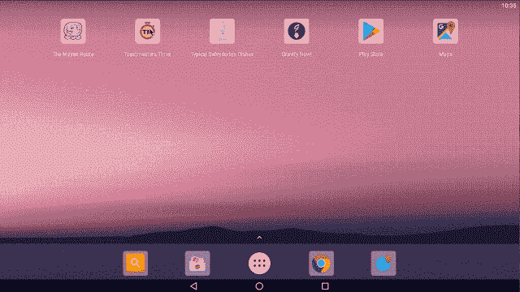

# 如何在 Xamarin 中用 3 个步骤创建闪屏？机器人

> 原文：<https://dev.to/fanmixco/how-to-create-a-splash-screen-in-3-steps-for-xamarin-android-3oa8>

Android 中的大部分时间飞溅都是一个复杂的话题，涉及到创建时间[活动](https://docs.microsoft.com/en-us/xamarin/android/user-interface/splash-screen)或[计时器](http://wintechtutorials.com/blog/android-splash-screen-using-timer)来模拟它的行为。直到 2015 年还没有一个合适的解决方案的一个重要原因是谷歌在开发 Android 应用程序时不鼓励他们，然而，这随着材料设计而改变。

你读这篇文章的原因之一是因为你的应用可能没有你预期的那么快，完全加载需要几秒钟。有一段时间这是我的案子，我测试了选项。

到目前为止，我在媒体上阅读了一篇文章:[(完整的)Android 闪屏指南](https://android.jlelse.eu/the-complete-android-splash-screen-guide-c7db82bce565)，在那里我找到了一个完美的例子，说明如何在 Android 中实现它，而不需要额外的库、计时器或活动，这是可靠、简单和快速的。

需要考虑一些简单的步骤:

* * *

## **1。定义一种新的风格。**

转到您的项目并确定您的 **styles.xml** 文件，如果您没有，您需要在以下位置创建一个:

> \ com . my domain . my project \ Resources \ values \ styles . XML

在这个文件中，你必须至少有两种风格:Launcher 和 MyCustomTheme，其中:
a. **Launcher** 是你的闪屏。
b. **MyCustomTheme** 代表您对应用程序的自定义配置。

您的基本 **styles.xml** 看起来大概是这样的:

```
<?xml version="1.0" encoding="utf-8" ?>
<resources>
    <!-- The launcher theme. It sets the main window background to the launch_screen drawable -->
    <style name="Launcher" parent="android:Theme.Material.Light">
        <item name="android:windowBackground">@drawable/launch_screen</item>
        <item name="android:windowActionBar">false</item>
        <item name="android:windowNoTitle">true</item>
    </style>

    <!-- Here you define your own theme and configuration -->
    <style name="MyCustomTheme" parent="android:Theme.Material.Light">
        <!-- Your personal configurations -->
    </style>
</resources> 
```

<svg width="20px" height="20px" viewBox="0 0 24 24" class="highlight-action crayons-icon highlight-action--fullscreen-on"><title>Enter fullscreen mode</title></svg> <svg width="20px" height="20px" viewBox="0 0 24 24" class="highlight-action crayons-icon highlight-action--fullscreen-off"><title>Exit fullscreen mode</title></svg>

我把我的父母定义为主题。材料。轻，但有多种选择，你可以尝试**主题。材料**，**主题。material . light . darkactionbar**或使用 AppCompact 版本执行您自己的配置。

启动程序风格有两个要点:

*   **windowActionBar** 为 false，因为你想要隐藏默认情况下带有应用程序或视图标题的显示栏。
*   **window not title**为真因为前面同样的原因，你不想在加载的时候显示 App 的名称。

### **1.1 定义一个可绘制的启动图标**

这是完全可选的，因为你可以创建你自己的个人图像，并将其存储在 **Drawable 文件夹**中，其名称类似于**launch _ screen . png**；然而，你可以定义一种更好的方式——在我看来——你需要创建一个名为 **launch_screen.xml** 的新文件。

该文件在 drawable 部分包含一个背景，你的应用程序图标的尺寸较大，通常为 **192×192px** ，当你的应用程序启动时，该图像将居中显示。

```
<?xml version="1.0" encoding="utf-8"?>
<!-- The android:opacity=”opaque” line — this is critical in preventing a flash of black as your theme transitions. -->
<layer-list xmlns:android="http://schemas.android.com/apk/res/android" android:opacity="opaque"> 
  <!-- The background color, preferably the same as your normal theme -->
  <item android:drawable="@android:color/white"/>

  <!-- Your product logo - 144dp color version of your app icon -->
  <item>
    <bitmap
      android:src="@drawable/ic_splash"
      android:gravity="center"/>
  </item> 
</layer-list> 
```

<svg width="20px" height="20px" viewBox="0 0 24 24" class="highlight-action crayons-icon highlight-action--fullscreen-on"><title>Enter fullscreen mode</title></svg> <svg width="20px" height="20px" viewBox="0 0 24 24" class="highlight-action crayons-icon highlight-action--fullscreen-off"><title>Exit fullscreen mode</title></svg>

* * *

## **2。设置您的新飞溅。**

转到您的清单文件，位于:

> \ com . my domain . my project \ Android manifest . XML

在那里你需要定义你的新的 **android:Theme** 为**“@ style/Launcher”**。

* * *

## **3。加载您的自定义主题。**

在**你的所有活动**中 **OnCreate** ，设置你的**自定义主题**如下很重要:

```
protected override void OnCreate(Bundle bundle)
{
    base.OnCreate(bundle);
    SetTheme(Resource.Style.MyCustomTheme);
} 
```

<svg width="20px" height="20px" viewBox="0 0 24 24" class="highlight-action crayons-icon highlight-action--fullscreen-on"><title>Enter fullscreen mode</title></svg> <svg width="20px" height="20px" viewBox="0 0 24 24" class="highlight-action crayons-icon highlight-action--fullscreen-off"><title>Exit fullscreen mode</title></svg>

如果没有全部加载，你的应用程序将会崩溃，因为 T2 默认的是 T4 飞溅。

仅此而已，现在你有一个完全可靠的，快速的，易于实现的启动画面！

[](https://res.cloudinary.com/practicaldev/image/fetch/s--g5Qo5EWX--/c_limit%2Cf_auto%2Cfl_progressive%2Cq_66%2Cw_880/https://1.bp.blogspot.com/-sQWq_Tm1wrg/XQxmUZKz9bI/AAAAAAAACWI/prfWoLxCBS0fxn9U5l-MoMi3DPdB1Ie4gCEwYBhgL/s640/Preview.gif)

这种方法的一些好处是:

*   **易于在任何类型的项目中实施**。
*   **没有额外的**类、计时器或活动。
*   **款式上的微小变化**。
*   基于您的自定义图像创建您自己的风格。
*   **灵活性**选择颜色并适应它。

### 关注我:

| 商务化人际关系网 | 油管（国外视频网站） | 照片墙 | 网络先知 | 分享您的故事 |
| --- | --- | --- | --- | --- |
| [](https://bit.ly/3xLCmvb) | [](https://youtube.com/c/FedericoNavarrete) | [](https://www.instagram.com/federico_the_consultant) | [](https://redcircle.com/shows/cyber-prophets) | [](https://redcircle.com/shows/sharing-your-stories) |

[](https://www.buymeacoffee.com/fanmixco)