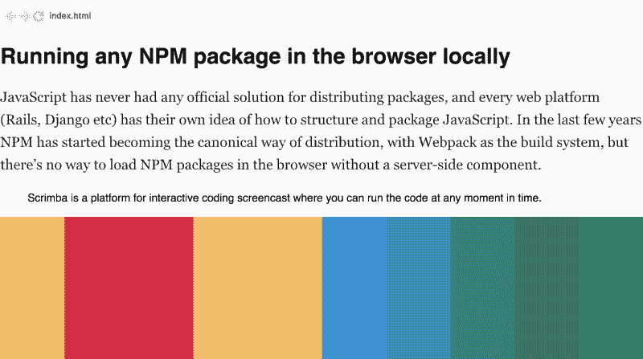
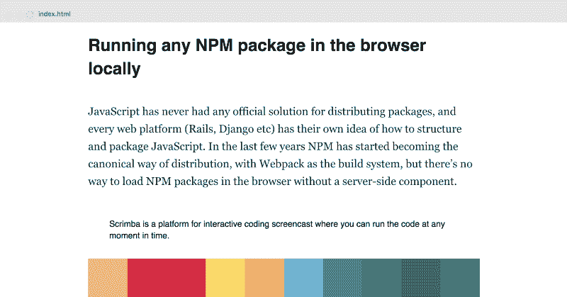
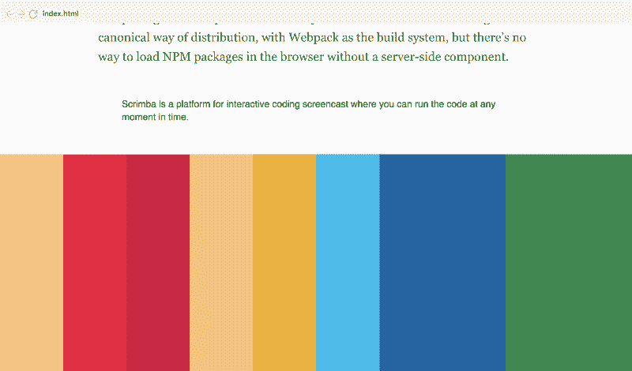
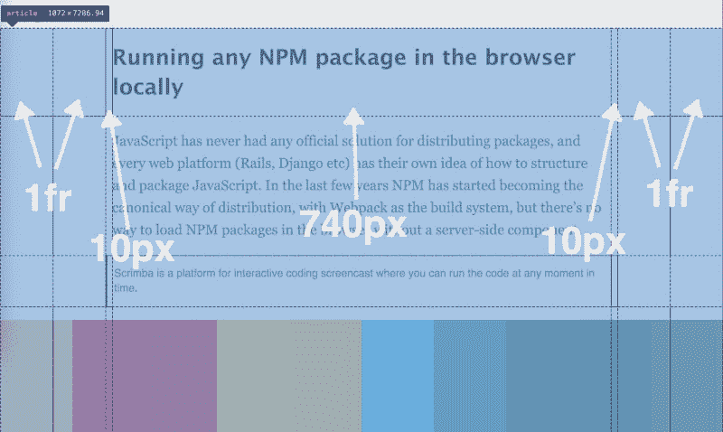

# 如何用 CSS 网格重建媒体的文章布局

> 原文：<https://dev.to/scrimba/how-to-recreate-medium-s-article-layout-with-css-grid-17ce>

当人们想到 CSS 网格时，他们通常会想到图像网格布局和完整的网页。然而，CSS Grid 实际上也是布局文章的极好技术，因为它允许你做以前很难做到的事情。

在本教程中，我将解释如何使用 CSS 网格重新创建著名的中型文章布局。

注意:我也参与了在 Scrimba 创建一个免费的 13 部分 CSS 网格课程。点击进入课程[。](https://scrimba.com/g/gR8PTE?utm_source=dev.to&utm_medium=referral&utm_campaign=gR8PTE_recreate_medium_layout_article)

[ ](https://scrimba.com/g/gR8PTE?utm_source=dev.to&utm_medium=referral&utm_campaign=gR8PTE_recreate_medium_layout_article) *点击图片进入完整的 CSS 网格课程。*

在课程中，我的同事 [Magnus Holm](https://medium.com/u/1a7998d688dd) 将介绍如何使用 CSS Grid 创建文章布局。所以如果你喜欢看而不是读，一定要看看他的视频。

### 内容

我们将从一个基本的 HTML 文件开始，它包含了您通常会在中型文章中找到的内容类型。例如标题、段落、副标题、图像、引用等等。这里有一个摘录:

```
<article>

<h1>Running any NPM package in the browser locally</h1>

<p>JavaScript has never had any official solution for distributing packages, and every web platform (Rails, Django etc) has their own idea of how to structure and package JavaScript. In the last few years, NPM has started becoming the canonical way of distribution, with Webpack as the build system, but there’s no way to load NPM packages in the browser without a server-side component.</p>

<blockquote>

<p>Scrimba is a platform for interactive coding screencast where           
you can run the code at any moment in time.</p>

</blockquote>

<figure>


</figure> 
```

如果您在没有调整任何布局的情况下在网站中打开此文件，它将如下所示:

[](https://res.cloudinary.com/practicaldev/image/fetch/s--Dg4bXrT0--/c_limit%2Cf_auto%2Cfl_progressive%2Cq_auto%2Cw_880/https://cdn-images-1.medium.com/max/800/1%2A78oGaexa4dc4cox9b3TIwA.png)

不是特别优雅。所以还是用 CSS 网格来修复吧。我们将一步一步地做它，以便你能容易地跟上。

### 基本页边距设置

我们需要做的第一件事是将整个`article`标签变成一个网格，并给它至少三列。

```
article {  
    display: grid;  
    grid-template-columns: 1fr 740px 1fr;  
} 
```

第一列和最后一列是响应性的，并作为边距。在大多数情况下，它们会包含空白。中间的列固定为 740 像素，将容纳文章的内容。

请注意，我们没有定义行，因为它们仅仅是为了适应其内容而需要的高度。文章中的每个内容块(段落、图片、标题)都有自己的一行。

下一步是确保网格中的所有内容默认从第二列开始。

```
article > \* {  
    grid-column: 2;  
} 
```

我们现在有以下结果:

[](https://res.cloudinary.com/practicaldev/image/fetch/s--K3U95VlP--/c_limit%2Cf_auto%2Cfl_progressive%2Cq_auto%2Cw_880/https://cdn-images-1.medium.com/max/800/1%2A7OmrcS4aCFyiqPBK93IpJg.png)

我们可以立即看到这看起来更好，因为每一边的空白使文本更容易阅读。

但是，通过将 left 和 right `margin`属性设置为 auto，也可以轻松实现这种效果。那么为什么要用 CSS 网格呢？

当我们想要模仿媒体的图像特征时，问题就出现了。例如创建全幅图像，就像这样:

[](https://res.cloudinary.com/practicaldev/image/fetch/s--CpLX_L_A--/c_limit%2Cf_auto%2Cfl_progressive%2Cq_auto%2Cw_880/https://cdn-images-1.medium.com/max/2560/1%2ATv8dyhSJfSjtcevJ3rfK6g.jpeg)

如果我们使用了`margin: 0 auto`,这将迫使我们对图像应用负边距，使它们占据整个网站的宽度，这是 hacky。

但是对于 CSS Grid，这变得很容易，因为我们将简单地使用列来设置宽度。为了让我们的图像占据整个宽度，我们只需要让它从第一列跨越到最后一列。

```
article > figure {  
    grid-column: 1 / -1;  
    margin: 20px 0;  
} 
```

我们还在顶部和底部设置了一些边距。然后我们有一个漂亮的全幅图像:

[](https://res.cloudinary.com/practicaldev/image/fetch/s--u2v6T8OX--/c_limit%2Cf_auto%2Cfl_progressive%2Cq_auto%2Cw_880/https://cdn-images-1.medium.com/max/800/1%2A50nsmqw-saQJXQNb0nuhnA.png)

### 用更多列展开

然而，这并没有让我们走完全程，因为 Medium 还有一些其他的布局需要我们考虑。让我们来看看其中的几个:

#### 中型图片

这是介于普通和全幅之间的图像选项，我们称之为*中型*图像。看起来是这样的:

[](https://res.cloudinary.com/practicaldev/image/fetch/s--4ykGbpi9--/c_limit%2Cf_auto%2Cfl_progressive%2Cq_auto%2Cw_880/https://cdn-images-1.medium.com/max/1200/1%2AkcNKt8kvMpl3c590yOMQpg.jpeg) 
***注意:*** 如果你在手机上观看，这个图像与全幅一模一样。在本文中，我们只关注桌面布局。_

这将需要至少两个新的栏目到我们的布局。

#### 引号

此外，如果您添加了引用，Medium 还会在文章的左侧放置一条**垂直线**:

> ←注意垂直线。因此，我们需要在网格中添加一个额外的列。

这需要在网格的左侧有一个微小的列。为了使事情对称，我们还将在右侧添加一个类似的列。

因此，为了支持**引用**和**中等大小的图像**，我们需要将整个宽度分成七列，而不是三列，就像这样:

```
article {  
    display: grid;  
    **grid-template-columns: 1fr 1fr 10px 740px 10px 1fr 1fr;**  
} 
```

如果我们使用 Chrome 检查器，我们实际上可以看到下面的网格线(见下图)。此外，我还添加了指针，以便更容易识别不同的列。

[](https://res.cloudinary.com/practicaldev/image/fetch/s--bPCU0HTI--/c_limit%2Cf_auto%2Cfl_progressive%2Cq_auto%2Cw_880/https://cdn-images-1.medium.com/max/800/1%2AYgYXxuC1tzrUdurfhirtww.png) 
我添加了指针，以便更容易识别不同的列。

我们需要做的第一件事是让所有默认项目从第四列开始，而不是第二列。

```
article > \* {  
    grid-column: 4;  
} 
```

然后我们可以通过做
来创建*中等大小的*图像

```
article > figure {  
    grid-column: 2 / -2;  
    margin: 20px 0;  
} 
```

这是 Chrome 检查器激活后的样子:

[](https://res.cloudinary.com/practicaldev/image/fetch/s--J2h9c4k8--/c_limit%2Cf_auto%2Cfl_progressive%2Cq_auto%2Cw_880/https://cdn-images-1.medium.com/max/1200/1%2AJabCqoB2CfZzy7toJcAj3A.png)

通过执行以下操作可以轻松创建*引号*:

```
article > blockquote {  
    grid-column: 3 / 5;  
    padding-left: 10px;  
    color: #666;  
    border-left: 3px solid black;  
} 
```

我们让它从第三列跨越到第三列到第五列。我们还添加了`padding-left: 10px;`,以便文本看起来从第四列开始(第三列也是 10 像素宽)。这是它在网格上的样子。

[](https://res.cloudinary.com/practicaldev/image/fetch/s--GslDqEnt--/c_limit%2Cf_auto%2Cfl_progressive%2Cq_auto%2Cw_880/https://cdn-images-1.medium.com/max/1200/1%2ASiTYghcUyboIplQOfFQTqA.png)

### **侧标记**

现在我们还需要支持最后一件事。Medium 有一种非常好的方式来表示文章中的哪些内容最突出。文本变成绿色，并在右侧得到一个顶部高亮显示的*。*

 *[](https://res.cloudinary.com/practicaldev/image/fetch/s--gyZCU3Wc--/c_limit%2Cf_auto%2Cfl_progressive%2Cq_auto%2Cw_880/https://cdn-images-1.medium.com/max/800/1%2ALUik3S2fM6I5P0b_k8EmpQ.png)

如果我们在 CSS 网格中使用了`margin: 0 auto;`，那么*顶部高亮显示的*文本元素将会是一场噩梦。这是因为该元素的行为不同于文章中的所有其他元素。它应该出现在前一个元素的右边，而不是出现在新的一行。如果我们不使用 CSS Grid，我们可能不得不开始使用`position: absolute;`来完成这项工作。

但是有了 CSS Grid 就超级简单了。我们将让这种元素从第四列开始。

```
.aside {  
    grid-column: 5;  
} 
```

这会自动将它放在文章的右边:

[](https://res.cloudinary.com/practicaldev/image/fetch/s--ns6Grxtd--/c_limit%2Cf_auto%2Cfl_progressive%2Cq_auto%2Cw_880/https://cdn-images-1.medium.com/max/800/1%2A_6JkoriZRy1bpDDGc-YPig.png) 
注意:我没有用绿色突出显示文本，因为这与 CSS 网格无关。

就是这样！我们现在已经使用 CSS Grid 重新创建了 Medium 的大部分文章布局。这其实很简单。但是请注意，我们还没有触及响应性，因为这本身就需要一篇全新的文章。

看看这个 Scrimba 游乐场，看看所有的代码。

感谢阅读！我叫 Per，我是 Scrimba 的联合创始人，我喜欢帮助人们学习新技能。如果你想获得关于新文章和资源的通知，请在 [Twitter](https://twitter.com/perborgen) 上关注我。*