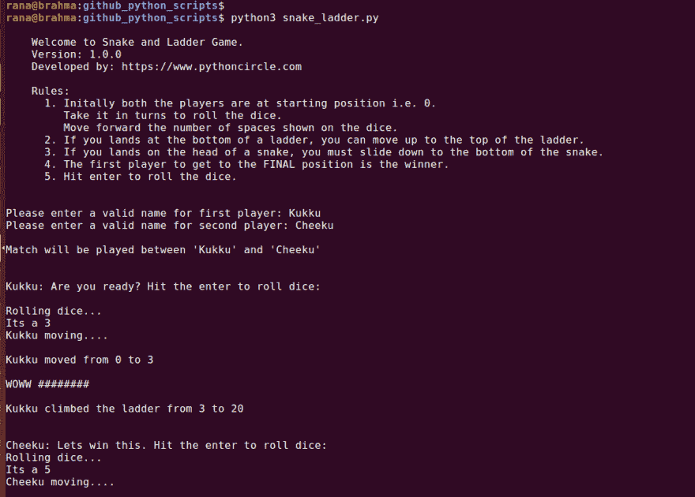

# Python 中基于文本的蛇和梯子游戏

> 原文：<https://dev.to/anuragrana/text-based-snake-and-ladder-game-in-python-196l>

本帖最初发表于[**pythoncircle.com**](https://www.pythoncircle.com/post/676/text-based-snake-and-ladder-game-in-python/)。

我赶紧写了一个 python 程序，在终端里玩基于文本的贪吃蛇和天梯游戏。

这段代码中没有使用任何高级 python 概念。然而，对于初学者来说，为了学习如何在程序中使用多个概念，这是一件有趣的事情。

这段代码中使用的几个基本概念是:
-字典
-列表
-生成随机数
-从列表中选择随机值
-在程序中添加等待/休眠
-条件语句，即 IF 和 ELSE
-从用户处获取输入

你可以从 [Github](https://github.com/anuragrana/Python-Scripts/blob/master/snake_ladder.py) 下载代码。

游戏中正在发生什么:
1-显示欢迎消息
2-收集玩家的名字
3-直到其中一个玩家赢了，执行以下操作:
3.1-掷骰子
3.2-根据掷骰子得到的值向前移动玩家。
3.3-如果玩家在蛇头上，向下移动到蛇尾
3.4-如果玩家在梯子的底部，将它带到顶部
3.5-否则留在那里，让第二个玩家掷骰子

使用命令`python3 snake_ladder.py`运行游戏。

[](https://res.cloudinary.com/practicaldev/image/fetch/s--86izyGtk--/c_limit%2Cf_auto%2Cfl_progressive%2Cq_auto%2Cw_880/https://www.pythoncircle.com/media/uploads/snake-and-ladder-game-in-python-20181225-f17b10d60d7642ab92990f28f0127e69.png)

**代号:**

```
#
# Text based snake and ladder game
# Author - https://www.pythoncircle.com
# 
import time
import random
import sys

# just of effects. add a delay of 1 second before performing any action SLEEP_BETWEEN_ACTIONS = 1
MAX_VAL = 100
DICE_FACE = 6

# snake takes you down from 'key' to 'value' snakes = {
    8: 4,
    18: 1,
    26: 10,
    39: 5,
    51: 6,
    54: 36,
    56: 1,
    60: 23,
    75: 28,
    83: 45,
    85: 59,
    90: 48,
    92: 25,
    97: 87,
    99: 63
}

# ladder takes you up from 'key' to 'value' ladders = {
    3: 20,
    6: 14,
    11: 28,
    15: 34,
    17: 74,
    22: 37,
    38: 59,
    49: 67,
    57: 76,
    61: 78,
    73: 86,
    81: 98,
    88: 91
}

player_turn_text = [
    "Your turn.",
    "Go.",
    "Please proceed.",
    "Lets win this.",
    "Are you ready?",
    "",
]

snake_bite = [
    "boohoo",
    "bummer",
    "snake bite",
    "oh no",
    "dang"
]

ladder_jump = [
    "woohoo",
    "woww",
    "nailed it",
    "oh my God...",
    "yaayyy"
]

def welcome_msg():
    msg = """
    Welcome to Snake and Ladder Game.
    Version: 1.0.0
    Developed by: https://www.pythoncircle.com

    Rules:
      1\. Initally both the players are at starting position i.e. 0\. 
         Take it in turns to roll the dice. 
         Move forward the number of spaces shown on the dice.
      2\. If you lands at the bottom of a ladder, you can move up to the top of the ladder.
      3\. If you lands on the head of a snake, you must slide down to the bottom of the snake.
      4\. The first player to get to the FINAL position is the winner.
      5\. Hit enter to roll the dice.

    """
    print(msg)

def get_player_names():
    player1_name = None
    while not player1_name:
        player1_name = input("Please enter a valid name for first player: ").strip()

    player2_name = None
    while not player2_name:
        player2_name = input("Please enter a valid name for second player: ").strip()

    print("\nMatch will be played between '" + player1_name + "' and '" + player2_name + "'\n")
    return player1_name, player2_name

def get_dice_value():
    time.sleep(SLEEP_BETWEEN_ACTIONS)
    dice_value = random.randint(1, DICE_FACE)
    print("Its a " + str(dice_value))
    return dice_value

def got_snake_bite(old_value, current_value, player_name):
    print("\n" + random.choice(snake_bite).upper() + " ~~~~~~~~>")
    print("\n" + player_name + " got a snake bite. Down from " + str(old_value) + " to " + str(current_value))

def got_ladder_jump(old_value, current_value, player_name):
    print("\n" + random.choice(ladder_jump).upper() + " ########")
    print("\n" + player_name + " climbed the ladder from " + str(old_value) + " to " + str(current_value))

def snake_ladder(player_name, current_value, dice_value):
    time.sleep(SLEEP_BETWEEN_ACTIONS)
    old_value = current_value
    current_value = current_value + dice_value

    if current_value > MAX_VAL:
        print("You need " + str(MAX_VAL - old_value) + " to win this game. Keep trying.")
        return old_value

    print("\n" + player_name + " moved from " + str(old_value) + " to " + str(current_value))
    if current_value in snakes:
        final_value = snakes.get(current_value)
        got_snake_bite(current_value, final_value, player_name)

    elif current_value in ladders:
        final_value = ladders.get(current_value)
        got_ladder_jump(current_value, final_value, player_name)

    else:
        final_value = current_value

    return final_value

def check_win(player_name, position):
    time.sleep(SLEEP_BETWEEN_ACTIONS)
    if MAX_VAL == position:
        print("\n\n\nThats it.\n\n" + player_name + " won the game.")
        print("Congratulations " + player_name)
        print("\nThank you for playing the game. Please visit https://www.pythoncircle.com\n\n")
        sys.exit(1)

def start():
    welcome_msg()
    time.sleep(SLEEP_BETWEEN_ACTIONS)
    player1_name, player2_name = get_player_names()
    time.sleep(SLEEP_BETWEEN_ACTIONS)

    player1_current_position = 0
    player2_current_position = 0

    while True:
        time.sleep(SLEEP_BETWEEN_ACTIONS)
        input_1 = input("\n" + player1_name + ": " + random.choice(player_turn_text) + " Hit the enter to roll dice: ")
        print("\nRolling dice...")
        dice_value = get_dice_value()
        time.sleep(SLEEP_BETWEEN_ACTIONS)
        print(player1_name + " moving....")
        player1_current_position = snake_ladder(player1_name, player1_current_position, dice_value)

        check_win(player1_name, player1_current_position)

        input_2 = input("\n" + player2_name + ": " + random.choice(player_turn_text) + " Hit the enter to roll dice: ")
        print("\nRolling dice...")
        dice_value = get_dice_value()
        time.sleep(SLEEP_BETWEEN_ACTIONS)
        print(player2_name + " moving....")
        player2_current_position = snake_ladder(player2_name, player2_current_position, dice_value)

        check_win(player2_name, player2_current_position)

if __name__ == "__main__":
    start() 
```

更从[**pythoncircle.com**](https://www.pythoncircle.com):

*   [如何开始 Python 编程——初学者指南](https://www.pythoncircle.com/post/671/how-to-start-with-python-programming-a-beginners-guide/)
*   [面向初学者的 Python Django 项目构想](https://www.pythoncircle.com/post/669/python-django-project-idea-for-beginners/)
*   [通过 Python 使用 Postgresql 数据库](https://www.pythoncircle.com/post/656/using-postgresql-database-with-python/)