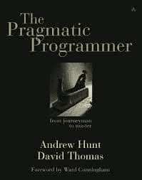
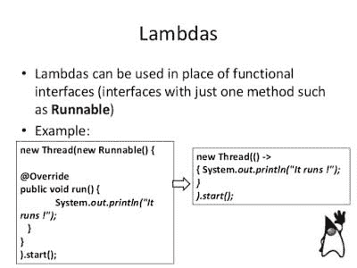

# Java 程序员为什么要学习 Scala 和函数式编程？

> 原文：<https://dev.to/javinpaul/why-java-programmer-should-learn-scala-and-functional-programming-5hej>

*披露:这篇文章包括附属链接；如果您从本文提供的不同链接购买产品或服务，我可能会收到报酬。*

我的读者经常问我的一个问题是，**“Java 开发人员是否应该学习** [**Scala**](https://javarevisited.blogspot.com/2019/01/5-free-scala-programming-courses-for-java-programmers-learn-online.html) **？***Scala 比*[*Java*](https://dev.to/javinpaul/10-free-courses-to-learn-java-in-depth-3ikn)*有前途吗？*Java 开发者为什么要学 Scala”等等。

嗯，[学习 Scala](https://javarevisited.blogspot.com/2020/09/top-5-courses-to-learn-scala.html#axzz6oawwFfxd) 可能有很多原因，比如你被迫学习它，因为它已经在你刚刚加入的新公司中使用，或者你的解决方案架构师决定在你将要工作的新项目中使用它，但那是一个不同的故事。

> 在这里，我们将讨论一些鼓励 Java 开发人员学习 Scala 的实际原因。

Scala 已经成为近来最强大的 Java 替代品之一。它一直是 JVM 语言的首选，把 T2 Groovy T3 和 T4 Kotlin T5 远远甩在后面，是人们最想用来编写代码的首选语言。

> Scala 有很多优点，最大的优点是它是一种多范例语言。

除了可以利用多核 CPU 架构的函数式编程习惯的优势，Scala 还拥有流行的[面向对象](https://javarevisited.blogspot.com/2018/08/5-object-oriented-programming-and-design-courses-for-Java-programmers.html)范例的正确组合。

它不仅解决了 Java 的许多问题，比如更少甚至没有样板文件，而且它还提供了该语言中的几个最佳实践和模式，比如使用 [val](http://www.java67.com/2017/05/difference-between-var-val-and-def-in-Scala.html) 关键字和`case`类的不变性。

尽管提供了像 [Python](http://www.java67.com/2017/12/10-programming-languages-to-learn-in.html) 这样的动态语言的流畅性和灵活性，但它仍然是一种强静态类型的语言，以防止你做坏事，这种事在动态语言的运行时只会发生。

我相信 Scala 开发人员会在这个列表中添加更多的理由，但是作为一个 Java 背景和 Java 的热心支持者，我认为 Scala 肯定有一些东西可以提供，并且下面的理由对 Java 开发人员学习 Scala 很有意义。

## 2021 年学习 Scala 的 10 个理由

事不宜迟，下面是我列出的程序员应该学习 Scala 2021 的 10 个理由:

### 1。多范式语言

Scala 与 Java 略有不同，因为它支持两种编程范式:面向对象编程( [OOP](http://www.java67.com/2015/12/top-30-oops-concept-interview-questions-answers-java.html) )和函数式编程( [FP](https://javarevisited.blogspot.com/2017/03/top-30-scala-and-functional-programming.html) )。

为了提高你的编程技能，最好从不同的范例中学习至少一种语言，例如命令式、逻辑式、函数式和面向对象编程，Scala 给了你一个同时探索函数式和面向对象编程的机会。

[实用程序员](https://www.amazon.com/Pragmatic-Programmer-Journeyman-Master/dp/020161622X?tag=javamysqlanta-20)这本书也建议你每年学习一门新的编程语言。

[](https://www.amazon.com/Pragmatic-Programmer-Journeyman-Master/dp/020161622X?tag=javamysqlanta-20)

程序员实用手册

Scala 允许你定义与数据属性(类的行为类似于 [C++](http://www.java67.com/2018/02/5-free-cpp-courses-to-learn-programming.html) / [Java](https://javarevisited.blogspot.com/2018/08/top-5-free-java-8-and-9-courses-for-programmers.html) 类)和行为属性(特性对应于 Java 接口)相关的类型。

就像在其他函数式编程语言中一样，在 Scala 中，**函数是一等公民**(这意味着你可以将它们作为值四处传递) [Scala](https://hackernoon.com/10-reasons-to-learn-scala-and-functional-programming-2fce385e6ec7) 也支持匿名函数和 currying(多参数函数的部分应用)。

这些特性的结合使得编写简洁优雅的 Scala 程序成为可能。多范例是 Scala 最强的卖点之一，Java 8 也试图通过引入 lambda 表达式来实现这一点(参见 [Java SE 8 新特性](https://click.linksynergy.com/deeplink?id=JVFxdTr9V80&mid=39197&murl=https%3A%2F%2Fwww.udemy.com%2Fjava-se-8-new-features%2F))，但它仍然落后了几步。我认为，Scala 永远比 Java 更具功能性，但这是另一个争论的话题。

[](https://click.linksynergy.com/deeplink?id=JVFxdTr9V80&mid=39197&murl=https%3A%2F%2Fwww.udemy.com%2Fjava-se-8-new-features%2F)

### 2。与 Java 的互操作性

在我看来，Scala 选择与 Java 互操作是 Scala 最好的选择。 [Scala](http://javarevisited.blogspot.sg/2013/11/scala-vs-java-differences-similarities-books.html#axzz5AzsDfyfF) 运行在 Java 虚拟机( [JVM](http://www.java67.com/2013/02/difference-between-jit-and-jvm-in-java.html) )上，可以很好地与 Java 代码互操作。

这也意味着 Scala 开发者可以直接从 Scala 代码中使用 Java 库。

鉴于许多 Java 开发人员正在转向 Scala，这是利用他们在现实世界 Java 编程中多年经验的最佳方式。

也可以从 Java 调用 Scala 代码，你可以很容易地用 Scala 编写部分程序，用 Java 编写其余部分。

简而言之，与 [Java](http://javarevisited.blogspot.sg/2013/04/10-reasons-to-learn-java-programming.html#axzz59dMqZlkB) 的互操作性赋予 Scala 成为主流企业编程语言的巨大潜力，因为世界上如此多的代码都是用 Java 编写的，而且世界上如此多的开发者都在用 [Java](https://medium.com/javarevisited/10-free-courses-to-learn-java-in-2019-22d1f33a3915) 工作。

### 3。最佳实践和模式内置语言

关于 Scala，你可能不知道的一件事是，它最初是由瑞士 EPFL 大学开发的，旨在将编程语言研究中的最新创新应用于一种能够获得主流牵引力的语言，就像 Java 一样。

语言本身内置了一些最佳实践和模式，如 val 声明顶级[不变性](http://javarevisited.blogspot.sg/2013/03/how-to-create-immutable-class-object-java-example-tutorial.html)，这比 Java 中重载的 [final](http://javarevisited.blogspot.sg/2016/09/21-java-final-modifier-keyword-interview-questions-answers.html) 关键字或 [C#](https://medium.com/javarevisited/5-best-c-c-sharp-programming-courses-for-beginners-in-2020-494f7afc7a5c) 中的 const/read-only 及其相关的奇怪规则要好得多。

它还有 *case 类*，这使得在 Scala 中创建不可变类变得容易。

Scala 还提供了闭包，这是动态语言如 [Python](http://www.java67.com/2018/02/5-free-python-online-courses-for-beginners.html) 和 [Ruby](http://www.java67.com/2018/02/5-free-ruby-and-rails-courses-to-learn-online.html) 从函数式编程范式中采用的一个特性。

### 4。表示

当你比较 Scala 和 Java 时，正如我在之前的文章中提到的 Scala 和 Java 的差异，Scala 肯定比 Java 得分高。

Scala 天生就很有表现力。还有许许多多用 [Scala](https://javarevisited.blogspot.com/2017/03/top-30-scala-and-functional-programming.html) 编写的非常漂亮和有用的代码。

这吸引了越来越多的 Java 开发人员学习 Scala，他们喜欢编写漂亮而[干净的代码](https://pluralsight.pxf.io/c/1193463/424552/7490?u=https%3A%2F%2Fwww.pluralsight.com%2Fcourses%2Fwriting-clean-code-humans)。

给你一个思路，下面是用 Java 和 Scala 两种语言写的[字数统计程序](http://www.java67.com/2015/10/java-program-to-find-repeated-words-and-count.html)，你可以自己看看语言表现力的区别。

Scala 只用一行代码就实现了 Java 花了 10 多行代码才实现的目标。

[](https://res.cloudinary.com/practicaldev/image/fetch/s--jstsMoed--/c_limit%2Cf_auto%2Cfl_progressive%2Cq_auto%2Cw_880/https://cdn-images-1.medium.com/max/1000/1%2AUpUCPydWXzXbB1WNLuFr0g.png)

Scala 代码更加清晰简洁

顺便说一下，可以通过使用 [Java 8 的特性](https://click.linksynergy.com/deeplink?id=JVFxdTr9V80&mid=39197&murl=https%3A%2F%2Fwww.udemy.com%2Fjava-se-8-new-features%2F)来改善 Java 方面的情况，比如 [lambdas](https://pluralsight.pxf.io/c/1193463/424552/7490?u=https%3A%2F%2Fwww.pluralsight.com%2Fcourses%2Fjava-8-lambda-expressions-collections-streams) 和 [stream](https://pluralsight.pxf.io/c/1193463/424552/7490?u=https%3A%2F%2Fwww.pluralsight.com%2Fcourses%2Fjava-8-lambda-expressions-collections-streams) ，本例中没有使用这些特性，但是在简洁和干净的代码方面，Scala 仍然比 Java 得分高。

### 5。市场的

哪个程序员不想有市场？学习新技术或框架的一个原因总是更好的工作和职业发展。

学习 Scala 一定会让你更有市场。如今，许多公司都在使用或迁移到 Scala，包括 Twitter、LinkedIn、Foursquare 和 Quora。

考虑到 Scala 作为一种可扩展语言的营销，大型投资银行和金融机构开始关注 Scala 的低延迟解决方案的日子不远了。

类似于[**Effective Java**](https://www.amazon.com/Effective-Java-3rd-Joshua-Bloch/dp/0134685997/?tag=javamysqlanta-20)**，** Twitter 已经分享了用 Scala 开发程序的最佳实践，作为 Effective Scala。

[](https://www.amazon.com/Effective-Java-3rd-Joshua-Bloch/dp/0134685997/?tag=javamysqlanta-20)

为了使用 Scala，Quora 的创始人花了几个月的时间构建了一个 Scala web 框架。

Martin Odersky ，Scala 背后的人，现在是初创公司 [Lightbend](https://www.lightbend.com/) 的幕后人，正式名称为 Typesafe，用于支持商业 Scala 开发。

Scala 作为 Java 的主要替代品，一切都朝着正确的方向发展。

### 6。静态类型化

一般来说，像 Java 这样的静态类型语言可以防止程序员做坏事，而像 [Python](http://javarevisited.blogspot.sg/2018/03/top-5-courses-to-learn-python-in-2018.html) 这样的动态语言，当你运行程序时，你只知道一件坏事。

[Scala](https://medium.com/javarevisited/5-best-scala-and-functional-programming-books-to-learn-in-2021-97ec9e56f2bd) 两全其美。感觉是动态的，但它是强静态类型的。Scala 编译器非常聪明，充分利用了类型推理。

Scala 为变量和函数提供了类型推断，比 [Java](https://click.linksynergy.com/fs-bin/click?id=JVFxdTr9V80&subid=0&offerid=323058.1&type=10&tmpid=14538&RD_PARM1=https%3A%2F%2Fwww.udemy.com%2Fjava-the-complete-java-developer-course%2F) 和 [C#](http://bit.ly/2yskpDe) 中有限的类型推断要好得多。

### 7。不断发展的框架

关于这个生态系统，你可能知道的一件事是 Scala 正在成长。现在有很多好的 Scala 库和框架。

已经开始使用 Scala 的公司也为 Scala 作为主流语言的发展做出了贡献。

有一些不错的 Scala web 框架，包括 Lift 和 Play。

Akka 是另一个基于 Scala 的并发框架，它已经成为在 JVM 上构建高度并发、分布式和容错的事件驱动应用程序的工具包和运行时。

Scala 还与 [Apache Spark](https://click.linksynergy.com/fs-bin/click?id=JVFxdTr9V80&subid=0&offerid=323058.1&type=10&tmpid=14538&RD_PARM1=https%3A%2F%2Fwww.udemy.com%2Fapache-spark-course-with-java%2F) 一起被用于[大数据空间](http://javarevisited.blogspot.sg/2017/12/top-5-courses-to-learn-big-data-and.html)，这进一步推动了许多对大数据感兴趣的 Java 开发人员对它的采用。

Btw，如果你对 Spark 感兴趣，那么你也可以看看 Udemy 上的[从零开始学习 Apache Spark】课程。](http://bit.ly/2BY5Z3q)

[](http://bit.ly/2BY5Z3q)

### 8。成长中的社区

随着语言和相关框架的发展，Scala 社区也在成长。许多程序员，包括 Java 开发人员都加入了 Scala 的行列。

越来越多的 ide 开始支持 Scala 语法，并且在 [Eclipse](http://www.java67.com/2018/02/5-free-eclipse-and-junit-online-courses-java-developers.html) 和 [IntelliJ](https://javarevisited.blogspot.com/2018/09/top-5-courses-to-learn-intellij-idea-java-and-android-development.html) 中有更好的支持。在 SBT、Maven 和 Ant 中也有很好的构建工具支持。

在最近的调查中，Scala 也被吹捧为 Java 的头号替代品。在我看来，要让 Scala 成为 Java 的真正替代品，鉴于 Java 8 也有 T2 函数式编程的支持，它必须吸引越来越多的 Java 开发者。

让像 Twitter 这样的大组织采用 Scala 当然有助于社区，因为他们有更多的资源和影响力。

### 9。简洁的语法

Java 长期以来一直因其冗长和重复的语法而受到批评。尽管 Scala 让 Java 更具可读性，就像英语一样，但它同时为简洁和可读性树立了新的标杆。

Scala 编译器 scalac(记住 [javac](http://javarevisited.blogspot.sg/2012/12/javac-is-not-recognized-as-internal-or-external-command.html#axzz51Q21YJnR) )做的比你想象的要多。它可以为你生成 [toString()](http://javarevisited.blogspot.sg/2012/09/override-tostring-method-java-tips-example-code.html#axzz54v9Z26qM) 、 [equals()](http://www.java67.com/2013/04/example-of-overriding-equals-hashcode-compareTo-java-method.html) 、 [hasCode()](http://javarevisited.blogspot.sg/2013/08/10-equals-and-hashcode-interview.html) 等东西。考虑用 Java 和 Scala 编写的同一个类的两个代码片段来帮助您做出选择:

```
public class Book {
private final String name;
private final double price;

public Star(String name, double price) {
this.name = name;
this.price = price;
}

@Override
public int hashCode() {
int hash = 7;
hash = 23 * hash + Objects.hashCode(this.name);
return hash;
}

@Override
public boolean equals(Object obj) {
if (obj == null) {
return false;
}

if (getClass() != obj.getClass()) {
return false;
}

final Test other = (Test) obj;

if (!Objects.equals(this.name, other.name)) {
   return false;
}

if (Double.doubleToLongBits(this.price) != Double.doubleToLongBits(other.price)) {
  return false;
}
return true;
}

@Override\
public String toString() {\
 return "Test{" + "name=" + name + ", price=" + price + '}';
}

} 
```

<svg width="20px" height="20px" viewBox="0 0 24 24" class="highlight-action crayons-icon highlight-action--fullscreen-on"><title>Enter fullscreen mode</title></svg> <svg width="20px" height="20px" viewBox="0 0 24 24" class="highlight-action crayons-icon highlight-action--fullscreen-off"><title>Exit fullscreen mode</title></svg>

你可以写同样的东西，使用 Scala 的 case 类:

```
case class Book(name: String, price: double) 
```

<svg width="20px" height="20px" viewBox="0 0 24 24" class="highlight-action crayons-icon highlight-action--fullscreen-on"><title>Enter fullscreen mode</title></svg> <svg width="20px" height="20px" viewBox="0 0 24 24" class="highlight-action crayons-icon highlight-action--fullscreen-off"><title>Exit fullscreen mode</title></svg>

顺便说一下，您还可以使用 Lombok 库，Java 开发人员的基本库之一，删除与 getters、setters、equals、hashCode 和 toString 相关的样板代码。它可以自动为你生成。

### 10。与 Haskell 和其他函数式编程语言相比，更容易学习

对于 Java 开发人员来说，学习 Haskell 或 OCaml 这样的经典函数式编程语言要比 Scala 困难得多。

换句话说，[Scala](因为它的 OOP 功能，所以相对容易学习。

尽管花时间学习函数式编程，Java 开发人员仍然可以通过利用他们现有的 [OOP](http://www.java67.com/2015/12/top-30-oops-concept-interview-questions-answers-java.html) 知识在 Scala 中高效工作。像 [Java](http://javarevisited.blogspot.sg/2017/11/top-5-free-java-courses-for-beginners.html#axzz5AzsDfyfF) 一样，Scala 有清晰的语法、漂亮的库、良好的在线文档，业内有很多人在使用它。

随着论坛上 Scala 社区的不断增长，找到任何 Scala 问题的答案并不困难，这将增加您的学习体验。

### 结论

一旦你开始学习 Scala，我相信你会爱上它的。它不仅有更干净的 OO 代码，还有功能性，感觉是动态的(就像 [Python](https://javarevisited.blogspot.com/2020/02/10-best-coursera-courses--for-python.html) )，但它也有一个静态类型系统，可以防止你做坏事。如果你现在决定学习 Scala，这里有一些有用的资源供你进一步学习。

1.  [开始 Scala 编程](https://click.linksynergy.com/fs-bin/click?id=JVFxdTr9V80&subid=0&offerid=323058.1&type=10&tmpid=14538&RD_PARM1=https%3A%2F%2Fwww.udemy.com%2Fbeginning-scala-programming%2F)
2.  [Scala:Justin Pihony 入门](https://pluralsight.pxf.io/c/1193463/424552/7490?u=https%3A%2F%2Fwww.pluralsight.com%2Fcourses%2Fscala-getting-started)
3.  Toby Weston 的《面向 Java 开发人员的 Scala》
4.  [不耐烦的 Scala】](http://www.amazon.com/dp/0321774094/?tag=javamysqlanta-20)
5.  [Scala 中的函数式编程](https://www.amazon.com/Functional-Programming-Scala-Paul-Chiusano/dp/1617290653/?tag=javamysqlanta-20)

祝您在 Scala 和函数式编程的美丽世界中一路顺风。如果您有任何问题或反馈，请留言。

如果你喜欢这篇文章，那么请分享给你的朋友和同事，别忘了在 Twitter 上关注 [javinpaul](https://twitter.com/javinpaul) 和在 Medium 上关注 [javinpaul](https://medium.com/@javinpaul) ！

### 附言——如果你需要一些免费资源，可以查看 [Scala 编程迷你新手训练营](http://bit.ly/2my9mVz)——一门#免费课程，开始你的 Scala 之旅。