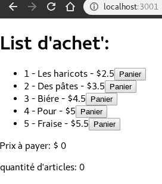

# 组件与 reactjs 的通信

> 原文:# t0]https://dev . to/geloncruz/communition-des-components-with-reacjs-3pbp

你好，正如我在上一篇文章中所说，我正在学习法语写作，所以我会尝试写技术，这是我练习法语写作的一个非常简单的方法。

今天我要讲的是如何简单地将父部件与子部件和使用 reactjs 的父部件进行通信。

此应用程序包含一个购物列表、一个购物车以及要添加到购物车中的物品。
可在以下网址取得([https://github . com/geloncruz/panzer](https://github.com/geltoncruz/Panier)

首先，我想你已经安装了 node、npm 和 react framework，所以我们进入开发的第一阶段。

在终端上写下来创建应用程序。

```
npx create-react-app <app-name> 
```

> 你知道 npx 吗？。下次我会写关于这项技术的

创建应用程序后，打开 IDE 进行工作，然后继续。

首先，我将清除 app . js archive 并创建一个名为 components 的新文件夹。
在 components 资料夹中，我建立 panzer . jsx
归档

```
rm src/App.js App.css App.test.js
cd src && mkdir Component && cd Component/
>> Panier.jsx 
```

在 panier . jsx 归档文件中，我们将创建组件类。

```
/**
 * @author Gelton Cruz
 * @file Panier.jsx
 */
import React from 'react'

export default class Panier extends React.Component {

} 
```

之后我们会进化，加入方法渲染

```
/**
 * @author Gelton Cruz
 * @file Panier.jsx
 */
import React from 'react'

export default class Panier extends React.Component {

    render() {
        return (
            <div>
                <h1>List d'achet':</h1>
                <ul>
                    <li>1 - Fejão - $2.5<button>Panier</button></li>
                    <li>2 - Macarrão - $3.5<button>Panier</button></li>
                    <li>3 - Acuçar - $4.5<button>Panier</button></li>
                    <li>4 - Pera - $5<button>Panier</button></li>
                    <li>5 - Morango - $5.5<button>Panier</button></li>
                </ul>
                <p>Prix à payer: $0</p>
                <p>quantité d'articles: 0</p>
            </div>
        )
    }
} 
```

现在，我们将创建一个静态列表来表示列表中的每个项目，并将其加载到其各自的子组件中。

```
constructor(props) {
        super(props)

        this.state = {
            Items: [
                { id: 1, productName: 'Les haricots', price: 2.50 },
                { id: 2, productName: 'Des pâtes', price: 3.50 },
                { id: 3, productName: 'Biére', price: 4.50 },
                { id: 4, productName: 'Pour', price: 5 },
                { id: 5, productName: 'Fraise', price: 5.50 },
            ],
        }
} 
```

要创建新组件，必须导航到组件文件夹并创建 item . jsx
文件

```
>> Item.jsx 
```

```
/**
 * @author Gelton Cruz
 * @file Item.jsx
 */
import React from 'react'

export default class Item extends React.Component {

    render(){
        return(
            <li>1 - Fejão - $2.5<button>Panier</button></li>
        )
    }
} 
```

在购物车中添加新组件非常简单。只需导入组件并将其放入购物车即可。

```
/**
 * @author Gelton Cruz
 * @file Panier.jsx
 */
import React from 'react'
import Item from './Item'

export default class Panier extends React.Component {

    render() {
        return (
            <div>
                <h1>List d'achet':</h1>
                <ul>
                    <Item />
                </ul>
                <p>Prix à payer: $0</p>
                <p>quantité d'articles: 0</p>
            </div>
        )
    }
} 
```

重复使用 map()方法。
我们将通过自己的项发送项组件数据的方式。

```
//Panier.jsx
                <ul>
                {
                 this.state.Items.map((item, i) => (
                   <Item key={i.toString()} item={item} />
                      ))
                    }
                </ul> 
```

在 Item 元件中，我们必须接收填入元件范本的资料。

```
/**
 * @author Gelton Cruz
 * @file Item.jsx
 */
import React from 'react'

export default class Item extends React.Component {

    render(){
        return(
            <li key={this.props.item.id}>
                {this.props.item.id} - {this.props.item.productName} - ${this.props.item.price} 
                <button>Panier</button>
            </li>
        )
    }
} 
```

如果执行所有步骤，您的屏幕将如下所示:

[](https://res.cloudinary.com/practicaldev/image/fetch/s--nwAyAZHr--/c_limit%2Cf_auto%2Cfl_progressive%2Cq_auto%2Cw_880/https://thepracticaldev.s3.amazonaws.com/i/yxbviq4hzem4oh1h9kmw.png)

## 最后一步将是:

1.  按一下「购物车」按钮，将料号新增至购物车。
2.  只要您有一个项目，就可以更改购物车中的项目数。
3.  更新购物车的总价。

### 1。

创建 click 事件并添加匿名方法，调用您将使用 item 作为参数创建的方法*receive(item)*

```
// Item.jsx
<button onClick={()=> this.props.recevoirItem(this.props.item)}>Panier</button> 
```

### 2。

首先，要添加结构篮保存数据
之后，父部件【篮】必须接收项目

```
//Panier.jsx

this.state = {
             ...
            Panier: []
        } 
```

```
//Panier.jsx

        recevoirItem  = item => {
        this.state.Panier.push(item);
        this.setState({Panier: this.state.Panier})
} 
```

```
//Panier.jsx

render(){

...
<ul>
...
  <Item key={i.toString()} item={item} recevoirItem={this.recevoirItem} /> 
    } 
```

```
//Panier.jsx
...

render(){

...
<p>quantité d'articles: {this.state.Panier.length <= 0 ? `Panier vide` : this.state.Panier.length}</p> 
```

### 3。

使用 _reduce()方法访问每个价格并合计:

```
 <p>Price à payer: $ { parseFloat(this.state.Panier.reduce((acc,prx) => acc + prx.price, 0)) }</p> 
```

最后，您必须将购物车汇入 index.js 档案并使用该组件。

```
// index.js
import Panier from './Component/Panier'

ReactDOM.render(<Panier />, document.getElementById('root')); 
```

于是，三个文件的完整代码:

```
/**
 * @author Gelton Cruz
 * @file index.js
 */
import React from 'react';
import ReactDOM from 'react-dom';
import './index.css';
import * as serviceWorker from './serviceWorker';
import Panier from './Component/Panier'

ReactDOM.render(<Panier />, document.getElementById('root'));

// If you want your app to work offline and load faster, you can change
// unregister() to register() below. Note this comes with some pitfalls.
// Learn more about service workers: https://bit.ly/CRA-PWA
serviceWorker.unregister(); 
```

```
/**
 * @author Gelton Cruz
 * @file Panier.jsx
 */
import React from 'react'
import Item from './Item'

export default class Panier extends React.Component {

    constructor(props) {
        super(props)

        this.state = {
            Items: [
                { id: 1, productName: 'Les haricots', price: 2.50 },
                { id: 2, productName: 'Des pâtes', price: 3.50 },
                { id: 3, productName: 'Acuçar', price: 4.50 },
                { id: 4, productName: 'Pour', price: 5 },
                { id: 5, productName: 'Fraise', price: 5.50 },
            ],
            Panier: []
        }
    }

    recevoirItem = item => {
        this.state.Panier.push(item);
        this.setState({ Panier: this.state.Panier })
    }

    render() {
        return (
            <div>
                <h1>List d'achet':</h1>
                <ul>
                    {
                        this.state.Items.map((item, i) => (
                            <Item key={i.toString()} item={item} recevoirItem={this.recevoirItem} />
                        ))
                    }
                </ul>
                <p>Prix à payer: $ {parseFloat(this.state.Panier.reduce((acc, prx) => acc + prx.price, 0))}</p>
                <p>quantité d'articles: {this.state.Panier.length <= 0 ? `Panier vide` : this.state.Panier.length}</p>
            </div>
        )
    }
} 
```

```
/**
 * @author Gelton Cruz
 * @file Item.jsx
 */
import React from 'react'

export default class Item extends React.Component {
    render(){
        return(
            <li key={this.props.item.id}>
                {this.props.item.id} - {this.props.item.productName} - ${this.props.item.price} 
                <button onClick={()=> this.props.recevoirItem(this.props.item)}>Panier</button>
            </li>
        )
    }
} 
```

对不起我的法语，谢谢大家！