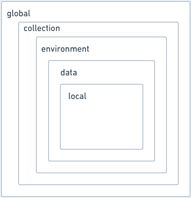
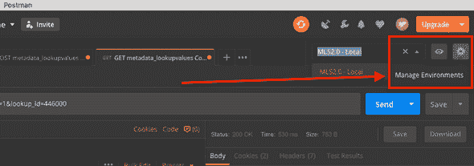
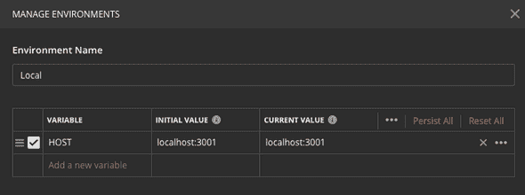

# 邮递员中的变量

> 原文：<https://dev.to/stephencweiss/variables-in-postman-51m6>

我以前写过为什么我喜欢用 Postman 测试我的[API。今天，我了解到它们还有一个让我的生活更轻松的特性——环境变量。](https://stephencharlesweiss.com/2019-04-13/testing-api-with-curl-and-postman)

就像在代码库中使用一个变量来指向一条你想要多处重用的信息一样，Postman 变量实现了无重复的重用。它们创建了一个单一的入口和管理点(这一点[我已经在过去的](https://stephencharlesweiss.com/2019-07-01/array-intersection-in-psql/)中作为一个特性写过了)。

# 管理范围

 Postman 提供了五个不同级别的范围——我相信这对更多的高级用户会有用。对我来说——环境范围是我最关心的地方——尽管我可以预见，随着我在越来越多的项目中工作，我也会从集合中受益。

此时环境对我来说是最有用的，这是我关注的地方。

# 管理环境

要创建一个环境，选择邮差窗口右上角的齿轮图标，点击“管理环境” 

从这里，您可以管理单个(或多个)环境。

在本例中，我创建了一个`HOST`变量，这样我就可以轻松地在本地环境和生产环境之间切换。

# 使用变量

一旦保存了一个变量，它就可以包含在路径栏中——我在下面为`HOST`做了这个。 

它也可以用在 Param 或 Header 部分。

# 结论

使用变量很容易，这使得管理不同的环境比我以前做的事情要容易得多——我以前做的事情包括手动管理和维护标签中环境的多个 API。

# 资源

*   [变量|邮递员](https://learning.getpostman.com/docs/postman/environments_and_globals/variables/)