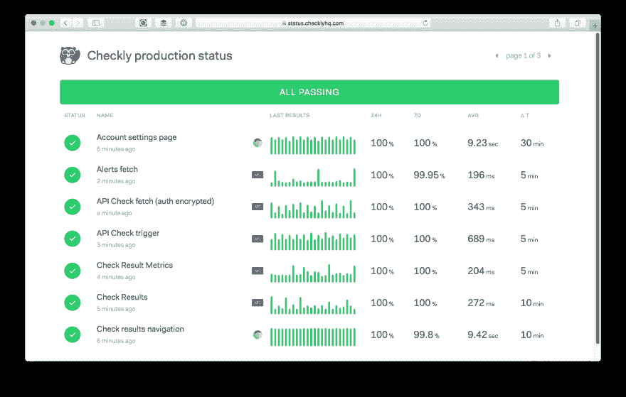
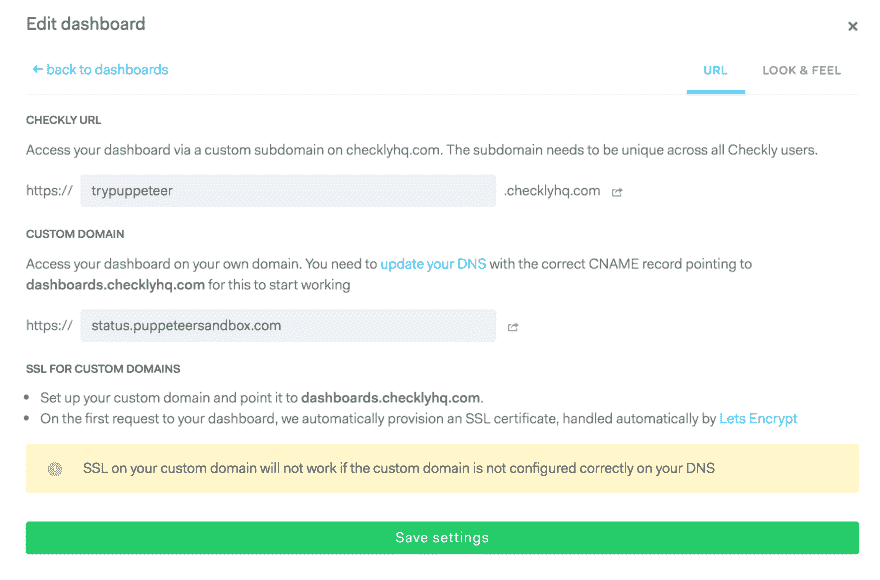

# How I set up SSL with Let's Encrypt for my SaaS customers' dashboards

> 原文：[https://dev.to/checkly/how-i-set-up-ssl-with-let-s-encrypt-for-my-saas-customers-dashboards-58f1](https://dev.to/checkly/how-i-set-up-ssl-with-let-s-encrypt-for-my-saas-customers-dashboards-58f1)

Recently I pushed a long overdue feature for [Checkly](https://checklyhq.com): SSL for customers' public dashboards. This was kinda, sort of, totally missing when I launched and many customers asked for it.

Setting up free SSL turned out to be fairly smooth because of

*   [Let's Encrypt](https://letsencrypt.org/).
*   A great NPM package called [GreenLock](https://git.rootprojects.org/root/greenlock.js).
*   Some DNS stuff on AWS Route 53 and EC2.
*   Some Vue.js router magic.

Most principles explained here are totally transferable to whatever stack you are using. There are some pretty important gotcha's though, so let's dive in.

# The use case

Customers of Checkly can create public dashboards and host them on a custom domain. This way they can show the status of their API endpoints and click flows on a big TV screen or as a status page for their customers, keeping the familiarity of their own domain name.

Here is our own public dashboard: [https://status.checklyhq.com/](https://status.checklyhq.com/)

[](https://res.cloudinary.com/practicaldev/image/fetch/s--DDDTnaar--/c_limit%2Cf_auto%2Cfl_progressive%2Cq_auto%2Cw_880/https://blog.checklyhq.com/conteimg/2019/06/Screen-Shot-2019-06-22-at-19.23.23.png)

Checkly public dashboard
For my customers, I wanted the SSL setup to be as easy as possible.

1.  Customer creates dashboard.
2.  Customer configures their DNS with a CNAME record that points to `dashboards.checklyhq.com`.
3.  Customer hits the configured CNAME and boom 💥 SSL!

This is how we explain it in our docs. Makes sense right? Onwards!

# Integrating Let's Encrypt

Let's Encrypt is incredible. I remember the days of hanging on the phone with Verisign in Geneva to get SSL certificates and forking over $400 for what's basically a string of hard to guess characters. That was shitty. I wish I had invented it 🤑.

Greenlock is also pretty incredible. It's a Node.js Let's Encrypt client that takes care of all the messy bits when interfacing with Let's Encrypt. Its sister project is [GreenLock-Express](https://www.npmjs.com/package/greenlock-express) which as you probably guessed makes Greenlock vanilla easy to use from Express.

I'm not going to regurgitate the Greenlock and Greenlock-Express docs. They are excellent. Just have a look at the full configuration example below. This is almost 100% literally the code we run.

```
const axios = require('axios')
const path = require('path')
const http01 = require('le-challenge-fs').create({ webrootPath: '/tmp/acme-challenges' })

const S3 = { bucketName: 'some-fantastic-private-bucket' }
const store = require('le-store-s3').create({ S3 })

const greenlock = require('greenlock-express').create({
  server: 'https://acme-v02.api.letsencrypt.org/directory',
  version: 'draft-11',
  configDir: path.join(__dirname, 'acme'),
  approveDomains,
  app: require('./app.js'),
  communityMember: true,
  store,
  debug: process.env.NODE_ENV === 'development',
  renewBy: 10 * 24 * 60 * 60 * 1000,
  renewWithin: 14 * 24 * 60 * 60 * 1000
})

function approveDomains (opts, certs, cb) {
  opts.challenges = { 'http-01': http01 }
  opts.email = config.email

  if (certs) {
    opts.domains = [certs.subject].concat(certs.altnames)
  }

  checkDomain(opts.domains, (err, agree) => {
    if (err) { cb(err); return }
    opts.agreeTos = agree
    cb(null, { options: opts, certs: certs })
  })
}

function checkDomain (domains, cb) {
  const userAgrees = true
  if (domains[0]) {
    axios.get('https://your.application.com/check-this-domain/ + domains[0]')
      .then(res => {
        cb(null, userAgrees)
      })
      .catch(err => {
        cb(err)
      })
  } else {
    cb(new Error('No domain found'))
  }
}

greenlock.listen(80, 443) 
```

Ok, so notice the following things:

*   The certificates issued by Let's Encrypt need to be "physically" stored somewhere. You can store them on disk, but what if your server explodes? That's why we use the S3 adapter. Just set up a bucket on AWS S3 and pass it in.

*   Let's Encrypt has a convenient split between `staging` and `production` pass in the right URL before putting this live.

*   The `approveDomains` hook allows you to define a custom function to do whatever you need to approve the domain is eligible for a free SSL certificate.

This is super, super nice as it allows you to put the certificate request process on autopilot. If you're on Nginx, the [lua-resty-auto-ssl](https://github.com/GUI/lua-resty-auto-ssl) project has a very similar thing. [Good write up from the Readme.io people is here](https://blog.readme.io/auto-generating-ssl-certificates-for-custom-domains-using-lets-encrypt/).

For Checkly, I made a simple RPC endpoint in our app that takes a domain name and spits out a `true/false` whether the domain belongs to a paying Checkly customer. I'm not going to show that code here. It is just a simple PostgreSQL query. Easy does it.

The `app.js` file referenced is a dead simple Express app that leverages the proxy middleware to pass your request — via the Greenlock middleware — to its target.

```
const express = require('express')
const proxy = require('http-proxy-middleware')

const app = express()

app.use('/',
  proxy({
    target: 'http://your.application.com/some-endpoint',
    changeOrigin: true
  })
)

module.exports = app 
```

This configuration will take care of issuing and renewing SSL certificates. The `renewBy` and `renewWithin` option control the window for renewals. That's pretty much it.

You know what's nuts? For Checkly's dashboards the target is actually just an S3 bucket with our Vue.js app. Yes, all this hassle for pushing some static Javascript files to a client.

# Deployment & setting up DNS

The above app is a pretty dead simple Node.js app. I wrapped it in a Docker container and set up [PM2](http://pm2.keymetrics.io/) to start the Express server in production mode.

Ok good! Deploy to Heroku and done right?

No. We run our API on Heroku but in this case this doesn't work. Actually none of the PaaS / Container-aaS I looked at can do this. Why? Because almost all of these hosting services already hijack the `Host` header in each HTTP request to determine to which tenant the traffic should go.

This `Host` header is crucial, because it contains the unique token — the domain name — by which the Checkly app can determine what dashboard to serve. We'll look at how that works in the next paragraph.

This means you need to have a "clean" IP address and an EC2 instance or other VM hooked up to that IP. You then run your Greenlock based app on that box and bind it to port 80 and 443\. Now you can point a DNS A record to that IP and receive the traffic directly, without some other vendor's routing solution in between meddling with your headers.

A record pointing to the Let's Encrypt / Greenlock server

[](https://res.cloudinary.com/practicaldev/image/fetch/s--MuUBDDoc--/c_limit%2Cf_auto%2Cfl_progressive%2Cq_auto%2Cw_880/https://blog.checklyhq.com/conteimg/2019/06/image-2.png)

# Resolving the right dashboard with Vue.js

The last bit.

A fully SSL encrypted request for status.example.com is proxied via dashboards.checklyhq.com to our S3 bucket that holds a single page Vue.js app.
The Vue app loads its / route and it determines what component to load. This magic happens in the Vue router.

```
// router.js
{
    path: '/',
    name: 'dashboard',
    component: (function () {
      return isCustomSub(window.location.hostname) ? PubDashboard : Dashboard
    }()),
 } 
```

Determine Vue component in Vue router
The isCustomSub() function is pretty specific to your situation. In our case, we just use a regex to determine what to do.

```
function isCustomSub (host) {
  const reg = new RegExp('app|app-test|www')
  const parts = host.split('.')
  return !reg.test(parts[0])
} 
```

The `PubDashboard` component uses the exact same logic to send an API request to the Checkly backed and fetch whatever is configured for the dashboard associated with that specific hostname. Whenever and wherever hostnames don't match up, or a customer is not on a paid, plan we just serve an error.

# The customer experience

This is what the end result looks like for my customers. They configure the custom domain and once that works, it's done!

[](https://res.cloudinary.com/practicaldev/image/fetch/s--ZbPGhNAK--/c_limit%2Cf_auto%2Cfl_progressive%2Cq_auto%2Cw_880/https://blog.checklyhq.com/conteimg/2019/06/image-1.png)