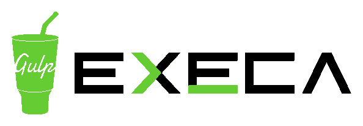

# Gulp.js 人类的命令执行。

> 原文：<https://dev.to/ehmicky/gulp-js-command-execution-for-humans-2idg>

[](https://res.cloudinary.com/practicaldev/image/fetch/s--eAFZH6z7--/c_limit%2Cf_auto%2Cfl_progressive%2Cq_auto%2Cw_880/https://raw.githubusercontent.com/ehmicky/design/master/gulp-execa/gulp-execa.svg%3Fsanitize%3Dtrue)

JavaScript 中的构建自动化变得太复杂了。使用 [Gulp-execa](https://github.com/ehmicky/gulp-execa) ，是时候让它回到按顺序执行的简单终端命令了。

与类似的插件或 [`child_process.exec()`](https://nodejs.org/api/child_process.html#child_process_child_process_exec_command_options_callback) 相反，这里使用的 [`execa`](https://github.com/sindresorhus/execa) 提供:

*   [更好的 Windows 支持](https://github.com/IndigoUnited/node-cross-spawn#why)，包括[shebang](https://en.wikipedia.org/wiki/Shebang_(Unix))
*   更快、更安全的命令，因为默认情况下[不使用外壳](https://github.com/ehmicky/gulp-execa/blob/master/README.md#command)
*   执行[本地安装的二进制文件](https://github.com/ehmicky/gulp-execa/blob/master/docs/API.md#preferlocal)
*   [交错](https://github.com/sindresorhus/execa#all-1) `stdout` / `stderr`

`gulp-execa`为 [`execa`](https://github.com/sindresorhus/execa) 增加了特定于吞咽的功能，包括:

*   一个[任务快捷语法](https://github.com/ehmicky/gulp-execa/blob/master/README.md#taskcommand-options)
*   可配置的[详细度](https://github.com/ehmicky/gulp-execa/blob/master/README.md#echo)
*   [更好的误差](https://github.com/gulpjs/plugin-error)

命令可以直接执行，也可以在[文件流](https://gulpjs.com/docs/en/api/src)中执行。在[流模式](https://github.com/ehmicky/gulp-execa/blob/master/README.md#streamfunction-options)下，与其他库不同:

*   命令并行运行，而不是串行运行
*   输出可以保存在[文件或变量](https://github.com/ehmicky/gulp-execa/blob/master/README.md#result)中

示例`gulpfile.js` :

```
const { src, dest } = require('gulp')
const { task, exec, stream } = require('gulp-execa')

module.exports.audit = task('npm audit')

module.exports.outdated = async () => {
  await exec('npm outdated')
}

module.exports.sort = () =>
  src('*.txt')
    .pipe(stream(({ path }) => `sort ${path}`))
    .pipe(dest('sorted')) 
```

<svg width="20px" height="20px" viewBox="0 0 24 24" class="highlight-action crayons-icon highlight-action--fullscreen-on"><title>Enter fullscreen mode</title></svg> <svg width="20px" height="20px" viewBox="0 0 24 24" class="highlight-action crayons-icon highlight-action--fullscreen-off"><title>Exit fullscreen mode</title></svg>

完整文档可在 [GitHub](https://github.com/ehmicky/gulp-execa) 上获得。