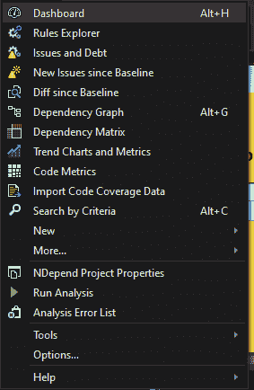
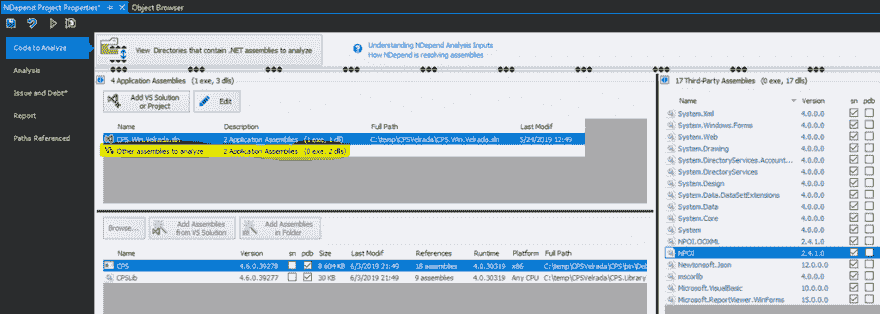
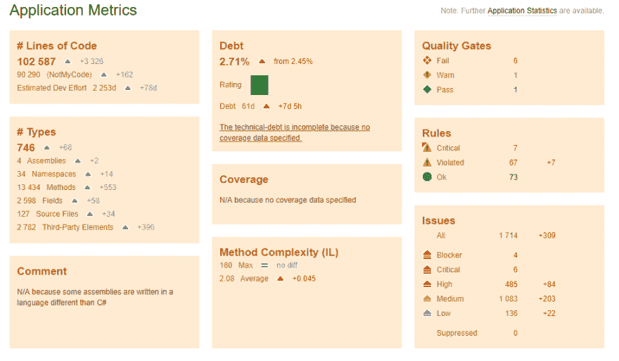
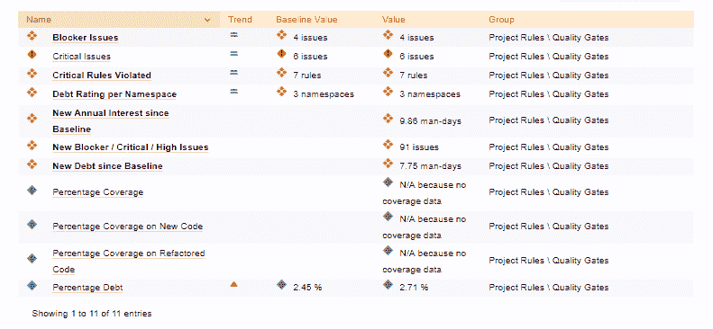
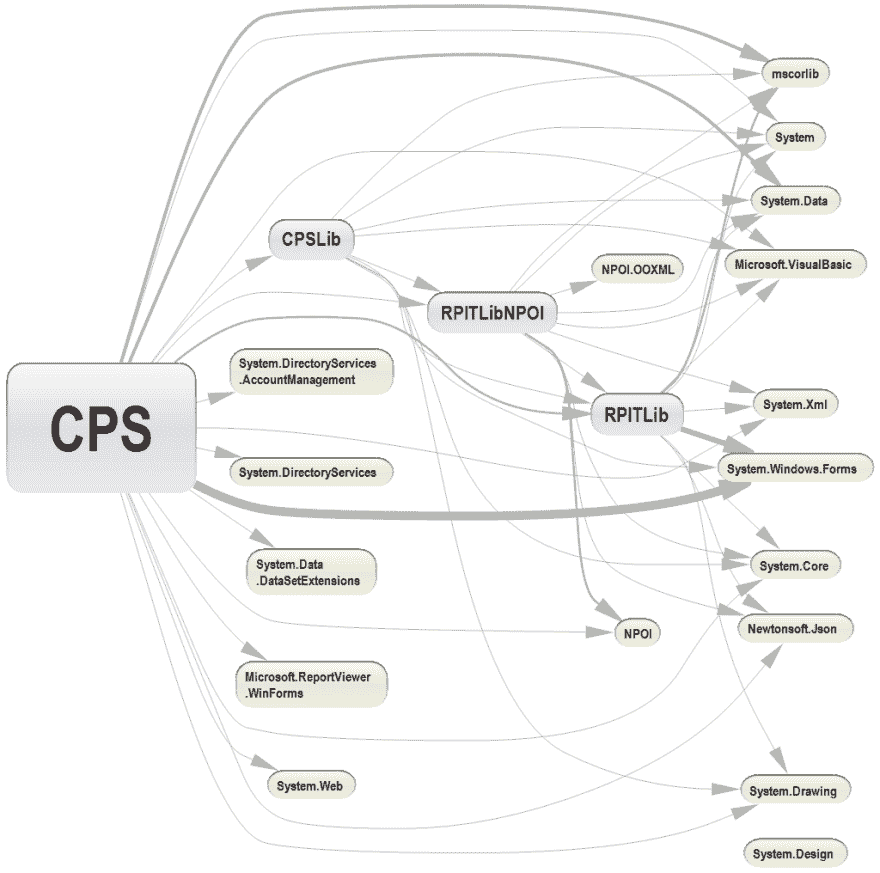
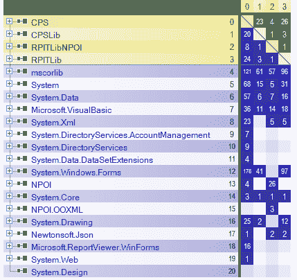
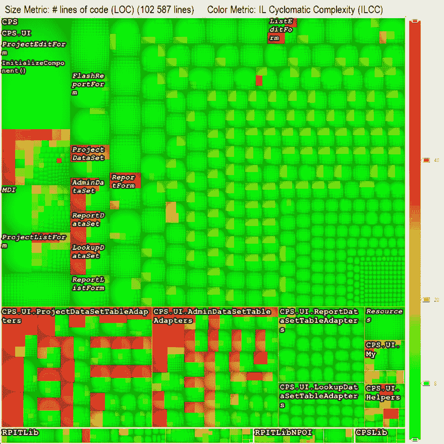
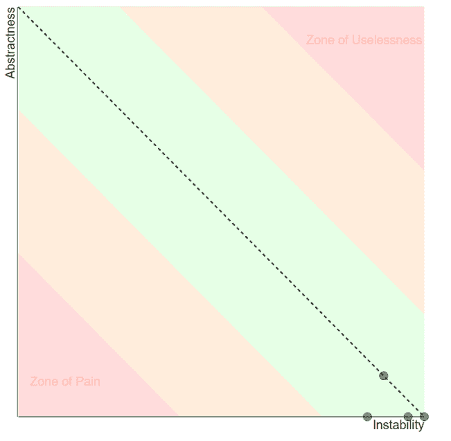

# NDepend code analysis

> 原文：[https://dev.to/chris_mckelt/ndepend-code-analysis-415a](https://dev.to/chris_mckelt/ndepend-code-analysis-415a)

## Intro

Recently I was asked to inspect and old VB.Net Windows Forms & SQL Server application to see determine its future life.  Part of this technical review was analysing the code base and database structure.

To analyse the code base I used [NDepend](https://www.ndepend.com/) a well-known code quality analysis tool that has progressed by [leaps and bounds](https://www.ndepend.com/release-notes) since I last used it on the build server circa 2013 (then version 5).  Now on version [2019.2.4](https://www.ndepend.com/release-notes#V2019_2_4)

## Application Overview

*   .Net 4.6 Windows Forms
*   SQL Server database where most of the logic resides (some in the GUI)

## Setup

After installing NDepend you will get a menu icon in Visual Studio

Next setup the NDepend project for analysis.  Within Visual Studio I select the projects and references I wish to include in the analysis.  I am also able to include 2 extra DLLs that the vendor bundled with the application (but did not provide the source code)

Next tab I setup the Analysis settings and output location.   This will enable NDepend to perform a time-based analysis to see how the solution has progressed/regressed since the last analysis.

## Running the Analysis

The analysis tool may be run and viewed from inside Visual Studio or output as a HTML file (great for the build server report).

### Application Metrics

### Quality Gates

### Dependency Graph

### Dependence Matrix

### Cyclomatic Complexity

**Cyclomatic complexity** is a [software metric](https://en.wikipedia.org/wiki/Software_metric) used to indicate the complexity of a program. It is a quantitative measure of the number of linearly independent paths through a program's [source code](https://en.wikipedia.org/wiki/Source_code). It was developed by [Thomas J. McCabe, Sr.](https://en.wikipedia.org/w/index.php?title=Thomas_J._McCabe,_Sr.&action=edit&redlink=1) in 1976.

Cyclomatic complexity is computed using the [control flow graph](https://en.wikipedia.org/wiki/Control_flow_graph) of the program: the nodes of the [graph](https://en.wikipedia.org/wiki/Graph_(discrete_mathematics)) correspond to indivisible groups of commands of a program, and a [directed](https://en.wikipedia.org/wiki/Directed_graph) edge connects two nodes if the second command might be executed immediately after the first command. Cyclomatic complexity may also be applied to individual [functions](https://en.wikipedia.org/wiki/Function_(computer_science)), [modules](https://en.wikipedia.org/wiki/Modular_programming), [methods](https://en.wikipedia.org/wiki/Method_(computer_science)) or [classes](https://en.wikipedia.org/wiki/Class_(computer_science)) within a program.

KEY AREAS TO REDUCE COMPLEXITY ARE

*   CPS.UI.ProjectDataSetTableAdapters – code that handles retrieving/saving projects
*   CPS.UI.AdminDataSetTableAdapters – code that handles retrieving/saving admin

Ideally remove the use of data sets/adapters as a data access pattern and move to a modern-day best practice solution (entity framework, dapper).

### The Abstractness versus Instability Diagram

The Abstractness versus Instability Diagram helps to detect which assemblies are potentially painful to maintain (i.e concrete and stable) and which assemblies are potentially useless (i.e abstract and instable).

*   Abstractness: If an assembly contains many abstract types (i.e interfaces and abstract classes) and few concrete types, it is considered as abstract.

*   Instability: An assembly is considered stable if its types are used by a lot of types from other assemblies. In this context stable means painful to modify.

Online documentation:

*   [Definitions of related Code Metrics](https://www.ndepend.com/docs/code-metrics#MetricsOnAssemblies)

## Outro

This post is a Work in Progress – stay tuned as I update it over time and determine the best use for NDepend as I have requested changes by the Vendor to fix areas of the code.  NDepend will be the tool I use that helps me guide the vendors code quality.