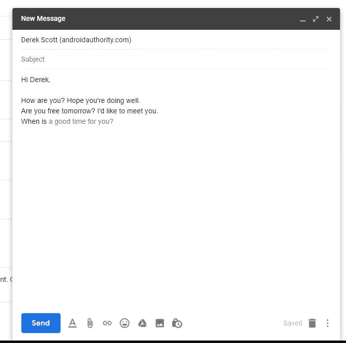

# 生成烹饪食谱，保证食物中毒，与 LSTM 为基础的图书馆

> 原文：<https://dev.to/perigk/generate-cooking-recipes-that-guarantee-food-poisoning-with-lstm-based-libraries-1hpg>

除非你生活在亚马逊森林中，无法访问互联网，否则你几乎不可能没有听说过最近几年深度学习的热潮。

训练神经网络，可以在相对较短的时间内做出决定，区分假图像或生成假视频，正在成为常态。

不过，这并不一定都很可怕。有时候你可以尽情享受那种力量。

作为今天文章的一部分，我们将尝试生成烹饪食谱。但与其他文章相反的是，你不需要看深度学习的 3 本教材，只需要看下面的那一节。

在下一部分中，我们将通过设置 LSTM，使用纯深度学习代码来完成相同的工作。

## LSTM 预言“下一个价值观”

LSTM 是一种软件(特别是神经网络)，它可以学习数据序列(你可能会听到时间序列数据)遵循的模式，从而预测序列的下一个“值”。

你用过 Gmail 吗？你可能已经看过智能作曲，如果你没有看过，这里有一个很好的视觉解释。

[](https://res.cloudinary.com/practicaldev/image/fetch/s--qOQRomrq--/c_limit%2Cf_auto%2Cfl_progressive%2Cq_auto%2Cw_880/https://cdn57.androidauthority.net/wp-content/uploads/2018/05/google-gmail-smart-compose-2.jpg) 
(鸣谢 androidauthority.com)

Gmail 在这里很可能使用了一个 LSTM，它被训练成各种序列。
所以它可以有把握地预测，如果令牌“明天？”足够接近于“什么时候”这个标记，那么最有可能的“下一个标记”集合就是“你有空吗？”

## 构建我们的灵力

在这篇文章中，我们将遵循一个编码者的方法，正如我之前提到的。这意味着你不需要任何 LSTM 的特殊知识或深度学习来做这项工作。

我们将使用一个名为
的大型库

```
textgenrnn 
```

<svg width="20px" height="20px" viewBox="0 0 24 24" class="highlight-action crayons-icon highlight-action--fullscreen-on"><title>Enter fullscreen mode</title></svg> <svg width="20px" height="20px" viewBox="0 0 24 24" class="highlight-action crayons-icon highlight-action--fullscreen-off"><title>Exit fullscreen mode</title></svg>

。接下来的步骤是:

*   设置开发环境
*   以友好的格式准备数据
*   用你的数据打电话给图书馆
*   预测

## 设置环境

首先，我们在一个新文件夹
中创建一个新的 virtualenv

```
virtualenv -p python3 myenv
And we source it
source myenv/bin/activate 
```

<svg width="20px" height="20px" viewBox="0 0 24 24" class="highlight-action crayons-icon highlight-action--fullscreen-on"><title>Enter fullscreen mode</title></svg> <svg width="20px" height="20px" viewBox="0 0 24 24" class="highlight-action crayons-icon highlight-action--fullscreen-off"><title>Exit fullscreen mode</title></svg>

# 我们按照[模块](https://github.com/minimaxir/textgenrnn)的自述文件中的指示安装库

```
pip install tensorflow 
```

<svg width="20px" height="20px" viewBox="0 0 24 24" class="highlight-action crayons-icon highlight-action--fullscreen-on"><title>Enter fullscreen mode</title></svg> <svg width="20px" height="20px" viewBox="0 0 24 24" class="highlight-action crayons-icon highlight-action--fullscreen-off"><title>Exit fullscreen mode</title></svg>

```
pip install textgenrnn 
```

<svg width="20px" height="20px" viewBox="0 0 24 24" class="highlight-action crayons-icon highlight-action--fullscreen-on"><title>Enter fullscreen mode</title></svg> <svg width="20px" height="20px" viewBox="0 0 24 24" class="highlight-action crayons-icon highlight-action--fullscreen-off"><title>Exit fullscreen mode</title></svg>

通过执行
验证一切正常

```
import textgenrnn
Using TensorFlow backend. 
```

<svg width="20px" height="20px" viewBox="0 0 24 24" class="highlight-action crayons-icon highlight-action--fullscreen-on"><title>Enter fullscreen mode</title></svg> <svg width="20px" height="20px" viewBox="0 0 24 24" class="highlight-action crayons-icon highlight-action--fullscreen-off"><title>Exit fullscreen mode</title></svg>

以友好的格式准备数据

浏览一下[datasets][https://github . com/minimax IR/textgenrnn/tree/master/datasets](https://github.com/minimaxir/textgenrnn/tree/master/datasets)文件夹，看起来我们希望每个样本都在最上面。

但是根据文档，它可以在任何文件上训练，所以让我们创建一个食谱 txt 并尝试训练。或者找些现成的。

通过谷歌搜索，我有了这个精彩的页面并下载了 chili 数据集。让我们试着照原样喂它，看看它怎么样。以下是辣椒档案
的节选

```
@@@@@ Now You're Cooking! Export Format 
```

<svg width="20px" height="20px" viewBox="0 0 24 24" class="highlight-action crayons-icon highlight-action--fullscreen-on"><title>Enter fullscreen mode</title></svg> <svg width="20px" height="20px" viewBox="0 0 24 24" class="highlight-action crayons-icon highlight-action--fullscreen-off"><title>Exit fullscreen mode</title></svg>

```
1981 WORLD CHAMP BUTTERFIELD STAGELINE CHILI

meats, chili

4 medium onions, minced
10-pound lean beef brisket, finely ch
1/4 cup oil
1 1/2 cloves garlic; minced 
```

<svg width="20px" height="20px" viewBox="0 0 24 24" class="highlight-action crayons-icon highlight-action--fullscreen-on"><title>Enter fullscreen mode</title></svg> <svg width="20px" height="20px" viewBox="0 0 24 24" class="highlight-action crayons-icon highlight-action--fullscreen-off"><title>Exit fullscreen mode</title></svg>

让我们训练模型:

*   导入库

```
from textgenrnn import textgenrnn 
```

<svg width="20px" height="20px" viewBox="0 0 24 24" class="highlight-action crayons-icon highlight-action--fullscreen-on"><title>Enter fullscreen mode</title></svg> <svg width="20px" height="20px" viewBox="0 0 24 24" class="highlight-action crayons-icon highlight-action--fullscreen-off"><title>Exit fullscreen mode</title></svg>

*   初始化模型

```
textgen = textgenrnn() 
```

<svg width="20px" height="20px" viewBox="0 0 24 24" class="highlight-action crayons-icon highlight-action--fullscreen-on"><title>Enter fullscreen mode</title></svg> <svg width="20px" height="20px" viewBox="0 0 24 24" class="highlight-action crayons-icon highlight-action--fullscreen-off"><title>Exit fullscreen mode</title></svg>

*   通过提供信息开始培训

```
textgen.train_from_file('chili.txt', num_epochs=20) 
```

<svg width="20px" height="20px" viewBox="0 0 24 24" class="highlight-action crayons-icon highlight-action--fullscreen-on"><title>Enter fullscreen mode</title></svg> <svg width="20px" height="20px" viewBox="0 0 24 24" class="highlight-action crayons-icon highlight-action--fullscreen-off"><title>Exit fullscreen mode</title></svg>

## 第一个结果

返回的结果是相当大的下降。但是有些不对劲。例如:
如果我运行

```
textgen.generate() 
```

<svg width="20px" height="20px" viewBox="0 0 24 24" class="highlight-action crayons-icon highlight-action--fullscreen-on"><title>Enter fullscreen mode</title></svg> <svg width="20px" height="20px" viewBox="0 0 24 24" class="highlight-action crayons-icon highlight-action--fullscreen-off"><title>Exit fullscreen mode</title></svg>

我得到

```
simmer for an hour. Originally slightly to cut into ground beef in brown.  Add to the chili powder. Simmer for 1 
```

<svg width="20px" height="20px" viewBox="0 0 24 24" class="highlight-action crayons-icon highlight-action--fullscreen-on"><title>Enter fullscreen mode</title></svg> <svg width="20px" height="20px" viewBox="0 0 24 24" class="highlight-action crayons-icon highlight-action--fullscreen-off"><title>Exit fullscreen mode</title></svg>

这是不可思议的，尤其是如果你认为我们训练的神经网络，对语言规则或言语模式一无所知。

它只理解字符序列-邮件。更多细节，你可以阅读安德烈·卡帕西的这篇精彩文章

因此，我们需要以某种方式改变输入格式。如果我们打开它，我们会看到很多对我们的训练毫无用处的东西。例如，

```
Exported from Now You're Cooking! v5.93 
```

<svg width="20px" height="20px" viewBox="0 0 24 24" class="highlight-action crayons-icon highlight-action--fullscreen-on"><title>Enter fullscreen mode</title></svg> <svg width="20px" height="20px" viewBox="0 0 24 24" class="highlight-action crayons-icon highlight-action--fullscreen-off"><title>Exit fullscreen mode</title></svg>

通过检查库的[示例](https://github.com/minimaxir/textgenrnn/blob/master/datasets/reddit_apple_android_2000.txt),看起来它希望每行有一个训练序列。

我们可以选择手动或使用 python 来清理 chili.txt 文件。或者得到更合适的数据集

## 为我们的训练寻找数据

Kaggle 是实现这些目的的一站式商店。通过挖掘，我发现[这个](https://www.kaggle.com/gjbroughton/christmas-recipes)数据集看起来结构清晰

让我们将数据转换成适合我们需要的格式(每行一个配方)。

以下是我如何做到这一点，并训练网络。请注意，
中的网络要及时接受训练，需要利用 GPU 因为 GPU 非常擅长矩阵乘法，这是神经网络训练的基础。

所以我在 Google collab 中运行了这段代码，不过如果你有一台装有 NVIDIA GPU 的电脑，你也可以在本地运行这段代码。

```
import json
from textgenrnn import textgenrnn

recipes_file = open('./recipes.json')

lines = recipes_file.readlines()

lines = [dict(json.loads(line)) for line in lines]

recipes = []
for line in lines:
  features = []

  description = line['Description']
  ingredients = line['Ingredients']
  method = line['Method']

  for key in [description, ingredients, method]:
    if key != None and len(key) > 0:
      features.append(method)
  recipes.append(features)

recipes_text = [ '.'.join(recipe_list[0]) for recipe_list in recipes]

write_to = open('recipes_text.txt', 'w')
write_to.write('\n'.join(recipes_text))

textgen = textgenrnn()
textgen.train_from_file('recipes_text.txt', num_epochs=20)

for i in range(5):
    textgen.generate() 
```

<svg width="20px" height="20px" viewBox="0 0 24 24" class="highlight-action crayons-icon highlight-action--fullscreen-on"><title>Enter fullscreen mode</title></svg> <svg width="20px" height="20px" viewBox="0 0 24 24" class="highlight-action crayons-icon highlight-action--fullscreen-off"><title>Exit fullscreen mode</title></svg>

## 结果

以前训练过 RNNs/lstm，我对该库返回的结果的质量、它的速度(对于当前数据集，每个时期花费我大约 2 分钟)以及当然的易用性印象深刻。

下面是一个结果:

```
Put the sponge and sugar in a saucepan with the mustard and bake for 15 mins. 
Meanwhile, make the frosted custard and stir to the sugar. 
Stir the chopped chili flakes and stir in the flour, peel and some seasoning. Cook for a further 3 mins until the sugar has dissolved. Add the dressing and top 
```

<svg width="20px" height="20px" viewBox="0 0 24 24" class="highlight-action crayons-icon highlight-action--fullscreen-on"><title>Enter fullscreen mode</title></svg> <svg width="20px" height="20px" viewBox="0 0 24 24" class="highlight-action crayons-icon highlight-action--fullscreen-off"><title>Exit fullscreen mode</title></svg>

正如我上面提到的，这是一个不可思议的结果，因为网络不理解单词甚至单词的意思。它只是学习数据集的字符序列模式！！

即使这是一个可读的段落，你仍然可能食物中毒。如果我吃加糖的海绵，至少我会得到这个。:)

## 有兴趣可以多看看

感谢你阅读这篇文章，我希望你喜欢它。RNNs 和 LSTMs 是复杂的技术，值得对它们进行更多的研究，即使你只是乐于使用这样的库(这很好，你不必只是为了给你的应用程序添加一些智能而成为人工智能专家)。

值得查看的一些资源有:

*   [递归神经网络的不合理有效性](http://karpathy.github.io/2015/05/21/rnn-effectiveness/)
*   [了解 LSTM](https://towardsdatascience.com/understanding-lstm-and-its-quick-implementation-in-keras-for-sentiment-analysis-af410fd85b47)
*   [来自 Brandon Rohrer 的 rnn 和 LSTMs】](https://www.youtube.com/watch?v=WCUNPb-5EYI)
*   [相关斯坦福课程](https://www.youtube.com/watch?v=6niqTuYFZLQ)