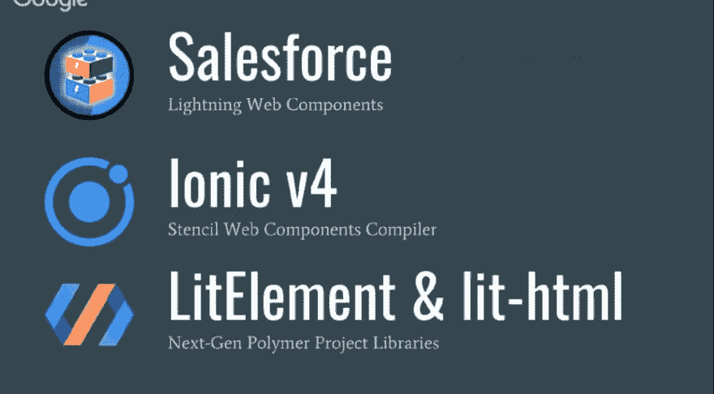
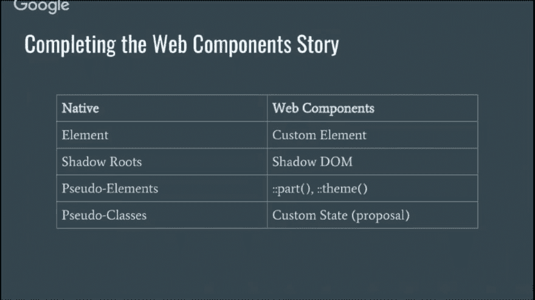

# 这个。JavaScript:框架状态-聚合物/Web 组件更新

> 原文：<https://dev.to/thisdotmedia/this-javascript-state-of-frameworks-polymer-web-components-update-ca3>

由这个主持。JavaScript，这是一个在线活动，开发者可以从中了解 JavaScript、框架和库的最新消息，涵盖了框架领域的所有突发新闻。

[2 月 19 日](https://www.youtube.com/watch?v=DFF9eOlTWzY)，State of Frameworks 的演讲者，包括许多来自开发界的最优秀和最聪明的人，向我们介绍了有关所有框架的最新情况。

以下是在谷歌从事网络组件和聚合物工作的贾斯汀·法格纳尼对[聚合物](https://www.polymer-project.org/)和[网络组件的一些看法。](https://github.com/GoogleWebComponents)

## [贾斯汀·法格纳尼—谷歌的 Polymer.js 贾斯汀·法格纳尼](https://twitter.com/justinfagnani)

## 发布

自从上次更新以来，在聚合物项目和社区的其他地方已经发布了很多版本。

例如，Salesforce 最近发布了他们的 Lightning Web 组件。Salesforce 将其整个客户端 SDK 从自定义框架类型的解决方案转移到纯 Web 组件。

Web Components 已经得到了大量的采用和发展，而 Salesforce 正在朝着更大的目标迈进。Salesforce 在其平台上带来了大约 400 万开发人员，因此这对于 Web 组件的未来是一件大事。

类似地，Ionic 刚刚发布了 Ionic v4，这是对他们所有库和组件的重写，更加与框架无关。Ionic 使用他们自己的模板 Web 组件编译器来创建所有的 Ionic 组件。

最近还发布了 LitElement 和 lit-html 的第一个稳定版本，这是 Polymer group 的下一代库。

## LitElement 和 lit-html

### lit-html

对于那些不熟悉的人来说，lit-html 是一个新的 html 模板引擎。它使用模板文字在 JS 中编写模板。它还可以非常高效地渲染和更新它们，只更新发生变化的部分。Lit-html 也不使用 v-DOM 或做任何区分，这两者通常都需要额外的内存分配开销。

Lit-html 有几个主要的好处。它非常小，如果模块被捆绑、缩小和压缩，只有大约 3.1K。它的速度也非常快，大约相当于 Inferno 运行的时间，有时甚至更快。

Lit-html 写的几乎和纯 ES2017 一样。它以模块的形式分发，所以可以在现代浏览器中使用，根本不需要额外的步骤。到目前为止，反馈非常积极，甚至来自在 Angular 和 React 等其他框架中工作的人。

您可以在语法中看到它的动态和静态部分。不使用 vDOM 或遍历树——而是“记住”动态部分在哪里，并根据需要更新它——节省了大量工作，并增加了引擎的人机工程学。

Lit-html 最近获得了一些新的语法来控制绑定的实现方式。您可以绑定到文本、特性或属性。您还可以使用事件侦听器绑定到任何事件，例如冒泡或捕获事件。

Stacklits 团队一直在开发 lit-html 的模板。这个模板利用了几乎不需要构建的事实。每次击键都可以重新载入整页；因为没有建立，所以基本上是即时的。这意味着热模块加载基本上是可用的，没有通常的缺陷。

### 立项 2.0

LitElement 也是最近发布的，是一个 Web 组件的轻量级基类，在 lit-html 之上只有大约 2 KB。LitElement 使用 lit-html 进行渲染。

它还具有反应性的、声明性的属性，并通过异步呈现管道提供这些属性。

LitElement 使用 shadowDOM 进行造型，看起来很像 React，但没有 JSX，通常使用标准语法。

## 预发布采用

Web 组件最近有几个令人鼓舞的采用公告。特别是，社区注意到企业对现有设计系统的早期采用。SAP、ING、British Gas、Williams Sonoma 等企业已经开始使用 Web 组件。

## 铬 73

Chrome 73 将为 Web 组件提供两大功能。

第一个是可构造的样式表，这个特性允许您创建一次样式表，然后只解析一次。你只需要给它一些 CSS 文本。之后，对于每个想要使用样式表的组件，可以将其添加到该组件的 shadowDOM 中。这只是对单个共享样式表的 JS 引用。

这个特性在一些基准测试中提供了高达 30%的性能提升，使得 Web 组件速度更快。如果修改样式表，修改会立刻影响所有组件，即使它们在封装的 shadowRoots 中。

当这个特性可用时，LitElements 会自动使用它。使用 LitElement 的页面在 Chrome 73 上会更快。

CSS 标签将检测你是否有可构造的样式表，如果有，它将从 CSS 文本中创建一个样式表。如果没有，它将在 ShadowRoot 中注入一个普通样式的标签。

Chrome 73 的另一个将对 Web 组件产生重大影响的新功能是 CSS ShadowParts，或::part()。

ShadowDOM 提供了样式封装。有时，为了设计样式，您希望能够从 ShadowRoot 中显式地公开一些内容。

将这个新的::part()属性添加到 ShadowRoot 内部的元素中。在 ShadowRoot 之外，就像在伪元素中一样，您可以选择一个部分并进行样式更改。对于封装风格世界中的主题化来说，这是一个非常重要的特性。

这些特性将帮助 Web 组件沿着这一进程前进，使开发人员能够做只有平台才能做的事情。Web 组件的故事是关于逐渐向开发人员公开本机特性。将来，自定义伪类将使用自定义状态来完成这个故事。

## 使用情况统计

从统计数据来看，很明显 Web 组件变得更加流行了。Chrome 中近 10%的页面浏览量使用了网络组件。这是近年来推出的最成功的平台功能之一，甚至比网络工作者、网络音频和服务工作者还要成功。几乎每个 web 用户每天浏览 web 时都会使用 Web 组件。

## 接下来是什么？

Lit-html 还不支持 SSR，所以这是未来的工作。Lit-html 最终也将拥有流 SSR，这样 lit-html 的每个静态和动态块都可以在解析时独立地进行流传输。

开发人员也在致力于 lit-html 的增量补液。构建时优化将进一步减少启动时间。

对于 Lit-Element，开发人员正在添加::part()支持，并提供后备支持。其他目标包括降低启动成本和增加 SSR。在 Lit-Element 的队列中还有许多异步助手。

对于本机平台，模板实例化正在向前发展。* theme()，类似于::part()，也将很快实现，以实现更多的样式控制。HTML 模块和 CSS 模块也可能在未来的工作中。

在甲板上还与 polyfills 合作，使他们更容易使用和透明地实施更准确的规格。这是采用 Web 组件的主要障碍之一，因此这将是今后的重中之重。

需要 JavaScript 咨询、指导或培训帮助吗？在 [This Dot Labs](//thisdot.co) 查看我们的服务列表。