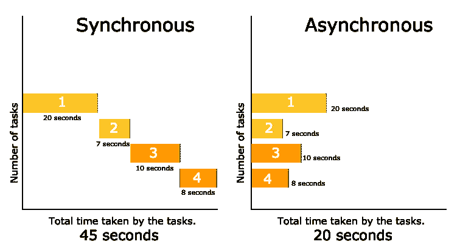

# 关于同步和异步代码，每个程序员都应该知道什么

> 原文：<https://dev.to/amejiarosario/what-every-programmer-should-know-about-synchronous-vs-asynchronous-code-1g78>

在编程语言中，有多种处理并发性的方法。一些语言使用各种线程，而另一些使用异步模型。我们将详细探讨后者，并提供例子来区分同步和异步。Btw，你觉得你的 CPU 大部分时间在做什么？

有用吗？没有。很闲！

计算机的处理器等待网络请求发出。它会让硬盘空闲，以输出请求的数据，并暂停以处理外部事件(I/O)。

请看下图，了解该系统事件的平均时间(以纳秒为单位)

[](https://res.cloudinary.com/practicaldev/image/fetch/s--vOJx-kG8--/c_limit%2Cf_auto%2Cfl_progressive%2Cq_auto%2Cw_880/https://adrianmejia.cimg/Latency-vs-System-Event.png)

正如你在上面的图表中所看到的，一个 CPU 可以每一纳秒执行一条指令。).然而，如果你在纽约，你向旧金山的一个网站发出请求，CPU 将会“浪费”1.57 亿个周期等待它的回复！

但不是一切都没了！如果您在程序中使用非阻塞(异步)代码，您可以利用这段时间来执行其他任务！这正是你在这篇文章中学到的东西。

**⚠️注**:你的操作系统上的大多数程序都是非阻塞的，因此一个 CPU 可以在等待其他 CPU 完成的同时执行许多任务。此外，现代处理器拥有多个内核来提高并行性。

# node . js 中的同步与异步

让我们看看如何开发非阻塞代码，最大限度地提高性能。同步代码也被称为“阻塞”，因为它会暂停程序，直到所有的资源都可用。然而，异步代码也被称为“非阻塞的”，因为程序继续执行，不等待外部资源(I/O)可用。

> 💡在计算中，输入/输出或`I/O`(或`io`或`IO`)是程序与外界(文件系统、数据库、网络请求等)之间的通信。

我们将比较使用阻塞 I/O 模型和使用非阻塞 I/O 模型读取文件的两种不同方式。

首先，考虑下面的阻塞代码。

## 读取 Node.js 中文件的同步代码

```
const fs = require('fs');

console.log('start');

const data = fs.readFileSync('./file.txt', 'utf-8'); // blocks here until file is read
console.log('data: ', data.trim());

console.log('end'); 
```

Enter fullscreen mode Exit fullscreen mode

这个程序的输出是多少？

我们使用节点的`readFileSync`。

> `Sync` =同步=阻塞 I/O 模式
> 
> `Async` =异步=非阻塞 I/O 模式

这意味着该程序将等待大约 2300 万个 CPU 周期，让你的硬盘返回`file.txt`的内容，也就是原始消息`Hello World!`。

输出将是:

```
start
data:  Hello World! 👋 🌍
end 
```

Enter fullscreen mode Exit fullscreen mode

**怎样才能让这段代码无阻塞？**

很高兴你问了。幸运的是，默认情况下，大多数 Node.js 函数都是非阻塞的(异步的)。

实际上，Ryan Dahl 创建 Node 是因为他对 Apache HTTP 服务器的局限性不满意。Apache 为每个消耗更多资源的连接创建一个线程。另一方面，Node.js 结合了 JavaScript 引擎、事件循环和 I/O 层来高效地处理多个请求。

[](https://res.cloudinary.com/practicaldev/image/fetch/s--N3hm8ko---/c_limit%2Cf_auto%2Cfl_progressive%2Cq_auto%2Cw_880/https://adrianmejia.cimg/blocking-vs-non-blocking-api.png)

正如您所看到的，异步函数在等待 IO 资源准备就绪时可以处理更多的操作。

让我们看一个使用异步代码读取文件的例子。

## 读取 Node.js 中文件的异步代码

我们可以像这样从文件中读取而不阻塞其余的代码:

```
const fs = require('fs');

console.log('start');

fs.readFile('./file.txt', 'utf-8', (err, data) => {
  if (err) throw err;
  console.log('file.txt data: ', data.trim());
});

console.log('end'); 
```

Enter fullscreen mode Exit fullscreen mode

这个程序的输出是多少？

见答案

```
start
end
file.txt data:  Hello World! 👋 🌍 
```

Enter fullscreen mode Exit fullscreen mode

许多人对`start`和`end`出现在`data`输出之前的事实感到惊讶。👀

`end`出现在文件输出之前，因为程序不会暂停并继续执行下一步。

这很酷，但是这有很大的区别吗？是的，让我们把文件放大，然后计时！

## 阻塞与非阻塞 I/O 模型基准测试

对于这个基准，我们来读一个大文件。我只是去我的下载，并采取了最重的。(你可以在家试试这个实验，评论你的结果)

```
const fs = require('fs');

console.time('readFileSync');

for (let x = 0; x < 10; x++) {
  const largeFile = fs.readFileSync('/users/admejiar/Downloads/Docker.dmg');
  console.log(`File size#${x}: ${Math.round(largeFile.length / 1e6)} MB`);
}

const data = fs.readFileSync('./file.txt', 'utf-8'); // blocks here until file is read
console.log('file.txt data: ', data.trim());

console.timeEnd('readFileSync'); 
```

Enter fullscreen mode Exit fullscreen mode

请注意，我们使用的是`console.time`,这对于基准测试来说非常好，因为它计算了花费的毫秒数。输出如下所示:

```
File size#0: 523 MB
File size#1: 523 MB
File size#2: 523 MB
File size#3: 523 MB
File size#4: 523 MB
File size#5: 523 MB
File size#6: 523 MB
File size#7: 523 MB
File size#8: 523 MB
File size#9: 523 MB
file.txt data:  Hello World! 👋 🌍
readFileSync: 2572.060ms 
```

Enter fullscreen mode Exit fullscreen mode

读取所有十个文件和`file.txt`花费了 2.5 秒。

现在让我们用无阻塞来试试同样的方法:

```
const fs = require('fs');

console.time('readFile');

for (let x = 0; x < 10; x++) {
  fs.readFile('/users/admejiar/Downloads/Docker.dmg', (err, data) => {
    if (err) throw err;
    console.log(`File size#${x}: ${Math.round(data.length / 1e6)} MB`);
  });
}

fs.readFile('./file.txt', 'utf-8', (err, data) => {
  if (err) throw err;
  console.log('file.txt data: ', data.trim());
});

console.timeEnd('readFile'); 
```

Enter fullscreen mode Exit fullscreen mode

这是输出结果:

```
readFile: 0.731ms
file.txt data:  Hello World! 👋 🌍
File size#7: 523 MB
File size#9: 523 MB
File size#4: 523 MB
File size#2: 523 MB
File size#6: 523 MB
File size#5: 523 MB
File size#1: 523 MB
File size#8: 523 MB
File size#0: 523 MB
File size#3: 523 MB 
```

Enter fullscreen mode Exit fullscreen mode

哇！完全随机！🤯

不到一毫秒就到了`console.timeEnd`！小的`file.txt`随后出现，然后大文件以不同的顺序出现。如你所见，非阻塞不等人。谁准备好了，谁就先出来。尽管它不是确定性的，但它有许多优点。

对异步代码进行基准测试并不简单，因为我们必须等待所有操作完成(而`console.timeEnd`并没有这么做)。当我们覆盖`Promise` s 时，我们将提供一个更好的基准。

看看这张照片:

[](https://res.cloudinary.com/practicaldev/image/fetch/s--si-PUEP6--/c_limit%2Cf_auto%2Cfl_progressive%2Cq_auto%2Cw_880/https://adrianmejia.cimg/synchronous-asynchronous-javascript.png)

异步程序将花费与最耗时的任务一样长的时间。它并行执行任务，而阻塞模型按顺序执行。

# 非阻塞码的优点

非阻塞代码的性能更高。阻塞代码会浪费大约 90%的 CPU 周期来等待网络或磁盘获取数据。使用非阻塞代码是一种更直接的方式，无需处理多个执行线程就能实现并发。

例如，假设您有一个 API 服务器。在下图中，您可以看到与使用阻塞代码相比，使用非阻塞代码可以多处理多少请求。

[](https://res.cloudinary.com/practicaldev/image/fetch/s--N3hm8ko---/c_limit%2Cf_auto%2Cfl_progressive%2Cq_auto%2Cw_880/https://adrianmejia.cimg/blocking-vs-non-blocking-api.png)

正如您前面看到的，阻塞 API 服务器一次处理一个请求。它服务于请求#1，它对数据库空闲，然后可以自由地服务于其他请求。然而，非阻塞 API 在等待数据库返回时可以接受多个请求。

既然你已经(希望)相信了为什么编写非阻塞代码是必要的，那么让我们看看可以管理它的不同方法。到目前为止，我们使用回调，但也有其他方法来处理它。

在 JavaScript 中，我们可以使用以下方式处理异步代码:

*   回收
*   承诺
*   异步/等待功能
*   发电机

我将在另一篇文章中逐一介绍。敬请关注！