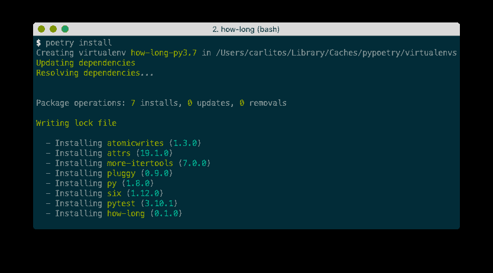
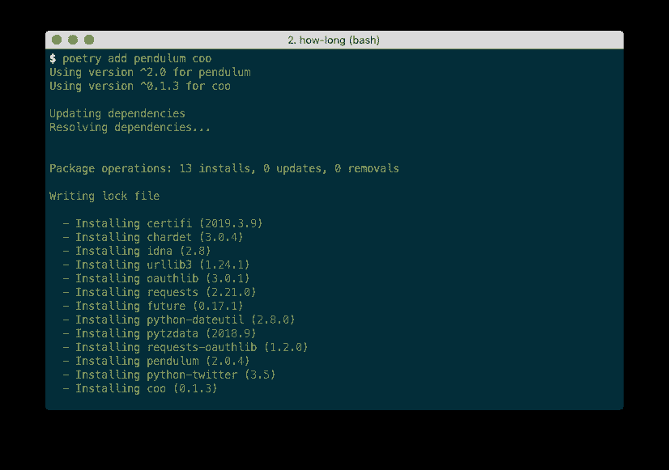
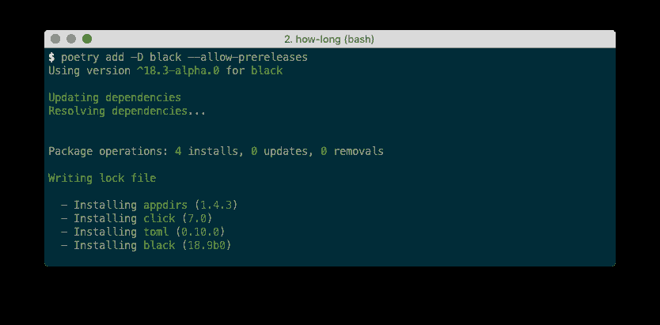

# 使用诗歌和 VSCode 的 Python 项目。第一部分

> 原文：<https://dev.to/wilfredinni/https-pythoncheatsheet-org-blog-python-projects-with-poetry-and-vscode-part-1-3pm5>

> 更新:
> 
> *   18-05-2019:装诗。

虚拟环境是一个独立的 Python 安装，旨在避免用我们可能只用于一个项目的库来填充我们的基础环境。它还允许我们在不同的项目中管理同一个包的多个版本。例如，我们可能需要一个 Django 2.2，另一个需要 1.9。

另一方面，诗歌:

> `poetry`是一个处理依赖项安装以及构建和打包 Python 包的工具。它只需要一个文件来完成所有这些:新的，[标准化的](https://www.python.org/dev/peps/pep-0518/) `pyproject.toml`。
> 
> 换句话说，诗用`pyproject.toml`代替了`setup.py`、`requirements.txt`、`setup.cfg`、`MANIFEST.in`和新加的`Pipfile`。

在这一系列文章中，我们将使用[诗歌](https://poetry.eustace.io/)来管理我们的依赖关系，构建一个简单的项目，并通过一个命令将其发布在 [PyPI](https://pypi.org/) 上。

在第一部分中，我们将:

*   开始一个新项目。
*   创建一个虚拟环境。
*   管理依赖关系。

在第二部分中，我们将:

*   将我们的虚拟环境添加到 [VSCode](https://code.visualstudio.com/) 中。
*   将我们的开发依赖项与编辑器集成。
    *   *薄片 8*
    *   *黑色*
    *   *Pytest*

最后，在第三部分[中，我们将:](https://www.pythoncheatsheet.org/blog/python-projects-with-poetry-and-vscode-part-3)

*   写一个样本库。
*   用*诗歌*构建我们的项目。
*   发布在 *PyPI* 上。

## 装诗

最简单的方法是使用 *pip* :

```
$ pip install poetry 
```

Enter fullscreen mode Exit fullscreen mode

但是我们将使用 poems 自己的安装程序，通过出售它的依赖项，将它与系统的其余部分隔离开来。这是推荐的诗歌安装方式:

```
$ curl -SSL https://raw.githubusercontent.com/sdispater/poetry/master/get-poetry.py | python 
```

Enter fullscreen mode Exit fullscreen mode

如果以这种方式安装，您以后可以使用`poetry self:update`命令将 poems 更新到最新的稳定版本。

## 开始一个新项目

我们现在可以使用`poetry new [project_name]`命令启动一个新的 Python 项目。我将称它为 ***多长时间*** ，这是一个非常简单的用来测量函数执行时间的库:

```
$ poetry new how-long 
```

Enter fullscreen mode Exit fullscreen mode

> 注意:对于现有的项目，您可以使用`poetry init`命令并交互地创建一个 *pyproject.toml* 。

目录*多久*被创建，里面是一个基本的项目结构:

```
how-long
├── README.rst
├── how_long
│   └── __init__.py
├── pyproject.toml
└── tests
    ├── __init__.py
    └── test_how_long.py 
```

Enter fullscreen mode Exit fullscreen mode

> 注意:为了能够发布您的项目，您需要一个可用的名称。为此，请使用 [PyPI](https://pypi.org/) 搜索工具。

### py project . toml 文件

文件 **pyproject.toml** 将管理项目的细节和依赖关系:

```
[tool.poetry]
name = "how-long"
version = "0.1.0"
description = "A simple decorator to measure a function execution time."
authors = ["wilfredinni <carlos.w.montecinos@gmail.com>"]

[tool.poetry.dependencies]
python = "^3.7"

[tool.poetry.dev-dependencies]
pytest = "^3.0"

[build-system]
requires = ["poetry>=0.12"]
build-backend = "poetry.masonry.api" 
```

Enter fullscreen mode Exit fullscreen mode

#### 【工具.诗歌】

细节。添加一个[许可](https://poetry.eustace.io/docs/pyproject/#license)和一个[自述](https://poetry.eustace.io/docs/pyproject/#readme)可能是个好主意:

```
[tool.poetry]
...
license = "MIT"
readme = "README.rst" 
```

Enter fullscreen mode Exit fullscreen mode

#### 【tool . poem . dependencies】

首先是 Python 版本。基本上，这个项目将与 Python 3.7 和更高版本兼容。另外，从现在开始，我们安装的每个要在生产中使用的包都会在这里列出。

#### 【tool . poem . dev-dependencies】

这些包仅用于开发，在我们发布项目时不会包含在内。默认情况下，poem 包含 [Pytest](https://docs.pytest.org/en/latest/) ，因此我们稍后将使用它来测试我们的项目。

## 创建虚拟环境

现在，让我们创建一个虚拟环境，用`poetry install`命令:
安装 *Pytest*

```
$ poetry install 
```

Enter fullscreen mode Exit fullscreen mode

[](https://res.cloudinary.com/practicaldev/image/fetch/s--qe04Lx7r--/c_limit%2Cf_auto%2Cfl_progressive%2Cq_auto%2Cw_880/https://raw.githubusercontent.com/wilfredinni/pysheetComments/master/2019/April/poetry_vscode_p1/poetry-install.png)

完成后，将创建一个新文件`poetry.lock`。

> 当 poems 完成安装后，它会将下载的所有包及其确切版本写入 poetry.lock 文件，将项目锁定到这些特定版本。您应该将 poetry.lock 文件提交到您的项目 repo 中，以便所有参与该项目的人员都锁定到相同版本的依赖项。

## 依赖关系管理

添加或删除依赖项的一种方法是直接编辑 *pyproject.toml* ，然后运行`poetry install`来应用更改。我们将使用`add`和`remove`命令来避免手动修改。

### 添加依赖关系

让我们给项目添加两个包，*钟摆*和 *coo* :

```
$ poetry add pendulum coo 
```

Enter fullscreen mode Exit fullscreen mode

[](https://res.cloudinary.com/practicaldev/image/fetch/s--ms3NrN_u--/c_limit%2Cf_auto%2Cfl_progressive%2Cq_auto%2Cw_880/https://raw.githubusercontent.com/wilfredinni/pysheetComments/master/2019/April/poetry_vscode_p1/poetry-add.png)

打开 *pyproject.toml* 和*poem . lock*看看他们更新的怎么样了。

### 添加开发依赖关系

这些依赖项仅在开发期间可用，当构建和发布项目时，poems 不会包含它们。

我们已经安装了 *Pytest* ，但是我们还将使用 [flake8](http://flake8.pycqa.org/en/latest/) 用于林挺，使用 [mypy](http://mypy-lang.org/) 用于静态类型:

```
$ poetry add -D flake8 mypy 
```

Enter fullscreen mode Exit fullscreen mode

现在想起来，忘了加格式化程序了。我们选黑色的 :

```
$ poetry add -D black
[ValueError]
Could not find a matching version of package black

add [-D|--dev] [--git GIT] [--path PATH] [-E|--extras EXTRAS] [--optional] [--python PYTHON] [--platform PLATFORM] [--allow-prereleases] [--dry-run] [--] <name> (<name>)... 
```

Enter fullscreen mode Exit fullscreen mode

出现这个错误是因为*黑*处于预发布状态，所以诗诗找不到任何稳定的版本给我们。但是我真的很想要它，所以让我们使用`--allow-prereleases`标志:
安装它

```
$ poetry add -D black --allow-prereleases 
```

Enter fullscreen mode Exit fullscreen mode

[](https://res.cloudinary.com/practicaldev/image/fetch/s--INScYiZz--/c_limit%2Cf_auto%2Cfl_progressive%2Cq_auto%2Cw_880/https://raw.githubusercontent.com/wilfredinni/pysheetComments/master/2019/April/poetry_vscode_p1/poetry-add-dev.png)

### 移除依赖关系

你知道吗，我改变主意了，这个项目将使用既不 *coo* 也不 *mypy* 。首先移除 *coo* ，我们项目的一个正常依赖:

```
$ poetry remove coo 
```

Enter fullscreen mode Exit fullscreen mode

现在 *mypy* 是一个开发依赖:

```
$ poetry remove -D mypy 
```

Enter fullscreen mode Exit fullscreen mode

## 结论

在第一部分中，我们启动了一个新项目，创建了一个虚拟环境，并使用以下命令添加和删除了依赖项:

| 命令 | 描述 |
| --- | --- |
| `poetry new [package-name]` | 开始一个新的 Python 项目。 |
| `poetry init` | 交互式创建一个 *pyproject.toml* 文件。 |
| `poetry install` | 在 *pyproject.toml* 文件中安装软件包。 |
| `poetry add [package-name]` | 将包添加到虚拟环境中。 |
| `poetry add -D [package-name]` | 向虚拟环境添加开发包。 |
| `poetry remove [package-name]` | 从虚拟环境中删除包。 |
| `poetry remove -D [package-name]` | 从虚拟环境中删除开发包。 |
| `poetry self:update` | 将诗歌更新到最新的稳定版本。 |

在[第二部分](https://www.pythoncheatsheet.org/blog/python-projects-with-poetry-and-vscode-part-2)中，我们将看到更多的*诗歌*命令，将我们的虚拟环境添加到 *VSCode* 中，并使用我们安装的开发包在编辑器中对 lint (Flake8)、format (Black)和 test (Pytest)我们的代码进行格式化。最后，在第三个例子中，我们将编写一个样本库并发布到 *PyPI* 。

有任何疑问或建议吗？请留言评论。