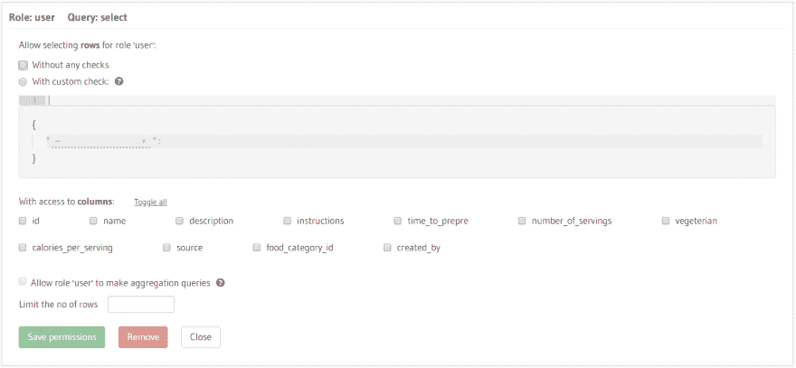
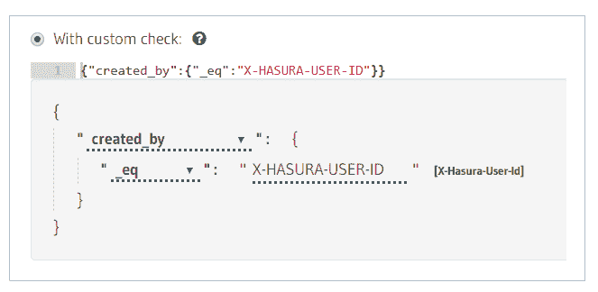
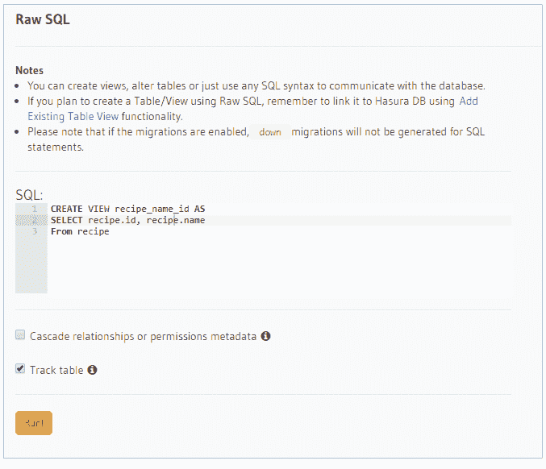

# Hasura，云中的 GraphQL 后端——第 2 部分

> 原文：<https://dev.to/thisdotmedia/hasura-graphql-backend-in-the-cloud-part-2-3a6g>

在第一部分中，向您介绍了 Hasura GraphQL 引擎，并展示了如何在 Heroku 上部署和使用 Hasura。

在这一部分中，我们将继续我们停下来的地方，继续探索 Hasura 为标准 GraphQL 查询和变异提供的扩展。在这一部分的最后，我们将为第三部分打下基础，并了解更多关于 Hasura 授权和动态访问控制的知识。

到目前为止，您已经了解了 Hasura 如何从 Postgres 模式模型自动生成查询和 GraphQL 模式的变化。此外，它还会生成一系列可用的查询。例如，根据表的主键，它生成一个查询字段，该字段接受一个 ID 并基于该 ID 输入参数返回一个对象。此外，Hausra 检测数据库表之间的关系，并将它们分别生成为嵌套对象。

Hasura 自动生成的 recipe 查询字段如下所示。其余的查询和变异字段可以在 Heroku 上部署的 Hasura app 上查看。

```
recipe(limit: Int offset: Int order_by: [recipe_order_by!] where: recipe_bool_exp): [recipe!]!
fetch data from the table: "recipe" 
```

配方突变字段也是自动生成的，其结果也如下所示。可以在 Heroku 上部署的 Hasura app 上查看 Hasura 创建的对象类型的详细信息。

```
insert_recipe(objects: [recipe_insert_input!]! on_conflict: recipe_on_conflict): recipe_mutation_response
insert data into the table: "recipe" 
```

## GraphQL 突变

我们将探索一些变化来展示 Hasura 添加到 GraphQL 标准语言中的不同扩展。

## 插入单个记录

让我们开始插入一个新的成分:

```
mutation insertSaltIngredient {
  insert_ingredient(objects: [{name: "Salt"}]) {
    returning {
      name
    }
  }
} 
```

Hasura 添加了 **objects** 类型，可以保存单个或多个数据记录以供插入。

上面的突变创建了**盐**成分，并返回新插入成分的名称。

```
{
  "data": {
    "insert_ingredient": {
      "returning": [
        {
          "name": "Salt"
        }
      ]
    }
  }
} 
```

## 插入批量记录，

要批量插入配料记录，您可以将**对象**类型中的多个数据记录传递给变异**插入配料** :

```
mutation insertIngredients {
  insert_ingredient(objects: [{name: "White sugar"}, {name: "Garlic"}]) {
    returning {
      name
    }
  }
} 
```

## 一次插入一条带有嵌套对象记录的记录

您可以一次插入一条新记录和一个嵌套对象。例如，我可以编写一个变异，在单个变异中插入一个新的标签为 Pizza 的 **recipe** 对象和一个嵌套对象，类型为 **recipe_ingredients，**。

这里假设数据库中已经存在**成分**对象。

```
mutation insertRecipe {
  insert_recipe(objects: [{name: "Pizza", description: "Preparing a lovely Margartia Pizza", vegeterian: true, recipe_ingredients: {data: [{ingredient_id: 3, quantity: 2, comments: "Medium tomatoes"}]}}]) {
    returning {
      name
    }
  }
} 
```

通过一个简单的变异，您可以在**食谱**表中插入一条新记录，同时在多对多关系表中插入一条记录，即**食谱 _ 配料**。

如果您在 recipe_ingredient 中插入的配料在数据库中不存在，Hasura GraphQL mutations 允许您插入一个新的**配方**，以及一个新的**配方 _ 配料**和一个新的**配料**，所有这些都在同一个查询中一次性完成，完全由 Hasura 处理！

检查下面的突变:

```
mutation insertRecipe {
  insert_recipe(objects: [{name: "Pizza", description: "Preparing a lovely Margartia Pizza", vegeterian: true, recipe_ingredients: {data: [{ingredient: {data: {name: "Tomato"}}, quantity: 2, comments: "Medium tomatoes"}]}}]) {
    returning {
      name
    }
  }
} 
```

这种变化是插入一个新的比萨饼食谱和一个新的番茄配料，最后插入两个对象之间的关系记录作为一个新的 recipe_ingredient 对象关系。

## 用 GraphQL 在 Postgres 数据库中增加一条记录

在数据库中向上插入记录就是执行一个单独的突变语句，这样，当记录已经存在于数据库中时，它就会被更新。而如果数据库中不存在该记录，则会创建该记录。upsert 操作是基于我们接下来将讨论的约束的。

让我们探索一下 Hasura 是如何将表**的成分**转换成包含所有相关对象类型的 GraphQL 突变语句的。

```
insert_ingredient(objects: [ingredient_insert_input!]!on_conflict: ingredient_on_conflict): ingredient_mutation_response
insert data into the table: "ingredient" 
```

**insert_ingredient** 变异接受**对象**和 **on_conflict** 输入参数。我们已经看到了如何使用**对象**参数来传递要插入到数据库中的实际数据。 **on_conflict** 参数主要用于将 insert 语句升级为 **upsert** 语句，以帮助 Hasura 在插入的数据存在冲突时做出决定。

**成分冲突**对象被定义为具有以下属性的对象:

```
constraint: ingredient_constraint!
update_columns: [ingredient_column!] 
```

**配料 _ 约束**对象被定义为配料:
表主键的约束

```
Ingredient_pkey
unique or primary key constraint 
```

当一种新的配料被插入数据库时:

在**约束**属性中定义的约束发生冲突:在这种情况下，**成分 _ 约束**。这意味着我们试图插入一个新记录，它的主键 ID 已经存在于数据库表中。

Hasura 检查了 **update_columns** 属性。

如果在**成分约束**中省略了 **update_columns** 属性，它将使用包含在**对象**参数中的所有列来更新表中的记录。

```
mutation insertSaltIngredient {
  insert_ingredient(objects: [{id: 2, name: "Eggs"}], on_conflict: {constraint: ingredient_pkey}) {
    returning {
      id
      name
    }
  }
} 
```

如果该属性存在，Hasura 将执行一个更新操作，只更新那些列在 **update_columns** 数组中的列。

```
mutation insertSaltIngredient {
  insert_ingredient(objects: [{id: 2, name: "Eggs"}], on_conflict: {constraint: ingredient_pkey, update_columns: [name]}) {
    returning {
      id
      name
    }
  }
} 
```

另一方面，如果 **update_columns** 属性存在并且被设置为空数组的值，则插入操作被忽略。

```
mutation insertSaltIngredient {
  insert_ingredient(objects: [{id: 2, name: "Eggs"}], on_conflict: {constraint: ingredient_pkey, update_columns: []}) {
    returning {
      id
      name
    }
  }
} 
```

## 使用 where 运算符更新记录

Hasura 提供了 **where** 操作符来过滤掉变异中要更新的记录。下面的突变用 **id = 2** 更新配料记录，并将其名称设置为 Eggs。

```
mutation {
  update_ingredient(where: {id: {_eq: 2}}, _set: {name: "Eggs"}) {
    returning {
      id
      name
    }
  }
} 
```

## 使用嵌套对象属性上的 where 运算符更新记录

更新变异也可用于更新由嵌套对象属性之一的属性过滤的记录。

```
mutation {
  update_recipe(where: {food_category: {id: {_eq: 2}}}, _set: {name: "Update based on food_category"}) {
    returning {
      id
      name
      food_category_id
    }
  }
} 
```

上面的变异遍历数据库中的所有食谱记录，并将它们的名称列值更新为“基于 food_category 更新”,其中 food_category 的 **id = 2。**而结果是:

```
{
  "data": {
    "update_recipe": {
      "returning": [
        {
          "id": 4,
          "name": "Update based on food_category",
          "food_category_id": 2
        },
        {
          "id": 5,
          "name": "Update based on food_category",
          "food_category_id": 2
        }
      ]
    }
  }
} 
```

## 更新 jsonb 类型的记录属性

Hasura 支持在 Postgres 中使用类型为 [jsonb 的列更新记录。你可以通过下面的链接阅读更多关于这个主题的内容:](https://www.compose.com/articles/faster-operations-with-the-jsonb-data-type-in-postgresql/)[使用 Jsob 操作符](https://docs.hasura.io/1.0/graphql/manual/mutations/update.html#using-jsonb-operators)。

## 使用 where 运算符删除记录

要删除 Hasura 中的记录，您可以执行删除突变，并对要删除的记录进行过滤:

```
mutation {
  delete_recipe(where: {name: {_like: "%za%"}}) {
    returning {
      id
      name
    }
  }
} 
```

上面的变异删除了名称以 **za** 结尾的配方。

## 使用嵌套对象属性上的 where 运算符删除记录

您也可以删除通过嵌套对象属性过滤的记录，如下所示:

```
mutation {
  delete_recipe(where: {food_category: {name: {_eq: "Desserts"}}}) {
    returning {
      id
      name
    }
  }
} 
```

上面的突变删除了一个 food_category 名为“Desserts”的食谱记录。

## 图形 SQL 愿望

现在我们已经在 Postgres 数据库中建立了一些数据，让我们来探索查询以及 Hasura 在这方面提供了什么。

## 简单查询

让我们首先编写一个简单的查询来检索数据库中的所有食谱，并只返回每个食谱的 id 和名字 T2:

```
query getAllRecipes {
  recipe {
    id
    name
  }
} 
```

上面的查询返回以下响应:

```
{
  "data": {
    "recipe": [
    {
        "id": 1,
        "name": "Hamburger Steak with Onions and Gravy"
    },
    {
        "id": 2,
        "name": "Butter!"
    }
    ]
  }
} 
```

## 查询一条记录，返回嵌套的对象字段(对象关系)

典型的 GraphQL 查询是搜索记录，并从对象关系中的嵌套对象返回数据。

```
query getAllRecipes {
  recipe(where: {id: {_eq: 1}}) {
    id
    name
    food_category {
      id
      name
    }
  }
} 
```

该查询针对一个 **id = 1** 的食谱，并返回该食谱的 id 和名称以及 food_category 的 id 和名称。

```
{
  "data": {
    "recipe": [
      {
        "id": 1,
        "name": "Hamburger Steak with Onions and Gravy",
        "food_category": {
          "id": 5,
          "name": "BBQ and Grilled Beef"
        }
      }
    ]
  }
} 
```

## 查询一条记录并返回嵌套的对象字段(数组关系)

典型的 GraphQL 查询是搜索记录，并从数组关系中的嵌套对象返回数据。

```
query getAllRecipes {
  recipe(where: {id: {_eq: 6}}) {
    id
    name
    recipe_ingredients {
      ingredient {
        name
      }
      quantity
      comments
    }
  }
} 
```

上面的查询返回了 id = 6 的菜谱，还返回了由**菜谱 _ 配料**关系定义的所有配料:

```
{
  "data": {
    "recipe": [
      {
        "id": 6,
        "name": "Butterhorns",
        "recipe_ingredients": [
          {
            "ingredient": {
              "name": "White sugar"
            },
            "quantity": 2,
            "comments": "teaspoons"
          },
          {
            "ingredient": {
              "name": "Milk"
            },
            "quantity": 1,
            "comments": "cups"
          },
          {
            "ingredient": {
              "name": "Butter, softened"
            },
            "quantity": 1,
            "comments": "cup"
          },
          {
            "ingredient": {
              "name": "Eggs"
            },
            "quantity": 3,
            "comments": "eggs"
          }
        ]
      }
    ]
  }
} 
```

## 使用大于运算符查询记录

假设我们想要查询一份供四个人以上使用的食谱。Hasura 提供了一个现成的有用操作符列表，可以在 GraphQL 查询中使用。

```
{
  recipe(where: {number_of_servings: {_gt: 4}}) {
    id
    name
    number_of_servings
  }
} 
```

上面的查询使用了 **_gt** 操作符来过滤出为四个人以上服务的所有菜谱，并请求返回菜谱 id、名称和服务数量列:

```
{
  "data": {
    "recipe": [
      {
        "id": 6,
        "name": "Butterhorns",
        "number_of_servings": 16
      }
    ]
  }
} 
```

Hasura 还提供了其他相关的[运算符](https://docs.hasura.io/1.0/graphql/manual/queries/query-filters.html#greater-than-or-less-than-operators-gt-lt-gte-lte)，如: **_gte** 、 **_lt** 和 **_lte** 。

## 使用相等运算符查询记录

让我们使用 **_eq** 操作符来查询鸡蛋配料。

```
{
  ingredient(where: {name: {_eq: "Eggs"}}) {
    id
    name
  }
} 
```

同样，您可以使用 **_neq** 操作符来排除一些数据。

```
{
  ingredient(where: {name: {_neq: "Eggs"}}) {
    id
    name
  }
} 
```

该查询返回除鸡蛋以外的所有配料。

## 使用基于列表的搜索运算符查询记录

Hasura 为 GraphQL 表带来了许多基于 SQL 的操作符，为 GraphQL 查询提供了动力。

例如，让我们查询属于 food_category 1 和 2 的所有食谱。

```
{
  recipe(where: {food_category: {id: {_in: [1, 2]}}}) {
    id
    name
    food_category {
      id
    }
  }
} 
```

回应如下:

```
{
  "data": {
    "recipe": [
      {
        "id": 4,
        "name": "Cajun Seafood Pasta",
        "food_category": {
          "id": 2
        }
      },
      {
        "id": 5,
        "name": "Chicken Parmesan",
        "food_category": {
          "id": 2
        }
      }
    ]
  }
} 
```

注意查询如何返回 food_category id 字段来验证发送的查询？

同样，Hasura 提供了 **_nin** 运算符，其作用方向与运算符中的**相反。**

## 使用文本搜索或模式操作符查询记录

哈苏拉提供了 **_like** 、 **_nlike** 、 **_ilike** 、 **_nilike** 、 **_similar** 和 **_nsimilar** 。这些操作符是 SQL 子句的对应部分。 **_ilike** 操作符不区分大小写，而 **_like** 和 **_similar** 操作符区分大小写。此外，您可以使用 **_similar** 运算符进行模式匹配搜索。

让我们查询名称中包含**鸡肉**的所有食谱:

```
{
  recipe(where: {name: {_ilike: "%chicken%"}}) {
    id
    name
    food_category {
      id
    }
  }
} 
```

让我们运行一个查询，查找名称以字母 E 或 b 开头的所有配料

```
{
  ingredient(where: {name: {_similar: "(E|B)%"}}) {
    id
    name
  }
} 
```

访问 [Hasura docs](https://docs.hasura.io/1.0/graphql/manual/queries/query-filters.html#filter-or-check-for-null-values) 查看提供的其他运营商。

## 查询所有菜谱并排序结果

让我们查询所有的菜谱，并使用 Hasura **order_by** 操作符按照菜谱名称以升序对结果进行排序。

```
{
  recipe(order_by: [{name: asc}]) {
    id
    name
  }
} 
```

结果如下:

```
{
  "data": {
    "recipe": [
      {
        "id": 6,
        "name": "Butterhorns"
      },
      {
        "id": 4,
        "name": "Cajun Seafood Pasta"
      },
      {
        "id": 5,
        "name": "Chicken Parmesan"
      },
      {
        "id": 1,
        "name": "Hamburger Steak with Onions and Gravy"
      }
    ]
  }
} 
```

## 查询所有配方，并按嵌套对象字段排序结果

假设我们想要查询所有的食谱，并按照嵌套对象 food_category 名称对结果进行排序。

```
{
  recipe(order_by: [{food_category: {name: desc}}]) {
    id
    name
    food_category {
      name
    }
  }
} 
```

该查询搜索所有食谱，并按每个食谱上的 food_category 名称对结果进行排序。

```
{
  "data": {
    "recipe": [
      {
        "id": 4,
        "name": "Cajun Seafood Pasta",
        "food_category": {
          "name": "Seafood"
        }
      },
      {
        "id": 5,
        "name": "Chicken Parmesan",
        "food_category": {
          "name": "Seafood"
        }
      },
      {
        "id": 6,
        "name": "Butterhorns",
        "food_category": {
          "name": "Bread"
        }
      },
      {
        "id": 1,
        "name": "Hamburger Steak with Onions and Gravy",
        "food_category": {
          "name": "BBQ and Grilled Beef"
        }
      }
    ]
  }
} 
```

食品类别名称为**海鲜**的菜谱在列表中排在第一位，食品类别名称为**面包**的菜谱之前。

## 查询所有菜谱，只返回前 N 条记录

Hasura 用分页机制丰富了 GraphQL，您可以用它来限制查询返回的记录数量。

```
{
  recipe(limit: 2, order_by: [{food_category: {name: asc}}]) {
    id
    name
    food_category {
      name
    }
  }
} 
```

该查询按照 food_category 名称以升序对所有食谱进行排序，并使用 **limit** 运算符只返回前 2 条记录。

假设我们想要运行相同的查询，但是这一次，我们跳过第一条记录并返回接下来的 2 条记录。

```
{
  recipe(limit: 2, offset: 1, order_by: [{food_category: {name: asc}}]) {
    id
    name
    food_category {
      name
    }
  }
} 
```

**偏移**操作符允许您定义要跳过的记录数。当您想在结果集中引入分页时，**限制**和**偏移**操作符非常有用。

## 在同一个查询中混合多个运算符

让我们编写一个查询来查询供四人以上使用的所有食谱，跳过前两条记录，返回五条记录，并按食谱名称降序排列结果。唷！

```
{
  recipe(where: {number_of_servings: {_gt: 4}}, limit: 5, offset: 2, order_by: {name: desc}) {
    id
    name
    number_of_servings
  }
} 
```

## GraphQL 订阅

GraphQL 订阅是一个实时查询，客户端会收到一个事件，表明服务器上的某个字段的值发生了变化。Hasura 完全支持[订阅](https://docs.hasura.io/1.0/graphql/manual/subscriptions/index.html)。

## 事件触发器

Hasura 为 Postgres 表提供了[事件触发器](https://docs.hasura.io/1.0/graphql/manual/event-triggers/index.html)。您可以基于删除、插入或更新操作定义自己的触发器。对于每个触发器，您还可以定义一个 **[webhook](https://en.wikipedia.org/wiki/Webhook)** ，Hasura 将在数据库表上发生删除、插入或更新事件时通过 POST 请求调用它。

## 认证/访问控制

Hasura 提供了一个强大而易于使用的访问控制系统，让开发人员在定义一个非常精细的[访问控制](https://docs.hasura.io/1.0/graphql/manual/auth/index.html)策略来控制 GraphQL 模式(最终是数据库中的一个表)中的每个字段方面占据上风。

不仅如此，Hasura 还允许您在访问控制策略中使用动态变量**，我们将在后面进一步讨论，以提供更多的精确性和控制。**

 **除了控制 GraphQL 模式字段的查询和变化，您还可以选择可以查询、插入、更新或删除哪些表列。

## 基本访问控制

让我们通过添加 **created_by** 列来修改配方表。该列包含实际插入配方的用户。

关于如何修改由 Hasura 管理的 Postgres 表的更多细节，请参阅本系列的第一部分。

现在已经添加了该列，让我们导航到**配方**表上的**权限**选项卡。

[](https://res.cloudinary.com/practicaldev/image/fetch/s---8UHVZ8T--/c_limit%2Cf_auto%2Cfl_progressive%2Cq_auto%2Cw_880/https://cdn-images-1.medium.com/max/2694/0%2AWC6xfzmQH7K7uP4P)

默认情况下，Hasura 为每个表创建一个 admin **角色**。该角色对表及其所有列具有完全访问权限。

要添加自定义访问控制策略，首先创建一个新角色。默认情况下，每个新角色对插入、选择、删除和更新的表操作没有**访问权**。

输入新角色的名称，然后单击每列(插入、选择、更新和删除)旁边的铅笔图标，以通过访问控制表单编辑权限。

[](https://res.cloudinary.com/practicaldev/image/fetch/s--LpN7GsfL--/c_limit%2Cf_auto%2Cfl_progressive%2Cq_auto%2Cw_880/https://cdn-images-1.medium.com/max/2800/0%2AcocsqaI8BdrNxOQF)

为了给角色**用户**在配方表上的选择权限，您选择了**而没有任何检查**复选框。

为了给予角色**用户**对配方表的某些列的选择权限，在**对列**的访问权限部分下选择要访问的列。

您可以进一步定制您的访问控制，将执行查询的用户的 ID 与静态值或来自 Hasura 可以访问的动态变量的值进行比较。为此，使用带有自定义检查复选框的**。**

您需要遵循上面强调的相同步骤，以便对插入、删除和编辑等其他操作进行适当的访问控制。否则，如果让**不访问**，这意味着 Hasura 将不会生成与其他操作相对应的正确的对象类型、查询和变异。

[](https://res.cloudinary.com/practicaldev/image/fetch/s--G0VLL26v--/c_limit%2Cf_auto%2Cfl_progressive%2Cq_auto%2Cw_880/https://cdn-images-1.medium.com/max/2000/0%2AeByOhOFnqVsyfbg0)

上述表达式如下所示:

允许用户读取其 **created_by** 列值等于动态会话变量 **X-HASURA-user-ID** 中存储的值的数据行，这样用户就属于角色 USER。

在开发模式下，你可以通过请求头传递变量 **X-HASURA-USER-ID** 和 **X-HASURA-ROLE** 。在生产模式下，建议您将 Hasura 与一个授权/认证服务挂钩，该服务知道如何检索 **X-HASURA-USER-ID** 和 **X-HASURA-ROLE** 值来管理访问控制。

要测试它，切换到 Hasura 上的 API Explorer，添加两个变量作为请求头，并给它们一些测试值。

[](https://res.cloudinary.com/practicaldev/image/fetch/s--wvBu3o6C--/c_limit%2Cf_auto%2Cfl_progressive%2Cq_auto%2Cw_880/https://cdn-images-1.medium.com/max/2214/0%2A2u-AgS4BFK43inF5)

您总是可以添加更多的会话变量来构建更复杂的访问控制策略。重要的是，Hasura 可以访问这些变量，以便评估您的访问控制表达式。

Hasura 在线文档有一篇关于基于几个实际场景构建角色和权限的优秀文章。这篇文章可以在[常见角色和授权示例](https://docs.hasura.io/1.0/graphql/manual/auth/common-roles-auth-examples.html#common-roles-and-auth-examples)页面下找到。

## 高级访问控制

在生产中，您不希望通过请求头以纯文本的形式向 Hasura 发送会话变量。相反，您应该使用公共认证服务对客户端应用程序的用户进行认证，当他们登录到您的应用程序时，该服务会为他们生成一个**认证令牌**。

当应用程序向 Hasura 引擎发送请求以执行查询或变异时，**认证令牌**包含在请求头中。

然后，Hasura 检索这个令牌，将其值发送到授权服务以验证它，验证它的持有者，并从令牌中检索所有动态会话变量，以便它可以自由地评估访问控制表达式。

为了让上面的工作流正常工作，Hasura 引擎需要配置一个适当的 authorization webhook，它可以调用来验证令牌并检索会话变量。

例如，在本系列的第三部分中，当我们构建 Vue.js 应用程序时。该应用程序将使用 Auth0 来验证该应用程序的用户。一旦用户通过身份验证，就会生成一个身份验证令牌。通常，应用程序可以访问身份验证令牌，因为它会将其与请求一起发送给 Hasura，以将其包含在请求头中。

Hasura 将被配置为调用一个 [Auth0 Webhook](https://github.com/hasura/sample-auth-webhook/blob/master/auth0/auth0Handler.js) (由 Hasura 开发并免费提供)，该 Webhook 将连接到 Auth0，验证令牌并确保它属于发送原始请求的用户，并向 Hasura 引擎返回两个填充了所需信息的会话变量。

X-Hasura-User-Id 将由 Auth0 用户 Id 填充。

X-Hasura-Role 将由默认值 **user 填充。**

如果授权失败，响应将只包括值为 **anonymous 的 X-Hasura-Role。**

在第三部分中，我们将在 Heroku 上部署 Auth0 webhook 的一个实例，并配置 Hasura 使用该 webhook 来认证和授权请求。

## GraphQL 派生视图

作为 GraphQL 和 Postgres 数据库紧密集成的一部分，Hasura 允许在 Postgres 数据库之上创建 SQL 视图。一旦创建了视图，Hasura 确保将视图转换成根查询上的字段，并定义这个新字段所需的所有类型对象。

通过定义视图和表之间的关系，Hasura 允许您将视图作为嵌套对象包含在其他根查询字段中。

先定义一下我们的第一个观点！

导航到 Hasura 管理控制台 UI 的**数据**部分。

点击页面左侧的 **SQL** 部分。

[](https://res.cloudinary.com/practicaldev/image/fetch/s--Pv4HeoEb--/c_limit%2Cf_auto%2Cfl_progressive%2Cq_auto%2Cw_880/https://cdn-images-1.medium.com/max/2000/0%2ABdXNZaZCAGd46pPW)

我们可以在 **SQL** 文本区域输入 SQL 视图。

在这个场景中，我们创建一个视图，只选择配方 id 和名称。

注意到复选框**跟踪表**被默认选中？当一个视图或表被跟踪时，Hasura 将确保视图或表作为一个字段出现在 GraphQL 模式类型的根查询中。这意味着，在任何给定的时刻，您都可以要求 Hasura 停止跟踪视图或表，这样它们在根查询中的字段就会消失！

点击**运行**按钮创建视图。
注意到**表格**部分现在将 **recipe_name_id** 视图列为新表格了吗？

[](https://res.cloudinary.com/practicaldev/image/fetch/s--1mFzNrPh--/c_limit%2Cf_auto%2Cfl_progressive%2Cq_auto%2Cw_880/https://cdn-images-1.medium.com/max/2000/0%2AoizG5n5qeyFU1b6a)

对待这个新表就像对待其他用 Hasura 创建的表一样。现在，您可以针对这个新字段发出常见的 GraphQL 查询和变异，甚至可以将 **recipe_name_id** 作为嵌套对象嵌入到任何其他 GraphQL 类型中。

在 Hasura 中将视图作为表格使用的另一个好处是，您可以选择授予谁访问权限以及访问什么。现在，您可以限制权限并直接在新视图上应用它们，而不是在 recipe 表上添加权限。

查看查询中的[派生数据，了解关于该主题的更多信息。](https://docs.hasura.io/1.0/graphql/manual/queries/aggregations.html)

## 结论

本文涵盖了 Hasura 中大多数有用的特性，使您能够针对 Postgres 数据库编写 GraphQL 查询和变体。您可以随时查阅 [Hasura 文档](https://docs.hasura.io/1.0/graphql/manual/index.html)以获得其功能的完整列表。

接下来是第三部分。本文另一边见！

祝你快乐！

*这篇文章是由[比拉勒·海达尔](https://www.twitter.com/bhaidar)写的，他是[这个圆点](http://thisdot.co/labs)的导师。*

需要 JavaScript 咨询、指导或培训帮助吗？在 [This Dot Labs](//thisdot.co) 查看我们的服务列表。**