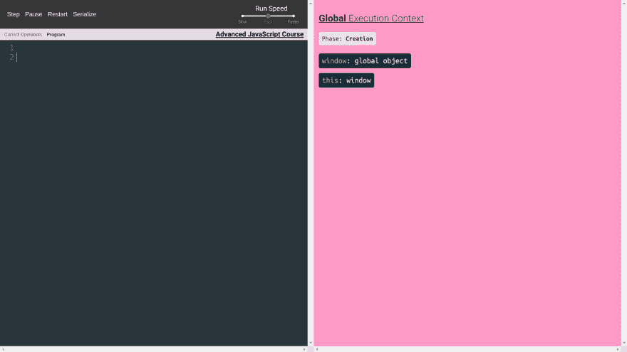
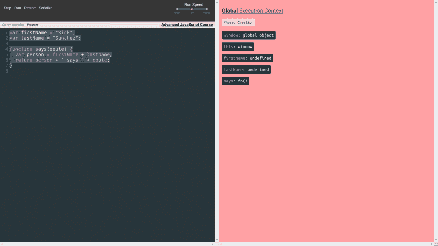
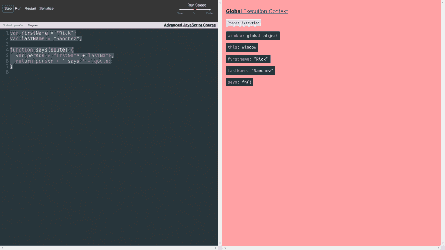
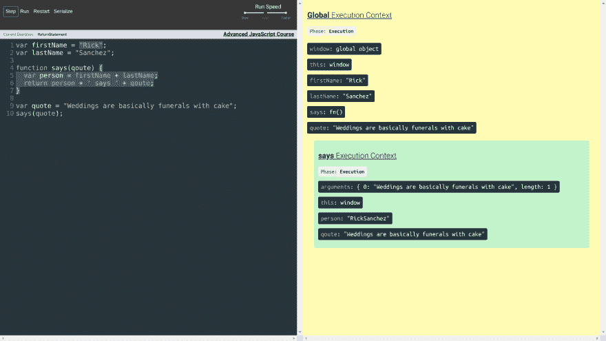
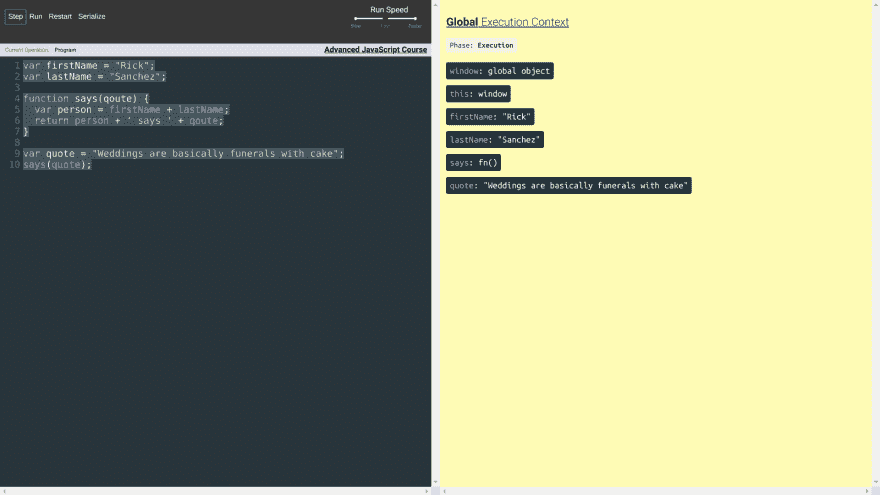
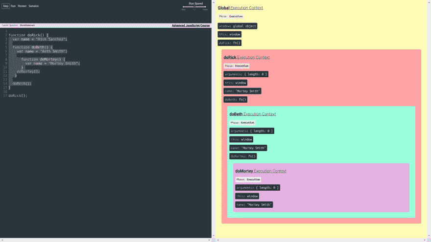

# 执行上下文&函数的秘密生活

> 原文：<https://dev.to/gemhar/execution-context-the-secret-life-of-functions-1bl1>

理解执行上下文是学习 Javascript 最重要的基础部分之一。这是因为理解执行上下文为清晰地理解更高级的主题铺平了道路，比如提升、作用域链和闭包。因此，在这篇文章中，我将涵盖执行上下文的完整生命周期。

## 什么是执行上下文？

执行上下文是 javascript 引擎模块化解释和运行我们代码的过程的方式；从而降低了过程的复杂性。有两种类型的执行上下文:

*   全局执行上下文
*   函数执行上下文

## 全局执行上下文

每当我们运行 javascript 文件时，即使默认情况下 javascript 文件为空，引擎也会为我们创建全局执行上下文。最初，这个执行上下文将由两件事组成——一个全局对象和一个名为'[this【T1 ']的变量，它将引用全局对象，如果您在浏览器中运行 JavaScript，该对象将是' window '，如果您在节点环境中运行它，它将是' global '。](https://developer.mozilla.org/en-US/docs/Web/JavaScript/Reference/Operators/this)

[](https://res.cloudinary.com/practicaldev/image/fetch/s--3k91ClFT--/c_limit%2Cf_auto%2Cfl_progressive%2Cq_auto%2Cw_880/https://thepracticaldev.s3.amazonaws.com/i/n0nf2uoyblcjq8vr49if.png)

当我们的执行上下文中有变量和函数时，默认情况下代码会经历两个阶段的过程，这两个阶段是:

*   全球创造阶段。
*   全局执行阶段。

### 创建阶段会做如下操作:

1.  为我们创建一个全局对象。
2.  创建一个名为“ [this](https://developer.mozilla.org/en-US/docs/Web/JavaScript/Reference/Operators/this) 的对象，并基于我们的环境初始化为 window/global。
3.  创建变量环境，作为变量和函数的内存空间。
4.  将所有“var”标识符声明初始化为“undefined ”,并将所有函数声明放在内存中。

[](https://res.cloudinary.com/practicaldev/image/fetch/s--bBeFT2SD--/c_limit%2Cf_auto%2Cfl_progressive%2Cq_auto%2Cw_880/https://thepracticaldev.s3.amazonaws.com/i/u459a4xifwb20impw7ep.png)

在执行阶段，JavaScript 引擎开始逐行运行我们的代码并执行它。

[](https://res.cloudinary.com/practicaldev/image/fetch/s--r2W3jwiR--/c_limit%2Cf_auto%2Cfl_progressive%2Cq_auto%2Cw_880/https://thepracticaldev.s3.amazonaws.com/i/c7ybal1b8wp82siagsd1.png)

### 注:

这个在创建阶段给变量声明分配一个缺省值“未定义”的过程叫做[提升](https://developer.mozilla.org/en-US/docs/Glossary/Hoisting)。

```
console.log(firstName); //logs -->undefined 

//it does not throw an error but logs -->undefined;
//this happens because of hoisting happening during the creation phase
var firstName = "Rick";
console.log(firstName); //logs -->Rick 
```

<svg width="20px" height="20px" viewBox="0 0 24 24" class="highlight-action crayons-icon highlight-action--fullscreen-on"><title>Enter fullscreen mode</title></svg> <svg width="20px" height="20px" viewBox="0 0 24 24" class="highlight-action crayons-icon highlight-action--fullscreen-off"><title>Exit fullscreen mode</title></svg>

## 功能执行上下文

函数执行上下文几乎与全局执行上下文完全相同，只有一点不同。只有当我们调用任何函数时，才会创建函数执行上下文。

默认情况下，即使函数执行上下文也要经历两个阶段的过程，这两个阶段与全局执行上下文相同，它们是:

1.  创作阶段。
2.  执行阶段。

### 创建阶段会做如下操作:

即使在函数执行中，上下文的创建阶段也类似于全局创建阶段，但它改变了第一步，因此它不是创建全局对象，而是用接收到的参数创建参数对象。因此，创建阶段的步骤是:

1.  用收到的参数创建一个 argument 对象。
2.  创建一个名为' [this](https://developer.mozilla.org/en-US/docs/Web/JavaScript/Reference/Operators/this) '的对象，并指向被调用者，或者在没有被调用者的情况下指向窗口/全局对象。
3.  创建变量环境，作为局部变量和函数的内存空间。
4.  将所有“var”标识符声明初始化为“undefined ”,并将所有函数声明放在内存中。

[](https://res.cloudinary.com/practicaldev/image/fetch/s--DK4eKf-o--/c_limit%2Cf_auto%2Cfl_progressive%2Cq_auto%2Cw_880/https://thepracticaldev.s3.amazonaws.com/i/atxcrx19cx4c2ndj8zzc.png)

在执行阶段，JavaScript 引擎开始一行一行地运行我们的代码并执行它。

[](https://res.cloudinary.com/practicaldev/image/fetch/s--99gtptw8--/c_limit%2Cf_auto%2Cfl_progressive%2Cq_auto%2Cw_880/https://thepracticaldev.s3.amazonaws.com/i/bp93v422pw35e5dfntc6.png)

在函数执行结束后，也就是通过隐式/显式 return 语句，函数执行上下文连同其所有变量环境一起被删除(并不总是有一种特殊情况，我们将在后面看到这种情况),并成为垃圾收集器的垃圾。

[](https://res.cloudinary.com/practicaldev/image/fetch/s--72911OmR--/c_limit%2Cf_auto%2Cfl_progressive%2Cq_auto%2Cw_880/https://thepracticaldev.s3.amazonaws.com/i/5nvu7655etonexht22gk.png)

## 调用堆栈

JavaScript 引擎创建一个“执行堆栈”(也称为“调用堆栈”)，将全局执行上下文作为其第一个或最底层的项目。每当调用一个函数时，都会创建一个新的执行上下文并将其添加到执行堆栈中。每当一个函数完成了创建和执行阶段的运行，它就会从执行堆栈中弹出。因此，嵌套的执行上下文将如下所示:

[](https://res.cloudinary.com/practicaldev/image/fetch/s--yRyoaoja--/c_limit%2Cf_auto%2Cfl_progressive%2Cq_auto%2Cw_880/https://thepracticaldev.s3.amazonaws.com/i/mtsdy5lyka61ksrrzeww.png)

函数的秘密生活并没有就此结束，还有更多有趣的事情，比如[作用域](https://developer.mozilla.org/en-US/docs/Glossary/Scope)和神奇的[闭包](https://developer.mozilla.org/en-US/docs/Web/JavaScript/Closures)。一定要去看看。

### 资源:

*   [JavaScript | MDN](https://developer.mozilla.org/en-US/docs/Web/javascript)
*   由威廉·森坦斯编写的难懂的部分
*   泰勒·麦金尼斯使用 JavaScript 可视化工具拍摄图片