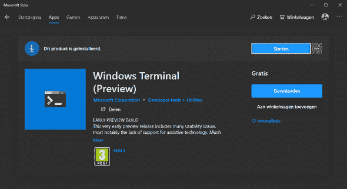
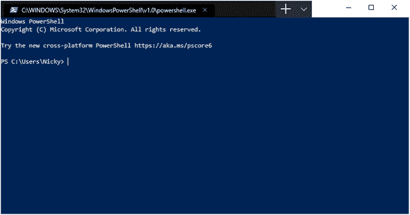
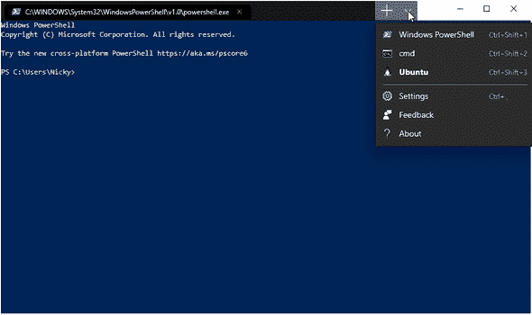
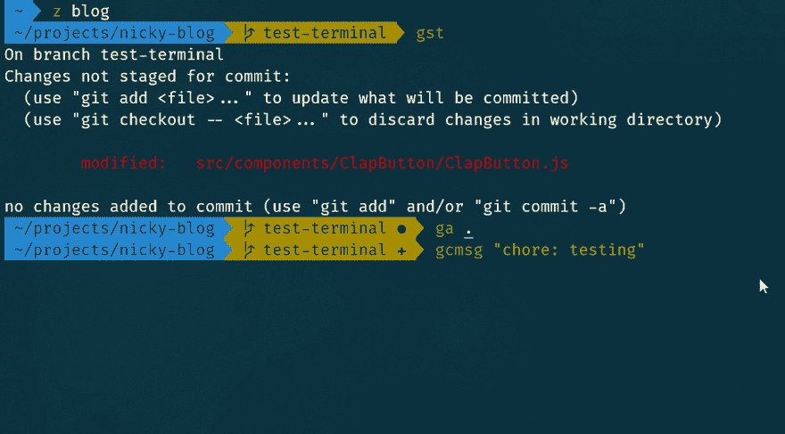
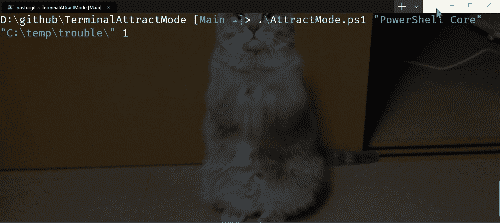

# 新的 Windows 终端

> 原文：<https://dev.to/nickymeuleman/the-new-windows-terminal-271j>

> 更新于 2019 年 12 月 6 日

微软正在开发一款名为 [Windows 终端](https://devblogs.microsoft.com/commandline/introducing-windows-terminal/)的新命令行应用。

宣传片看起来很有希望，让我们期待它不负众望。

Windows 终端的预览版可以在 [Windows 商店](https://www.microsoft.com/en-us/p/windows-terminal-preview/9n0dx20hk701)买到。

[](https://res.cloudinary.com/practicaldev/image/fetch/s--66B8-DwZ--/c_limit%2Cf_auto%2Cfl_progressive%2Cq_auto%2Cw_880/https://nickymeuleman.netlify.com/static/a7919b6c4ba7716dc474e3e2a30c2ae6/b9e4f/store.png)

旧的、众所周知的、常被轻视的`cmd`应用程序并不十分功能丰富。它的主要目标是保持向后兼容，防止添加许多特性。

然而，新的 Windows 终端有许多花哨的功能。

这是一个访问许多不同 Shell 的中心位置，如 good 'ol cmd、PowerShell、 [your fancy WSL shell](https://dev.to/nickymeuleman/wsl2-zsh-and-docker-linux-through-windows-4e4m) ，...

该项目是开源的，看看吧，主要是 C++ [资源库](https://github.com/microsoft/terminal)。

从他们的`README.md`:

> Windows 终端是一个新的、现代的、功能丰富的、面向命令行用户的高效终端应用程序。它包括许多 Windows 命令行社区最常要求的特性，包括对选项卡、富文本、全球化、可配置性、主题和样式等的支持。
> 
> 终端还需要满足我们的目标和措施，以确保它保持快速、高效，并且不会消耗大量内存或电力。

许多附加功能**即将推出**。

例如:[按键绑定像复制&粘贴](https://github.com/microsoft/terminal/pull/1093#event-2438652452)，[窗格像 tmux](https://github.com/microsoft/terminal/pull/825) ，...

> 这些功能现已推出(2019 年 12 月 6 日)。为了更全面地了解他们在 1.0 版本中的计划和应该达到的水平，看看[里程碑](https://github.com/microsoft/terminal/milestone/6)。

更多的特性已经在开发者的清单上，而且**可能**即将到来。

就像一个开发者认为用文件来支持主题会很酷(T2)。

那会成为现实吗？不知道。

会不会很酷？绝对的！🤩

## 配置

有许多配置选项可以让整个应用程序和每个 shell 按照您想要的方式运行。
这发生在`profiles.json`文件中。

虽然不像使用 <abbr title="Graphical user interface">GUI</abbr> 那样花哨，但这是一种令人愉快的方法。

特别是当文件附有 JSON-schema 时。

我希望他们尽快增加一个，因为 [JSON-schemas 太棒了](https://dev.to/nickymeuleman/json-schemas-are-awesome-312m)。

[](/nickymeuleman) [## JSON 模式棒极了

### 尼基·穆勒曼 3 月 29 日 194 分钟阅读

#productivity #dx](/nickymeuleman/json-schemas-are-awesome-312m)

> 编辑:他们做到了🎉！是在[版本 1909](https://devblogs.microsoft.com/commandline/windows-terminal-preview-1909/) 中增加的。这给我[带来了极大的快乐](https://twitter.com/NMeuleman/status/1176829617128247296)。

当您第一次安装应用程序时，它会向您显示一个 PowerShell 窗口。

[](https://res.cloudinary.com/practicaldev/image/fetch/s--E4wtSUkD--/c_limit%2Cf_auto%2Cfl_progressive%2Cq_auto%2Cw_880/https://nickymeuleman.netlify.com/static/bcfc1f1a6f6863d85891f40b96638bd5/b9e4f/default-powershell.png)

最近我花了一些时间来安装 Linux 2 的 Windows 子系统[并运行](https://dev.to/nickymeuleman/wsl2-zsh-and-docker-linux-through-windows-4e4m)，我希望它在我启动终端时显示出来。

[](/nickymeuleman) [## WSL2、zsh 和 docker。Linux 穿越 Windows。

### 尼基·穆勒曼 6 月 15 日 1911 分钟阅读

#linux #windows #productivity #tutorial](/nickymeuleman/wsl2-zsh-and-docker-linux-through-windows-4e4m)

幸运的是，来自 <abbr title="Windows subsystem for Linux 2">WSL2</abbr> 的 Ubuntu 终端已经在可用 shells 列表中了。

[](https://res.cloudinary.com/practicaldev/image/fetch/s--6bS9TI5i--/c_limit%2Cf_auto%2Cfl_progressive%2Cq_auto%2Cw_880/https://nickymeuleman.netlify.com/static/0d36f6a34054020af0bf8a1723fbdcfd/b9e4f/shell-list.png)

点击下拉菜单中的设置选项，或点击`ctrl+,`快捷键，打开`profiles.json`文件。

将它更改为默认 shell 意味着在`profiles`键下找到那个 Ubuntu 配置文件的 <abbr title="globally unique identifier">GUID</abbr> ,并将其放在`globals`下的`defaultProfile`中。

```
//  profiles.json  {  "globals":  {  //  ...  "defaultProfile":  "the GUID of your chosen profile"  //  ...  },  "profiles":  [  {  //  ...  "GUID":  "a GUID string"  //  ...  }  //  more  profiles  ]  } 
```

默认情况下，该 shell 在 Windows 上的用户目录中打开。我的项目位于 Linux 端，所以我想让 shell 在我的 Ubuntu 主目录中打开。

```
//  in  a  profile-object  {  "startingDirectory":  "//wsl$/Ubuntu/home/nicky"  } 
```

经过一些调整，我觉得我的终端看起来很可爱。

我把我的`profiles.json`保存到了一个公开的[要诀](https://gist.github.com/NickyMeuleman/42c032b0991202864160faec57886954)。

[](https://res.cloudinary.com/practicaldev/image/fetch/s--NQYh39ch--/c_limit%2Cf_auto%2Cfl_progressive%2Cq_66%2Cw_880/https://nickymeuleman.netlify.com/pretty-e706eb8c39e6a4750a8370c544531750.gif)

一个叫 [Chris Duck](https://twitter.com/gpduck) 的开发者做了一个 PowerShell 模块来控制这个: [MSTerminalSettings](https://github.com/gpduck/MSTerminalSettings) 。

还记得那个认为使用 iTerm 配色方案文件会很棒的 dev 吗？是的，这个模块使这成为可能。🤯

克里斯列举了使用来自[iterm2colorschemes.com](https://iterm2colorschemes.com/)的方案作为[他的模块能做什么的例子](https://github.com/gpduck/MSTerminalSettings?WT.mc_id=-blog-scottha#examples)。

斯科特·汉瑟曼和[泰勒·莱恩哈特](https://twitter.com/TylerLeonhardt)立刻用上了它，理由很充分，恶作剧。

他们制作了[终端吸引模式](https://github.com/shanselman/TerminalAttractMode)。自称“今天编写的最伟大的 PowerShell 脚本”将动画 gif 作为终端的背景。很光荣。🤣

[](https://res.cloudinary.com/practicaldev/image/fetch/s--np9koArl--/c_limit%2Cf_auto%2Cfl_progressive%2Cq_66%2Cw_880/https://user-images.githubusercontent.com/2892/60372165-8cfa0480-99b0-11e9-8e80-c37ab964f202.gif)