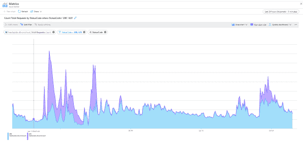

# 积极调优 Cosmos DB(漫长的过程)

> 原文：<https://dev.to/tdwright/aggressively-tuning-cosmos-db-the-long-way-round-2291>

有多少种方法可以调优 Cosmos DB？在我们(最终非常绝望地)试图让它很好地扩展时，我们尝试了 9 种方法。随着它们变得更加神秘，我们看到了收益递减。有些人完全适得其反！在我们的案例中，最终的解决方案是一个单行修复程序(多么尴尬！)，但是旅途真的很有意思。今天我想分享的就是这段旅程。

正如普通读者所知，我在 [HeadUp Labs](https://www.headuplabs.com/) 工作。我们制作了一款健康应用，将数据科学应用于用户数据，以帮助他们了解自己的身体。我们使用一系列 Azure 技术从可穿戴设备获取数据，并大规模应用数据科学。

自去年 10 月推出这款应用以来，我们已经迅速扩展到数万名用户。一方面，以这种速度扩展已经验证了我们早期关于使用技术的许多战略决策:总的来说，我们对 Azure Functions 和 Cosmos DB 非常满意。另一方面，当涉及到我们实现的细节时，我们对用户的快速吸收是不可原谅的。

我们遇到的一个主要问题是过载 Cosmos DB。从早期开始，我们就发现为高峰时间提供足够的“请求单元”(“RUs”)是非常昂贵的。另一方面，未能提供足够的 RUs 意味着请求受到限制，我们开始在日志中看到可怕的 429 状态代码。

[](https://res.cloudinary.com/practicaldev/image/fetch/s--zgG2pcAw--/c_limit%2Cf_auto%2Cfl_progressive%2Cq_auto%2Cw_880/https://i2.wp.com/blog.tdwright.co.uk/wp-content/uploads/2019/06/spoooky429.png%3Ffit%3D620%252C349)

当我们扩展时，我们发现有时我们会设法完全淹没数据库。在此期间，引发 429 状态(`RequestRateTooLarge`)的请求数量可能会使成功的(200，201)请求数量相形见绌。

我们最终意识到，我们的问题主要是由一个非常简单的配置错误引起的。(如果你想知道这个问题的梗概和解决方法，请跳到最后。)然而，这个解决方案并不真正有趣。我想写这篇博文的原因是想谈谈我们在发现什么是大问题之前所做的事情。我们经历的旅程和尝试的技术是这里有趣的话题。我希望你坐得舒服…

## 分散负荷

我们试图驯服宇宙的第一个方法是一个简单但非常有效的架构方法。我们的许多工作都是由定时器触发的 Azure 函数驱动的。例如，我们可能每天为每个用户运行一次特定的数据模型。通过错开每个任务的执行，我们能够以低得多的 RU 上限执行相同数量的工作。

我们不会在 UTC 午夜触发 10，000 个作业，而是将这么多项目放在 Azure 存储队列中，每个项目都有不同的`VisibilityTimeout`。此属性防止项目在经过指定的时间后出列。

根据任务的类型，我们使用各种策略来确定每个项目的延迟量。一个常见的模式是:

*   使用用户的**时区**将任务偏移一个整数小时，这样任务将总是在一天中用户本地的大致相同的时间发生。
*   根据用户的**群组**(任意指定)，在一个小时内应用一个偏移量，这可能导致群组间隔 10 分钟。
*   在每个群组范围内，应用一个**随机**秒数，以便用户在 10 分钟内大致均匀分布。

总的效果是将大量的日常高峰平滑成一个更小、更稳定的工作流。因为我们需要提供 Cosmos 来处理最大的峰值，所以这种策略可以节省大量成本。

## 实现索引文件

我们最初简单实现的另一个问题是复杂的查询逻辑。对于每个用户，我们可能有一个大的“评级”集合，涉及他们健康的不同方面。我们维护几个类别，每个等级可能有不同的状态。我们可能会做的一个常见查询是为类别和状态的每个组合查找最近的`Rating`文档。随着用户数量和每个用户的评分数量的增长，这种查询很快变得非常昂贵。

通过将我们的查询从使用基于文本的`DateTime`属性切换到内置的`_ts`属性，我们能够赢得一些时间，这是文档最后一次更改时间的数字表示。

然而，最终我们需要重新思考我们的方法。我们最终选择的路线是引入一种新的文档类型:a `RatingsIndex`。这个文档基本上是 Cosmos 中其他地方的`Rating`文档的 id 的分组集合。每当我们更改评级时，我们都会更新此文档，并查询它以确定使用哪个评级。

这似乎有悖直觉。毕竟，我们已经用两个查询代替了一个查询。诀窍在于，我们实际上是用一个非常廉价的查询和 *read* 的组合替换了一个昂贵的查询。读操作更像是对文件系统的调用，而不是数据库查询。他们效率惊人。

我们已经有效地将选择评级的逻辑从读取时间转移到写入时间。因为我们读的比写的多得多，我们发现这非常有益。额外的写操作(当我们更新索引时)和额外的读操作(在我们查询索引后)的组合成本远远超过了我们通过删除一个昂贵且频繁调用的查询所获得的收益。

## 用 Redis 屏蔽宇宙

即使在分散负荷后，我们的增长意味着成本继续上升。和大多数应用程序一样，我们读的比写的多得多，所以我们决定扩展我们的 Cosmos 实现。

我说“扩展”是因为我们已经在使用 Redis 来缓存从我们的 API 项目发出的数据库调用。和平常一样，我们对 ASP 使用了分层设计。基于. NET 的 API。将我们所有的数据库逻辑集中在我们的存储库层，使得将缓存作为防御层变得非常简单。

问题是我们的 API 实际上很薄——大部分繁重的工作都是由我们的(众多的)Azure 函数来完成的。在函数中访问数据库的惯用方式是通过“binding”参数接受客户端。下面的例子直接摘自[文档](https://docs.microsoft.com/en-us/azure/azure-functions/functions-bindings-cosmosdb-v2#http-trigger-get-multiple-docs-using-documentclient-c) :

```
[FunctionName("DocsByUsingDocumentClient")]
public static async Task<IActionResult> Run(
    [HttpTrigger(AuthorizationLevel.Anonymous, "get", "post", Route = null)]HttpRequest req,
    [CosmosDB(databaseName: "ToDoItems", collectionName: "Items", ConnectionStringSetting = "CosmosDBConnection")] DocumentClient client,
    ILogger log)
{
    // do stuff with client
} 
```

<svg width="20px" height="20px" viewBox="0 0 24 24" class="highlight-action crayons-icon highlight-action--fullscreen-on"><title>Enter fullscreen mode</title></svg> <svg width="20px" height="20px" viewBox="0 0 24 24" class="highlight-action crayons-icon highlight-action--fullscreen-off"><title>Exit fullscreen mode</title></svg>

我们用这种形式写了几十个函数。尽管我们的 API 项目中的存储库中实现了缓存逻辑，但我们没有真正的方法在这里使用它们。在函数中重新实现缓存意味着大量的重复代码，并且容易出错和难以调试。

当我们发现 Azure Functions 的 AutoFac 的一个非官方实现时，我们的运气变了。Autofac 。突然间，我们可以在函数中注入依赖关系。事实上，我们的 API 项目已经在使用 AutoFac for DI，所以开始共享服务和存储库并删除所有重复的功能非常简单。那天删除了很多代码。

通过从我们的 Azure 函数中移除所有与 Cosmos 的直接绑定，并用缓存感知的存储库调用来代替它们，我们能够大幅减少向数据库发送的请求数量。

## 但是，他们还是来了…

有一段时间，情况看起来好多了。我们能够扩大我们的用户群，而不会过度增加 RUs 的供应，也不会屈服于不可接受数量的节流请求(429)。

然后我们开始在高峰时段看到一些不愉快的症状。请求的数量会超出容量，并停留一两个小时。在此期间，我们会看到更多的`RequestRateTooLarge`异常和 429 个状态代码。

<figure>[](https://res.cloudinary.com/practicaldev/image/fetch/s--_fyzNn5z--/c_limit%2Cf_auto%2Cfl_progressive%2Cq_auto%2Cw_880/https://i2.wp.com/blog.tdwright.co.uk/wp-content/uploads/2019/06/429chart.png%3Ffit%3D620%252C302) 

<figcaption>那些紫色的山丘绝对令人沮丧。</figcaption>

</figure>

随着时间的推移，这些事件变得越来越频繁，越来越重要。更糟糕的是，我们开始看到应用程序的错误行为。乔布斯不会结束。数据会以奇怪的状态结束。你明白了…嗯，正如你所想象的，寻找解决方案的动力变得越来越迫切。

## 微调重试次数

我们早期抓住的一个想法是，不知何故，它是使用存储队列、Azure 函数和。NET Cosmos DB SDK。您会看到，队列和数据库都将尝试重试失败的操作。

例如，如果数据库无法处理查询，SDK 将后退并重试。在抛出异常之前，它会这样做一定的次数。这个异常将导致该函数失败，此时它对队列项的声明将失效，这意味着该函数的另一个实例可以自由进入并重试。

这意味着单个队列项可能会导致比预期多很多倍的数据库请求。根据[这份有用的文档](https://docs.microsoft.com/en-us/azure/architecture/best-practices/retry-service-specific)，Cosmos SDK 的默认值是 9 次重试，存储队列的默认值是 3 次重试。换句话说，我们队列中的单个项目可能会导致 27 次数据库命中。这是我们看到如此严重的失败率的原因吗？

如果是真的，这意味着两件事。首先，它表明稍微提高一点供应的吞吐量可能对失败率有很大的影响，因为每增加一次成功可能会阻止 26 次进一步的请求。其次，它促使我们思考我们可能希望重试如何进行——所有操作真的需要 27 次机会才能成功吗？

鼓励我们稍微提高吞吐量，我们也减少了后端应用程序的重试次数。(我们没有理会 API 项目，认为失败的影响可能会更大。)推理是沿着“最终一致性”的思路进行的。

正如你可能已经猜到的，这不是一个伟大的战略。不仅 429 的速率几乎没有受到影响，而且我们发现，随着越来越多的操作严重失败，系统设法让自己进入一些非常奇怪的状态。我们恢复了这一变化。

## 记录 Cosmos DB 事务

我们从失败的重试实验中得到的一个重要教训是，我们已经用尽了所有正常的想法，现在是盲目的。因此，我们开始以新发现的活力来审视现有的数据。

Azure 内置的指标以及应用洞察能够大致告诉我们问题出在哪里。例如，我们可以看出，我们在 upserts 上花费了比以前更多的 RUs(我想是缓存的影响)。然而，在 Azure 门户中进行更深入的挖掘实际上是不可能的，我们发现自己无法获得任何可操作的东西。我们无法自信地指出代码中任何特定的“热点”。

沮丧之余，我们从过去、从 SQL Server 世界借用了一个技巧…我们决定尝试分析我们的 Cosmos DB 使用情况。

幸运的是，我们早期将数据库逻辑集中到一组共享存储库中的举措为我们铺平了道路。这些存储库都使用相同的底层 Cosmos DB 客户端类，因此添加一些代码来记录每个请求相对来说没有什么痛苦。我们决定将 RUs 中的请求类型、查询、调用方法和成本写到一个新的 Azure 存储表中。

在启用分析代码几天后，我们能够将 Power BI 连接到事务表。这些数据与我们看到的整体模式不太匹配(最后一节痛苦地说明了原因)，但我们有一些强有力的线索可以追踪。

## 不能智取 SDK

在查看配置文件数据后，我们尝试了一些事情，但都没有结果。我会把这些都放在一类苦乐参半的现实中。痛苦，因为我们没有看到我们所希望的改进。因为我们意识到。NET SDK for Cosmos 已经比我们想象的更聪明了。这些我就不细说了，我举个例子。

我们留下了一个不合适的场景。在我们实现的深处，我们有以下内容:

```
EnableCrossPartitionQuery = true 
```

<svg width="20px" height="20px" viewBox="0 0 24 24" class="highlight-action crayons-icon highlight-action--fullscreen-on"><title>Enter fullscreen mode</title></svg> <svg width="20px" height="20px" viewBox="0 0 24 24" class="highlight-action crayons-icon highlight-action--fullscreen-off"><title>Exit fullscreen mode</title></svg>

所以我们有这样的想法，也许，也许每个分区的每个查询都会产生一次 RU 开销。鉴于我们的数据库现在跨越了许多分区，这似乎可以解释 RU 消耗的激增。

这是一个简单的尝试。对于所有可以访问分区键的查询(谢天谢地，这是大多数查询)，我们禁用了`EnableCrossPartitionQuery`，并在`FeedOptions`对象中显式设置了`PartitionKey`。

结果呢？没有任何变化。SDK 显然已经在远离窥探的目光中施展了它的魔力；在我们不知道的情况下优化我们的查询。同时，一方面，很高兴知道 SDK 如此聪明，另一方面，我们对解决方案的探索将不得不继续。

## 当心更新！

我们从分析工作中学到的一件事是，更新操作的成本似乎不成比例。正如 Maxime Rouiller 在一篇关于[计算 RU 成本](https://dev.to/maximrouiller/calculating-cosmos-db-request-units-ru-for-crud-and-queries-23g7-temp-slug-5254216)的博客文章中所指出的，一个更新实际上是一个删除，然后是一个创建。这导致安如的成本比阅读相同文档的成本高 10 倍。

查看我们的分析输出，可以清楚地看到一些由更新引起的“热点”。在最重要的情况下，我们经常更新相对较大的文档中的单个属性。因为 RUs 中的成本与文档的大小成正比，所以我们决定将这个文档分成两部分:一个包含我们经常需要更新的属性的小文档和一个包含其他内容的大文档。

不得不阅读两份文件是有代价的。这两个文档中的每一个都至少有一组标准的核心属性(例如，`_ts`，`etag`)，这意味着在拆分文档之后，您将需要读取更多的数据。但是由于读取和写入的成本相差 10 倍，写入较小的文档可以节省足够多的成本，从而克服读取两个文档所带来的损失。

我们可以使用 Azure Cosmos 容量计算器来估算拆分的经济性。我将保留所有常规设置的默认值，只更改与我们的文档相关的部分。想象我们有一个单一的大文档(像[这个](https://pastebin.com/F7kevW1u)；1.99kb)，我们每秒需要读取和更新 100 个这样的文档。这将要求我们调配 734 RU/s，其中 105 RU/s 用于读取，629 RU/s 用于写入。现在想象一下，我们从大文档中获取了几个属性(让它[稍微小一点](https://pastebin.com/wDsMHb6C)；1.94kb)并把它们移到了[一个小的](https://pastebin.com/2sH7MUid) (0.47kb)。如果我们以每秒 100 次的速度读取两者，但仅以此频率写入较小的一个，则总吞吐量将降至 700 RU/s(读取 205+写入 495)。这是一个玩具示例，但我们已经可以看到 5%的改进。

|  | **天真** | **拆分** | % |
| --- | --- | --- | --- |
| 读 | One hundred and five | Two hundred and five | +95% |
| 写 | Six hundred and twenty-nine | Four hundred and ninety-five | -79% |
| **总计** | **第 734 章** | **700** | -5% |

在我们的实际例子中，通过减少我们最频繁更新的文档的大小，我们能够削减我们最频繁操作之一的 RU 成本的近 15%。

## 先发制人

虽然我们到目前为止的努力已经取得了显著的成果，但我们仍然面临着巨大的消费高峰和低谷。当需求超过我们提供的吞吐量时，峰值总是会看到大量被节流的请求。将数据库保持在能够满足这种需求的规模看起来非常昂贵。

为了处理高峰而不在平静时期付出过多代价，我们编写了一个函数来自动扩展 Cosmos 以预测需求。幸运的是，我们的高需求时期是可以预测的，所以我们可以根据时间表扩大和缩小规模。

原来，通过`DocumentClient`本身可以改变每秒供应的 ru 的数量，所以扩展和缩小数据库的代码非常简单:

```
var coll = cosmosDBClient
    .CreateDocumentCollectionQuery(UriFactory.CreateDatabaseUri(databaseName))
    .Where(c => c.Id == collectionName)
    .AsEnumerable()
    .Single();

var offer = cosmosDBClient
    .CreateOfferQuery()
    .Where(o => o.ResourceLink == coll.SelfLink)
    .AsEnumerable()
    .Single();

var newOffer = new OfferV2(offer, newRUs);
await cosmosDBClient.ReplaceOfferAsync(newOffer); 
```

<svg width="20px" height="20px" viewBox="0 0 24 24" class="highlight-action crayons-icon highlight-action--fullscreen-on"><title>Enter fullscreen mode</title></svg> <svg width="20px" height="20px" viewBox="0 0 24 24" class="highlight-action crayons-icon highlight-action--fullscreen-off"><title>Exit fullscreen mode</title></svg>

如您所见，困难的部分是用新条款创建一个新的`Offer`对象。

我们从一个定时器触发的函数中运行它，该函数查看存储表以获取它的时间表。它在整点一刻和整点一刻检查时间表，并根据已知的需求模式放大或缩小数据库。

当然，这并没有解决 RU 需求高于预期的问题。它所做的是在我们找到合适的解决方案的同时，大幅降低成本。

## 调优索引策略

在我们越来越绝望地减少我们的 RU 支出时，我们开始考虑 Cosmos 的索引政策。默认和推荐的方法是允许 Cosmos 索引每个文档的每个属性。我们最初接受了这一点，但现在却怀疑一切。是不是我们的索引元数据现在太大了，以至于影响了性能？

我们试着改变默认的策略，让每个属性都有索引。相反，我们使用来自分析练习的数据来识别我们在查询中实际使用的属性，并指示 Cosmos 只索引这些属性。这背后的动机是降低写操作的成本。

文档似乎支持将此作为一种策略，但是结果并不像我们希望的那样令人印象深刻。

## 一句话搞定

当我们开始用尽想法——仍然没有接近一个表演系统——我们开始绝望。绝望中，我们开始漫无目的地梳理代码。

我们甚至开始查看我们*知道*有效的代码。我们知道它有效，因为我们几个月前就写好了，而且一直在用。在我们目前的困境开始之前很久，它就没有被修改过。这不可能是错误的，但我们仍然翻看着文件，绝望地在古老的方法中滚动。

我们看到的一个类是我们的 Cosmos 客户机 singleton。当我们第一次开始编写访问 Cosmos 的代码时，我们遵循了[性能提示](https://docs.microsoft.com/en-us/azure/cosmos-db/performance-tips#sdk-usage)，并将我们的客户端实现为一个共享的单例。一切看起来都很好，但是我们想仔细检查 Autofac 是否正确地将它解析为单例，所以我们决定一步一步来。

F11，F11，F11…“是的，它肯定是共享一个实例。”

“但是……那个方法在做什么？而且为什么用了 750ms 才跑完？”所以我们又查了一遍。同样的行为。很奇怪。

女士们，先生们，原来我们在查询方法中留下了一个特定的方法调用，而不是构造函数。也不是任何方法调用，而是对主动获取集合的所有元数据的方法的调用，以便加速每个查询。考虑到我们数据库的规模，这些元数据请求现在需要数百毫秒的时间，并耗费了我们大量调配的 RU/s。

最终，修复过程简单得可笑。我们将`OpenAsync();`从执行动作/查询的方法中移出，移到实例化单例的方法中。

我们一部署这一变化，大量 429 个响应的平稳期就消失了。吞吐量下降如此之多，以至于我们能够将我们正在调配的 RU/s 数量减少到原来的 20%。(换句话说，这个修复立即削减了我们 80%的数据库费用。)

每个人都很高兴。成本大大降低，没有例外，一夜之间，应用程序开始按照设计的那样运行。

## 倒影

自从我们结束这个话题已经有几个星期了，但是我一直在考虑写这篇博客，并思考一大堆相关的问题。

其中最主要的是“为什么我们花了这么长时间才恢复正常？”我认为这个问题的答案是微妙而有趣的。从根本上讲，它可以分解为以下几个因素:

1.  **代码合并。**有问题的类最初只被我们的 API 使用。我们开始在我们的功能项目中使用它，因为我们开始向我们的存储库注入依赖项。换句话说，我们将问题作为修复的一部分进行传播。
2.  **日益严重的问题。** `OpenAsync`有点像一个黑匣子(的文档很少提到它在做什么)，但我们认为它可以提供一个分区键和分区的字典。这是有意义的，因为它允许 SDK 以闪电般的速度完成大多数查询。这也解释了为什么当数据库非常小的时候(或者在我们的非生产数据库上)，我们没有注意到这个问题。结果是，这个问题实际上是与数据库并行增长的。
3.  **缺乏文献记载。**同样，什么是“ReadFeed”操作？我们可以在我们的 Azure 指标中看到这些。它们显然与我们的问题有关，但是我们的谷歌搜索没有回答我们的问题。我们现在知道`OpenAsync`执行了一个`ReadFeed`操作，但是我们直到后来才设法建立起这种联系。
4.  **部分日志记录。**还记得我说过我们分析工作的数据与我们在 Azure 上看到的不太匹配吗？嗯，我们没有考虑到`OpenAsync`可能会让 RUs 付出代价。我们只是跟踪我们的查询、追加销售等的成本。利用我们不完善的数据，我们能够有针对性地进行一些明智的增量优化，但却忽略了系统行为不当的根本原因。

我认为，支撑这一切的是大量的“新技术”和“缺乏经验”。事后看来，我们已经调配了比应该需要的更多的吞吐量—我们只是对敲响警钟的技术不够熟悉。

另一方面，我无法通过任何其他途径了解我们已经了解的关于 Cosmos DB 的一些事情。有时候，需要是最好的导师。

除了我们获得的知识，我们还保留了我们所做的许多改变:

*   我们仍然使用各种技术来分散负载和消除峰值。事实上，这是我们现在建筑思想的核心部分。不管我们的代码中有什么问题，Cosmos 的可用性模型更适合基本负载而不是峰值。
*   索引文档不仅仅是我们保留的东西，而是扩展的。对于经常被阅读，但很少被书写的文档，它的效率要高得多。我们已经将这种技术推广到其他一些文档类型。
*   向存储库注入缓存逻辑仍然是明智之举，即使它最初在我们的 DB 客户机中传播了一个缺陷。我们仍然在整个应用程序中使用存储库来封装所有关于缓存和数据库访问的逻辑。
*   我们留下了记录对 Cosmos 调用的代码，因此我们可以在将来对新的子系统进行分析。我们所需要做的就是在我们的配置中翻转一个标志，所有的数据库调用都会被记录下来，还有负责的存储库方法的细节。
*   我们保留了按计划扩展数据库的能力。即使我们已经修复/实施了其他一切，我们仍然有高峰和非高峰时间。这主要是因为我们对用户的地理分布有偏见，并且希望在用户当地时区的一天中的特定时间运行特定的操作。因此，我们保留了在一天中增加和减少我们的供应吞吐量的代码。

因此，在很多方面，我们遇到的问题让我们变得更聪明，并驱使我们创造具有持续效用的工具。

## 结论

在我们找到解决方案之前的最后几周是相当不愉快的。团队感受到了压力，并怀疑 Cosmos 是否是这项工作的合适工具。

现在我们已经出现在另一边，变化是巨大的。整个系统现在按照设计的那样运行，我们支付的费用比以前少得多。可以肯定地说，我们对宇宙的任何怀疑现在都烟消云散了。

我们尝试了很多解决问题的策略，最终，这个问题变得更加根本。一路走来，我们学到了很多东西，也制作了一些很酷的工具，所以这一切并没有白费。

我决定公布一份清单，列出我们还在树林深处时做过的事情。我当时没有想到答案会像移动一个方法调用那么简单。我想象我会写一本关于调整宇宙的权威剧本。当我们偶然发现我们的解决方案时，我的第一个想法是放弃我们尝试过的所有其他方法。

不过，最终还是旅程让我感兴趣。我希望，看完整篇文章后，你会同意。