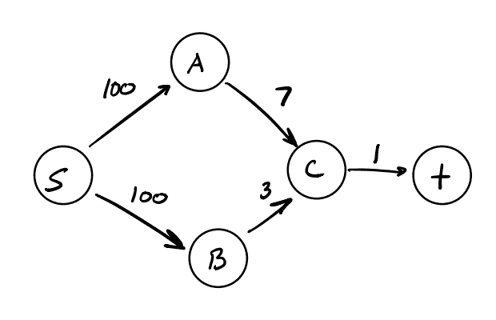
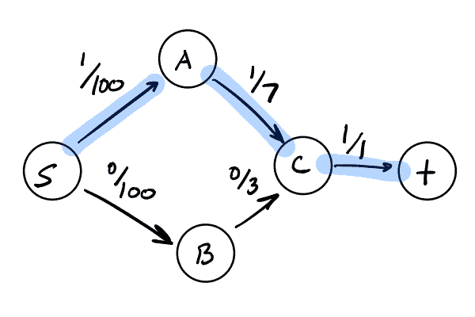
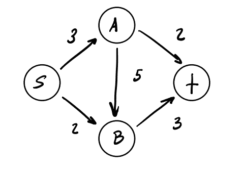
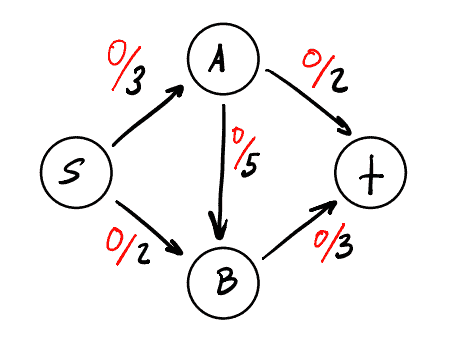
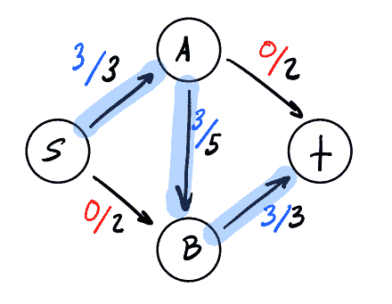
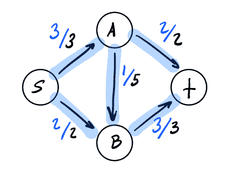
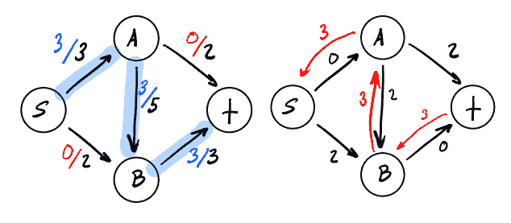
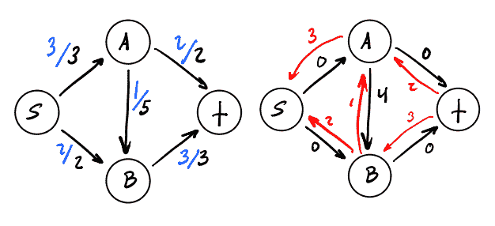

# 使用福特-富尔克森算法和马修·麦康纳寻找最大流量

> 原文：<https://dev.to/downey/finding-max-flow-using-the-ford-fulkerson-algorithm-and-matthew-mcconaughey-nph>

[https://www.youtube.com/embed/aq5ecBaOb6Y](https://www.youtube.com/embed/aq5ecBaOb6Y)

## 先决条件

在进一步阅读之前，一定要看上面马修·麦康纳的必要的先决条件讲座。他的至理名言是这一切的关键。

> 我知道有人说你回不去了。是的，你可以。
> 
> — Matthew McConaughey on the Maximum Flow Problem

## 什么是最大流量问题？

[最大流问题](https://en.wikipedia.org/wiki/Maximum_flow_problem)是一个优化问题，用于确定在给定时间点通过单个源/汇[流网络](https://en.wikipedia.org/wiki/Flow_network)可以流动的*物质*的最大数量。流网络本质上只是一个有向图，其中边权重表示每条边的流容量。流经这些网络的东西可能是任何东西。也许是穿过城市的车流，流过管道的水流，或者是在互联网上传输的比特。

为了更具体地说明这一点，我们来看下面的例子:

这是一个非常简单的没有后边缘的图，其中 *s* 是源顶点 *t* 是汇点。让我们想象一下*的*是一个水处理设施，而 *t* 是我们的家，我们有兴趣找出可以流到我们浴室水槽的水量。

你可以仔细观察这张照片，发现尽管从源头出来的边(顶点 *s* )有很大的容量，但我们受到了通往我们家的边(水槽顶点 *t* )的瓶颈，它只能输送 1 单位的水。

这里，我们的流量显然最多是通向 *t* 的最小边的容量。那么，我们是否可以简单地寻找最小的容量边界，并明确地说我们知道我们的最大流量？几乎...稍后我们将使用[最大流最小割定理](https://en.wikipedia.org/wiki/Max-flow_min-cut_theorem)来解决这个问题，但首先让我们看一个更困难的例子，它有多条边流入水槽。

上面的流网络是这个问题的一个经典例子。我们有从 *s* 到 *t* 的四个顶点和三条路径。假设我们有以下贪婪算法来发现此图的最大流量:

1.  最初将沿每条边的流量设置为 0。

1.  使用像深度优先搜索(DFS)或宽度优先搜索(BFS)这样的寻路算法来寻找从 *s* 到 *t* 的具有可用容量的路径 *P* 。
2.  让 *cap(P)* 表示可以沿着这条路径流动的最大物质数量。为了找到这条路径的容量，我们需要查看路径上的所有边 *e* ，并从它们的容量*ceT11】中减去它们的当前流量*feT7】。我们将把 *cap(P)* 设置为等于*ce*-*fe*的最小值，因为这将使路径成为瓶颈。**
3.  然后我们用我们的 *cap(P)* 值来**增加穿过路径 *P* 的边的流量**。
4.  重复从步骤 2 开始的过程，直到从 *s* 到 *t* 没有剩余具有可用容量的路径。

在我们的流网络上使用上面描述的朴素贪婪算法将导致 3 的次优流。然而，随着进入 *t* 的两条边的容量分别为 2 和 3，感觉我们应该能够实现最大流量 5。下图显示了我们如何通过更智能地分配流量来实现这一点。

但是我们如何做到这一点呢？这就是马修·麦康纳智慧的来源。

> 有时候你必须回头才能真正前进。
> 
> — Also Matthew McConaughey

## 残图

想象一下，如果我们可以回顾我们所做的选择，撤销一些我们早期的心流决定。我们可以用一种叫做剩余图的东西。这就是马修一直以来所指的。

我们将基本上采用我们现有的图，并将所有规则边的容量更新为当前剩余容量(*ceT3】-*fe*)。然后，我们将添加后边缘，指示当前穿过该边缘的流量。然后，我们可以使用后沿来减少流量，以便尝试替代流量分配。下图显示了运行我们的原始算法后得到的残差图。*

通过对我们的算法做一些调整，我们可以使用剩余图的概念来找到网络中真正的最大流。这被称为[福特-富尔克森算法](https://en.wikipedia.org/wiki/Ford%E2%80%93Fulkerson_algorithm)。

## 福特-富尔克森算法

这个算法看起来与我们之前设计的非常相似，只有一个关键的区别。我们将为流网络构建一个剩余图，并搜索穿过它的 *s-t* 路径！

1.  最初将沿每条边的流量设置为 0。
2.  为这个网络构造一个剩余图。它看起来应该与输入流网络相同。

1.  使用诸如深度优先搜索(DFS)或宽度优先搜索(BFS)的寻路算法，在剩余图中找到从 *s* 到 *t* 的具有可用容量**的路径 *P* 。**
2.  让 *cap(P)* 表示可以沿着这条路径流动的最大物质数量。为了找到这条路径的容量，我们需要查看路径上的所有边 *e* ，并从它们的容量*ceT11】中减去它们的当前流量*feT7】。我们将把 *cap(P)* 设置为等于*ce*-*fe*的最小值，因为这将使路径成为瓶颈。**
3.  然后我们**通过增加 *cap(P)* 值来增加通过路径 *P* 的前沿的流量**。对于剩余图中穿过后边缘的流动，我们减去我们的 *cap(P)* 值。
4.  用这些流量调整更新残差图。
5.  重复从步骤 2 开始的过程，直到在**剩余图**中从 *s* 到 *t* 没有剩余路径具有可用容量。

让我们一步一步来看我们的示例图。

### 第一步

初始流量设置为 0。

### 第二步

运行该算法一次，发现我们可以实现 3 的流量。更新残差图。

### 第三步

在更新的残差图中搜索新的 *s-t* 路径。不再有可用的前沿，但是我们可以使用后沿来增加电流。我们可以将 A-B 边缘的流量减少 2，这将允许我们利用通向 *t* 的两个边缘！

### 第四步

用我们上面的发现增加当前的流量，并更新残差图。

现在没有可用容量的边可以用来创建从 *s* 到 *t* 的路径。这意味着我们运行的福特-富尔克森算法已经完成，我们引入 *t* 的最大流量是 5！

## 总结

这是一个很小的例子，所以我想重申一下，福特-富尔克森算法可以用来寻找更复杂的交通网络的最大流量。当然，前提是它们的容量是正整数。

我强烈推荐观看 [William Fiset 的视频解释](https://www.youtube.com/watch?v=LdOnanfc5TM),看看该算法在这些大型网络中运行的例子。除了那个视频，如果你想更深入，或者只是想用其他方式解释，我个人觉得下面的讲座、视频和笔记非常有用:

1.  [CMSC 网络流量笔记](https://www.cs.cmu.edu/~ckingsf/bioinfo-lectures/netflow.pdf)
2.  [威廉·费塞特的福特·富尔克森源代码视频](https://www.youtube.com/watch?v=Xu8jjJnwvxE)
3.  [Tim Roughgarden 的最大流量介绍讲座](https://www.youtube.com/watch?v=dorq_YA6plQ)

此外，如果你的图没有整数容量，或者如果你想探索一种潜在的更快的方法来找到最大流量，我建议看看[埃德蒙兹-卡普算法](https://www.youtube.com/watch?v=OViaWp9Q-Oc)。

祝你的算法之旅好运！