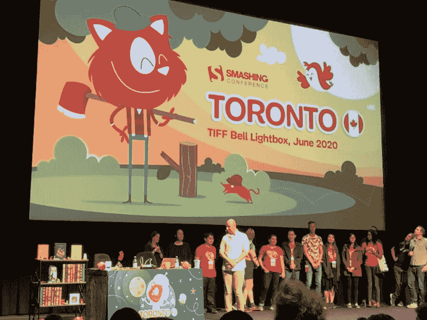

# 重温 2019 年多伦多 SmashingConf 的第二天

> 原文：<https://dev.to/solacedevs/recapping-day-2-of-smashingconf-toronto-2019-c0e>

我最近总结了我在多伦多粉碎会议第一天的经历，我不想让你失望，所以这里有一个第二天的快速总结。和以前一样，我在 Medium 上发表了一篇相当全面的文章。

第 2 天讨论了前端开发中的趋势主题，如服务人员、性能、CSS 网格、颜色系统以及基于组件的开发和设计。

这一天还有一位神秘的演讲者，他坦率地让我大吃一惊——著名的英国艺术家和书法家塞布·莱斯特。我被他的工作和演示迷住了，并带走了一些将重塑我工作方式的东西——比如知道什么时候停下来继续前进，以及在公司工作之外尝试想法如何让位于更具创造性和表现力的设计。

以下是我对其他演讲者的总结:

*   **对网格的热爱:**在短短的四十分钟内，就在我们眼前， [Jules Forrest](https://codepen.io/julesforrest/) 使用 CSS Grid 和 CodePen 将一份打印的餐厅菜单转换成了一个响应性网页。她强调了这样一个事实，过度创新并不总是必要的或好的，因为坚持通用的用户界面模式可以帮助用户更容易地浏览你的网站。
*   **潜入服务人员，现场:** [菲尔·纳什](https://philna.sh/)演示了如何使用“[服务人员](https://www.npmjs.com/package/service-worker-mock)”策略让网站离线工作。
*   **查看组件页面:**平面设计师[丹·罗斯](http://danroseonline.com/)然后分享了他对如何识别非内聚设计的常见症状的想法。他解释了[组件连接](https://weareadjacent.com/blog/component-connectivity/)如何帮助你优先考虑一致性，以在所有组件之间创建稳定的视觉流，同时与内容团队合作，因为内容驱动设计。
*   **色彩系统的秘密生活:**在本次会议中， [Diana Mounter](https://broccolini.net/) 展示了添加一项新功能的工作，该功能为用户提供了将 GitHub 的色彩主题从白色模式更改为深色模式的能力。她使用了一个 Gatsby 应用程序和一个 GitHub 样本库来演示更新企业级 web 应用程序配色方案的过程、技术和挑战。
*   **快速行动，不要弄坏东西:**在这个 40 分钟的会议中， [Scott Jehl](https://scottjehl.com/) 谈到了 web 性能方面的问题，并分享了一些改善它们的方法。一个例子是不管网络速度和设备类型如何都可以加速网站的“渐进增强”。

第二天以[拍照留念结束，](https://smashingconf.com/toronto-2019/photo-walk)可惜我们错过了，但这里有一张“粉碎家庭”的有趣照片粉碎家庭，感谢一场盛事！

回顾多伦多 2019 年 SmashingConf 第二天的帖子[首先出现在](https://solace.com/blog/smashingconf-toronto-2019-day-2/) [Solace](https://solace.com) 上。