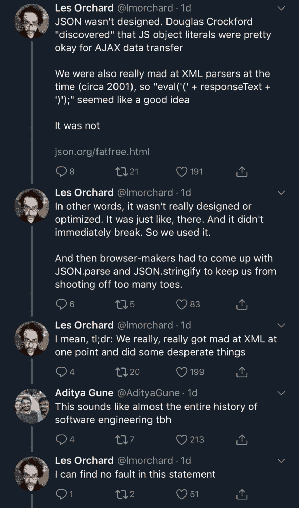

# 提取转换和加载第 2 部分——提交信息包和高级验证

> 原文：<https://dev.to/ryboflavin42/extract-transform-and-load-part-2-submission-information-packages-and-high-level-validation-106b>

提取转换和加载管道的前两个主要部分是提交信息包(SIP)和高级验证。本系列的第[篇文章](https://tenmilesquare.com/data-transform-and-load-overview/)中讨论了主要组件，以及提取转换和加载的好处和用法。建议读者在继续之前熟悉整个提取转换和加载过程。数据很重要，在本文中，主题是数据。

## 提交信息包

提交信息包，简称 SIP，是从数据伙伴提交到数据接收系统的实际数据。SIP 一词取自[开放档案信息标准](https://www.oclc.org/research/publications/library/2000/lavoie-oais.html) (OAIS)，该标准将其定义为

> 提交信息包(SIP):由生产商交付给 OAIS 的信息包，用于构建或更新一个或多个 AIP 和/或相关的描述性信息。

也就是说，提供给系统的数据用于创建一个或多个记录。为了讨论的目的，我们将扩展这个定义，并分成两部分:原始数据和数据端点

### 原始数据

原始数据是从数据合作伙伴向接收系统提供的数据文件。数据可以是单个数据文件、多个数据文件或一个包，其中通常包含数据文件和元数据或描述符文件。在 OAIS 系统中，SIP 通常

*   一堆不同格式的文件，
*   每个文件的描述符文件
*   包中所有文件的清单
*   认证文件或数字签名

在大多数接收系统中，数据只是一个或多个预定义的数据文件。

涉及原始数据时要问的问题是

*   行业中是否使用了任何特定的标准(行业 sop、模式、XSD、格式最佳实践)？
*   系统正在接收哪些数据类型(Excel、XML、JSON)
*   我们需要创建一个标准吗？或者我们需要简化现有的标准吗？
*   谁将提交数据？它是来自一个合作伙伴，还是可以由多个合作伙伴提交相同的数据类型。

#### 行业中有什么特殊的标准吗？

通常，第一个问题是“在这个行业中有什么特殊的标准吗？”是最好的起点。在更大的行业中，数据传输标准通常已经存在。这应该是这次讨论的起点。找出这个问题的最好方法是谷歌，询问行业专家，并查看数字零售来源的数据。

数据类型通常很容易通过回答行业标准问题来确定。通常使用 XML，但也可能使用 CSV 和固定宽度的文件格式。JSON 越来越受欢迎，但是在数据质量非常重要的行业中，由于其自由格式的性质，这种格式应该避免。然而，像 RelaxNG 这样的工具可以用来为 JSON 建立数据结构标准。这种工具的采用是有限的，并且用于某些编程语言的资源可能不可用或不完整。

#### 我们需要创建一个标准还是一个简化的标准？

问题“我们需要创建一个标准还是一个简化的标准？”通常来自两种情况之一

*   目前不存在标准
*   标准是存在的，但是它
    *   过于复杂
    *   它不再适合该行业的需求
    *   或者不太复杂的数据合作伙伴想要参与

创建新标准需要对领域的理解，并促进数据合作伙伴之间的交流。创建新标准时的最佳实践可以写满一本书，这超出了本文的范围。

第二种情况是标准已经存在，但要么过于复杂，不再适合行业需求，要么摄取系统试图允许较小的数据合作伙伴做出贡献。与第一种情况一样，在创建新标准时需要小心。然而，当构建一个试图允许小型数据合作伙伴做出贡献的系统时，经常会出现这样的情况，一些数据合作伙伴不具备实现大型标准的技术成熟度。解决方案通常是创建一个用户界面，允许合作伙伴手动输入数据，或者创建一个 CSV/Excel 模板，允许合作伙伴批量上传数据。简化格式时，重要的是该格式涵盖或强制要求较大格式的基本必需数据。

#### 谁将提交数据？

最后一个问题，“谁将提交数据？”将规定上述标准问题以及下一节数据端点。

### 数据端点

数据端点是数据伙伴发送数据的方式。有两种基本形式的数据端点，推和拉。

*注意:数据伙伴(系统发送响应)的数据检索也被认为是数据端点，但这不在本文的讨论范围之内。*

### 推

推送端点是数据伙伴发起请求并将数据发送到系统的地方。通常，这些类型的端点是 web 服务和 UI 输入。关于 REST、web 服务、UI 设计和最佳实践的文章很多，所以本文不会涉及这些。但是，建议端点仅仅是端点，它们不应该支配整个新的管道。应该注意将这些端点连接到数据管道中，并尽可能多地重用 ETL 组件。通常这意味着将数据映射到一个规范的。业务逻辑/规则是检查数据质量的地方，将逻辑保持在一个组件中使得系统易于维护并确保数据质量。如果用户界面

如果向数据合作伙伴提供 UI，特别是如果 CSV 上传组件可用，那么允许数据合作伙伴通过 UI 上传 XML 或 JSON 文件通常是好的。此外，当新的数据合作伙伴加入时，拥有允许合作伙伴验证数据而不将数据持久化到数据库的路径是非常有用的。

### 拉

拉端点是接收系统向各种数据伙伴请求数据的地方。这些拉取作业需要由系统调度和执行，并定期轮询合作系统。例如，当接收系统订阅 RSS 或 ATOM 等数据提要或来自数据源的数据抓取时。注意:大多数数据抓取端点不需要正式的接收管道，因为数据通常是非官方的，并且可能不是最佳质量。

#### SFTP/共享目录

一种混合方法是 SFTP 或共享目录。这要求数据合作伙伴和接收系统都进行拉取和推送。在这种情况下，数据伙伴会将数据推送到共享位置。然后，接收系统将轮询共享目录以接收新数据。

从共享位置提取数据时，最佳实践极其重要。需要考虑的事项有

*   子目录:这些用于将数据伙伴提交分解成逻辑块。最佳实践是使用唯一标识符或时间戳作为子目录的名称。拉取系统每次都要扫描旧数据。
*   批量完成文件。数据合作伙伴需要一种方式来告诉拉取系统数据批次已经准备好接收。如果拉取系统在推取系统仍在传输数据时开始扫描，可能会导致不良/不完整的批次。通常使用一个命名约定为“batch.complete”的空白文件。确保数据伙伴知道只有在所有数据完全传输后才创建 batch.complete 文件。
*   数据保留策略:随着时间的推移，共享目录会变得很大，导致拉取系统的性能问题或目录主机的维护成本。数据被接收后应该如何处理或应该在目录上存储多长时间的问题。摄取系统通常会在摄取成功完成后删除数据或将数据移动到另一个位置。*注意:如果数据无效，成功完成可能包含管道错误。但是如果出现未知的系统错误，比如数据库关闭，那么数据就不应该被删除。*

## 高级验证

高级验证严格处理这些问题

*   数据是否来自可信来源(即系统是否知道提交者)？
*   数据的格式是否已知？

### 数据来源可靠吗？

确定数据是否来自受信任者通常是直接的，并且解决方案已经众所周知。此问题的解决方案示例如下

*   访问控制列表(ACL)
*   API 键
*   用户登录凭据
*   FTP 凭据
*   SHA 键
*   等等

在更安全的情况下，可以使用数字签名和证书来确保数据不被篡改，并维护监管链。

### 数据的格式是否已知？

在这种情况下，我们讨论的是高级验证，它不关心业务规则或细粒度的验证，比如一本书是否包含书名和作者。然而，一些数据规范，如 XSD，将包括较低层次的验证。

各种数据格式的高级验证示例如下

**XML**

*   数据是否格式良好？
*   XSD 有效吗？
    *   需要指出的是，并非所有的 XSD 验证包都是一样的。如果 XSD 规范来自更高版本，Python 和 Java 中的一些 XSD 库可能无法捕捉所有规则。注意:大多数 Java 库都会验证这个规范。然而，大多数 python XML 处理库都依赖于 XMLLINT，它不能处理更多复杂的验证规则。

**CSV/EXCEL**

*   所有预期的标题列都存在吗？
*   列标题文本与预期的列标题文本匹配吗？
*   列是有序的吗？
*   是否至少有一行数据？

**文件格式**

*   文件扩展名是否与预期的扩展名匹配？
    *   这个真的很好恶搞。然而，当处理 CSV 或 Excel 时，大多数用户不够老练，无法更改文件扩展名，因为他们使用的是电子表格应用程序。这项检查确保他们没有意外上传错误的文件。
    *   存在检查和确定文件格式的工具，而不管文件扩展名如何，但是这些工具的占用空间通常很大，对于大多数数据管道来说被认为是多余的。

## 摘要

在使用提取、转换和加载系统时，我们关注的是接收数据的系统。这意味着数据是最重要的部分。首先考虑数据有助于让下游组件变得清晰。一定要回答问题

*   系统会摄取什么样的？
*   谁来提供这些数据？
*   数据合作伙伴将如何提供这些数据？
*   系统将如何验证数据是系统理解的格式。

有关提取转换和加载的更多信息，请务必阅读[提取转换和加载概述](https://tenmilesquare.com/data-transform-and-load-overview/)一文。也请注意本系列的第 3 部分规范转换。