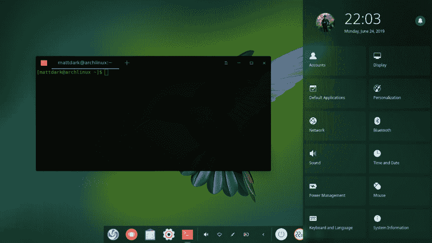

# 在曼哈罗用 Deepin 替换 Budgie

> 原文：<https://dev.to/mattdark/replace-budgie-with-deepin-on-manjaro-3eg9>

Manjaro 是一个基于 Arch Linux 的 GNU/Linux 发行版，它有一个滚动发布更新模型，这意味着系统和最终用户应用程序会收到持续的更新，因此当有新版本可用时，您不必重新安装系统。

Manjaro 可在不同的口味，一些最流行的桌面环境(DE)和窗口管理器，XFCE，KDE，建筑师和 GNOME，由项目本身维护；Mate，Cinnamon，Openbox，Awesome，BSPWM，i3 和 Deepin，那都是社区版。

自 2013 年以来，我一直在使用带有 [xfce](https://xfce.org/) 的 Manjaro，但去年我在一台联想 G480 上安装了 Manjaro Budgie，以尝试这种桌面环境，我听到了很好的评论。

Budgie 是一个桌面环境，由 Manjaro、Ubuntu 和其他发行版提供的 Budgie 版本的项目开发。

Manjaro 项目有一个 [wiki](https://wiki.manjaro.org/) ，如果你想安装多个桌面或者替换默认安装的桌面，你可以在那里找到如何安装这些 DEs 和窗口管理器的信息。

本周，我在宏碁 Aspire E11 上安装了 Arch Linux，花了一整天时间(已经 6 年没用过 Arch Linux 了)配置系统，最终让发行版与 Deepin DE 一起工作。

<figure>[](https://res.cloudinary.com/practicaldev/image/fetch/s--DwlcFbJm--/c_limit%2Cf_auto%2Cfl_progressive%2Cq_auto%2Cw_880/https://thepracticaldev.s3.amazonaws.com/i/gnn9cpjbzgdcah8kokqk.png)

<figcaption>Arch Linux+Deepin</figcaption>

T7】</figure>

Deepin 是基于 Debian 稳定分支的 GNU/Linux 发行版，由中国 Deepin 科技有限公司开发，专注于基于 Linux 的中文操作系统的研发和服务。Deepin 也是这个发行版的桌面环境的名字。

所以在安装了 Arch Linux 之后，我决定在 Manjaro 上用 Deepin 替换 Budgie。Manjaro 的 wiki 有一个部分，您可以找到安装任何其他桌面环境的说明。在安装之前，您需要删除与默认安装的 DE 相对应的包组和配置文件。

## 指令

### 卸载虎皮鹦鹉

*   首先，注销系统。
*   按`Ctrl + Alt + F1`(或 F1 到 F6 之间的任意键)打开 TTY。
*   使用具有超级用户权限的用户(您登录时使用的用户)再次登录。
*   卸载其他组件。

```
$ sudo pacman -Rsn budgie-extras
$ sudo pacman -Rsn gnome-terminal dconf-editor nautilus nautilus-admin nautilus-empty-file python-nautilus 
```

Enter fullscreen mode Exit fullscreen mode

*   卸载 Budgie。如果您要替换其他 DE，请转到 wiki 中的 **[安装桌面环境](https://wiki.manjaro.org/index.php?title=Install_Desktop_Environments)** 部分，了解哪些包。对于虎皮鹦鹉，删除以下内容:

```
$ sudo pacman -Rsn budgie-desktop network-manager-applet gnome-control-center gnome-screensaver gnome-calendar 
```

Enter fullscreen mode Exit fullscreen mode

*   移除 Budgie 的 LightDM 配置应用和主题。

```
$ sudo pacman -Rsn lightdm-slick-greeter lightdm-settings 
```

Enter fullscreen mode Exit fullscreen mode

*   删除曼加洛配置和虎皮鹦鹉的主题。

```
$ sudo pacman -Rsn manjaro-budgie-settings manjaro-settings-manager manjaro-setting-manager-notifier papirus-maia-icon-theme 
```

Enter fullscreen mode Exit fullscreen mode

*   卸载上述软件包后，请确保删除孤立的依赖项。

```
$ sudo pacman -Rsn $(sudo pacman -Qtdq) 
```

Enter fullscreen mode Exit fullscreen mode

*   删除为用户存储 DE 配置的文件。

```
$ rm ~/.config/dconf/user 
```

Enter fullscreen mode Exit fullscreen mode

### 安装 Deepin

*   安装 Deepin 的软件包组。

```
$ sudo pacman -S deepin 
```

Enter fullscreen mode Exit fullscreen mode

*   安装 deepin 应用程序套件的软件包组。

```
$ sudo pacman -S deepin-extra 
```

Enter fullscreen mode Exit fullscreen mode

*   安装 Manjaro 配置的包组，并为深化进行主题化

```
$ sudo pacman -S deepin-manjaro 
```

Enter fullscreen mode Exit fullscreen mode

*   然后编辑`/etc/lightdm/lightdm.conf`，在*下【座位:】**用**greeter-session = light DM-deepin-greeter**替换 greeter-session 设置。

*   重新启动，以使更改生效。

再次登录后，您最终将拥有一个工作桌面环境。
[T3】](https://res.cloudinary.com/practicaldev/image/fetch/s--kN2KtG7l--/c_limit%2Cf_auto%2Cfl_progressive%2Cq_auto%2Cw_880/https://thepracticaldev.s3.amazonaws.com/i/8a1in50cpsukejfl7ecw.png)