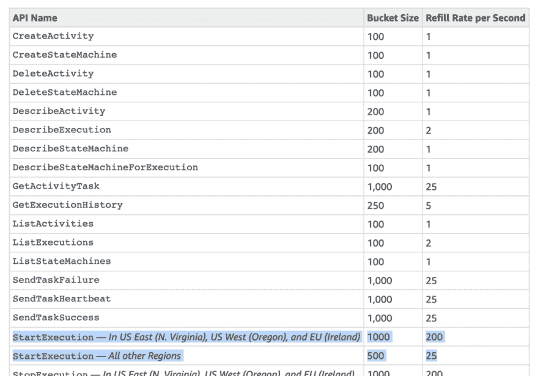
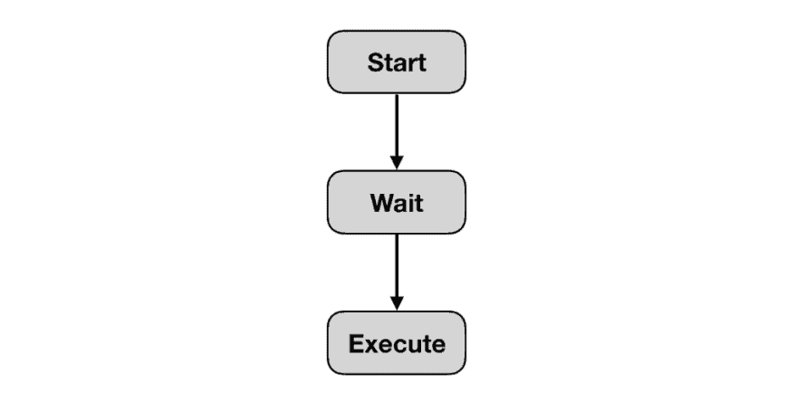

# 步骤作为一种特别的调度机制

> 原文：<https://dev.to/theburningmonk/step-functions-as-an-ad-hoc-scheduling-mechanism-5a51>

我们之前讨论过如何使用 [DynamoDB TTL](https://theburningmonk.com/2019/03/dynamodb-ttl-as-an-ad-hoc-scheduling-mechanism/) 以及 [CloudWatch Events](https://dev.to/theburningmonk/using-cloudwatch-and-lambda-to-implement-ad-hoc-scheduling-46jo) 来实现一个特别的调度系统。现在，让我们看看如何使用 AWS Step 函数实现相同的系统，以及这种方法的优缺点。

和以前一样，我们将使用以下标准评估这种方法:

*   **精度**:任务的执行离我的预定时间有多近？越近越好。
*   **Scale(未完成任务的数量)**:解决方案能否扩展以支持许多未完成的任务。即已调度但尚未执行的任务。
*   **扩展(热点):**该解决方案可以扩展到在大约同一时间执行许多任务吗？例如，数百万人设置了一个计时器来提醒自己观看超级碗，所以所有的计时器都在接近开球时间时启动。

### 用步进功能等待

阶跃函数的一个低调的超能力是[等待状态](https://docs.aws.amazon.com/step-functions/latest/dg/amazon-states-language-wait-state.html)。它允许你暂停一个工作流程长达一整年！

通常情况下，Lambda 很难实现空闲等待。但是有了 Step 函数，就像几行 JSON 一样简单:

```
"wait_ten_seconds": { 
  "Type": "Wait",
  "Seconds": 10,
  "Next": "NextState"
} 
```

您也可以等到特定的 UTC 时间戳:

```
"wait_until" : {
  "Type": "Wait", 
  "Timestamp": "2016-03-14T01:59:00Z", 
  "Next": "NextState"
} 
```

您也可以通过用`Seconds`替换`SecondsPath`，或者用`Timestamp`替换`TimestampPath`来参数化等待/直到多长时间。这允许您使用状态机输入来控制等待时间。

例如，我可以将一个`expirydate`传递给状态机，并使用它来控制何时继续工作流。

```
"wait_until" : { 
  "Type": "Wait", 
  "TimestampPath": "$.expirydate", 
  "Next": "NextState"
} 
```

为了调度一个特别的任务，我可以启动一个状态机执行，并使用一个`wait`状态来暂停执行，直到指定的日期和时间。

#### 精度

我启动了 1000 次状态机执行，每次等待 1 到 10 分钟来调用一个 Lambda 函数。这是将实际调用的时间戳与预期时间戳进行比较的结果。

[](https://res.cloudinary.com/practicaldev/image/fetch/s--KJ7S3sHx--/c_limit%2Cf_auto%2Cfl_progressive%2Cq_auto%2Cw_880/https://theburningmonk.com/wp-content/uploads/2019/06/img_5d15407da0550.png)

如你所见，这种方法的精确度非常高。

#### 可扩展性(热点)

如果您需要在突发中调度大量任务，那么您需要考虑 API 对`StartExecution`请求数量的限制。对于大多数地区来说，这是从 500 英镑开始，以每秒 25 英镑的速度补充。

是的，这是一个**软限制**，因此您可以通过支持中心请求提高限制。但鉴于违约限额如此之低，你不太可能大幅提高它们。因此，如果您需要支持每秒调度成千上万个任务，那么这种方法可能不适合您。

[](https://res.cloudinary.com/practicaldev/image/fetch/s--dYVwtCgP--/c_limit%2Cf_auto%2Cfl_progressive%2Cq_auto%2Cw_880/https://theburningmonk.com/wp-content/uploads/2019/06/img_5d1540905dd32.png)

当`wait`状态到期时，我们的预定任务将会执行。但是，如果您已经安排了大量的任务同时执行，那么它们可能会受到限制。因为状态转换的次数有一个硬限制(见下文)。

[](https://res.cloudinary.com/practicaldev/image/fetch/s--OuCDIT4H--/c_limit%2Cf_auto%2Cfl_progressive%2Cq_auto%2Cw_880/https://theburningmonk.com/wp-content/uploads/2019/06/img_5d1540ad31003.png)

如您所见，这个限制很宽松，对于大多数工作负载来说不会造成问题。但是，如果您需要安排倾向于聚集在一起的临时任务，那么您需要考虑这一点。例如，一个让用户安排特别提醒的系统可以体验围绕重要事件的大型热点——超级碗、总决赛、冠军联赛决赛等。

#### 可扩展性(打开任务的数量)

Step Functions 还有 1，000，000 个打开执行的硬限制，即已经开始但尚未完成的执行。这将是我们可以使用阶跃函数调度的最大未完成任务数。

[](https://res.cloudinary.com/practicaldev/image/fetch/s--UbOr1p69--/c_limit%2Cf_auto%2Cfl_progressive%2Cq_auto%2Cw_880/https://theburningmonk.com/wp-content/uploads/2019/06/img_5d1540c4c28a2.png)

对大多数人来说，一百万个开放任务应该足够了。但是，因为您可以等待长达一年的时间，所以它为您留下了一个很大的时间窗口，可以累积未完成的任务。有许多用例需要安排数百万个开放的任务。

幸运的是，这个限制有变通办法。我们可以将其用作“最后一英里”解决方案，而不是使用阶跃函数来提供端到端解决方案。大卫·威尔斯的这个好建议值得称赞。

> 帖子不错！ [@theburningmonk](https://twitter.com/theburningmonk?ref_src=twsrc%5Etfw)
> 
> 为此，我使用了迪纳摩 TTL 和步进函数。
> 
> 提前 48 小时终止 dynamo 项目，并使用 step 函数`Wait`类型和 unix 时间戳设置计划项目在给定时间戳发送
> 
> —大卫·威尔斯([@大卫·威尔斯](https://dev.to/davidwells))[2019 年 3 月 5 日](https://twitter.com/DavidWells/status/1102724123325685761?ref_src=twsrc%5Etfw)

这种变通方法还缓解了在突发事件中启动太多任务的规模限制。我们将把项目写到 DynamoDB(用 TTL ),而不是立即开始执行 Step 函数。

DynamoDB 具有很强的可扩展性，并且对打开的任务数量没有限制。它缺乏精确性([官方文档](https://docs.aws.amazon.com/amazondynamodb/latest/developerguide/howitworks-ttl.html)仅确认数据通常在 48 小时内被删除)通过让步骤函数执行执行的“最后一英里”来解决。这种结合使得这两种方法可以很好地互补。

然而，它并不是防弹的。因为您使用阶跃函数来执行调度任务，所以您仍然受到状态转换的硬限制的约束。此外，如果所有任务都计划在 48 小时内执行(并且您关心精度)，那么您根本不能依赖 DynamoDB TTL。

### 成本

关于 Step 函数需要记住的另一个警告是，它是 AWS 上最昂贵的服务之一。一百万次状态转换将花费您 25 美元，这是 Lambda 调用成本的许多倍。

用于预定任务的最简单的状态机需要 3 次状态转换。因此，一百万个预定任务仅步骤函数就要花费你 75 美元！然后，你还必须考虑 Lambda 和其他外围服务(如 CloudWatch 日志)的成本。

[](https://res.cloudinary.com/practicaldev/image/fetch/s--WAzzbpT3--/c_limit%2Cf_auto%2Cfl_progressive%2Cq_auto%2Cw_880/https://theburningmonk.com/wp-content/uploads/2019/06/img_5d1541137354f.png)

### 总结

在调度临时任务时，阶跃函数带来了很多好处:

*   您可以将任务安排在一年后执行
*   预定任务的时间非常精确
*   从 Step 函数中获得的所有常见的可视化、日志记录和审计功能

然而，它也不是没有局限性。阶跃函数有许多软限制和硬限制。虽然这些限制对于大多数用例来说应该足够高了，但这并不意味着您只能扩展到某个点。

但是，您可以解决其中一些问题:

*   对公开执行次数的限制
*   对`startExecutions` API 请求的限制

如果将阶跃函数与 DynamoDB TTL 结合使用。

最后，与其他方法不同，这种方法的成本是一个更大的问题。这是因为 Step 函数是一种相对昂贵的服务。这就是为什么我一般[建议主要对业务关键型工作负载使用阶跃函数](https://epsagon.com/blog/hitchhikers-guide-to-aws-step-functions/)。

### 阅读其他方法

*   [DynamoDB TTL 作为临时调度机制](https://theburningmonk.com/2019/03/dynamodb-ttl-as-an-ad-hoc-scheduling-mechanism/)
*   [使用 CloudWatch 和 Lambda 实现临时调度](https://dev.to/theburningmonk/using-cloudwatch-and-lambda-to-implement-ad-hoc-scheduling-46jo)