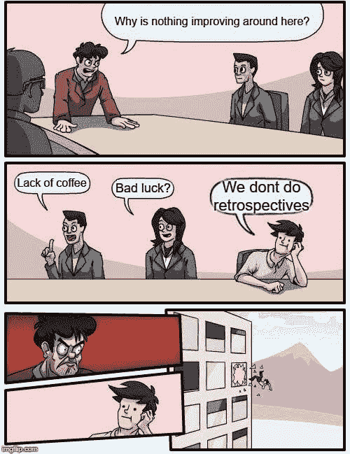

# 👆等级上升👆你的回顾！(以及为什么您应该运行一个！).

> 原文：<https://dev.to/yerac/level-up-your-retrospectives-and-why-you-should-run-one-1bgf>

不管你使用哪种敏捷方法来交付你的软件-*你正在使用一种，对吗*？回顾是你能参加的最重要的会议之一。可悲的是，这种会议可能会变成无组织的噩梦，如果你从中得不到任何东西，那还有什么意义呢？这是一个 5 分钟的快速指南，帮助你提高回顾水平，或者说服你，如果你还没有进行回顾的话。

## 回顾展是为了什么？我为什么要运行一个？

顾名思义，回顾展是对过去的回顾。在这种情况下，团队有机会在冲刺/里程碑结束时聚在一起，讨论哪些做得好，哪些做得不好，更重要的是，可以做些什么来改进。它应该给*整个*团队一个在安全的空间发表意见的机会，并提供诚实的反馈，用于改进未来的迭代/冲刺。

**TL；DR:回顾的目的是识别增量改进，使下一次迭代/冲刺比上一次更好。**

### 快速概况介绍

谁在经营它？:按理说，会议应该由团队领导/Scrum master 等主持。然而，它可以由任何人运行，因为它是整个团队拥有的公开讨论。理想情况下，应该由一个人来负责，以确保会议保持专注，并跟踪任何结果。

**谁参加:**回顾应该由整个交付团队参加。业务分析师、开发人员、测试人员、项目经理、产品负责人等。凡是被 ***直接*** 参与运送的物品。此会议不适合更广泛的群体，如利益相关者，因为这通常会限制诚实。

**何时运行:**:回顾应该在迭代开始时运行——回顾上一次迭代。通常，这将在任何 sprint-review/show & tell 会议之后运行，并且利益相关者已经离开房间。

**应该多久:**保持专注！每位与会者 5 分钟。在一个“理想规模”的 SCRUM 团队中，这不应该超过 30-45 分钟。

## 一个有效的回顾模板

这些年来，我们在回顾中尝试了许多不同的方法。主题一直是一样的，重点是什么进展顺利，什么不顺利，我们可以改变什么。

最近，我们引入了一个新的模板，因为回顾会变得有点不集中，尽管他们拿出了坚实的行动，但人们似乎不太愿意自我判断，除非得到提示。

在此之前我们也使用过“红绿灯法”，也称为“开始、停止、继续”。我对 SSC 的看法是，它有可能会更快出轨，而且感觉不那么专注。SSC 有时也会被一两个人主导，我觉得我有时会排斥其他人。这就是为什么我喜欢 4 个问题的方法。

### 第 4( *ish* )题法

#### 第 1 部分:针对每位团队成员的问题

围着桌子，每个人回答以下 4 个焦点。

*   对你来说，这次迭代的成功之处是什么？
    *   例如:他们引以为豪的一项特殊工作，他们很快解决的一个 bug，等等。这很重要，因为它允许团队成员炫耀或幸灾乐祸一点。如果你不让人们讨论成功，他们就不会想谈论失败！
*   **你这次**迭代的失败是什么，**为什么**？这本来可以避免吗？
    *   比如:“因为 X，没有完成约定的工作”，或者“在 Y 上花的时间比他们想象的多”。他们应该知道为什么会发生这种情况，以及理想情况下我们可以做些什么来阻止它再次发生。
*   如果你可以改变上一次迭代的一件事，那会是什么？
    *   例如:“更快地分解工作项目”，“在会议上花更少的时间”
*   你学到什么了吗？
    *   重要的是你希望你的团队成员成长。无论是技术知识还是产品知识。

答案应该是简单的一句俏皮话，并可能引发小组讨论。例如，假设有人说他们感觉迭代的一个失败是他们不能完成一项工作，因为需求在最后一刻改变了。你可能会问为什么会发生这种情况，我们将来可以做些什么来减轻这种情况。

**保持任何跟进讨论简短明了**。有人很容易“下兔子洞”。进行任何超过几分钟的离线讨论，或者在结束时再回来讨论。毕竟，你不想把所有的时间都花在一个人身上！

运行会话的人应该捕获所有的失败和变更。

#### 举例:

*   对你来说，这次迭代的成功之处是什么？
    *   对我来说，这个 sprint 的一个成功之处在于，我们很好地解决了 SLA 中的一个关键优先级项目，并且拥有一个反馈良好的满意客户。
*   对你来说，这次迭代的**失败**是什么，**为什么**？这本来可以避免吗？
    *   **什么:**这次冲刺对我来说是一次失败，由于缺乏变更控制资源，我不能足够快地将我的变更引入测试环境。**原因:**变更控制人员无法在短时间内到位。**行动**我们应该在冲刺阶段的开始就安排好资源能力。
*   如果你可以改变上一次迭代的一件事，那会是什么？
    *   不适用的
*   你学到什么了吗？
    *   我了解了(物品)的工作原理。

这可能引发了关于我们需要如何思考如何通过另一个部门部署变更的讨论，一个行动将是我们将做一些预先安排。

#### 第二部分:行动起来！

如果没有人在本次会议后采取任何行动，整个过程将毫无意义！

在第 1 部分中，主持会议的人应该记录下所有可能的行动。

会议负责人应快速重复所捕获的行动，并作为团队决定；

*   这是我们应该立即做的事情，还是放在待办事项中？
*   谁负责这项行动？

#### 第三部分:咖啡。

你活该，去你的！

虽然，天下没有免费的咖啡。实际的第三项是**跟进行动**。

## 你可能遇到的问题:

**人们不想谈论失败**:也许人们觉得自己在被评判。为了应对这一点，真正把 sprint 的成功作为主要话题&促进开放/安全的环境。如果个人不想开诚布公，会议主持人可以推动公开对话，例如“你认为我们(作为一个团队)为什么没有实现 X”

敌意:确保任何反馈都是建设性的，没有责备。不要把失败归咎于另一个团队成员。永远用“我们”而不是“你”。提倡集体所有制！

**缺乏互动**有些人性格内向，可能不想加入公开讨论。如果这是一个问题，建议人们在便利贴上写下答案，并让会议主要由团队领导主持(整理和讨论)。仍然让他们选择在会议中分享或更改他们的答案。

变成了一场哀鸣。这件很容易穿进去。为了避免这种情况，提倡建设性的讨论。确保跟进行动，否则人们可能不会认真对待会议，而只是将它作为一个发泄的机会。

## 回顾你的回顾

没有“最佳”的方式来进行回顾会议。每个团队都是不同的，有时你可能会发现这种形式并不适合参加的人。如果它不适合你，不要放弃它，适应它！YMMV。

帖子[👆等级上升👆你的回顾！(以及为什么您应该运行一个！).](http://yer.ac/blog/2019/06/27/236/)最早出现在 [yer.ac |一个开发者的冒险，等等。](http://yer.ac/blog)。