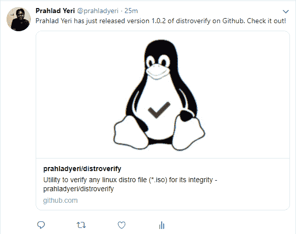

# 宣布 GH _ announce——一个 Python 机器人，每当你在 github 上发布一个版本，它就会发布一条 tweet！

> 原文：<https://dev.to/prahladyeri/announcing-ghannounce-a-python-bot-that-posts-a-tweet-each-time-you-make-a-release-on-github-5abc>

*(原贴于[prahladyeri.com](https://prahladyeri.com/blog/2019/06/announcing-gh_announce-a-python-bot-that-posts-a-tweet-each-time-you-make-a-release-on-github.html))*

我碰巧在 github 上维护了很多 python 项目，比如[discoverify](https://github.com/prahladyeri/distroverify)和 [vtscan](https://github.com/prahladyeri/vtscan) 。每次我在 Github 上发布带标签的消息，我都要发一条这样的状态推文，让人们知道:

[](https://res.cloudinary.com/practicaldev/image/fetch/s--fu8bGWL3--/c_limit%2Cf_auto%2Cfl_progressive%2Cq_auto%2Cw_880/https://prahladyeri.com/uploads/distroverify_tweet.png)

所以今天我想，为什么不写一个 python 机器人来自动化这个过程呢？

1.  在我的计算机上作为后台 cron 运行。
2.  一直在检查我的 github 发布标签。
3.  每当有新的发布，就用上面的格式为我发布一条新的推文。

这种努力的结果就是 [gh_announce](https://github.com/prahladyeri/gh_announce) 。我为 twitter api 使用了流行的 [tweepy](https://github.com/tweepy/tweepy) 库和我自己编写的包 [cfgsaver](https://github.com/prahladyeri/cfgsaver/) 来处理配置数据，比如我的 github 用户名、twitter api 凭证等。

一旦完成，只需要浏览 github 用户事件 api，检查是否有新的标签发布:

```
def check_activity():
    url = "https://api.github.com/users/%s/events" % config['github_username']
    resp = requests.get(url)
    acts = json.loads(resp.text)
    if len(acts) == 0:
        print("Zero events found, is this the correct github repo I'm looking at?")
        print("Run the program again with --config parameter to set the correct values")
        return
    for i in range(len(acts)):
        act = acts[i]
        if act['type'] == 'CreateEvent': #latest tag
            payload = act['payload']
            if payload['ref_type'] != 'tag':
                continue
            repo = act['repo']
            repo_url = "https://github.com/" + repo['name']
            tag_name = payload['ref']

            dt = parse_date(act['created_at'])
            delta = datetime.now() - dt
            days = delta.days
            hrs = delta.seconds // 3600
            mins = (delta.seconds // 60) % 60

            if delta.days >= 2: #this push is more than two days old, so just ignore
                continue

            tweet = False
            #check local config data to know whether we've already tweeted for this release
            if not 'pushes' in config:
                pushes = [act['id']]
                tweet = True
            else:
                pushes = config['pushes']
                if act['id'] in pushes:
                    pass #do nothing
                else:
                    tweet = True
                    pushes.append(act['id'])
            if tweet:
                try:
                    tw_announce(tag_name, repo['name'], repo_url)
                except Exception as ex:
                    print("Error occurred: ", str(ex))
            config['pushes'] = pushes
            cfgsaver.save(pkg_name, config) 
```

<svg width="20px" height="20px" viewBox="0 0 24 24" class="highlight-action crayons-icon highlight-action--fullscreen-on"><title>Enter fullscreen mode</title></svg> <svg width="20px" height="20px" viewBox="0 0 24 24" class="highlight-action crayons-icon highlight-action--fullscreen-off"><title>Exit fullscreen mode</title></svg>

正如你所看到的，我忽略了超过两天的推送，因为它们可能已经在推特上发布或讨论过，可以在第一次运行时忽略。为了制作实际的 tweet，我使用`tweepy`库的`OAuthHandler`进行认证，然后调用`api.update_status()`方法来制作实际的 tweet。

```
def tw_announce(tag_name, repo_name, repo_url):
    ss = "I have" if (config['Full_Name'] == None or config['Full_Name'] == "") else config["Full_Name"] + " has"
    ss += " just released version %s of %s on Github. Check it out! %s" % (tag_name, repo_name.split("/")[1], repo_url)
    #print("TWEETING: " + ss) 
    if config['twitter_consumer_api_key'] == "":
        print("twitter api credentials missing")
        return
    auth = tweepy.OAuthHandler(config['twitter_consumer_api_key'], 
        config['twitter_consumer_secret'],
        )
    auth.set_access_token(config['twitter_access_token'], config['twitter_access_token_secret'])
    api = tweepy.API(auth)
    api.update_status(ss)
    print("successfully updated status for repo: %s, tag: %s" % (repo_name, tag_name)) 
```

<svg width="20px" height="20px" viewBox="0 0 24 24" class="highlight-action crayons-icon highlight-action--fullscreen-on"><title>Enter fullscreen mode</title></svg> <svg width="20px" height="20px" viewBox="0 0 24 24" class="highlight-action crayons-icon highlight-action--fullscreen-off"><title>Exit fullscreen mode</title></svg>

如果你打算使用 tweepy 库来代表你发布推文，你需要在[https://developer.twitter.com/apps](https://developer.twitter.com/apps)上注册你自己的应用程序，并获得这四个证书:

```
'twitter_consumer_api_key',
'twitter_consumer_secret',
'twitter_access_token',
'twitter_access_token_secret', 
```

<svg width="20px" height="20px" viewBox="0 0 24 24" class="highlight-action crayons-icon highlight-action--fullscreen-on"><title>Enter fullscreen mode</title></svg> <svg width="20px" height="20px" viewBox="0 0 24 24" class="highlight-action crayons-icon highlight-action--fullscreen-off"><title>Exit fullscreen mode</title></svg>

当然，应用程序会在第一次运行时提示这样做。tweet 的措辞会注意是否进入了`Full_Name`配置设置。如果它在那里，状态以“`Full_Name`刚刚在 Github 上发布了版本`tag`”，否则为“我刚刚在 Github 上发布了版本……”。因此，您可以根据您想要的状态结构将`Full_Name`设置留空。

因为我非常喜欢开源社区，所以我想把这个送给你！`gh_announce`是开源的，并且得到了 MIT 的许可，您只需运行:

```
pip install gh_announce 
```

<svg width="20px" height="20px" viewBox="0 0 24 24" class="highlight-action crayons-icon highlight-action--fullscreen-on"><title>Enter fullscreen mode</title></svg> <svg width="20px" height="20px" viewBox="0 0 24 24" class="highlight-action crayons-icon highlight-action--fullscreen-off"><title>Exit fullscreen mode</title></svg>

如果你喜欢这个工具，请告诉我，这将鼓励我在未来继续写更多这样的工具！