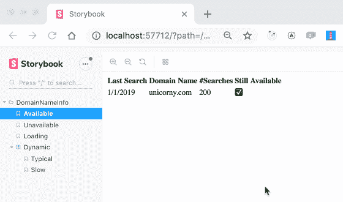

# 在测试中降低嘲笑的痛苦，反应过来道

> 原文：<https://dev.to/deanius/test-oop-better-by-encapsulating-less-like-react-18ej>

你有没有想过，当你搜索一个可能从 GoDaddy 这样的网站购买的域名时，如果他们的一个管理员正在查看最近搜索的页面，看看他们是否想购买你搜索的域名？也许我是偏执狂，但我完全想象他们看着这一页:

| 上次搜索 | 域名 | 搜索次数 | 仍然可用(Ajax) |
| --- | --- | --- | --- |
| 1/1/2019 | unicorn.com | One thousand | 🚫 |
| 1/1/2019 | unicornius.com | Two | 981 号房 |
| 1/2/2019 | unicorny.com | Two hundred | 981 号房 |

我们的目标是研究构建表示表中某一行的组件的几种不同方法，并看看这些解决方案在可测试性方面有何不同。因此，我们将能够为这项工作选择正确的风格，并可能以更好的设计而告终。

为了让它变得有趣，让我们

*   用纯 JavaScript 编写(没有框架)
*   仅通过名为`lookup`的异步函数填充“仍然可用”字段
*   担心以后更新视图——只需关注对象的状态管理。

一个合理的 OO 实践者可能会写这样的代码:

```
class DomainSearchInfo {
  constructor(lastSearchDate, domain, searchCount) {
    this.lastSearchDate = lastSearchDate;
    this.domain = domain;
    this.searchCount = searchCount;
    this.stillAvailable = null; // unknown, initially

    this.checkAvailability();
  }
  checkAvailability() {
    this.lookup(this.domain).then(({ isAvailable }) => {
      this.stillAvailable = isAvailable;
    });
  }
  lookup(domain) {
    return axios.get('http://someurl.com?domain=' + domain);
  }
  // rendering omitted
} 
```

但是他们在尝试测试时遇到了麻烦。

## 你是在嘲讽我吗？

他们会有类似于*我如何模仿“axios . get”*这样的问题，并开始花时间挖掘模仿库文档(我们都花了时间，但有没有感觉到有所收获？).当他们最终完成模拟实现时，发现他们期望的某些参数的方式有问题，他们需要调整模拟。该领域的一些倡导者如 Eric Elliott 说[嘲讽是一种气味](https://medium.com/javascript-scene/mocking-is-a-code-smell-944a70c90a6a)。我们能做些什么来减轻嘲笑的痛苦吗？

让我们看看 React [功能组件](https://www.robinwieruch.de/react-function-component/)如何以较低的嘲讽痛苦做同样的事情:

```
const DomainSearchInfo = ({
  lastSearchDate,
  domain,
  searchCount,
  // default to this implementation of lookup
  lookup = domain => axios.get(...)
}) => {
  const [isAvailable, setAvailable] = useState(null);

  // useEffect hook omitted
  lookup(domain).then(({ isAvailable }) => {
    setAvailable(isAvailable);
  });

  // rendering omitted
}; 
```

主要区别在于，在 React 中，组件没有完全封装在`lookup`方法周围。它提供了一个默认的实现，但是允许它的环境覆盖它。正如迈克尔·韦斯特斯特在 [UI 中事后想起的](https://medium.com/@mweststrate/ui-as-an-afterthought-26e5d2bb24d6)所说，你的代码总是运行在至少两种环境中——你的生产应用和你的测试套件。React 代码本质上是可测试的，没有模仿，因为它允许您注入任何您想要的 lookup 实现。像以下任何一种:

```
const delayedAvailabilityCheck = (isAvailable, delay) =>
  new Promise(resolve => {
    setTimeout(() => resolve({ isAvailable }), delay);
  });

// Instant pass/fail
const immediateAvailabilityCheck = isAvailable => {
  return Promise.resolve({ isAvailable });
};

// Typical
const shortDelayCheck = isAvailable =>
  delayedAvailabilityCheck(isAvailable, 200);

// Slow connection
const longDelayCheck = isAvailable =>
  delayedAvailabilityCheck(isAvailable, 5000); 
```

我说了，注入一个功能吗？就像依赖注入一样？是的，但是是轻便的那种，不是有棱角的，或者弹簧的那种。简单的函数式编程概念，即组件可以接收函数和数据作为参数。这是你在 OOP 中可以自由做的事情——它只是值得重复，因为它不是典型的。但是，如果有用，你就应该去做。

现在，依赖注入对于 React 开发人员来说已经不是什么新鲜事了。但是新的是评估它对测试的影响，特别是一种叫做 Storybook 的工具中的视觉测试。

## 故事书的故事

我重新发现这种注入功能道具的模式的原因之一，是为了给我的团队在故事书中编写的故事带来更多的生命。故事书([https://storybook.js.org](https://storybook.js.org))对于你的视觉设计就像单元测试对于你的逻辑一样。你可以用它来布局应用程序的所有可视状态，并使之具有风格——不需要四处点击——只需直接跳转到该状态:

在处理异步代码时，经常会想到的一件事是，你的加载状态需要和其他状态一样设计。我们只是不太经常在我们快速开发的本地网络连接计算机上看到这些状态！

如果我们在 Storybook 中制作我们的 DomainNameInfo 组件，如果我们能够控制可用性查找的解析速度，并为每个速度编写一个故事，那该有多酷？

它看起来像这样:

[](https://res.cloudinary.com/practicaldev/image/fetch/s--J-_tRspC--/c_limit%2Cf_auto%2Cfl_progressive%2Cq_66%2Cw_880/https://cl.ly/54c86393ba69/Screen%25252520Recording%252525202019-06-26%25252520at%2525252004.35%25252520PM.gif)

我最近为我的团队实现了这一点，我们能够确定准确的 UI 外观和感觉，即使有不同的时间场景。

*奖励:*如果你想测试一个实际接收多个事件或道具的组件，并且熟悉 RxJS，我可以向你展示一个包装器组件，让你用一个可观察到的道具来控制一个故事书故事！但那可能要等到另一篇博文了:)

# 总结:传入函数解决您的测试难题

简而言之，将功能实现直接编码到组件中的常见 OOP 实践是有成本的——需要使用模拟工具而不是常规编程技术来设置测试状态的成本。相比之下，依赖注入的实践，以其将功能传递给组件的基本形式，保持了事物的可测试性，以及在 Storybook 等工具中的可视化。这允许你编码并验证你的用户**将**遇到的所有可能性。额外的好处是，通过一种简单的方式(与嘲笑相比)来设置不同的场景，你会更倾向于尝试不同的场景，而不是编写每个场景都很痛苦。嘿，也许你甚至会写一个域名查找失败的案例！

也许没有人真的在那里窥探你的域名查找。但是有了这些节省时间的技巧，也许你可以在更短的时间内推出你自己的、经过良好测试的。如果你尝试，我不会嘲笑你。