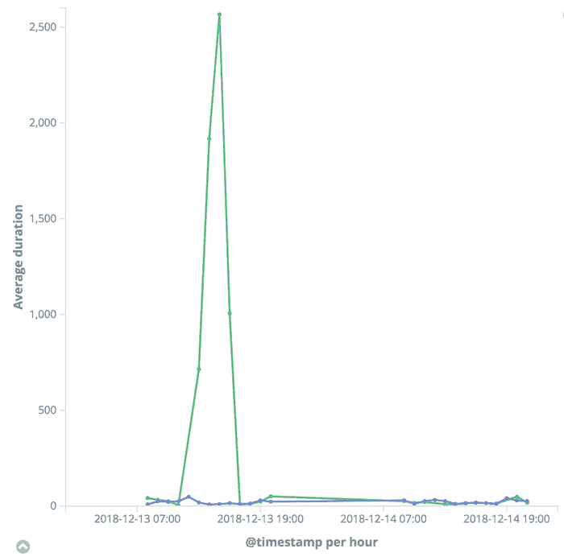

# 整理后用吸尘器打扫

> 原文：<https://dev.to/optoro_engineering/vacuum-after-you-tidy-up-71i>

关于数据迁移、突发性能问题以及我们如何解决该问题的故事。

在 Optoro，我们从客户那里收集了大量数据。在理想情况下，所有这些数据都完全符合我们的模式，但事实往往并非如此。我们在 Rails 应用程序中使用的一种常见技术是将额外的数据存储在一个“无所不包”的数据库列中，比如一个序列化散列或一个 jsonb 列。我们不希望将任何客户数据丢在地上，以防以后需要。

在这个例子中，我们有一个名为 OrderItem 的 ActiveRecord 模型，它有一个名为`extra_data`的 [postgres jsonb](https://www.postgresql.org/docs/current/datatype-json.html) 属性。填充`extra_data`的代码如下所示:

```
known_attributes = attributes.slice(*OrderItem.column_names.map(&:to_sym))
extra_attributes = attributes.except(*OrderItem.column_names.map(&:to_sym))

known_attributes[:extra_data] = extra_attributes

OrderItem.create(known_attributes) 
```

以这种方式存储额外的字段允许我们在需要时重新访问这些数据。有时，我们意识到这些特定于客户的字段中有一个非常适合我们的领域模型。当这种情况发生时，我们想把它变成一个合适的数据库列。程序相当简单:

1.  运行数据库迁移以添加新列
2.  定期运行脚本，将数据从 jsonb 移动到新列
3.  更改代码以开始使用新列

我们最近对一个名为`purchase_order_number`的字段执行了这个过程，在此期间我们迁移了大约 450 万行数据。不久之后，我们公司的另一个团队告诉我们，通过这个新字段进行查询非常慢。他们甚至制作了一张图表来支持这一说法。绿线显示包含`purchase_order_number`的查询，蓝线显示不包含它的查询。`purchase_order_number`的查询平均耗时 2.4 秒。不好！

[](https://res.cloudinary.com/practicaldev/image/fetch/s--OpudATqf--/c_limit%2Cf_auto%2Cfl_progressive%2Cq_auto%2Cw_880/https://thepracticaldev.s3.amazonaws.com/i/uiwn9u6k5bq5kii3sp4i.png)

我们的第一个想法是:“我们肯定索引了那个专栏”。对数据库模式的快速检查表明。

下一个调试步骤是使用 postgres 的[解释](https://www.postgresql.org/docs/current/sql-explain.html)功能。我们将查询缩减到最简单的形式，并对其进行解释分析。

```
EXPLAIN ANALYZE select * from order_items
                join orders on order_items.order_id = orders.id
                where order_items.purchase_order_number = 'PO00000001';

                                                                    QUERY PLAN
--------------------------------------------------------------------------------------------------------------------------------------------------------------
 Hash Join  (cost=512087.46..1266205.21 rows=23649 width=69) (actual time=2630.284..2813.946 rows=1 loops=1)
   Hash Cond: (order_items.order_id = orders.id)
   ->  Bitmap Heap Scan on order_items  (cost=6553.11..726261.45 rows=341748 width=4) (actual time=0.065..0.067 rows=1 loops=1)
         Recheck Cond: ((purchase_order_number)::text = 'PO00000001'::text)
         Heap Blocks: exact=1
         ->  Bitmap Index Scan on index_order_items_on_purchase_order_number  (cost=0.00..6467.68 rows=341748 width=0) (actual time=0.057..0.057 rows=1 loops=1)
               Index Cond: ((purchase_order_number)::text = 'PO00000001'::text)
   ->  Hash  (cost=444843.38..444843.38 rows=2505917 width=69) (actual time=1557.832..1557.832 rows=2545639 loops=1)
         Buckets: 524288 (originally 524288)  Batches: 16 (originally 8)  Memory Usage: 36865kB
         ->  Bitmap Heap Scan on orders  (cost=54361.42..444843.38 rows=2505917 width=69) (actual time=228.596..694.259 rows=2545639 loops=1)
               Heap Blocks: exact=45059

 Planning time: 0.689 ms
 Execution time: 2821.106 ms
(16 rows) 
```

我不敢说我理解这个查询计划的复杂性，但是它看起来不是最理想的。请注意 2821.106 毫秒的执行时间，对于查询一个索引列来说，这似乎是一个非常长的执行时间。它也与之前报告的响应时间吻合得很好。

经过一些额外的实验后，我的一个队友(他对 postgres 更熟悉)建议运行真空分析。来自 postgres 文档:

> VACUUM 回收死元组占用的存储空间。在正常的 PostgreSQL 操作中，被更新删除或废弃的元组不会被物理地从它们的表中删除；它们会一直存在，直到真空完成。因此有必要定期清理，尤其是在**频繁更新的表上。**

经常更新的表格...当我们迁移`purchase_order_number`字段时，我们仅仅更新了大约 450 万行。在文档的后面部分:

> 分析更新计划程序使用的统计数据，以确定执行查询的最有效方式。

这可以解释我们上面看到的可疑的查询计划。

怀着期待和屏息，我们运行了真空分析仪(花了一段时间才完成)。后来，我们重新运行我们的查询。

```
EXPLAIN ANALYZE select * from order_items
                join orders on order_items.order_id = orders.id
                where order_items.purchase_order_number = 'PO00000001';

                                                                    QUERY PLAN
--------------------------------------------------------------------------------------------------------------------------------------------------------------
Nested Loop  (cost=1.01..2496.88 rows=15 width=69) (actual time=0.063..0.066 rows=1 loops=1)
   ->  Index Scan using index_order_items_on_purchase_order_number on order_items  (cost=0.57..692.77 rows=213 width=4) (actual time=0.043..0.044 rows=1 loops=1)
         Index Cond: ((purchase_order_number)::text = 'PO00000001'::text)
   ->  Index Scan using orders_pkey on orders  (cost=0.44..8.46 rows=1 width=69) (actual time=0.016..0.018 rows=1 loops=1)
         Index Cond: (id = order_items.order_id)
 Planning time: 0.501 ms
 Execution time: 0.113 ms
(8 rows) 
```

我们的执行时间从 2821.106 毫秒减少到 0.113 毫秒，快了大约 25，000 倍！我们解决了缓慢的`purchase_order_number`查询。

真空和分析应该是自动化数据库维护的一部分，但是在我们的案例中，数据迁移产生了直接的负面影响。这个故事的寓意是，收拾好东西后记得用吸尘器打扫。

**更新！**

一位同事(前数据库管理员)指出，解决这个问题的可能是 ANALYZE，而不是 VACUUM 或两者的组合。

当我们添加列和索引时，postgres 收集关于它们状态的统计数据。当时大约有 450 万个空值，查询优化器认为这些值没什么用。在数据迁移后运行 ANALYZE 会在索引上重新收集统计数据，这突然使它对查询优化器更有吸引力。