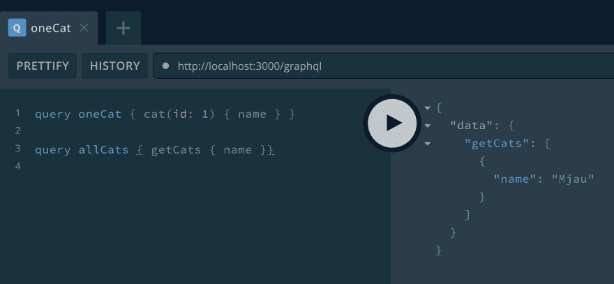
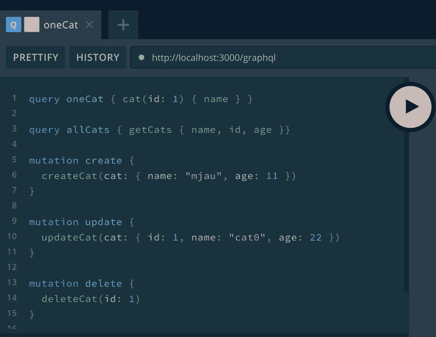

# 如何使用 Nest 构建 GraphQL API

> 原文：<https://dev.to/azure/how-you-can-use-nest-to-build-a-graphql-api-24ii>

在 [Twitter](https://twitter.com/chris_noring) 上关注我，很乐意接受您对主题或改进的建议/Chris

> 构建 GraphQL API 有很多种方法。看看 JavaScript，你可能在使用原始的`grapql`库、`graphql-express`库，或者为什么不使用来自[阿波罗](https://www.apollographql.com/)的库。还有另一个非常好的方法，那就是 Nest.js 与 GraphQL 的完美集成

在本文中，我们将:

*   **快速解释** GraphQL 基础知识。我们将为你解释足够的内容来理解主要的结构。
*   创建第一个 Nest.js + GraphQL 项目，看看完整的 CRUD 是什么样子
*   **最佳实践**让我们看看如何充分利用 Nest 的全部功能

## 图形 SQL 基础

我在以下文章中解释了 Graphql 的基础:

*   [用 Node.js 和 Express 绘制 QL](https://dev.to/azure/building-a-graphql-server-with-nodejs-andexpress-5hfh)
*   [带 Node.js 的 graph QL+Apollo](https://dev.to/azure/creating-a-graphql-server-withapollo-jjj)

如果我们为 GraphQL 添加一个完整的入门，那么这篇文章将会非常长，所以让我们高兴地陈述一个由模式和解析器函数组成的 GraphQL API。

## 在 Nest.js 中创建你的第一个`Hello GraphQL`

好了，现在我们对 GraphQL 的工作原理有了基本的了解。是时候做以下事情了:

1.  **脚手架**一个鸟巢工程
2.  **连接**项目以使用 GraphQL
3.  **编写**我们的模式和解析器

### 脚手架一个 Nest.js 项目

要搭建一个新项目，只需键入以下内容:

```
nest new hello-world 
```

您可以用项目的名称替换`hello-world`。这将为我们下一步添加 GraphQL 提供所需的文件。

### 钢丝拉升图 QL

现在，要在我们刚刚创建的项目中使用 GraphQL，我们需要执行以下操作:

1.  安装所需的依赖项
2.  配置`GraphQLModule`

好了，要安装依赖项，我们需要键入:

```
npm i --save @nestjs/graphql apollo-server-express graphql 
```

以上将为我们提供所需的用于 Nest `@nestjs/graphql`的 GraphQL 绑定和用于 GraphQL 服务器创建的 Apollo 库`apollo-server-express`。

接下来，我们需要配置从库`@nestjs/graphql`中获取的名为`GraphQLModule`的东西。有许多方法可以设置它，但是我们现在要告诉它的是在哪里可以找到模式文件。因此，我们将改变`app.module.ts`如下:

```
// app.module.ts

import { Module } from '@nestjs/common';
import { GraphQLModule } from '@nestjs/graphql';
import { AppResolver } from './app.resolver';
// import { join } from 'path';

@Module({
  imports: [
    GraphQLModule.forRoot({
      debug: false,
      playground: true,
      typePaths: ['./**/*.graphql']
    }),
  ],
  providers: [ AppResolver ]
})
export class AppModule { } 
```

让我们仔细看看`GraphQLModule.forRoot()`调用。现在，我们在这里看到我们将`playground`设置为真。这将为我们提供一种图形化的方式来提出我们的查询，稍后会详细介绍。我们还看到，我们设置了一个名为`typePaths`的属性，并赋予它一个类似于`['./**/*.graphql']`的数组。现在，这是一个寻找所有以`.graphql`结尾的文件的模式匹配。这种构造的原因是，我们实际上可以将我们的模式定义分布在几个文件上。

### 编写我们的模式和解析器

下一步是创建一个匹配上述模式的文件，因此我们创建一个名为`app.graphql`的文件，并赋予它以下内容:

```
// app.graphql

type Cat {
  id: Int
  name: String
  age: Int
}

type Query {
  getCats: [Cat]
  cat(id: ID!): Cat
} 
```

这就很好地设置了我们，但是解析器函数呢？好吧，让我们回到`app.module.ts`并放大特定的行`providers: [ AppResolver ]`。这是我们连接`AppResolver`作为我们的解析器类。让我们仔细看看`AppResolver` :

```
// app.resolver.ts

import { Args, Mutation, Query, Resolver, Subscription } from '@nestjs/graphql';
import { ParseIntPipe } from '@nestjs/common';

@Resolver('Cat')
export class AppResolver {
  cats = [{
    id: 1,
    name: 'Mjau',
    age: 17
  }]

  @Query()
  getCats() {
    console.log('getCats');
    return this.cats;
  }

  @Query('cat')
  async findOneById(
    @Args('id', ParseIntPipe)
    id: number,
  ): Promise<any> {
    return this.cats.find(c => c.id === id);
  }

} 
```

如你所见，我们创建了一个类`AppResolver`，但它也附带了一些有趣的装饰器。让我们来解释一下:

*   `@Resolver`，这个装饰器告诉 GraphQL 这个类应该知道如何解决与类型`Cat`相关的任何事情。
*   `Query()`，这表示被修饰的方法将在名称上匹配模式中`Query`中定义的内容。正如我们看到的，我们有方法`getCats()`，但是在我们不打算命名匹配的情况下，我们需要发送一个参数到`Query`中，说明它匹配的部分。正如你在方法`findOneById()`上看到的，我们用`Query('cat')`来修饰它，这仅仅意味着它将任何查询解析到`cat`
*   这个装饰器被用作一个帮助装饰器来挖掘任何输入参数

### 带它兜风

让我们首先输入:
来确保我们有了所有必需的库

```
npm install 
```

这将安装所有需要的依赖项。一旦完成，我们应该准备开始。

下一个类型，这样我们就可以尝试我们的 API:

```
npm start 
```

它应该是这样的:

[](https://res.cloudinary.com/practicaldev/image/fetch/s--MePZXupC--/c_limit%2Cf_auto%2Cfl_progressive%2Cq_auto%2Cw_880/https://thepracticaldev.s3.amazonaws.com/i/hbf5b5bgz37kibiqsjr2.png)

下一步是在`http://localhost:3000/graphql`访问我们的浏览器。您应该看到以下内容:

[](https://res.cloudinary.com/practicaldev/image/fetch/s--etrgJ8Ys--/c_limit%2Cf_auto%2Cfl_progressive%2Cq_auto%2Cw_880/https://thepracticaldev.s3.amazonaws.com/i/xg71w5rojj7jernvslaf.png)

如上图所示，我们定义了两个不同的查询，分别名为`oneCat`和`allCats`，您可以在每个查询中看到查询定义。在名为`oneCat`的示例中，您可以看到我们如何调用`{ cat(id: 1){ name } }`，这意味着我们使用参数`id`和值`1`来调用`cat`的解析器，并在结果中选择字段`name`，它的类型为`Cat`。其他查询`allCats`是简单的调用`{ getCats }`，它与`AppResolver`类上的相同方法相匹配

## 添加变异子

到目前为止，我们有一个完全正常工作的 GraphQL API，可以进行查询，但是我们缺少 mutator 部分，如果我们想要支持添加、更新或删除一个 cat，该怎么办呢？为此，我们需要做到以下几点:

1.  向我们的模式添加赋值操作
2.  将所需的解析器方法添加到我们的`AppResolver`类中
3.  测试一下

### 更新我们的模式

好了，我们需要向模式中添加一些赋值函数，确保`app.graphql`看起来像下面这样:

```
type Cat {
  id: Int
  name: String
  age: Int
}

input CatInput {
  name: String
  age: Int,
  id: Int
}

type Mutation {
  createCat(cat: CatInput): String,
  updateCat(cat: CatInput): String,
  deleteCat(id: ID!): String
}

type Query {
  getCats: [Cat]
  cat(id: ID!): Cat
} 
```

正如你在上面看到的，我们已经添加了`Mutation`和`CatInput`

### 添加解析器

好了，现在我们需要返回到`AppResolver`类，确保它看起来像这样:

```
// app.resolver.ts

import { Args, Mutation, Query, Resolver, Subscription } from '@nestjs/graphql';
import { ParseIntPipe } from '@nestjs/common';

@Resolver('Cat')
export class AppResolver {
  cats = [{
    id: 1,
    name: 'Cat1',
    age: 17
  }]

  @Mutation()
  createCat(
    @Args('cat')
    cat: any
  ): Promise<string> {
    this.cats = [...this.cats, {...cat, id: this.cats.length + 1}];
    return Promise.resolve('cat created');
  }

  @Mutation()
  updateCat(
    @Args('cat')
    cat: any
  ): Promise<string> {
    this.cats = this.cats.map(c => {
      if(c.id === cat.id) {
        return {...cat}
      }
      return c;
    });
    return Promise.resolve('cat updated');
  }

  @Mutation()
  deleteCat(
    @Args('id', ParseIntPipe)
    id: number
  ) : Promise<any> {
    this.cats = this.cats.filter(c => c.id !== id);
    return Promise.resolve('cat removed');
  }

  @Query()
  getCats() {
    console.log('getCats');
    return this.cats;
  }

  @Query('cat')
  async findOneById(
    @Args('id', ParseIntPipe)
    id: number,
  ): Promise<any> {
    return this.cats.find(c => c.id === id);
  }

} 
```

增加的部分是方法`deleteCat()`、`updateCat()`和`createCat()`。

## 附加功能

在这一点上，我们有一个全功能的 API。事实上，确保您的浏览器窗口看起来像这样，您将能够测试完整的 CRUD:

[](https://res.cloudinary.com/practicaldev/image/fetch/s--63ITG4UC--/c_limit%2Cf_auto%2Cfl_progressive%2Cq_auto%2Cw_880/https://thepracticaldev.s3.amazonaws.com/i/94yokm9lu60dwlner6uw.png)

我们所说的最佳实践是什么意思？嗯，我们可以做得更多，使我们的 API 更容易使用，比如:

1.  **添加类型**，现在我们已经在`app.graphql`文件中定义了很多类型，但是我们可以提取这些类型并在解析器类中使用它们
2.  分割我们的 API，没有必要有一个巨大的模式文件，你完全可以分割它，让 Nest 把所有这些文件缝合起来
3.  **定义 API** 通过修饰 dto，有第二种定义 API 的方式，哪种方式最好由你来判断

### 添加类型

我说过，我们可以从模式中提取类型，以便在 resolver 类中使用它们。这听起来很棒，但我猜你想知道如何？

嗯，你首先需要前往`app.module.ts`和属性`definitions`并告诉它两件事。第一个是生成类型的文件的名称，第二个是输出类型。后者有两个选择，`class`或者`interface`。你的文件现在应该看起来像这样:

```
@Module({
  imports: [
    GraphQLModule.forRoot({
      debug: false,
      playground: true,
      typePaths: ['./**/*.graphql'],
      definitions: {
        path: join(process.cwd(), 'src/graphql.ts'),
        outputAs: 'class',
      }
    }),
  ],
  providers: [ AppResolver ]
})
export class AppModule { } 
```

如果你用`npm start`启动 API，那么`src/graphql.ts`将被创建，看起来应该是这样的:

```
//graphql.ts

/** ------------------------------------------------------
 * THIS FILE WAS AUTOMATICALLY GENERATED (DO NOT MODIFY)
 * -------------------------------------------------------
 */

/* tslint:disable */
export class CatInput {
    name?: string;
    age?: number;
    id?: number;
}

export class Cat {
    id?: number;
    name?: string;
    age?: number;
}

export abstract class IMutation {
    abstract createCat(cat?: CatInput): string | Promise<string>;

    abstract updateCat(cat?: CatInput): string | Promise<string>;

    abstract deleteCat(id: string): string | Promise<string>;
}

export abstract class IQuery {
    abstract getCats(): Cat[] | Promise<Cat[]>;

    abstract cat(id: string): Cat | Promise<Cat>;
} 
```

我们的收获是类型`Cat`和`CatInput`，我们可以用它们来使我们的`AppResolver`类更加类型安全。您的`app.resolver.ts`文件现在应该看起来像这样:

```
// app.resolver.ts

import { Args, Mutation, Query, Resolver, Subscription } from '@nestjs/graphql';
import { ParseIntPipe } from '@nestjs/common';
import { Cat, CatInput } from './graphql';

@Resolver('Cat')
export class AppResolver {
  cats:Array<Cat> = [{
    id: 1,
    name: 'Cat1',
    age: 17
  }]

  @Mutation()
  createCat(
    @Args('cat')
    cat: CatInput
  ): Promise<string> {
    this.cats = [...this.cats, {...cat, id: this.cats.length + 1}];
    return Promise.resolve('cat created');
  }

  @Mutation()
  updateCat(
    @Args('cat')
    cat: CatInput
  ): Promise<string> {
    this.cats = this.cats.map(c => {
      if(c.id === cat.id) {
        return {...cat}
      }
      return c;
    });
    return Promise.resolve('cat updated');
  }

  @Mutation()
  deleteCat(
    @Args('id', ParseIntPipe)
    id: number
  ) : Promise<any> {
    this.cats = this.cats.filter(c => c.id !== id);
    return Promise.resolve('cat removed');
  }

  @Query()
  getCats(): Array<Cat> {
    return this.cats;
  }

  @Query('cat')
  async findOneById(
    @Args('id', ParseIntPipe)
    id: number,
  ): Promise<Cat> {
    return this.cats.find(c => c.id === id);
  }

} 
```

上面值得注意的是我们的内部数组`cats`现在是`Cat`类型，方法`createCat()`和`updateCat()`现在有了`CatInput`类型的输入。此外，方法`getCats()`返回一个数组`Cat`，最后方法`findOneById()`返回一个类型`Cat`的承诺。

### 拆分我们的模式定义

现在我们说我们可以很容易地做到这一点，因为事情的设置方式。这很容易做到，只需创建另一个名为* * .graphql 的文件。当你的 API 中有不同的主题时，进行拆分是有意义的。假设你正在添加狗，那么有一个单独的`dogs.graphql`和一个单独的狗解析器类是有意义的。

本文的重点是向您展示如何开始，以及应该如何逐步继续添加新的类型和新的解析器。希望你觉得有用。

### 定义事物的第二种方式

定义模式的第二种方法超出了本文的范围，因为它太长了。然而，看看这是怎么做的，看看这个[回购](https://github.com/nestjs/nest/tree/master/sample/23-type-graphql)，看看标题为“代码优先”的[这里](https://docs.nestjs.com/graphql/quick-start)

## 总结

现在我们已经从生成一个新项目，学习定义一个模式和它的解析器，到从我们的模式生成类型。我们应该为自己感到骄傲。