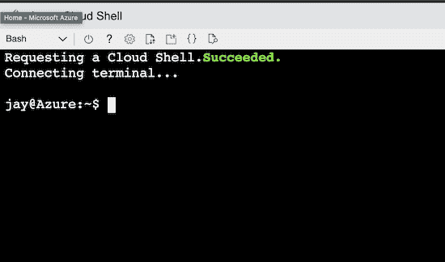
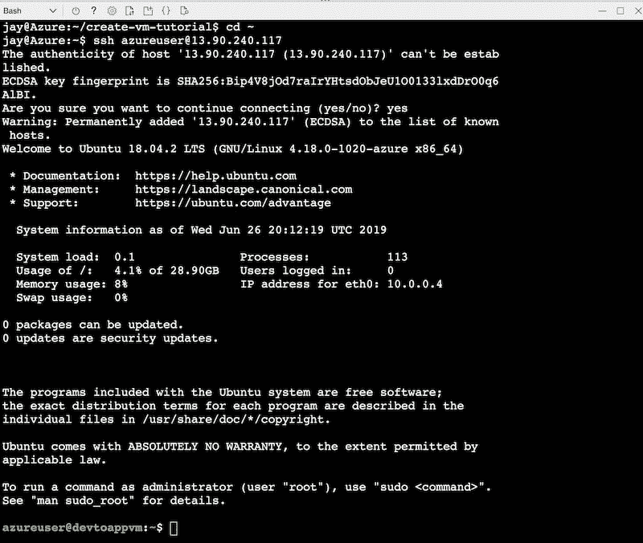

# 面向系统管理员的 Azure 云外壳技巧第三部分——使用 Azure CLI

> 原文：<https://dev.to/azure/azure-cloud-shell-tips-for-sysadmins-part-iii-using-azure-cli-for-server-details-9dd>

作为 Azure 的支持者，我花时间做的事情之一就是学习初学者使用微软 Azure 的最简单的方法。今天我想和你分享一些利用 Azure 内置工具的方法。

在我的上一篇博客文章[Azure Cloud Shell SysAdmins 技巧第二部分——使用 Cloud Shell 工具迁移](https://dev.to/azure/azure-cloud-shell-tips-for-sysadmins-bash-4h2e)中，我使用了一些工具，这些工具是用于 bash 的 [Azure Cloud Shell 的一部分。这一次，我将给出一些关于使用](https://docs.microsoft.com/azure/cloud-shell/quickstart?WT.mc_id=devto-blog-jagord) [Azure 资源管理器](https://docs.microsoft.com/en-us/azure/azure-resource-manager/resource-group-overview/?WT.mc_id=devto-blog-jagord)获取信息和修改新创建的 VM 的快速技巧。我将使用 Azure Cloud Shell 中已经准备好的 Azure CLI 工具。

### 第一步

首先，打开一个云壳，这可以通过访问门户中搜索栏右侧的云壳徽标来完成，或者通过访问[https://shell.azure.com/](https://shell.azure.com/?WT.mc_id=devto-blog-jagord)直接导航。

[](https://res.cloudinary.com/practicaldev/image/fetch/s--KH4xhz3S--/c_limit%2Cf_auto%2Cfl_progressive%2Cq_auto%2Cw_880/https://thepracticaldev.s3.amazonaws.com/i/8tfe4fscvxsd4uedtrvn.png)

Azure Cloud Shell 包含了本教程中使用的所有工具。您可以按照适用于您的操作系统的[说明在本地安装 Azure CLI。](https://docs.microsoft.com/en-us/cli/azure/install-azure-cli?WT.mc_id=devto-blog-jagord)

### 使用 Azure CLI

让我们来看一系列使用 Azure CLI 创建新的 Linux 服务器可能需要完成的任务。

### 创建一个资源组。

我喜欢把[资源组](https://docs.microsoft.com/en-us/azure/azure-resource-manager/resource-group-overview#resource-groups?WT.mc_id=devto-blog-jagord)想象成一个大盒子，你可以把你所有的 Azure 资源放在里面。当我用完这个盒子，我可以把它扔进垃圾箱，然后继续前进。当我完成时，我不必花时间删除每个单独的资源。

[](https://res.cloudinary.com/practicaldev/image/fetch/s--wTciEgA7--/c_limit%2Cf_auto%2Cfl_progressive%2Cq_auto%2Cw_880/https://thepracticaldev.s3.amazonaws.com/i/rfbjlko9lcer264wdrzz.png)

创建资源组要求您至少提供创建该组所需的两条信息。

*   名称——字面意思是您希望资源组的名称
*   位置——这是存储资源组元数据的位置。这对于那些出于合规性原因可能需要将您的所有基础架构数据存储在特定国家/地区的人来说非常重要。

另一个可选设置是 Subscription，它允许用户声明资源组将属于哪个计费订阅。

为了在 Azure 的美国东部地区创建一个名为“devtoapp”的资源组，我将执行以下命令:

```
az group create --location eastus --name devtoapp 
```

Enter fullscreen mode Exit fullscreen mode

然后，Azure 资源管理器将创建您的组，并为您提供所创建内容的 JSON 输出:

```
{
  "id": "/subscriptions/fakefakefake-54cc-0000-a58b-87afakefakefake7ad/resourceGroups/devtoapp",
  "location": "eastus",
  "managedBy": null,
  "name": "devtoapp",
  "properties": {
    "provisioningState": "Succeeded"
  },
  "tags": null,
  "type": null
} 
```

Enter fullscreen mode Exit fullscreen mode

看起来我忘了设置一个标签来说明这是我的“开发”环境——让我们更新一下:

```
az group update --name devtoapp --set tags.Details='{"Environment":"dev"}' 
```

Enter fullscreen mode Exit fullscreen mode

我已经告诉 Azure Resource Manager 更新与我的组相关联的元数据，以包含一个关于我的环境的标签。

```
{
  "id": "/subscriptions/fakefakefake-54cc-0000-a58b-87afakefakefake7ad/resourceGroups/devtoapp",
  "location": "eastus",
  "managedBy": null,
  "name": "devtoapp",
  "properties": {
    "provisioningState": "Succeeded"
  },
  "tags": {
    "Details": "{'Environment': 'dev'}"
  },
  "type": null
} 
```

Enter fullscreen mode Exit fullscreen mode

搞定了。我们在这个群里放点资源吧！

### 创建一个虚拟机

在我的上一篇博客中，我为读者做了所有的工作，为你提供了一个处理所有 VM 创建的脚本。这一次，我想展示这个命令，并解释传递给 Azure 资源管理器的内容。

在运行这个命令之前，我想解释一下我在云 Shell 中执行这个命令的目的。

**`az vm create`**
我想创建一个虚拟机
**`--resource-group devtoapp`**
我想将这个新虚拟机放在`devtoapp`资源组
**`--name devtoappvm`**
我的新虚拟机的名称应该是`devtoappvm`
**`--public-ip-address-dns-name devtoappvm`**
我想要一个完全限定的域名，主机名为`devtoappvm`
**`--image UbuntuLTS`**
我想长期使用 Linux Ubuntu 我的服务器用户名是`azureuser`
**`--generate-ssh-keys`**
我希望 Azure 为新虚拟机创建一个新的 ssh 密钥对。 除非用`--ssh-dest-key-path`选项指定，否则密钥文件存储在`~/.ssh`目录中。

我将运行带有“time”的命令，只是为了好玩，这样我就可以看到在云 Shell 中配置我的新虚拟机需要多长时间。

```
time az vm create --resource-group devtoapp --name devtoappvm --public-ip-address-dns-name devtoappvm --image UbuntuLTS --admin-username azureuser --generate-ssh-keys 
```

Enter fullscreen mode Exit fullscreen mode

我将从 Azure 资源管理器获得`- Running ..`响应，直到新的 VM 被创建。当虚拟机准备就绪时，资源管理器将输出一个 JSON 文档，其中包含与虚拟机相关的详细信息。

```
{
  "fqdns": "devtoappvm.eastus.cloudapp.azure.com",
  "id": "/subscriptions/fakefakefake-54cc-0000-a58b-87afakefakefake7ad/resourceGroups/devtoapp/providers/Microsoft.Compute/virtualMachines/devtoappvm",
  "location": "eastus",
  "macAddress": "00-0D-3A-15-0A-5C",
  "powerState": "VM running",
  "privateIpAddress": "10.0.0.4",
  "publicIpAddress": "13.90.240.117",
  "resourceGroup": "devtoapp",
  "zones": ""
} 
```

Enter fullscreen mode Exit fullscreen mode

好像服务器开了，我 ssh 进去看看！

[](https://res.cloudinary.com/practicaldev/image/fetch/s--LYYYX1Lv--/c_limit%2Cf_auto%2Cfl_progressive%2Cq_auto%2Cw_880/https://thepracticaldev.s3.amazonaws.com/i/a1f2a9jaeaugxf3vtow2.png)

很好，是时候给服务器添加新的网络规则了。

### 创建网络规则

现在我有了这台新服务器，我想添加网络规则，这样我就可以访问 web 流量的标准端口 80/443。让我们来看看我将使用的一个规则，并分析一下具体发生了什么:

**`az vm open-port`**
我要给一个 VM 开一个端口
**`--port 80`**
将规则命名为“port 80”，在服务器上开端口 80
**`--priority 101`**
规则优先级 101，介于 100(最高优先级)和 4096(最低优先级)之间。
**`--resource-group devtoapp`**
服务器所在的资源组。
 **服务器的名称。**

 **我将运行命令

```
az vm open-port --port 80 --priority 101 --resource-group devtoapp --name devtoappvm 
```

Enter fullscreen mode Exit fullscreen mode

并从 Azure 资源管理器获得输出:

```
 {
      "access": "Allow",
      "description": null,
      "destinationAddressPrefix": "*",
      "destinationAddressPrefixes": [],
      "destinationApplicationSecurityGroups": null,
      "destinationPortRange": "80",
      "destinationPortRanges": [],
      "direction": "Inbound",
      "etag": "W/\"dcb63769-502e-4e8b-ad93-b909cff97e9e\"",
      "id": "/subscriptions/fakefakefake-54cc-0000-a58b-87afakefakefake7ad/resourceGroups/devtoapp/providers/Microsoft.Network/networkSecurityGroups/devtoappvmNSG/securityRules/open-port-80",
      "name": "open-port-80",
      "priority": 101,
      "protocol": "*",
      "provisioningState": "Succeeded",
      "resourceGroup": "devtoapp",
      "sourceAddressPrefix": "*",
      "sourceAddressPrefixes": [],
      "sourceApplicationSecurityGroups": null,
      "sourcePortRange": "*",
      "sourcePortRanges": [],
      "type": "Microsoft.Network/networkSecurityGroups/securityRules"
    } 
```

Enter fullscreen mode Exit fullscreen mode

我将运行下面的规则，优先级增加到 102，并为端口 443 运行一个规则:

```
az vm open-port --port 443 --priority 102 --resource-group devtoapp --name devtoappvm 
```

Enter fullscreen mode Exit fullscreen mode

现在，我已经准备好了一台服务器，可以开始安装我可能需要的任何特定配置管理代理，或者执行应用程序的手动安装。

### 包装完毕

我一直在整理这些手工工作的入门技巧，以展示开始使用 Azure 可能需要采取的小步骤。我将继续完成这些“入门”任务，以帮助可能仍在工作的用户理解他们的数据中心和云之间的巨大差异。我会继续为你寻找新的方法去做你可能已经在做的工作！如果你需要更多信息或者只是想在 twitter 上说声谢谢，随时联系我，你可以在那里找到我，我的名字是 [@jaydestro](https://twitter.com/jaydestro) 。一定要看看我的播客，[随叫随到噩梦](https://oncallnightmares.podomatic.com/)，听听其他在技术领域随叫随到的运营专业人士的故事！**